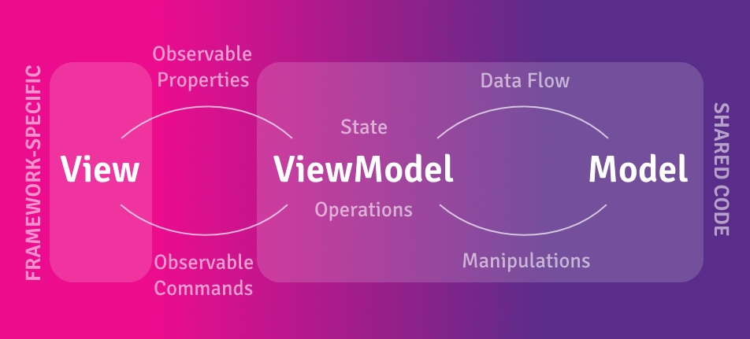

# Getting Started with ReactiveUI

ReactiveUI gives you the power to build reactive, testable, and composable UI code using the MVVM pattern.

See our <a href="../handbook/index.md">Handbook</a> for the ReactiveUI documentation. We also have a complete <a href="https://github.com/reactiveui/ReactiveUI/tree/main/integrationtests">cross-platform demo app</a>.

## Getting Started

To get started visit our <a href="installation/index.md">Installation</a> page to install the appropriate NuGet packages for your platform.

### Modern ReactiveUI with RxAppBuilder (Recommended)

**RxAppBuilder** is the recommended way to initialize and configure ReactiveUI applications (introduced in v21.0.1). It provides a fluent API for setting up dependency injection, view/view model registration, and platform-specific services:

```csharp
var app = RxAppBuilder.CreateReactiveUIBuilder()
    .WithWpf() // Or WithMaui(), WithBlazor(), WithWinUI(), etc.
    .WithViewsFromAssembly(typeof(App).Assembly)
    .WithRegistration(locator =>
    {
        // Register your services
        locator.RegisterLazySingleton<IScreen>(() => new MainViewModel());
    })
    .BuildApp();
```

Learn more about RxAppBuilder in the <a href="../handbook/rxappbuilder.md">RxAppBuilder Guide</a>.

### Key ReactiveUI Features

ReactiveUI makes it easy to combine the MVVM pattern with Reactive Programming by providing features such as:

- **[RxAppBuilder](../handbook/rxappbuilder.md)** - Modern application initialization and dependency injection
- **[ReactiveUI.SourceGenerators](https://github.com/reactiveui/ReactiveUI.SourceGenerators)** - Compile-time code generation for reactive properties and commands
- **[WhenAnyValue](../handbook/when-any.md)** - Observe property changes reactively
- **[ReactiveCommand](../handbook/commands/index.md)** - Asynchronous, composable command execution
- **[ObservableAsPropertyHelper](../handbook/observable-as-property-helper.md)** - Transform observables into read-only properties
- **[WhenActivated](../handbook/when-activated.md)** - Manage subscriptions and prevent memory leaks
- **[Data Binding](../handbook/data-binding/index.md)** - Type-safe, reactive data binding
- **[User Input Validation](../handbook/user-input-validation.md)** - Declarative validation with ReactiveUI.Validation

The [Compelling Example](compelling-example.md) walks through creating a more complete application, demonstrating the power of ReactiveUI and Reactive Extensions.

## Why MVVM?

The Model-View-ViewModel (MVVM) pattern helps create more portable and maintainable codebases for cross-platform .NET applications. It increases the amount of code that can be shared between different platforms (Windows, iOS, Android, Web, etc.) and makes testing easier.



## Explore the ReactiveUI Ecosystem

ReactiveUI is much more than just a MVVM helper. Take a look at the following projects to get started exploring what is available:

### Core Libraries

- **[DynamicData](https://github.com/reactivemarbles/DynamicData)** - Reactive collections based on Rx.NET
- **[ObservableEvents](https://github.com/reactivemarbles/ObservableEvents)** - Generate observables from .NET events
- **[Splat](https://github.com/reactiveui/Splat)** - Cross-platform dependency injection and logging
- **[Akavache](../handbook/akavache/index.md)** - Asynchronous key-value store with SQLite persistence
- **[ReactiveUI.Validation](../handbook/user-input-validation.md)** - Reactive validation for user input

### Platform Extensions

- **[ReactiveUI.SourceGenerators](https://github.com/reactiveui/ReactiveUI.SourceGenerators)** - C# source generators for ReactiveUI
- **[Maui.Plugins.Popup](https://github.com/reactiveui/Maui.Plugins.Popup)** - MAUI popup plugin with ReactiveUI support
- **[Sextant](https://github.com/reactiveui/Sextant)** - Navigation library for Xamarin.Forms using ReactiveUI

### Additional Tools

- **[Fusillade](https://github.com/reactiveui/Fusillade)** - HTTP request prioritization and rate limiting
- **[Punchclock](https://github.com/reactiveui/punchclock)** - Asynchronous work queue with prioritization

### Resources

- **[Samples](../resources/samples.md)** - Open source applications built with ReactiveUI
- **[Blog](../../articles/2020-07-16-article-on-elevated-values.md)** - Release notes and announcements
- **[Videos and Presentations](../resources/videos.md)** - Videos and presentations about ReactiveUI

## Next Steps

1. **[Install ReactiveUI](installation/index.md)** for your platform
2. **Follow the [Compelling Example](compelling-example.md)** to build your first reactive app
3. **Read the [Handbook](../handbook/index.md)** to learn about advanced features
4. **Join the Community** on [Slack](https://join.slack.com/t/reactivex/shared_invite/zt-lt48skpz-G5WDYOAuzA80_MByZrLT0g)
