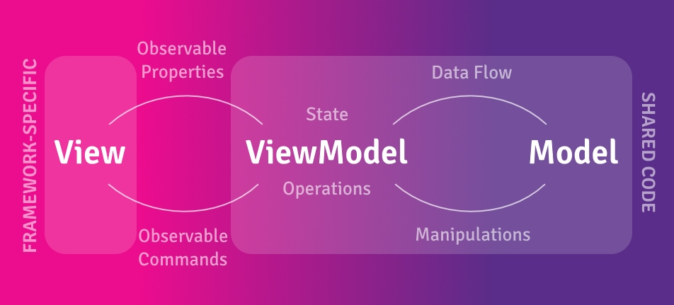

# Getting Started with ReactiveUI

ReactiveUI gives you the power to build reactive, testable, and composable UI code using the MVVM pattern.

See our <a href="../handbook/index.md">Handbook</a> for the ReactiveUI documentation. We also have a complete <a href="https://github.com/reactiveui/ReactiveUI/tree/main/integrationtests">cross-platform demo app</a>.

## Getting Started

To get started visit our <a href="installation/index.md">Installation</a> page to install the appropriate NuGet packages for your platform. The [suite installation guide](../../getting-started/installation.md) covers every library and how ReactiveUI brings ReactiveUI.Binding with it.

### Modern ReactiveUI with RxAppBuilder (Recommended)

**RxAppBuilder** is the recommended way to initialize and configure ReactiveUI applications (introduced in v21.0.1). It provides a fluent API for setting up dependency injection, view/view model registration, and platform-specific services:

```csharp
var app = RxAppBuilder.CreateReactiveUIBuilder()
    .WithWpf() // Or WithMaui(), WithBlazor(), WithWinUI(), etc.
    .WithViewsFromAssembly(typeof(App).Assembly)
    .WithRegistration(locator =>
    {
        // Register your services
        locator.RegisterLazySingleton<IScreen>(() => new MainViewModel());
    })
    .BuildApp();
```

Learn more about RxAppBuilder in the <a href="../handbook/rxappbuilder.md">RxAppBuilder Guide</a>.

### Key ReactiveUI Features

ReactiveUI makes it easy to combine the MVVM pattern with Reactive Programming by providing features such as:

- **[RxAppBuilder](../handbook/rxappbuilder.md)** - Modern application initialization and dependency injection
- **[ReactiveUI.SourceGenerators](../../source-generators/index.md)** - Compile-time code generation for reactive properties and commands
- **[WhenAnyValue](../../binding/observing.md)** - Observe property changes reactively
- **[ReactiveCommand](../handbook/commands/index.md)** - Asynchronous, composable command execution
- **[ObservableAsPropertyHelper](../../binding/properties.md)** - Transform observables into read-only properties
- **[WhenActivated](../handbook/when-activated.md)** - Manage subscriptions and prevent memory leaks
- **[Data Binding](../handbook/data-binding/index.md)** - Type-safe, reactive data binding
- **[User Input Validation](../../validation.md)** - Declarative validation with ReactiveUI.Validation

The [Compelling Example](compelling-example.md) walks through creating a more complete application, demonstrating the power of ReactiveUI and [ReactiveUI.Primitives](../../primitives/index.md).

## Why MVVM?

The Model-View-ViewModel (MVVM) pattern helps create more portable and maintainable codebases for cross-platform .NET applications. It increases the amount of code that can be shared between different platforms (Windows, iOS, Android, Web, etc.) and makes testing easier.



## Related libraries

ReactiveUI is one library in a family. [ReactiveUI.Binding](../../binding/index.md) runs its bindings, and ReactiveUI
installs it for you. [ReactiveUI.SourceGenerators](../../source-generators/index.md),
[ReactiveUI.Validation](../../validation.md), [Sextant](../../sextant.md) and
[Splat](../../splat/index.md) add to ReactiveUI. The [documentation overview](../../index.md) lists every library and
its repository. The [samples](../../resources/samples.md) and [videos](../../resources/videos.md) show complete apps.

## Next Steps

1. **[Install ReactiveUI](installation/index.md)** for your platform
2. **Follow the [Compelling Example](compelling-example.md)** to build your first reactive app
3. **Read the [Handbook](../handbook/index.md)** to learn about advanced features
4. **Join the Community** on [Slack](https://join.slack.com/t/reactivex/shared_invite/zt-lt48skpz-G5WDYOAuzA80_MByZrLT0g)
