# Collections

[Run the complete page example](https://github.com/reactiveui/ReactiveUI/blob/main/src/examples/Documentation/Pages/collections/collections.csproj).

A screen that shows a list has to react when the list changes: an item is added, removed, replaced or moved. ReactiveUI
turns those changes into a stream you can subscribe to, filter for the changes you care about, or hand to code that
tests a handler directly. ReactiveUI also ships as `ReactiveUI.Reactive`, built from the same source, for apps that use
System.Reactive instead of ReactiveUI.Primitives.

A change is one add, remove, replace or move. A batch is every change a single collection edit produces; most edits
produce one change, but clearing a collection or replacing its contents can produce many at once.

## Track every add and remove

**1. Call `ActOnEveryObject` on the collection.** Give it a method to run for every item already there and a method to
run for every item removed later. The example collection is an `ObservableCollection<Product>`, the .NET type that
raises a change notification for every edit.

**2. Add and remove items.** `ActOnEveryObject` reports the item already in the collection first, then each later
change.

**3. Read the log.** The subscription is an `IDisposable`; [dispose it](../guidelines/framework/dispose-your-subscriptions.md)
when you stop watching the collection.

```csharp
ObservableCollection<Product> inventory = [new Product("Kettle", 4)];
List<string> log = [];
using IDisposable subscription = inventory.ActOnEveryObject(
    product => log.Add($"add {product.Name}"),
    product => log.Add($"remove {product.Name}"));

inventory.Add(new Product("Toaster", 2));
inventory.RemoveAt(0);

foreach (string entry in log)
{
    Console.WriteLine(entry);
}
```

```text
add Kettle
add Toaster
remove Kettle
```

## Watch other kinds of collections

`ActOnEveryObject` also works on a `ReadOnlyObservableCollection<T>`, the type a view model typically exposes to a
view. Changes made through the writable collection behind it still reach the subscriber.

```csharp
ObservableCollection<Product> inventory = [new Product("Kettle", 4)];
ReadOnlyObservableCollection<Product> readOnlyInventory = new(inventory);
List<string> log = [];
using IDisposable subscription = readOnlyInventory.ActOnEveryObject(
    product => log.Add($"add {product.Name}"),
    product => log.Add($"remove {product.Name}"));

inventory.Add(new Product("Toaster", 2));
```

```text
add Kettle
add Toaster
```

It also subscribes directly to a change-set stream, the kind [the next section](#observe-changes-as-a-change-set)
produces.

```csharp
ObservableCollection<Product> inventory = [new Product("Kettle", 4)];
List<string> log = [];
using IDisposable subscription = inventory.ToReactiveChangeSet().ActOnEveryObject(
    product => log.Add($"add {product.Name}"),
    product => log.Add($"remove {product.Name}"));

inventory.Add(new Product("Toaster", 2));
```

```text
add Kettle
add Toaster
```

A collection does not need to be an `ObservableCollection<T>`. Any type that implements `INotifyCollectionChanged` and
`IEnumerable<T>` works, such as a catalog backed by its own list and its own `CollectionChanged` event. Name the item
and collection types explicitly on the call: `ActOnEveryObject<Product, ShopCatalog>`.

```csharp
ShopCatalog catalog = new();
catalog.Stock(new Product("Kettle", 4));

List<string> log = [];
using IDisposable subscription = catalog.ActOnEveryObject<Product, ShopCatalog>(
    product => log.Add($"add {product.Name}"),
    product => log.Add($"remove {product.Name}"));

catalog.Stock(new Product("Toaster", 2));
catalog.SellOut(catalog.First(static product => product.Name == "Kettle"));

foreach (string entry in log)
{
    Console.WriteLine(entry);
}
```

```text
add Kettle
add Toaster
remove Kettle
```

## Observe changes as a change set

`ToReactiveChangeSet` turns a collection into a stream of `IReactiveChangeSet<T>` batches. Each batch holds one or
more `ReactiveChange<T>` values. A change has a `Reason` (`Add`, `Remove`, `Replace`, `Move` or `Refresh`), the
affected item as `Current`, and the `CurrentIndex` and `PreviousIndex` the change carries. A `Replace` also carries the
replaced item as `Previous`. The stream delivers a batch for the items already in the collection first, then a batch
for every later change.

```mermaid
%%{init: {"theme": "base", "themeVariables": {"fontFamily": "Roboto, Helvetica, Arial, sans-serif", "fontSize": "15px", "primaryColor": "#DCE9FF", "primaryBorderColor": "#6C8EC4", "primaryTextColor": "#0B2447", "secondaryColor": "#E3F2E8", "secondaryBorderColor": "#7FA88C", "secondaryTextColor": "#12301C", "tertiaryColor": "#F3E5F5", "tertiaryBorderColor": "#A98BB0", "tertiaryTextColor": "#2E1437", "lineColor": "#7B8699", "textColor": "#1B1F27", "noteBkgColor": "#FFF4D6", "noteBorderColor": "#C9A94F", "noteTextColor": "#3A2A00", "actorBkg": "#DCE9FF", "actorBorder": "#6C8EC4", "actorTextColor": "#0B2447", "signalColor": "#7B8699", "signalTextColor": "#1B1F27", "labelBoxBkgColor": "#F1F3F8", "labelBoxBorderColor": "#A7AEBB", "edgeLabelBackground": "#F7F9FC", "clusterBkg": "#F7F9FC", "clusterBorder": "#C9D1DE"}}}%%
flowchart LR
    classDef view fill:#DCE9FF,stroke:#6C8EC4,color:#0B2447
    classDef model fill:#F3E5F5,stroke:#A98BB0,color:#2E1437
    classDef vm fill:#E3F2E8,stroke:#7FA88C,color:#12301C
    Collection(["ObservableCollection change"]):::view -- "Add / Remove / Replace / Move" --> Batch(["ReactiveChangeSet"]):::model
    Batch -- "subscribe" --> Sub(["Subscriber, e.g. WhenCountChanged"]):::vm
```



Every edit becomes a batch of changes, and a subscriber decides what to do with each one, from reading every change to
watching only for a count change.

```csharp
ObservableCollection<Product> inventory = [new Product("Kettle", 4), new Product("Toaster", 2)];
List<IReactiveChangeSet<Product>> batches = [];
using IDisposable subscription = inventory.ToReactiveChangeSet().Subscribe(batches.Add);

inventory.Add(new Product("Blender", 3));
inventory.RemoveAt(0);
inventory[0] = new Product("Air fryer", 1);
inventory.Move(0, 1);

foreach (IReactiveChangeSet<Product> batch in batches)
{
    foreach (ReactiveChange<Product> change in batch)
    {
        Console.WriteLine($"{change.Reason}: {change.Current.Name}, previous={change.Previous?.Name ?? "none"}, index={change.CurrentIndex}, previousIndex={change.PreviousIndex}");
    }
}
```

```text
Add: Kettle, previous=none, index=0, previousIndex=-1
Add: Toaster, previous=none, index=1, previousIndex=-1
Add: Blender, previous=none, index=2, previousIndex=-1
Remove: Kettle, previous=none, index=0, previousIndex=-1
Replace: Air fryer, previous=Toaster, index=0, previousIndex=-1
Move: Air fryer, previous=none, index=1, previousIndex=0
```

The `ToReactiveChangeSet<TCollection, T>` overload observes a collection that only raises `INotifyCollectionChanged`,
the same way `ActOnEveryObject` does above.

```csharp
ShopCatalog catalog = new();
catalog.Stock(new Product("Kettle", 4));

List<IReactiveChangeSet<Product>> batches = [];
using IDisposable subscription = catalog.ToReactiveChangeSet<ShopCatalog, Product>().Subscribe(batches.Add);

catalog.Stock(new Product("Toaster", 2));

foreach (IReactiveChangeSet<Product> batch in batches)
{
    Console.WriteLine($"{batch.Count} changes, adds={batch.Adds}, removes={batch.Removes}");
}
```

```text
1 changes, adds=1, removes=0
1 changes, adds=1, removes=0
```

## Watch for a count change

`WhenCountChanged` passes on only the batches that add or remove an item, skipping a batch that only replaces or moves
one. Use it when a screen cares about the number of items, not their content.

```csharp
ObservableCollection<Product> inventory = [new Product("Kettle", 4)];
List<IReactiveChangeSet<Product>> countChangingBatches = [];
using IDisposable subscription = inventory.ToReactiveChangeSet().WhenCountChanged().Subscribe(countChangingBatches.Add);

inventory[0] = new Product("Air fryer", 1);
inventory.Add(new Product("Toaster", 2));

foreach (IReactiveChangeSet<Product> batch in countChangingBatches)
{
    Console.WriteLine($"{batch.Count} changes, adds={batch.Adds}, removes={batch.Removes}");
}
```

```text
1 changes, adds=1, removes=0
1 changes, adds=1, removes=0
```

`CountHasChanged` asks a single batch the same question, without a stream around it.

```csharp
ObservableCollection<Product> inventory = [new Product("Kettle", 4)];
List<IReactiveChangeSet<Product>> allBatches = [];
using IDisposable subscription = inventory.ToReactiveChangeSet().Subscribe(allBatches.Add);

inventory[0] = new Product("Air fryer", 1);
inventory.Add(new Product("Toaster", 2));

foreach (IReactiveChangeSet<Product> batch in allBatches)
{
    Console.WriteLine(batch.CountHasChanged());
}
```

```text
True
False
True
```

## Build and test a change directly

A change handler is a plain method that reads a `ReactiveChange<T>`, so you can test it by building a change
yourself, without a collection at all. `ReactiveChangeReason.Refresh` marks an item that should be re-evaluated
without being added or removed. A plain collection edit never produces one. Test a handler for `Refresh` with a
change you build by hand.

```csharp
Product kettle = new("Kettle", 4);
ReactiveChange<Product> refreshed = new(ReactiveChangeReason.Refresh, kettle, default, 0, -1);

Console.WriteLine(DescribeChange(refreshed));
```

```text
redraw Kettle
```

Two changes with the same reason, item and indices are equal, and hash the same.

```csharp
Product kettle = new("Kettle", 4);
ReactiveChange<Product> first = new(ReactiveChangeReason.Add, kettle, default, 0, -1);
ReactiveChange<Product> second = new(ReactiveChangeReason.Add, kettle, default, 0, -1);
ReactiveChange<Product> third = new(ReactiveChangeReason.Remove, kettle, default, 0, -1);

Console.WriteLine(first.Equals(second));
Console.WriteLine(first.Equals((object)second));
Console.WriteLine(first.Equals(third));
Console.WriteLine(first.GetHashCode() == second.GetHashCode());
```

```text
True
True
False
True
```

A `ReactiveChangeSet<T>` is built the same way, directly from a list of changes. It exposes `Count`, `Adds`,
`Removes`, an indexer, and `GetEnumerator` for a `foreach` loop.

```csharp
Product kettle = new("Kettle", 4);
Product toaster = new("Toaster", 2);
List<ReactiveChange<Product>> changes =
[
    new(ReactiveChangeReason.Add, kettle, default, 0, -1),
    new(ReactiveChangeReason.Add, toaster, default, 1, -1),
];

ReactiveChangeSet<Product> batch = new(changes);

Console.WriteLine(batch.Count);
Console.WriteLine(batch.Adds);
Console.WriteLine(batch.Removes);
Console.WriteLine(batch[0].Current.Name);

foreach (ReactiveChange<Product> change in batch)
{
    Console.WriteLine(change.Current.Name);
}
```

```text
2
2
0
Kettle
Kettle
Toaster
```

## Observe the raw CollectionChanged event

`ObserveCollectionChanges` forwards each `INotifyCollectionChanged.CollectionChanged` event as a `CollectionChanged`
value, carrying the `Sender` and the `EventArgs` .NET raised. Use it when you need the raw event instead of a
change set, for example to inspect `NotifyCollectionChangedAction` directly.

```csharp
ObservableCollection<Product> inventory = [new Product("Kettle", 4)];
List<CollectionChanged> events = [];
using IDisposable subscription = inventory.ObserveCollectionChanges().Subscribe(events.Add);

inventory.Add(new Product("Toaster", 2));
inventory.RemoveAt(0);

foreach (CollectionChanged notification in events)
{
    Console.WriteLine($"{notification.EventArgs.Action}, sender is inventory: {ReferenceEquals(notification.Sender, inventory)}");
}
```

```text
Add, sender is inventory: True
Remove, sender is inventory: True
```

Two notifications built from the same sender and event arguments are equal, and hash the same.

```csharp
ObservableCollection<Product> inventory = [];
NotifyCollectionChangedEventArgs sharedArgs = new(NotifyCollectionChangedAction.Reset);

CollectionChanged first = new(inventory, sharedArgs);
CollectionChanged second = new(inventory, sharedArgs);
CollectionChanged third = new(inventory, new NotifyCollectionChangedEventArgs(NotifyCollectionChangedAction.Reset));

Console.WriteLine(first == second);
Console.WriteLine(first.Equals((object)second));
Console.WriteLine(first != third);
Console.WriteLine(first.GetHashCode() == second.GetHashCode());
Console.WriteLine(first.Sender is ObservableCollection<Product>);
Console.WriteLine(first.EventArgs.Action);
```

```text
True
True
True
True
True
Reset
```

A notification built from different event arguments is a different notification, so `first != third` is `True`
even though both arguments describe a reset.

## Sort with a chained comparer

`OrderedComparer<T>` builds an `IComparer<T>` from one or more keys, so a leaderboard can sort by score first and
break ties by name without a hand-written `Compare` method. `OrderByDescending` starts the chain, and `ThenBy` adds a
tie-breaker that only runs when the first key is equal.

```csharp
List<Player> leaderboard = [new("Ada", 92), new("Alan", 92), new("Grace", 88), new("Barbara", 75)];
IComparer<Player> byScoreThenName = OrderedComparer<Player>
    .OrderByDescending(static player => player.Score)
    .ThenBy(static player => player.Name);

leaderboard.Sort(byScoreThenName);

foreach (Player player in leaderboard)
{
    Console.WriteLine($"{player.Name}: {player.Score}");
}
```

```text
Ada: 92
Alan: 92
Grace: 88
Barbara: 75
```

`OrderBy`, `OrderByDescending`, `ThenBy` and `ThenByDescending` each take an `IComparer<TValue>` overload too, for a
key whose default comparer is not what you want, such as a case-insensitive name comparison.

```csharp
List<Player> leaderboard = [new("Mike", 95), new("Zoe", 80), new("adam", 80)];
IComparer<Player> byScoreThenNameIgnoringCase = OrderedComparer<Player>
    .OrderByDescending(static player => player.Score, Comparer<int>.Default)
    .ThenBy(static player => player.Name, StringComparer.OrdinalIgnoreCase);

leaderboard.Sort(byScoreThenNameIgnoringCase);

foreach (Player player in leaderboard)
{
    Console.WriteLine($"{player.Name}: {player.Score}");
}
```

```text
Mike: 95
adam: 80
Zoe: 80
```

`OrderBy` can start the chain instead of `OrderByDescending`, and `ThenByDescending` breaks a tie the other way.

```csharp
List<Player> leaderboard = [new("Sam", 60), new("Ben", 70), new("Sam", 85)];
IComparer<Player> byNameThenHighestScore = OrderedComparer<Player>
    .OrderBy(static player => player.Name)
    .ThenByDescending(static player => player.Score);

leaderboard.Sort(byNameThenHighestScore);

foreach (Player player in leaderboard)
{
    Console.WriteLine($"{player.Name}: {player.Score}");
}
```

```text
Ben: 70
Sam: 85
Sam: 60
```

`OrderedComparer.For`, given a sample sequence, infers the row type and returns an `IComparerBuilder<T>` that can
build several comparers for the same type, one for each sort a screen offers.

```csharp
List<Player> leaderboard = [new("Ada", 92), new("Ben", 65), new("Zack", 99)];
IComparerBuilder<Player> builder = OrderedComparer.For(leaderboard);

Console.WriteLine(TopPlayer(leaderboard, builder.OrderByDescending(static player => player.Score)));
Console.WriteLine(TopPlayer(leaderboard, builder.OrderByDescending(static player => player.Score, Comparer<int>.Default)));
Console.WriteLine(TopPlayer(leaderboard, builder.OrderBy(static player => player.Name)));
Console.WriteLine(TopPlayer(leaderboard, builder.OrderBy(static player => player.Name, StringComparer.Ordinal)));
```

```text
Zack
Zack
Ada
Ada
```

`OrderedComparer.For<T>()` builds the same kind of builder without a sample sequence, for a leaderboard that starts
empty.

```csharp
IComparerBuilder<Player> builder = OrderedComparer.For<Player>();
IComparer<Player> byScoreThenName = builder.OrderByDescending(static player => player.Score).ThenBy(static player => player.Name);

List<Player> leaderboard = [new("Grace", 81), new("Alan", 81), new("Ada", 92)];
leaderboard.Sort(byScoreThenName);

foreach (Player player in leaderboard)
{
    Console.WriteLine($"{player.Name}: {player.Score}");
}
```

```text
Ada: 92
Alan: 81
Grace: 81
```

## Members at a glance

| Member | What it does |
| --- | --- |
| `ActOnEveryObject` (on `ObservableCollection<T>`, `ReadOnlyObservableCollection<T>`, a custom `INotifyCollectionChanged` collection, or an `IObservable<IReactiveChangeSet<T>>`) | Calls an add method and a remove method for every item, past and future. |
| `ToReactiveChangeSet` (on `ObservableCollection<T>` or a custom `INotifyCollectionChanged` collection) | Turns a collection into a stream of `IReactiveChangeSet<T>` batches. |
| `IReactiveChangeSet<T>` / `IReactiveChangeSet` | A batch of changes; exposes `Count`, `Adds`, `Removes`, an indexer and enumeration. |
| `ReactiveChangeSet<T>` | The concrete change-set type, built from a `List<ReactiveChange<T>>`. |
| `ReactiveChange<T>` | One change: `Reason`, `Current`, `Previous`, `CurrentIndex`, `PreviousIndex`. |
| `ReactiveChangeReason` | `Add`, `Remove`, `Replace`, `Move` or `Refresh`. |
| `WhenCountChanged` | Filters a change-set stream to the batches that add or remove an item. |
| `CountHasChanged` | Asks a single change set whether it added or removed an item. |
| `ObserveCollectionChanges` | Forwards each raw `CollectionChanged` event as a `CollectionChanged` value. |
| `CollectionChanged` | A single notification: `Sender` and `EventArgs`. |
| `OrderedComparer<T>` | Builds an `IComparer<T>` from `OrderBy` or `OrderByDescending`, chained with `ThenBy` / `ThenByDescending`. |
| `OrderedComparer.For` | Builds an `IComparerBuilder<T>`, inferred from a sample sequence or named explicitly. |
| `IComparerBuilder<T>` | The reusable builder `OrderedComparer.For` returns. |
| `ComparerChainingExtensions.ThenBy` / `ThenByDescending` | Adds a tie-breaking key to an existing `IComparer<T>`. |
