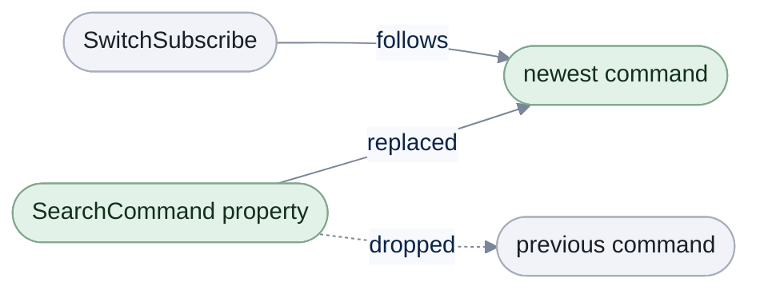

# Writing your own command type

[Run the complete page example](https://github.com/reactiveui/ReactiveUI/blob/main/src/examples/Documentation/Pages/commands/commands.csproj).

The [basics page](index.md) creates commands with the static factory methods on `ReactiveCommand`. Those factories
cover almost every case, because they call the same constructors this page covers directly. Write your own command
type when every command of a kind needs behavior the factories cannot give you: recording every parameter a
command has run with, logging every run of a combined command, or wrapping a non-reactive command source. This
page also covers the interfaces a view model exposes a command through, and `SwitchSubscribe`, for following a
command property that gets replaced.

## Derive from `ReactiveCommand<TParam, TResult>`

`ReactiveCommand<TParam, TResult>` exposes two constructors to a subclass. The factory methods on `ReactiveCommand`
call these same constructors, but give you no way to intercept each run. A subclass can.

**1. Pass the constructors through and override `Execute`.** `RecordingCommand<TParam, TResult>` hands both of
its constructors straight to the base class. Its `Execute` override adds the parameter to a list, then runs the
command as usual.

```csharp
public sealed class RecordingCommand<TParam, TResult> : ReactiveCommand<TParam, TResult>
{
    private readonly List<TParam> _history = [];

    public RecordingCommand(
        Func<TParam, IObservable<TResult>> execute,
        IObservable<bool>? canExecute,
        ISequencer? outputScheduler)
        : base(execute, canExecute, outputScheduler)
    {
    }

    public RecordingCommand(
        Func<TParam, IObservable<(IObservable<TResult> Result, Action Cancel)>> execute,
        IObservable<bool>? canExecute,
        ISequencer? outputScheduler)
        : base(execute, canExecute, outputScheduler)
    {
    }

    public IReadOnlyList<TParam> History => _history;

    public override IObservable<TResult> Execute(TParam parameter)
    {
        _history.Add(parameter);
        return base.Execute(parameter);
    }
}
```

**2. Use it like any other command.** `borrow.History` lists every book id it has run with, something no
`ReactiveCommand.Create` factory tracks for you.

```csharp
LibraryDesk desk = new();

using RecordingCommand<int, Book> borrow = new(
    bookId => Signal.Emit(desk.Borrow(bookId)),
    canExecute: null,
    outputScheduler: Sequencer.Immediate);

Book first = await borrow.Execute(1);
Book second = await borrow.Execute(2);

Console.WriteLine(first.Title);
Console.WriteLine(second.Title);
Console.WriteLine(string.Join(", ", borrow.History));

// Output:
// Clean Code
// The Pragmatic Programmer
// 1, 2
```

The second constructor is for execution logic that cancels through a callback instead of by unsubscribing. It
takes a `Func<TParam, IObservable<(IObservable<TResult> Result, Action Cancel)>>`: an observable of a tuple
holding the result observable and a `Cancel` action. `ReactiveCommand` calls `Cancel` when the execution is
disposed, instead of unsubscribing from `Result` directly. Use this when the work you are wrapping only knows how
to stop through a callback of its own, such as a printer driver.

```csharp
bool printerToldToStop = false;
ScheduledSignal<string> printerOutput = new(Sequencer.Immediate);

using RecordingCommand<int, string> printReceipt = new(
    bookId => Signal.Emit<(IObservable<string> Result, Action Cancel)>((printerOutput, () => printerToldToStop = true)),
    canExecute: null,
    outputScheduler: Sequencer.Immediate);

IDisposable execution = printReceipt.Execute(1).Subscribe(static _ => { });
execution.Dispose();

Console.WriteLine(printerToldToStop);
Console.WriteLine(string.Join(", ", printReceipt.History));

// Output:
// True
// 1
```

Disposing `execution` calls `printerToldToStop`'s setter rather than unsubscribing from `printerOutput`, because
this constructor cancels through the `Cancel` callback the execute function supplied.

A failed execution's exception reaches `ThrownExceptions` even when nothing awaits `Execute` — a plain
subscription sees it too, because `ThrownExceptions` is a separate stream from the command's result.

```csharp
LibraryDesk desk = new();
List<string> errors = [];

using ReactiveCommand<int, Book> borrow = ReactiveCommand.CreateFromObservable<int, Book>(
    bookId => bookId == 99 ? Signal.Fail<Book>(new InvalidOperationException("No such book.")) : Signal.Emit(desk.Borrow(bookId)),
    outputScheduler: Sequencer.Immediate);
using IDisposable subscription = borrow.ThrownExceptions.Subscribe(error => errors.Add(error.Message));

try
{
    _ = await borrow.Execute(99);
}
catch (InvalidOperationException)
{
    // The awaiting caller sees the error too; ThrownExceptions lets other parts of the view model react as well.
}

Console.WriteLine(errors[0]);

// Output:
// No such book.
```

## Derive from `CombinedReactiveCommand<TParam, TResult>`

`CombinedReactiveCommand<TParam, TResult>` exposes three constructors to a subclass, for a `canExecute`
observable, an output `ISequencer`, or both. `ReactiveCommand.CreateCombined` calls these same
constructors, but gives you no hook to react to every run. `LoggingCombinedCommand<TParam, TResult>` writes a line
each time it runs, using its own `IsExecuting`.

```csharp
public sealed class LoggingCombinedCommand<TParam, TResult> : CombinedReactiveCommand<TParam, TResult>
{
    private readonly IDisposable _loggingSubscription;

    public LoggingCombinedCommand(
        IEnumerable<ReactiveCommandBase<TParam, TResult>> childCommands,
        IObservable<bool>? canExecute,
        ISequencer? outputScheduler)
        : base(childCommands, canExecute, outputScheduler) =>
        _loggingSubscription = LogRuns();

    public LoggingCombinedCommand(IEnumerable<ReactiveCommandBase<TParam, TResult>> childCommands, IObservable<bool>? canExecute)
        : base(childCommands, canExecute) =>
        _loggingSubscription = LogRuns();

    public LoggingCombinedCommand(IEnumerable<ReactiveCommandBase<TParam, TResult>> childCommands, ISequencer? outputScheduler)
        : base(childCommands, outputScheduler) =>
        _loggingSubscription = LogRuns();

    protected override void Dispose(bool disposing)
    {
        if (disposing)
        {
            _loggingSubscription.Dispose();
        }

        base.Dispose(disposing);
    }

    private IDisposable LogRuns() =>
        IsExecuting.Where(static isExecuting => isExecuting)
            .Subscribe(static _ => Console.WriteLine("Combined command running"));
}
```

Each constructor passes the child commands to the matching base constructor, with `canExecute`, `outputScheduler`
or both. Pass `null` for either one to keep its default.

```csharp
LibraryDesk desk = new();
_ = desk.Borrow(1);

using ReactiveCommand<RxVoid, int> takeBackLoans = ReactiveCommand.Create(desk.ReturnAll);
using ReactiveCommand<RxVoid, int> countShelf = ReactiveCommand.Create(() => desk.Search(string.Empty).Count);
using LoggingCombinedCommand<RxVoid, int> withCanExecuteAndScheduler = new([takeBackLoans, countShelf], desk.WhenAnyValue(d => d.IsOpen), Sequencer.Immediate);
IList<int> firstRun = await withCanExecuteAndScheduler.Execute();

using ReactiveCommand<RxVoid, int> countShelfAgain = ReactiveCommand.Create(() => desk.Search(string.Empty).Count);
using LoggingCombinedCommand<RxVoid, int> withCanExecute = new([countShelfAgain], desk.WhenAnyValue(d => d.IsOpen));
IList<int> secondRun = await withCanExecute.Execute();

using ReactiveCommand<RxVoid, int> countShelfOnceMore = ReactiveCommand.Create(() => desk.Search(string.Empty).Count);
using LoggingCombinedCommand<RxVoid, int> withScheduler = new([countShelfOnceMore], Sequencer.Immediate);
IList<int> thirdRun = await withScheduler.Execute();

Console.WriteLine(firstRun[1]);
Console.WriteLine(secondRun[0]);
Console.WriteLine(thirdRun[0]);

// Output:
// Combined command running
// Combined command running
// Combined command running
// 4
// 4
// 4
```

`withCanExecuteAndScheduler` combines `takeBackLoans` and `countShelf`, so its list has both results; the other
two combine a single child, so their list holds one.

## Derive from `ReactiveCommandBase<TParam, TResult>`

`ReactiveCommandBase<TParam, TResult>` is the abstract class `ReactiveCommand<TParam, TResult>` and
`CombinedReactiveCommand<TParam, TResult>` both build on. Deriving from it directly means implementing
`CanExecute`, `IsExecuting`, `ThrownExceptions`, `Execute()`, `Execute(TParam)` and `Subscribe` yourself. It also
means implementing two protected hooks, `ICommandCanExecute` and `ICommandExecute`. A `System.Windows.Input.ICommand`
caller — such as XAML binding infrastructure — routes through these hooks instead of calling `CanExecute` and
`Execute` directly. A realistic reason to derive this way is adapting an existing, non-reactive command source
into ReactiveUI's contract, rather than writing execution logic that itself produces an `IObservable`.

`DeskAnnouncementCommand` wraps a plain `Func<string>` that produces an announcement, allowed to run only while
the desk is open:

```csharp
protected override bool ICommandCanExecute(object? parameter) => _canExecuteValue;

protected override void ICommandExecute(object? parameter) => _ = Execute();
```

Binding code that only knows `ICommand` calls `asCommand.CanExecute(null)` and `asCommand.Execute(null)`. Both
route to these overrides. That is how a command built this way still works as an `ICommand`, without repeating
`ReactiveCommandBase`'s own dispatch logic.

```csharp
LibraryDesk desk = new();
List<string> canExecuteChanges = [];
using DeskAnnouncementCommand closingSoon = new(desk, static () => "The desk closes in ten minutes.");
using IDisposable subscription = closingSoon.Subscribe(Console.WriteLine);

System.Windows.Input.ICommand asCommand = closingSoon;
asCommand.CanExecuteChanged += (_, _) => canExecuteChanges.Add(asCommand.CanExecute(null) ? "can announce" : "cannot announce");

Console.WriteLine(asCommand.CanExecute(null));
asCommand.Execute(null);
await Task.Yield();

desk.IsOpen = false;

Console.WriteLine(string.Join(", ", canExecuteChanges));

// Output:
// True
// The desk closes in ten minutes.
// cannot announce
```

Closing the desk raises `CanExecuteChanged`, which the sample's handler turns into `"cannot announce"` by reading
`CanExecute(null)` again. `DeskAnnouncementCommand` raises that event itself, by calling the protected
`OnCanExecuteChanged` method `ReactiveCommandBase` defines for exactly this purpose.

## Exposing a command from a view model

A view model property typed as a concrete `ReactiveCommand<TParam, TResult>` or `CombinedReactiveCommand<TParam,
TResult>` forces every caller to know which one it is. `IReactiveCommand<TParam, TResult>` hides that: it is the
interface both classes implement, exposing `Execute`, `CanExecute`, `IsExecuting` and the command's results as an
`IObservable<TResult>`, whichever concrete type sits behind it.

```csharp
LibraryDesk desk = new();
DeskConsoleViewModel console = new()
{
    SearchCommand = ReactiveCommand.Create<string, IReadOnlyList<Book>>(desk.Search),
};

IReactiveCommand<string, IReadOnlyList<Book>> search = console.SearchCommand!;
IReadOnlyList<Book> matches = await search.Execute("Fowler");

Console.WriteLine(matches[0].Title);

// Output:
// Refactoring
```

`IReactiveCommand`, without the type parameters, drops `Execute` and the result type entirely. Use it for a method
that only needs to know whether a command is busy or ready to run — a status bar, say. Neither the command's
parameter type nor its result type matters there.

```csharp
LibraryDesk desk = new();
using ReactiveCommand<RxVoid, int> countShelf = ReactiveCommand.Create(() => desk.Search(string.Empty).Count);
using CombinedReactiveCommand<RxVoid, int> endOfDay = ReactiveCommand.CreateCombined([countShelf]);

_ = await countShelf.Execute();
Console.WriteLine(await DescribeAsync(countShelf));

_ = await endOfDay.Execute();
Console.WriteLine(await DescribeAsync(endOfDay));

// Output:
// Not busy, ready
// Not busy, ready
```

```csharp
private static async Task<string> DescribeAsync(IReactiveCommand command)
{
    bool isExecuting = await command.IsExecuting.FirstAsync();
    bool canExecute = await command.CanExecute.FirstAsync();
    return $"{(isExecuting ? "Busy" : "Not busy")}, {(canExecute ? "ready" : "not ready")}";
}
```

`DescribeAsync` reads the same way for a plain command and a combined one, because both implement
`IReactiveCommand`.

## Following a command property that gets replaced

A clerk's console screen might swap in a new search command each time the clerk switches catalogue: `SearchCommand`
on `DeskConsoleViewModel` is an `IReactiveCommand<TParam, TResult>?` property that gets reassigned, not a fixed
field. Subscribing to `this.WhenAnyValue(x => x.SearchCommand)` gives you the command instances themselves, one
per assignment. You would still have to subscribe to whichever one is current by hand, and re-subscribe every
time it changes. `SwitchSubscribe` does that for you. Given an observable of commands, or of any inner
observable, it follows whichever one the property currently holds, dropping the old one and subscribing to the
new one the moment the property changes.



`SwitchSubscribe` always follows whichever command the property currently holds. The previous command's stream
stops mattering the moment a new one replaces it.

**1. Subscribe once, follow every command the property holds.** `SwitchSubscribe(Action<TResult>)` subscribes to
each command's results in turn.

```csharp
LibraryDesk desk = new();
DeskConsoleViewModel console = new();
List<string> firstTitles = [];

using IDisposable subscription = console.WhenAnyValue(v => v.SearchCommand)
    .SwitchSubscribe(matches => firstTitles.Add(matches[0].Title));

using ReactiveCommand<string, IReadOnlyList<Book>> byTitle = ReactiveCommand.Create<string, IReadOnlyList<Book>>(desk.Search, Sequencer.Immediate);
console.SearchCommand = byTitle;
_ = await byTitle.Execute("Fowler");

using ReactiveCommand<string, IReadOnlyList<Book>> byAuthor = ReactiveCommand.Create<string, IReadOnlyList<Book>>(desk.Search, Sequencer.Immediate);
console.SearchCommand = byAuthor;
_ = await byAuthor.Execute("Gamma");

Console.WriteLine(string.Join(", ", firstTitles));

// Output:
// Refactoring, Design Patterns
```

Both `byTitle`'s and `byAuthor`'s results reach `firstTitles`, even though the subscription was made once, before
either command was assigned to `SearchCommand`.

**2. Add error and completion handlers where the command type can raise them.** An overload takes `onNext`,
`onError` and `onCompleted`, the same three callbacks `Subscribe` takes.

```csharp
LibraryDesk desk = new();
DeskConsoleViewModel console = new();
List<string> titles = [];
List<string> notes = [];

using IDisposable subscription = console.WhenAnyValue(v => v.SearchCommand).SwitchSubscribe(
    matches => titles.Add(matches[0].Title),
    error => notes.Add($"Search failed: {error.Message}"),
    () => notes.Add("Command replaced"));

using ReactiveCommand<string, IReadOnlyList<Book>> search = ReactiveCommand.Create<string, IReadOnlyList<Book>>(desk.Search, Sequencer.Immediate);
console.SearchCommand = search;
_ = await search.Execute("Martin");

Console.WriteLine(string.Join(", ", titles));

// Output:
// Clean Code
```

`onCompleted` here runs only when the outer property observable itself completes, not each time one command's
result stream completes. Swapping in a new command does not call it. A `ReactiveCommand`'s result stream, in
fact, never completes on its own. So `onCompleted` is reachable only if the outer `WhenAnyValue` observable ends.

**3. Pick one of the command's own observables with a selector.** `SwitchSubscribe(selector, onNext)` projects
each command to one of its own observables — `IsExecuting`, here — before switching and subscribing. That lets you
drive a busy indicator from whichever command is current.

```csharp
LibraryDesk desk = new();
DeskConsoleViewModel console = new();
List<bool> busyChanges = [];

using IDisposable subscription = console.WhenAnyValue(v => v.SearchCommand)
    .SwitchSubscribe(static cmd => cmd.IsExecuting, busyChanges.Add);

using ReactiveCommand<string, IReadOnlyList<Book>> search = ReactiveCommand.Create<string, IReadOnlyList<Book>>(desk.Search, Sequencer.Immediate);
console.SearchCommand = search;
_ = await search.Execute("Hunt");

Console.WriteLine(string.Join(", ", busyChanges));

// Output:
// False, True, False
```

The selector overload also takes error and completion handlers, for a command type that can raise them, in the
same three-callback shape as step 2.

`SwitchSubscribe` is not limited to command properties. Any property typed as an `IObservable<T>` can be
swapped and followed the same way: `DeskConsoleViewModel.Progress` is a running match count that gets replaced
each time a new search starts.

```csharp
DeskConsoleViewModel console = new();
List<int> matchCounts = [];

using IDisposable subscription = console.WhenAnyValue(v => v.Progress).SwitchSubscribe(matchCounts.Add);

ScheduledSignal<int> firstSearch = new(Sequencer.Immediate);
console.Progress = firstSearch;
firstSearch.OnNext(1);
firstSearch.OnNext(2);

ScheduledSignal<int> secondSearch = new(Sequencer.Immediate);
console.Progress = secondSearch;
firstSearch.OnNext(3);
secondSearch.OnNext(5);

Console.WriteLine(string.Join(", ", matchCounts));

// Output:
// 1, 2, 5
```

Once `console.Progress` is reassigned to `secondSearch`, further values from `firstSearch` (`3`) are dropped; only
`secondSearch`'s values (`5`) reach `matchCounts`.

A selector overload also works on a plain `IObservable<T>` property, when the value you want is not the property
itself but something it exposes. `ActiveSession` holds a `SearchSession` record whose `MatchCount` is the stream
that matters:

```csharp
DeskConsoleViewModel console = new();
List<int> matchCounts = [];

using IDisposable subscription = console.WhenAnyValue(v => v.ActiveSession)
    .SwitchSubscribe(static session => session.MatchCount, matchCounts.Add);

ScheduledSignal<int> firstCount = new(Sequencer.Immediate);
console.ActiveSession = new SearchSession(firstCount);
firstCount.OnNext(1);

ScheduledSignal<int> secondCount = new(Sequencer.Immediate);
console.ActiveSession = new SearchSession(secondCount);
firstCount.OnNext(9);
secondCount.OnNext(4);

Console.WriteLine(string.Join(", ", matchCounts));

// Output:
// 1, 4
```

## `SwitchSelect`: the observable form

Every `SwitchSubscribe` overload is built on `SwitchSelect`, which does the same switching but returns an
`IObservable<TValue>` instead of subscribing for you. Use it when you want to compose the result further, or feed
it to `ToProperty`, rather than subscribing directly.

```csharp
LibraryDesk desk = new();
DeskConsoleViewModel console = new();
List<bool> busyChanges = [];

IObservable<bool> isBusy = console.WhenAnyValue(v => v.SearchCommand).SwitchSelect(static cmd => cmd.IsExecuting);
using IDisposable subscription = isBusy.Subscribe(busyChanges.Add);

using ReactiveCommand<string, IReadOnlyList<Book>> search = ReactiveCommand.Create<string, IReadOnlyList<Book>>(desk.Search, Sequencer.Immediate);
console.SearchCommand = search;
_ = await search.Execute("Hunt");

Console.WriteLine(string.Join(", ", busyChanges));

// Output:
// False, True, False
```

`SwitchSelect` also has an overload for a plain inner observable, without a command selector, for properties like
`ActiveSession` above.

Every `ReactiveUI` package that ships these types also ships as `ReactiveUI.*.Reactive`, built from the same
source, for apps that use System.Reactive instead.

## At a glance

| Member | What it does |
| --- | --- |
| `ReactiveCommand<TParam, TResult>` constructor (result observable) | Base constructor a subclass uses to intercept every run; `ReactiveCommand.Create*` calls the same one. |
| `ReactiveCommand<TParam, TResult>` constructor (cancel callback) | Base constructor for execution logic that cancels through a callback rather than by unsubscribing. |
| `CombinedReactiveCommand<TParam, TResult>` constructors | Three base constructors a subclass uses, with `canExecute`, an `ISequencer`, or both. |
| `ReactiveCommandBase<TParam, TResult>` | Abstract base every command type shares: `CanExecute`, `IsExecuting`, `ThrownExceptions`, `Execute`, `Subscribe`, plus the `ICommand` hooks a subclass overrides. |
| `IReactiveCommand<TParam, TResult>` | The interface to expose a command through when a view model should not commit to a concrete command type. |
| `IReactiveCommand` | The non-generic interface for code that only needs `CanExecute` and `IsExecuting`. |
| `SwitchSubscribe` | Subscribes to the inner observable a property currently holds, following each replacement. |
| `SwitchSelect` | The observable form of `SwitchSubscribe`, for composing further or feeding to `ToProperty`. |
