# Canceling command execution

[Run the complete page example](https://github.com/reactiveui/ReactiveUI/blob/main/src/examples/Documentation/Pages/commands/commands.csproj).

A command's execution can take a while: a network search, a file copy, a long calculation. The
[basics page](index.md) covers running a command and reading its result; this page covers stopping one before it
finishes. `Execute` returns a cold `IObservable<TResult>` — nothing runs until something subscribes — so disposing
that subscription is how you cancel.

## Cancel by disposing the execution

**1. Keep the disposable that `Subscribe` returns.** `Search` runs a slow GitHub lookup. Disposing the
subscription tears down the execution before it produces a result.

```csharp
InMemoryGitHubApi api = new() { Latency = _slowNetwork };
using RepositorySearchViewModel viewModel = new(api);
Task<bool> stopped = viewModel.Search.IsExecuting.Where(static executing => !executing).Skip(1).FirstAsync().ToTask();

IDisposable execution = viewModel.Search.Execute("platform").Subscribe(static _ => { }, static _ => { });
Console.WriteLine(viewModel.IsSearching);

execution.Dispose();
_ = await stopped;

Console.WriteLine(viewModel.IsSearching);
Console.WriteLine(viewModel.Results.Count);

// Output:
// True
// False
// 0
```

**2. Watch `IsExecuting` go back to `false`.** Disposing stops the execution immediately: `IsExecuting` turns
`false` and no result ever reaches `Results`, so `viewModel.Results.Count` stays at `0`.

The command itself is unaffected. It stays subscribable and can be executed again.

## Cancel from another command

Binding a button straight to `Dispose()` is awkward, since you need to hold the subscription around until the
button is clicked. It reads better to run a second command instead, and have the first command's execution logic
stop when the second one fires. [`TakeUntil`](../../../primitives/filtering.md) is the operator for this: it
subscribes to a source and unsubscribes as soon as another observable produces a value.

**1. Build the search to stop when `cancel` fires.** `TakeUntil(cancel)` unsubscribes from the search's
observable as soon as `cancel` produces a value. That disposes the pending GitHub request the same way the
previous example disposed it by hand.

```csharp
InMemoryGitHubApi api = new() { Latency = _slowNetwork };
using ReactiveCommand<RxVoid, RxVoid>? cancel = ReactiveCommand.Create(static () => { });
using ReactiveCommand<string, IReadOnlyList<Repository>> search = ReactiveCommand.CreateFromObservable<string, IReadOnlyList<Repository>>(
    query => Signal.FromAsync(cancellationToken => api.SearchRepositoriesAsync(query, cancellationToken)).TakeUntil(cancel));
using IDisposable canCancel = search.IsExecuting.Subscribe(static executing => Console.WriteLine($"Searching: {executing}"));
Task<bool> stopped = search.IsExecuting.Where(static executing => !executing).Skip(1).FirstAsync().ToTask();

using IDisposable execution = search.Execute("platform").Subscribe(static _ => { });
_ = await cancel.Execute();
_ = await stopped;

Console.WriteLine(api.RequestCount);

// Output:
// Searching: False
// Searching: True
// Searching: False
// 1
```

**2. Execute `cancel` to stop the search.** `api.RequestCount` stops at `1`: the search made its one HTTP call,
but `TakeUntil` unsubscribed before a second attempt or a result could land.

A view model that exposes both commands lets the view bind a *Cancel* button to `cancel` and a *Search* button to
`search`. `cancel` is only ever executable while `search` is executing, so bind its `canExecute` to
`search.IsExecuting`; see controlling executability on the [basics page](index.md).

```mermaid
%%{init: {"theme": "base", "themeVariables": {"fontFamily": "Roboto, Helvetica, Arial, sans-serif", "fontSize": "15px", "primaryColor": "#DCE9FF", "primaryBorderColor": "#6C8EC4", "primaryTextColor": "#0B2447", "secondaryColor": "#E3F2E8", "secondaryBorderColor": "#7FA88C", "secondaryTextColor": "#12301C", "tertiaryColor": "#F3E5F5", "tertiaryBorderColor": "#A98BB0", "tertiaryTextColor": "#2E1437", "lineColor": "#7B8699", "textColor": "#1B1F27", "noteBkgColor": "#FFF4D6", "noteBorderColor": "#C9A94F", "noteTextColor": "#3A2A00", "actorBkg": "#DCE9FF", "actorBorder": "#6C8EC4", "actorTextColor": "#0B2447", "signalColor": "#7B8699", "signalTextColor": "#1B1F27", "labelBoxBkgColor": "#F1F3F8", "labelBoxBorderColor": "#A7AEBB", "edgeLabelBackground": "#F7F9FC", "clusterBkg": "#F7F9FC", "clusterBorder": "#C9D1DE"}}}%%
flowchart LR
    Button(["Cancel button"]):::view -- "executes" --> CancelCmd(["cancel command"]):::vm
    CancelCmd -- "ticks a value" --> TakeUntil(["TakeUntil"]):::neutral
    Search(["search command's execution"]):::vm -- "subscribes through" --> TakeUntil
    TakeUntil -- "unsubscribes" --> Search
    classDef view fill:#DCE9FF,stroke:#6C8EC4,color:#0B2447
    classDef vm fill:#E3F2E8,stroke:#7FA88C,color:#12301C
    classDef neutral fill:#F1F3F8,stroke:#A7AEBB,color:#1B1F27
```



`TakeUntil` sits between the search's execution and the cancel command; a value from `cancel` tears the
subscription down from there.

## Cancel with a `CancellationToken`

`CreateFromTask` has overloads that pass your execution logic a `CancellationToken`. Disposing the execution
subscription cancels that token, so an `async` method that honors it stops early, the same way `TakeUntil` stops
an observable pipeline.

**1. Take the token with no parameter of your own.** `CreateFromTask(Func<CancellationToken, Task>, ...)` covers a
method with nothing to pass in besides the token; `RefreshLocalCacheAsync` takes only the token.

```csharp
LibraryDesk desk = new();

using ReactiveCommand<RxVoid, RxVoid> refresh = ReactiveCommand.CreateFromTask(desk.RefreshLocalCacheAsync);
using ReactiveCommand<RxVoid, RxVoid> refreshWhileOpen = ReactiveCommand.CreateFromTask(desk.RefreshLocalCacheAsync, desk.WhenAnyValue(d => d.IsOpen));
using ReactiveCommand<RxVoid, RxVoid> refreshImmediate = ReactiveCommand.CreateFromTask(desk.RefreshLocalCacheAsync, Sequencer.Immediate);
using ReactiveCommand<RxVoid, RxVoid> refreshGuarded = ReactiveCommand.CreateFromTask(desk.RefreshLocalCacheAsync, desk.WhenAnyValue(d => d.IsOpen), Sequencer.Immediate);

_ = await refresh.Execute();
_ = await refreshWhileOpen.Execute();
_ = await refreshImmediate.Execute();
_ = await refreshGuarded.Execute();

Console.WriteLine("Local cache refreshed 4 times");

// Output:
// Local cache refreshed 4 times
```

`CreateFromTask<TResult>(Func<CancellationToken, Task<TResult>>, ...)` adds a result. `SyncWithCentralCatalogueAsync`
counts the books it synced, and disposing its execution cancels the token exactly as in the first example on this
page.

```csharp
LibraryDesk desk = new();

using ReactiveCommand<RxVoid, int> sync = ReactiveCommand.CreateFromTask(desk.SyncWithCentralCatalogueAsync);
using ReactiveCommand<RxVoid, int> syncWhileOpen = ReactiveCommand.CreateFromTask(desk.SyncWithCentralCatalogueAsync, desk.WhenAnyValue(d => d.IsOpen));
using ReactiveCommand<RxVoid, int> syncImmediate = ReactiveCommand.CreateFromTask(desk.SyncWithCentralCatalogueAsync, Sequencer.Immediate);
using ReactiveCommand<RxVoid, int> syncGuarded = ReactiveCommand.CreateFromTask(desk.SyncWithCentralCatalogueAsync, desk.WhenAnyValue(d => d.IsOpen), Sequencer.Immediate);

Console.WriteLine(await sync.Execute());
Console.WriteLine(await syncWhileOpen.Execute());
Console.WriteLine(await syncImmediate.Execute());
Console.WriteLine(await syncGuarded.Execute());

Task<bool> stopped = sync.IsExecuting.Where(static executing => !executing).Skip(1).FirstAsync().ToTask();
IDisposable execution = sync.Execute().Subscribe(static _ => { }, static _ => { });
execution.Dispose();
_ = await stopped;

Console.WriteLine("Sync cancelled");

// Output:
// 4
// 4
// 4
// 4
// Sync cancelled
```

**2. Take the token alongside your own parameter.** `SendRenewalReceiptAsync` and `BorrowAsync` both take a
`CancellationToken` alongside their parameter, and pass it on to whatever they `await`.

```csharp
LibraryDesk desk = new();

Func<int, CancellationToken, Task> sendReceipt = desk.SendRenewalReceiptAsync;
using ReactiveCommand<int, RxVoid> receipt = ReactiveCommand.CreateFromTask(sendReceipt);
using ReactiveCommand<int, RxVoid> receiptWhileOpen = ReactiveCommand.CreateFromTask(sendReceipt, desk.WhenAnyValue(d => d.IsOpen));
using ReactiveCommand<int, RxVoid> receiptImmediate = ReactiveCommand.CreateFromTask(sendReceipt, Sequencer.Immediate);
using ReactiveCommand<int, RxVoid> receiptGuarded = ReactiveCommand.CreateFromTask(sendReceipt, desk.WhenAnyValue(d => d.IsOpen), Sequencer.Immediate);

_ = await receipt.Execute(1);
_ = await receiptWhileOpen.Execute(2);
_ = await receiptImmediate.Execute(3);
_ = await receiptGuarded.Execute(4);

Console.WriteLine(string.Join(", ", desk.RenewalReceipts));

// Output:
// 1, 2, 3, 4
```

`CreateFromTask<TParam, TResult>(Func<TParam, CancellationToken, Task<TResult>>, ...)` is the same idea with a
result: `BorrowAsync` takes a book id and a token, and returns the `Book` it lent out.

```csharp
LibraryDesk desk = new();

using ReactiveCommand<int, Book> borrow = ReactiveCommand.CreateFromTask<int, Book>(desk.BorrowAsync);
using ReactiveCommand<int, Book> borrowWhileOpen = ReactiveCommand.CreateFromTask<int, Book>(desk.BorrowAsync, desk.WhenAnyValue(d => d.IsOpen));
using ReactiveCommand<int, Book> borrowImmediate = ReactiveCommand.CreateFromTask<int, Book>(desk.BorrowAsync, Sequencer.Immediate);
using ReactiveCommand<int, Book> borrowGuarded = ReactiveCommand.CreateFromTask<int, Book>(desk.BorrowAsync, desk.WhenAnyValue(d => d.IsOpen), Sequencer.Immediate);

Book first = await borrow.Execute(1);
Book second = await borrowWhileOpen.Execute(2);
Book third = await borrowImmediate.Execute(3);
Book fourth = await borrowGuarded.Execute(4);

Console.WriteLine(first.Title);
Console.WriteLine(second.Title);
Console.WriteLine(third.Title);
Console.WriteLine(fourth.Title);
Console.WriteLine(desk.LoanCount);

// Output:
// Clean Code
// The Pragmatic Programmer
// Design Patterns
// Refactoring
// 4
```

Both overloads follow the pattern `CreateFromTask` already uses on the [basics page](index.md): the parameter
comes first, then the optional `canExecute` and `outputScheduler` arguments, in either order or together. Every
overload of `CreateFromTask` — with or without a parameter, a result, or a `CancellationToken` — is named there
too.

## Cancellation is cooperative

Disposing a cancellable execution cancels the token right away, but the `async` method still owns the decision to
stop. Nothing forces it to return early: a token is only a request. The method usually notices only when it
awaits something that watches the token itself, such as `Task.Delay` or an I/O call, and that call throws
`OperationCanceledException`. Until then, the task keeps running, and `IsExecuting` stays `true`. Cooperative
cancellation is a general .NET pattern, not something specific to `ReactiveCommand`; write your `async` methods to
check or pass through the token so they actually stop when asked.

## Choosing between the two

Reach for `TakeUntil` when the cancellation source is already an observable, such as another command or a stream
of user input. Reach for a `CancellationToken` overload when your execution logic is `async` and calls other
`Task`-based APIs, since the token is the standard way .NET APIs accept cancellation. Both stop the same thing:
the execution subscription for one call to `Execute`. Neither affects the command itself, which stays ready for
its next execution once the current one ends.

## At a glance

| Member | What it does |
| --- | --- |
| `IDisposable.Dispose()` on the result of `Execute` | Cancels that one execution. |
| `TakeUntil` | Unsubscribes an execution's observable when another observable ticks. |
| `CreateFromTask(Func<CancellationToken, Task>, ...)` | Cancellable, no parameter, no result. |
| `CreateFromTask<TResult>(Func<CancellationToken, Task<TResult>>, ...)` | Cancellable, no parameter, a result. |
| `CreateFromTask<TParam>(Func<TParam, CancellationToken, Task>, ...)` | Cancellable, a parameter, no result. |
| `CreateFromTask<TParam, TResult>(Func<TParam, CancellationToken, Task<TResult>>, ...)` | Cancellable, a parameter, a result. |
