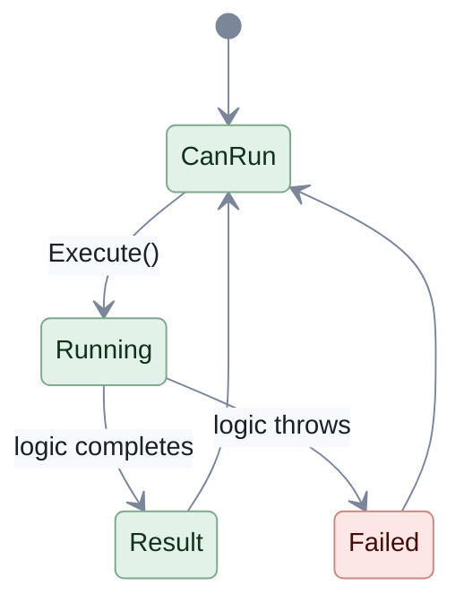
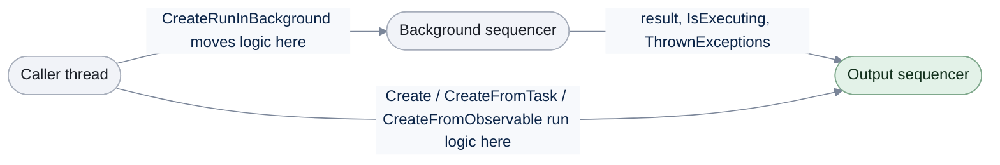

# Commands

[Run the complete page example](https://github.com/reactiveui/ReactiveUI/blob/main/src/examples/Documentation/Pages/commands/commands.csproj).

A screen has buttons: *Save*, *Search*, *Delete*. Each one runs some logic in the view model, and the view needs to
know more than just "run this": can the button be pressed right now, is the work still running, and did it fail?
[`ICommand`](https://learn.microsoft.com/dotnet/api/system.windows.input.icommand) is the .NET interface a button
binds to. `ReactiveCommand` implements it and adds what a reactive view model needs: a result, a running flag and a
place for errors to go.

A `ReactiveCommand<TParam, TResult>` is a command that takes a `TParam` argument and produces a `TResult`. It is also
an `IObservable<TResult>`: a stream, a source of values that arrive over time. You subscribe to a stream to receive
its values, and every subscription is an `IDisposable` you should dispose when you no longer need it. `RxVoid` is a
type that carries no data, similar to `void`. Use it for a command's parameter or result when there is nothing to
pass or nothing to report.

## Create and run a command

**1. Create the command.** `ReactiveCommand.Create` builds a command from a synchronous method. The command below
clears a filter box and gives back the empty string.

```csharp
using TodoListViewModel viewModel = new(InMemoryTodoStore.CreateSeeded());
viewModel.FilterText = "bill";
using ReactiveCommand<RxVoid, string>? clearFilter = ReactiveCommand.Create(() => viewModel.FilterText = string.Empty);

_ = await clearFilter.Execute();

Console.WriteLine($"[{viewModel.FilterText}]");
```

```text
[]
```

**2. Create an asynchronous command the same way.** `ReactiveCommand.CreateFromTask` wraps a method that returns a
`Task`, so you can use `async`/`await` inside it. Calling `Execute()` on either kind of command returns a stream that
delivers the result.

```csharp
using TodoListViewModel viewModel = new(InMemoryTodoStore.CreateSeeded());

IReadOnlyList<TodoItem> rows = await viewModel.Load.Execute();

Console.WriteLine(rows.Count);
Console.WriteLine(viewModel.RemainingCount);
```

```text
4
3
```

A reader who stops here can already create and run a command. The rest of this page covers the other ways to build
one, how a view binds to a command, and how a command reports its state.

## Create commands

Five static factory methods on `ReactiveCommand` cover every way to run logic. `Create` takes a plain method.
`CreateFromObservable` takes logic that is already a stream. `CreateFromTask` takes a `Task`-returning method.
`CreateRunInBackground` runs logic off the calling thread. `CreateCombined` runs several commands as one.

Every one of them takes an optional `IObservable<bool>` for `canExecute` and an optional
`ISequencer` that picks where the command delivers its result. A sequencer decides when and where work runs; see
[Scheduling](../scheduling.md). Left out, a command uses `RxSchedulers.MainThreadScheduler`, the UI thread in an app.

### Create

`Create(Action, ...)` runs a plain method with no parameter and no result. `Create<TParam>`, `Create<TResult>` and
`Create<TParam, TResult>` add a parameter, a result, or both. Each of the four shapes has four overloads: the
delegate alone, with a `canExecute` observable, with an output `ISequencer`, or with both.

```csharp
LibraryDesk desk = new();
List<string> log = [];

using ReactiveCommand<RxVoid, RxVoid> open = ReactiveCommand.Create(() => log.Add("Desk opened"));
using ReactiveCommand<RxVoid, RxVoid> lendBook = ReactiveCommand.Create(() => log.Add("Book lent"), desk.WhenAnyValue(d => d.IsOpen));

// The last argument is the output ISequencer: it picks where the command delivers its result, IsExecuting
// and ThrownExceptions. Left out, a command uses RxSchedulers.MainThreadScheduler, the UI thread in an app.
using ReactiveCommand<RxVoid, RxVoid> tidyShelf = ReactiveCommand.Create(() => log.Add("Shelf tidied"), Sequencer.Immediate);
using ReactiveCommand<RxVoid, RxVoid> waiveFee = ReactiveCommand.Create(() => log.Add("Late fee waived"), desk.WhenAnyValue(d => d.IsOpen), Sequencer.Immediate);

_ = await open.Execute();
_ = await lendBook.Execute();
_ = await tidyShelf.Execute();
_ = await waiveFee.Execute();

desk.IsOpen = false;

foreach (string entry in log)
{
    Console.WriteLine(entry);
}

Console.WriteLine(await lendBook.CanExecute.FirstAsync());
```

```text
Desk opened
Book lent
Shelf tidied
Late fee waived
False
```

| Delegate | Parameter | Result | Overloads |
| --- | --- | --- | --- |
| `Action` | none | none | `Create(Action)`, `Create(Action, IObservable<bool>)`, `Create(Action, ISequencer)`, `Create(Action, IObservable<bool>, ISequencer)` |
| `Action<TParam>` | `TParam` | none | `Create<TParam>(Action<TParam>)`, `Create<TParam>(Action<TParam>, IObservable<bool>)`, `Create<TParam>(Action<TParam>, ISequencer)`, `Create<TParam>(Action<TParam>, IObservable<bool>, ISequencer)` |
| `Func<TResult>` | none | `TResult` | `Create<TResult>(Func<TResult>)`, `Create<TResult>(Func<TResult>, IObservable<bool>)`, `Create<TResult>(Func<TResult>, ISequencer)`, `Create<TResult>(Func<TResult>, IObservable<bool>, ISequencer)` |
| `Func<TParam, TResult>` | `TParam` | `TResult` | `Create<TParam, TResult>(Func<TParam, TResult>)`, `Create<TParam, TResult>(Func<TParam, TResult>, IObservable<bool>)`, `Create<TParam, TResult>(Func<TParam, TResult>, ISequencer)`, `Create<TParam, TResult>(Func<TParam, TResult>, IObservable<bool>, ISequencer)` |

### CreateFromObservable

`CreateFromObservable` wraps logic that already returns an `IObservable<TResult>`, so a command can run a stream
directly instead of a plain value. The command below borrows a book by id, turning the synchronous lookup into a
single-value stream with `Signal.Emit`.

```csharp
LibraryDesk desk = new();

using ReactiveCommand<int, Book> borrow = ReactiveCommand.CreateFromObservable<int, Book>(bookId => Signal.Emit(desk.Borrow(bookId)));
using ReactiveCommand<int, Book> borrowWhileOpen = ReactiveCommand.CreateFromObservable<int, Book>(bookId => Signal.Emit(desk.Borrow(bookId)), desk.WhenAnyValue(d => d.IsOpen));
using ReactiveCommand<int, Book> borrowImmediate = ReactiveCommand.CreateFromObservable<int, Book>(bookId => Signal.Emit(desk.Borrow(bookId)), Sequencer.Immediate);
using ReactiveCommand<int, Book> borrowGuarded = ReactiveCommand.CreateFromObservable<int, Book>(
    bookId => Signal.Emit(desk.Borrow(bookId)),
    desk.WhenAnyValue(d => d.IsOpen),
    Sequencer.Immediate);

Book first = await borrow.Execute(1);
Book second = await borrowWhileOpen.Execute(2);
Book third = await borrowImmediate.Execute(3);
Book fourth = await borrowGuarded.Execute(4);

Console.WriteLine(first.Title);
Console.WriteLine(second.Title);
Console.WriteLine(third.Title);
Console.WriteLine(fourth.Title);
Console.WriteLine(desk.LoanCount);
```

```text
Clean Code
The Pragmatic Programmer
Design Patterns
Refactoring
4
```

| Delegate | Parameter | Overloads |
| --- | --- | --- |
| `Func<IObservable<TResult>>` | none | `CreateFromObservable<TResult>(Func<IObservable<TResult>>)`, `CreateFromObservable<TResult>(Func<IObservable<TResult>>, IObservable<bool>)`, `CreateFromObservable<TResult>(Func<IObservable<TResult>>, ISequencer)`, `CreateFromObservable<TResult>(Func<IObservable<TResult>>, IObservable<bool>, ISequencer)` |
| `Func<TParam, IObservable<TResult>>` | `TParam` | `CreateFromObservable<TParam, TResult>(Func<TParam, IObservable<TResult>>)`, `CreateFromObservable<TParam, TResult>(Func<TParam, IObservable<TResult>>, IObservable<bool>)`, `CreateFromObservable<TParam, TResult>(Func<TParam, IObservable<TResult>>, ISequencer)`, `CreateFromObservable<TParam, TResult>(Func<TParam, IObservable<TResult>>, IObservable<bool>, ISequencer)` |

### CreateFromTask

`CreateFromTask` wraps a method that returns a `Task`, so the method can use `async`/`await`. Eight delegate shapes
cover every combination of a parameter, a result and a `CancellationToken`; each shape has the same four overloads as
`Create`. Passing a `CancellationToken` lets the command cancel the task: disposing an execution cancels the token it
was given, which [Cancelling commands](canceling.md) covers in full. The example below reads the number of books a
sync returns, then cancels one mid-flight and shows `IsExecuting` drop back to `false`.

```csharp
LibraryDesk desk = new();

using ReactiveCommand<RxVoid, int> sync = ReactiveCommand.CreateFromTask(desk.SyncWithCentralCatalogueAsync);
using ReactiveCommand<RxVoid, int> syncWhileOpen = ReactiveCommand.CreateFromTask(desk.SyncWithCentralCatalogueAsync, desk.WhenAnyValue(d => d.IsOpen));
using ReactiveCommand<RxVoid, int> syncImmediate = ReactiveCommand.CreateFromTask(desk.SyncWithCentralCatalogueAsync, Sequencer.Immediate);
using ReactiveCommand<RxVoid, int> syncGuarded = ReactiveCommand.CreateFromTask(desk.SyncWithCentralCatalogueAsync, desk.WhenAnyValue(d => d.IsOpen), Sequencer.Immediate);

Console.WriteLine(await sync.Execute());
Console.WriteLine(await syncWhileOpen.Execute());
Console.WriteLine(await syncImmediate.Execute());
Console.WriteLine(await syncGuarded.Execute());

Task<bool> stopped = sync.IsExecuting.Where(static executing => !executing).Skip(1).FirstAsync().ToTask();
IDisposable execution = sync.Execute().Subscribe(static _ => { }, static _ => { });
execution.Dispose();
_ = await stopped;

Console.WriteLine("Sync cancelled");
```

```text
4
4
4
4
Sync cancelled
```

`IsExecuting` is an `IObservable<bool>` that reports whether the command is running. It, like the command's result
and `ThrownExceptions`, is delivered on the output sequencer. Every `Create*` factory delivers it the same way.

| Delegate | Parameter | Result | Cancellable | Overloads (each with the same four `canExecute`/`ISequencer` combinations as `Create`) |
| --- | --- | --- | --- | --- |
| `Func<Task>` | none | none | no | `CreateFromTask(Func<Task>, ...)` |
| `Func<CancellationToken, Task>` | none | none | yes | `CreateFromTask(Func<CancellationToken, Task>, ...)` |
| `Func<Task<TResult>>` | none | `TResult` | no | `CreateFromTask<TResult>(Func<Task<TResult>>, ...)` |
| `Func<CancellationToken, Task<TResult>>` | none | `TResult` | yes | `CreateFromTask<TResult>(Func<CancellationToken, Task<TResult>>, ...)` |
| `Func<TParam, Task>` | `TParam` | none | no | `CreateFromTask<TParam>(Func<TParam, Task>, ...)` |
| `Func<TParam, CancellationToken, Task>` | `TParam` | none | yes | `CreateFromTask<TParam>(Func<TParam, CancellationToken, Task>, ...)` |
| `Func<TParam, Task<TResult>>` | `TParam` | `TResult` | no | `CreateFromTask<TParam, TResult>(Func<TParam, Task<TResult>>, ...)` |
| `Func<TParam, CancellationToken, Task<TResult>>` | `TParam` | `TResult` | yes | `CreateFromTask<TParam, TResult>(Func<TParam, CancellationToken, Task<TResult>>, ...)` |

A simpler no-parameter, result-returning example shows the plain four-overload shape on its own:

```csharp
LibraryDesk desk = new();

_ = desk.Borrow(1);
_ = desk.Borrow(2);
using ReactiveCommand<RxVoid, int> returnAll = ReactiveCommand.CreateFromTask(desk.ReturnAllBooksWithCountAsync);
Console.WriteLine(await returnAll.Execute());
```

```text
2
```

### CreateRunInBackground

`Create` and `CreateFromTask` run their logic wherever the caller is; the caller decides whether that is off the UI
thread. `CreateRunInBackground` instead moves the execution logic itself onto a background `ISequencer`, so a
synchronous method that takes a while does not block the UI thread. It takes the same four delegate shapes as
`Create` (`Action`, `Action<TParam>`, `Func<TResult>`, `Func<TParam, TResult>`), each with five overloads: the
delegate alone, with `canExecute`, with `canExecute` and a background sequencer, with a background sequencer and an
output sequencer, or with all three.

```csharp
LibraryDesk desk = new();
List<string> log = [];

using ReactiveCommand<RxVoid, RxVoid> logOpened = ReactiveCommand.CreateRunInBackground(() => log.Add("Desk opened"));
using ReactiveCommand<RxVoid, RxVoid> logWhileOpen = ReactiveCommand.CreateRunInBackground(() => log.Add("Book lent"), desk.WhenAnyValue(d => d.IsOpen));

// The third argument is the background ISequencer, where the execute action runs; omitted, it defaults to
// RxSchedulers.TaskpoolScheduler. The fourth is the output ISequencer, where the result, IsExecuting and
// ThrownExceptions are delivered; omitted, it defaults to RxSchedulers.MainThreadScheduler.
using ReactiveCommand<RxVoid, RxVoid> logBackground = ReactiveCommand.CreateRunInBackground(
    () => log.Add("Shelf tidied"),
    desk.WhenAnyValue(d => d.IsOpen),
    Sequencer.Immediate);
using ReactiveCommand<RxVoid, RxVoid> logBackgroundAndOutput = ReactiveCommand.CreateRunInBackground(
    () => log.Add("Late fee waived"),
    Sequencer.Immediate,
    Sequencer.Immediate);
using ReactiveCommand<RxVoid, RxVoid> logAll = ReactiveCommand.CreateRunInBackground(
    () => log.Add("Catalogue reindexed"),
    desk.WhenAnyValue(d => d.IsOpen),
    Sequencer.Immediate,
    Sequencer.Immediate);

_ = await logOpened.Execute();
_ = await logWhileOpen.Execute();
_ = await logBackground.Execute();
_ = await logBackgroundAndOutput.Execute();
_ = await logAll.Execute();

foreach (string entry in log)
{
    Console.WriteLine(entry);
}
```

```text
Desk opened
Book lent
Shelf tidied
Late fee waived
Catalogue reindexed
```

| Delegate | Parameter | Result | Overloads |
| --- | --- | --- | --- |
| `Action` | none | none | `CreateRunInBackground(Action)`, `CreateRunInBackground(Action, IObservable<bool>)`, `CreateRunInBackground(Action, IObservable<bool>, ISequencer)`, `CreateRunInBackground(Action, ISequencer, ISequencer)`, `CreateRunInBackground(Action, IObservable<bool>, ISequencer, ISequencer)` |
| `Action<TParam>` | `TParam` | none | `CreateRunInBackground<TParam>(Action<TParam>)`, `CreateRunInBackground<TParam>(Action<TParam>, IObservable<bool>)`, `CreateRunInBackground<TParam>(Action<TParam>, IObservable<bool>, ISequencer)`, `CreateRunInBackground<TParam>(Action<TParam>, ISequencer, ISequencer)`, `CreateRunInBackground<TParam>(Action<TParam>, IObservable<bool>, ISequencer, ISequencer)` |
| `Func<TResult>` | none | `TResult` | `CreateRunInBackground<TResult>(Func<TResult>)`, `CreateRunInBackground<TResult>(Func<TResult>, IObservable<bool>)`, `CreateRunInBackground<TResult>(Func<TResult>, IObservable<bool>, ISequencer)`, `CreateRunInBackground<TResult>(Func<TResult>, ISequencer, ISequencer)`, `CreateRunInBackground<TResult>(Func<TResult>, IObservable<bool>, ISequencer, ISequencer)` |
| `Func<TParam, TResult>` | `TParam` | `TResult` | `CreateRunInBackground<TParam, TResult>(Func<TParam, TResult>)`, `CreateRunInBackground<TParam, TResult>(Func<TParam, TResult>, IObservable<bool>)`, `CreateRunInBackground<TParam, TResult>(Func<TParam, TResult>, IObservable<bool>, ISequencer)`, `CreateRunInBackground<TParam, TResult>(Func<TParam, TResult>, ISequencer, ISequencer)`, `CreateRunInBackground<TParam, TResult>(Func<TParam, TResult>, IObservable<bool>, ISequencer, ISequencer)` |

### CreateCombined

`CreateCombined` runs a group of commands together as one, useful when several independent commands should also be
triggerable as a batch: clearing several caches at once, or refreshing several lists together. The combined command
collects every child command's result into a list. Writing your own combined command type, and the
`CombinedReactiveCommand` constructors behind this factory, are covered in
[Writing your own command type](advanced.md).

```csharp
LibraryDesk desk = new();
_ = desk.Borrow(1);
_ = desk.Borrow(2);

using ReactiveCommand<RxVoid, int> takeBackLoans = ReactiveCommand.Create(desk.ReturnAll);
using ReactiveCommand<RxVoid, int> countShelf = ReactiveCommand.Create(() => desk.Search(string.Empty).Count);
using CombinedReactiveCommand<RxVoid, int> endOfDay = ReactiveCommand.CreateCombined([takeBackLoans, countShelf]);
IList<int> firstRun = await endOfDay.Execute();

using ReactiveCommand<RxVoid, int> countShelfWhileOpen = ReactiveCommand.Create(() => desk.Search(string.Empty).Count);
using CombinedReactiveCommand<RxVoid, int> endOfDayWhileOpen = ReactiveCommand.CreateCombined([countShelfWhileOpen], desk.WhenAnyValue(d => d.IsOpen));
IList<int> secondRun = await endOfDayWhileOpen.Execute();

// The ISequencer argument picks where the combined list is delivered; omitted, it defaults to RxSchedulers.MainThreadScheduler.
using ReactiveCommand<RxVoid, int> countShelfImmediate = ReactiveCommand.Create(() => desk.Search(string.Empty).Count);
using CombinedReactiveCommand<RxVoid, int> endOfDayImmediate = ReactiveCommand.CreateCombined([countShelfImmediate], Sequencer.Immediate);
IList<int> thirdRun = await endOfDayImmediate.Execute();

using ReactiveCommand<RxVoid, int> countShelfGuarded = ReactiveCommand.Create(() => desk.Search(string.Empty).Count);
using CombinedReactiveCommand<RxVoid, int> endOfDayGuarded = ReactiveCommand.CreateCombined([countShelfGuarded], desk.WhenAnyValue(d => d.IsOpen), Sequencer.Immediate);
IList<int> fourthRun = await endOfDayGuarded.Execute();

Console.WriteLine(firstRun[0]);
Console.WriteLine(firstRun[1]);
Console.WriteLine(secondRun[0]);
Console.WriteLine(thirdRun[0]);
Console.WriteLine(fourthRun[0]);
```

```text
2
4
4
4
4
```

Every child command passed to `CreateCombined` must be the same `ReactiveCommandBase<TParam, TResult>` type. The
combined command can run only when every child command can run, and an extra `canExecute` observable narrows that
further.

| Overload |
| --- |
| `CreateCombined<TParam, TResult>(IEnumerable<ReactiveCommandBase<TParam, TResult>>)` |
| `CreateCombined<TParam, TResult>(IEnumerable<ReactiveCommandBase<TParam, TResult>>, IObservable<bool>)` |
| `CreateCombined<TParam, TResult>(IEnumerable<ReactiveCommandBase<TParam, TResult>>, ISequencer)` |
| `CreateCombined<TParam, TResult>(IEnumerable<ReactiveCommandBase<TParam, TResult>>, IObservable<bool>, ISequencer)` |

A view model that just wants to reload several lists together can combine them without any of this ceremony:

```csharp
using TodoListViewModel home = new(InMemoryTodoStore.CreateSeeded());
InMemoryTodoStore workStore = new();
_ = await workStore.AddAsync("Send the quarterly report", CancellationToken.None);
using TodoListViewModel work = new(workStore);

using CombinedReactiveCommand<RxVoid, IReadOnlyList<TodoItem>>? refreshAll = ReactiveCommand.CreateCombined([home.Load, work.Load]);
IList<IReadOnlyList<TodoItem>> results = await refreshAll.Execute();

Console.WriteLine(results.Count);
Console.WriteLine(home.Items.Count);
Console.WriteLine(work.Items[0].Title);
```

```text
2
4
Send the quarterly report
```

## Decide whether a command can run

`CanExecute` is an `IObservable<bool>` on every command. Give a factory method an `IObservable<bool>` and the command
can run only while the latest value from that stream is `true`; a command with no `canExecute` observable can always
run. Below, the add command follows the title box: it can run once a title is typed, and not while the box is blank.

```csharp
using TodoListViewModel viewModel = new(InMemoryTodoStore.CreateSeeded());
using IDisposable subscription = viewModel.Add.CanExecute.Subscribe(Console.WriteLine);

viewModel.NewTitle = ElectricianTitle;
viewModel.NewTitle = "   ";
```

```text
False
True
False
```

`CanExecute` also turns `false` while the command is already running, so a second click cannot start it twice. A
`canExecute` observable is not marshalled to the output sequencer, so build it from a stream that already ticks on
the thread you want, such as `WhenAnyValue`.

## Handle errors

A command never fails as a stream: it never calls `OnError`. An exception thrown inside its execution logic goes to
`ThrownExceptions`, an `IObservable<Exception>` on every command, delivered on the output sequencer. It also
propagates to whatever awaits or subscribes to `Execute()`, so a view model can catch it locally and still let
`ThrownExceptions` update the rest of the screen.

```csharp
using TodoListViewModel viewModel = new(InMemoryTodoStore.CreateSeeded());
_ = await viewModel.Load.Execute();
viewModel.NewTitle = "Buy groceries";

try
{
    _ = await viewModel.Add.Execute();
}
catch (TodoStoreException)
{
    // The awaiting caller sees the error too; the screen shows it through ErrorMessage.
}

Console.WriteLine(viewModel.ErrorMessage);
Console.WriteLine(viewModel.Items.Count);
```

```text
'Buy groceries' is already on the list.
4
```

If nothing subscribes to `ThrownExceptions`, an exception from a command's execution logic brings the application
down. Subscribe to it, even just to log the error. Use [the default exception handler](../default-exception-handler.md)
to change what happens to an exception nobody handles.

## Invoke commands

Call `Execute()` to run a command. It returns a stream that delivers the result, so `await` it or `Subscribe()` to
it; the stream is cold, so nothing runs until something does one of those. `InvokeCommand` runs a command each time
another stream ticks, useful for triggering a command from something other than a click, such as a timer or another
command's result.

```csharp
using TodoListViewModel viewModel = new(InMemoryTodoStore.CreateSeeded());
Task<IReadOnlyList<TodoItem>> loaded = viewModel.Load.FirstAsync().ToTask();

using IDisposable subscription = Signal.Emit(RxVoid.Default).InvokeCommand(viewModel.Load);
_ = await loaded;

Console.WriteLine(viewModel.Items.Count);
```

```text
4
```

`InvokeCommand` checks `CanExecute` before each run, so it does nothing while the command cannot run. Dispose the
subscription it returns when you no longer want the source stream driving the command.

## Bind a command to a view

`BindCommand` is a [ReactiveUI.Binding](../../../binding/bindings.md) method that connects a view model's command to
a control on the view: it runs the command when the control's default event fires, such as a button's `Click`, and
disables the control while the command cannot run. Read [Bindings](../../../binding/bindings.md) for how binding
works in depth.

```csharp
using TodoListViewModel viewModel = new(InMemoryTodoStore.CreateSeeded());
_ = await viewModel.Load.Execute();
using TodoListView view = new() { ViewModel = viewModel };

using IDisposable binding = view.BindCommand(viewModel, x => x.Add, v => v.AddButton);

view.AddButton.PerformClick();
Console.WriteLine(viewModel.Items.Count);

viewModel.NewTitle = "Book electrician";
Task<TodoItem> added = viewModel.Add.FirstAsync().ToTask();
view.AddButton.PerformClick();
TodoItem item = await added;

Console.WriteLine(item.Title);
Console.WriteLine(viewModel.Items.Count);
```

```text
4
Book electrician
5
```

Clicking while the title is blank does nothing, because `Add.CanExecute` is `false`. Pass a fourth argument, an
`IObservable<TParam>`, to hand the command a parameter each time it runs. Below, completing a to-do item passes the
item currently selected in the list.

```csharp
using TodoListViewModel viewModel = new(InMemoryTodoStore.CreateSeeded());
_ = await viewModel.Load.Execute();
using TodoListView view = new() { ViewModel = viewModel };
view.ItemList.Items = viewModel.Items;

using IDisposable binding = view.BindCommand(
    viewModel,
    x => x.Complete,
    v => v.CompleteButton,
    view.WhenAnyValue(v => v.ItemList.SelectedItem).WhereNotNull());

view.ItemList.SelectedItem = viewModel.Items[0];
Task<TodoItem> completed = viewModel.Complete.FirstAsync().ToTask();
view.CompleteButton.PerformClick();
TodoItem item = await completed;

Console.WriteLine($"{item.Title}: {item.IsDone}");
Console.WriteLine(viewModel.RemainingCount);
```

```text
Buy groceries: True
2
```

## A command's life cycle

The diagram below follows one execution of a command from the moment it may run to the moment it stops running.



`CanExecute` is `true` in the first state, and `IsExecuting` is `true` only in the `Running` state. A result reports
through the command's own stream; a failure reports through `ThrownExceptions` as well as through whatever awaits
`Execute()`. Either way, the command returns to a state where it may run again, unless a `canExecute` observable
says otherwise.

## Where results are delivered

Every `Create*` factory takes an optional `ISequencer` for its output. It picks where the command delivers its
result, `IsExecuting` and `ThrownExceptions`; left out, that is `RxSchedulers.MainThreadScheduler`. The execution
logic itself is not moved to that sequencer: for `Create`, `CreateFromTask` and `CreateFromObservable`, it runs
wherever the caller invoked `Execute` from. Only `CreateRunInBackground` also takes a background `ISequencer`, which
moves the execution logic itself off the caller's thread.



Passing `canExecute` as the last argument is a common mistake: it is always the argument before any `ISequencer`, so
overloads that take both list `canExecute` first. See [Scheduling](../scheduling.md) for more on sequencers,
including `Sequencer.Immediate`, used throughout this page so the examples run synchronously.

## At a glance

Each `ReactiveUI` package that ships a `Reactive` sibling (`ReactiveUI.Reactive`) builds `ReactiveCommand` and the
rest of this page's types from the same source, for apps that use System.Reactive.

| Member | What it does |
| --- | --- |
| `ReactiveCommand.Create` | Builds a command from a plain method: `Action`, `Action<TParam>`, `Func<TResult>` or `Func<TParam, TResult>`. |
| `ReactiveCommand.CreateFromObservable` | Builds a command from a method that returns `IObservable<TResult>`. |
| `ReactiveCommand.CreateFromTask` | Builds a command from a method that returns `Task` or `Task<TResult>`, optionally cancellable. |
| `ReactiveCommand.CreateRunInBackground` | Builds a command whose execution logic runs on a background `ISequencer`. |
| `ReactiveCommand.CreateCombined` | Builds a `CombinedReactiveCommand` that runs several commands together. |
| `Execute()` | Runs the command and returns a stream of its result. |
| `CanExecute` | An `IObservable<bool>` reporting whether the command may run. |
| `IsExecuting` | An `IObservable<bool>` reporting whether the command is currently running. |
| `ThrownExceptions` | An `IObservable<Exception>` of every error the execution logic throws. |
| `InvokeCommand` | Runs a command each time a stream ticks, respecting `CanExecute`. |
| `BindCommand` | Connects a view control's event to a command, disabling the control while it cannot run. |

Production implementation: [`ReactiveCommand.cs`](https://github.com/reactiveui/ReactiveUI/blob/main/src/ReactiveUI.Core/ReactiveCommand.cs).
