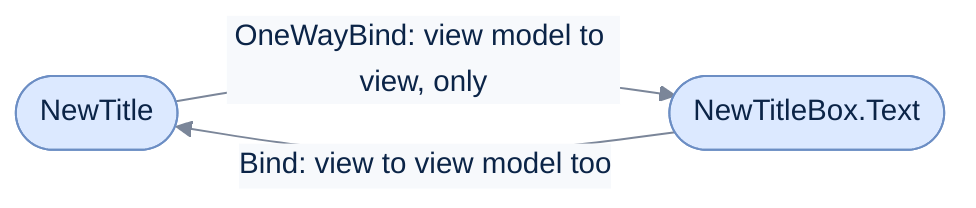

# Data Binding

[Run the complete page example](https://github.com/reactiveui/ReactiveUI/blob/main/src/examples/Documentation/Pages/data-binding/data-binding.csproj).

A screen shows values that live on a view model: the title of a to-do item, how many items are left, the last error. A **binding** is a call that keeps a property on the view in step with a property on the view model, so you write no event handler by hand. A **one-way** binding copies the view model's value to the view. A **two-way** binding also copies an edit in the view back to the view model. Every binding runs until you dispose it, so it stops watching both objects the moment you no longer need it.

[ReactiveUI.Binding](../../../binding/index.md) is the binding engine behind every call on this page. A source generator reads each binding while your project builds and writes the code for it, so a binding needs no reflection and works with trimming and Native AOT. `ReactiveUI.Binding` also ships as `ReactiveUI.Binding.Reactive`, the same source built against System.Reactive; reference that one only if your app already schedules with `IScheduler`.

## Bind two properties both ways

`Bind` connects a view-model property to a control's property in both directions. The example view model, `TodoListViewModel`, holds a `NewTitle` string; the example view, `TodoListView`, has a `NewTitleBox` text box.

**1. Call `Bind` on the view.** Pass the view model, then the view model's property, then the view's property, each as a lambda written inline so the generator can read it. `Bind` returns an `IReactiveBinding<TodoListView, BindingChange>`, a disposable that also reports what the binding writes.

**2. Type in the box.** The new text flows to `NewTitle`.

**3. Set the view model property.** The new value flows back to the box.

```csharp
using TodoListViewModel viewModel = new(InMemoryTodoStore.CreateSeeded());
using TodoListView view = new() { ViewModel = viewModel };

using IReactiveBinding<TodoListView, BindingChange> binding = view.Bind(viewModel, x => x.NewTitle, v => v.NewTitleBox.Text);

view.NewTitleBox.Text = ElectricianTitle;
Console.WriteLine(viewModel.NewTitle);

viewModel.NewTitle = string.Empty;
Console.WriteLine($"[{view.NewTitleBox.Text}]");
```

```text
Book electrician
[]
```

`BindingChange` names which side produced the value, through its `Value` and `FromViewModel` members. `IReactiveBinding<TView, TValue>` also exposes `Direction` (a `BindingDirection` of `OneWay`, `TwoWay` or `AsyncOneWay`), the bound `View`, and the `ViewExpression` and `ViewModelExpression` the binding was built from. [Bindings](../../../binding/bindings.md#read-what-a-binding-reports) covers reading them. `BindTwoWay` is the same call made from the view model's side; it returns a plain `IDisposable` instead.



The one-way arrow only ever runs from the view model to the view. The two-way arrow adds the return trip: an edit in the box reaches `NewTitle` as well.

## Copy one property to the view

`OneWayBind` copies a view-model property to a control and never writes back, so it suits a value the user cannot edit, such as a list or a count. The example binds the view model's filtered `Items` to the view's `ItemList`.

```csharp
using TodoListViewModel viewModel = new(InMemoryTodoStore.CreateSeeded());
using TodoListView view = new() { ViewModel = viewModel };

using IReactiveBinding<TodoListView, IReadOnlyList<TodoItem>> binding = view.OneWayBind(viewModel, x => x.Items, v => v.ItemList.Items);

_ = await viewModel.Load.Execute();
Console.WriteLine(view.ItemList.Items.Count);

viewModel.FilterText = "bill";
Console.WriteLine(view.ItemList.Items[0].Title);
```

```text
4
Pay electricity bill
```

Loading the items fills the list, and changing `FilterText` narrows it, because `Items` recomputes from the filter. `BindOneWay` is the same call made from the view model's side, and it returns a plain `IDisposable`. An app can register a **hook**, a class that inspects a binding as it is created and can refuse it. A refused `OneWayBind` returns `null`. A refused `BindOneWay` returns an empty `IDisposable` that does nothing. [Bind one property to another](../../../binding/bindings.md#bind-one-property-to-another) covers both, including what happens when a property path runs through a value that is `null`, and [Refuse a binding with a hook](../../../binding/bindings.md#refuse-a-binding-with-a-hook) covers hooks.

## Convert a value while binding

Add a conversion function after the two property lambdas when the view model's type is not what the control shows. Here `RemainingCount`, an `int`, becomes the sentence the label shows.

```csharp
using TodoListViewModel viewModel = new(InMemoryTodoStore.CreateSeeded());
using TodoListView view = new() { ViewModel = viewModel };

using IReactiveBinding<TodoListView, string> binding = view.OneWayBind(
    viewModel,
    x => x.RemainingCount,
    v => v.RemainingLabel.Text,
    static count => count == 1 ? "1 item left" : $"{count} items left");

_ = await viewModel.Load.Execute();
Console.WriteLine(view.RemainingLabel.Text);

_ = await viewModel.Complete.Execute(viewModel.Items[0]);
Console.WriteLine(view.RemainingLabel.Text);
```

```text
3 items left
2 items left
```

Mark a conversion function `static` when it captures nothing from the method around it, so the compiler reuses one delegate. `Bind` and `BindTwoWay` take a conversion in each direction instead of one, for a two-way binding whose types differ. [Converters](../../../binding/converters.md) covers reusable conversions and the `IBindingTypeConverter` types the library ships.

## Write any stream to a property with BindTo

`BindTo` is not limited to a view-model property: it writes any `IObservable<T>` to a target property, so you can shape the value with operators first. The example turns the view model's `ErrorMessage` into a `bool` with `Select`, then writes it to the error label's visibility.

```csharp
using TodoListViewModel viewModel = new(InMemoryTodoStore.CreateSeeded());
using TodoListView view = new() { ViewModel = viewModel };

using IDisposable binding = viewModel.WhenAnyValue(x => x.ErrorMessage)
    .Select(static message => message.Length > 0)
    .BindTo(view, v => v.ErrorLabel.IsVisible);
Console.WriteLine(view.ErrorLabel.IsVisible);

_ = await viewModel.Load.Execute();
viewModel.NewTitle = "Buy groceries";
try
{
    _ = await viewModel.Add.Execute();
}
catch (TodoStoreException)
{
    // The store refuses the duplicate; the view model reports it through ErrorMessage.
}

Console.WriteLine(view.ErrorLabel.IsVisible);
```

```text
False
True
```

`WhenAnyValue` is the observation method that turns a property into a stream; [Observing](../../../binding/observing.md) covers it and the other observation methods `WhenChanged`, `WhenChanging`, `WhenAny`, `WhenAnyObservable` and `WhenAnyDynamic`. `BindTo` returns an `IDisposable`, not an `IReactiveBinding`, because the source is a stream rather than a named property. `BindTo` writes each value on the thread that owns the target property, so the stream needs no `ObserveOn`. When the stream's element type and the property's type differ and no converter handles that pair, `BindTo` writes nothing and reports nothing. Convert the value in the stream first, as the `Select` above does.

## Dispose a binding in WhenActivated

A live binding keeps both the view and the view model in memory, because each side holds a reference to the other for as long as the binding runs. Dispose every binding you create, as the [dispose-your-subscriptions](../../guidelines/framework/dispose-your-subscriptions.md) guideline explains. The usual place is inside [WhenActivated](../when-activated.md), which runs its block each time the view is shown and disposes everything the block adds each time the view is hidden. `TodoListView` sets up every one of its bindings this way:

```csharp
public TodoListView() =>
    this.WhenActivated(
        disposables =>
        {
            disposables(this.Bind(ViewModel, x => x.NewTitle, v => v.NewTitleBox.Text));
            disposables(this.Bind(ViewModel, x => x.FilterText, v => v.FilterBox.Text));
            disposables(this.OneWayBind(ViewModel, x => x.Items, v => v.ItemList.Items));
            disposables(this.OneWayBind(ViewModel, x => x.RemainingCount, v => v.RemainingLabel.Text, static count => $"{count} left"));
            disposables(this.OneWayBind(ViewModel, x => x.ErrorMessage, v => v.ErrorLabel.Text));
            disposables(this.BindCommand(ViewModel, x => x.Add, v => v.AddButton));
        },
        this.WhenAnyValue(x => x.ViewModel));
```

`Bind` and `OneWayBind` called this way read `ViewModel` on the view itself, so each lambda's first parameter is the view model's type and the second is the view's. `BindCommand` attaches a `ReactiveCommand` to a control; [Bindings](../../../binding/bindings.md) covers it alongside `BindInteraction` and `InvokeCommand`.

## Implement IViewFor on the view

A view needs an `IViewFor<TViewModel>` implementation before it can use the view-first binding methods shown above (`Bind`, `OneWayBind`, `BindCommand`, `BindInteraction`). The way to implement it depends on the platform.

* **iOS:** change the base class to one of the Reactive UIKit classes, such as `ReactiveViewController`, and implement `ViewModel` with `RaiseAndSetIfChanged`. You can also implement `INotifyPropertyChanged` on the view and make sure the `ViewModel` property signals changes.

* **Android:** change the base class to one of the Reactive Activity or Fragment classes, such as `ReactiveActivity<T>`. You can also implement `IViewFor<T>` on the view and make sure the `ViewModel` property signals changes.

* **XAML-based platforms:** implement `IViewFor<T>` by hand and make `ViewModel` a `DependencyProperty`. A `UserControl` can use the `ReactiveUserControl<TViewModel>` base class instead.

## Platforms

The platform pages below cover the view base classes and activation for each UI framework. Each one builds on [WhenActivated](../when-activated.md) and the platform base classes.

* [Android](android/index.md)

* [iOS](ios.md)

* [MAUI](../../getting-started/installation/maui.md)

* [Windows Presentation Foundation](windows-presentation-foundation.md)

* [Windows Forms](../../../binding/threading.md)

* [Avalonia UI](avalonia.md)

## Go deeper

[ReactiveUI.Binding](../../../binding/index.md) is the full reference for binding:

* [Observing property changes](../../../binding/observing.md) with `WhenChanged`, `WhenAnyValue` and the other observation methods.
* [Bindings](../../../binding/bindings.md) with `BindOneWay`, `BindTwoWay`, `BindTo`, `BindCommand` and `BindInteraction`, and how a binding reports what it wrote.
* [Converters](../../../binding/converters.md) and [custom converters](../../../binding/custom-converters.md) for values whose types differ.
* [Notification mechanisms](../../../binding/mechanisms.md), [views](../../../binding/views.md), [threading](../../../binding/threading.md) and [setup](../../../binding/setup.md).

## Binding calls at a glance

| Member | What it does |
| --- | --- |
| `Bind` | Two-way binding from the view: connects a view property to a view-model property in both directions. Returns an `IReactiveBinding`. |
| `BindTwoWay` | Two-way binding from the view model: the same connection, called on the view model. Returns an `IDisposable`. |
| `OneWayBind` | One-way binding from the view: copies a view-model property to a view property, with an optional conversion function. Returns an `IReactiveBinding`. |
| `BindOneWay` | One-way binding from the view model: the same copy, called on the view model. Returns an `IDisposable`. |
| `BindTo` | Writes any `IObservable<T>` to a property. Returns an `IDisposable`. |
| `BindCommand` | Attaches a `ReactiveCommand` to a control. |
| `BindInteraction` | Answers an `Interaction<TInput, TOutput>` raised by the view model. |
| `IReactiveBinding<TView, TValue>` | The disposable a view-first binding call returns; reports `Changed`, `Direction`, `View`, `ViewExpression` and `ViewModelExpression`. |
| `BindingChange` | The value a two-way binding moved, and whether the view model produced it (`Value`, `FromViewModel`). |
| `BindingDirection` | `OneWay`, `TwoWay` or `AsyncOneWay`. |
