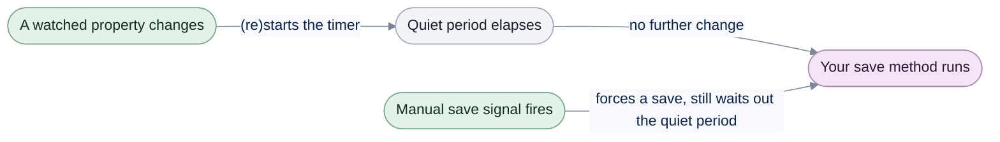
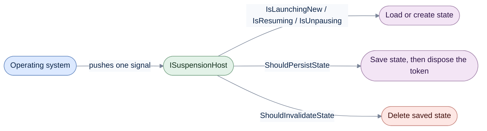

# Data Persistence

[Run the complete page example](https://github.com/reactiveui/ReactiveUI/blob/main/src/examples/Documentation/Pages/data-persistence/data-persistence.csproj).

An app can be paused, resumed or killed by its operating system at any moment, without warning. A phone can kill a
background app to free memory; a desktop app can be closed while a save is still pending. ReactiveUI gives you two
tools to protect a user's work against that. `AutoPersist` saves an object a moment after its last change, so a single
edit is never lost. The suspension host tells your app which of those moments is happening — launching new, resuming,
pausing, closing — so you can load and save the right state at the right time. ReactiveUI also ships as
`ReactiveUI.Reactive`, built from the same source, for apps that use System.Reactive instead of ReactiveUI.Primitives.

## Save a note a moment after its last change

**1. Give `AutoPersist` a save method and metadata.** `AutoPersistHelperMixins.AutoPersistMetadata` names the
`[DataMember]` properties to watch, so `AutoPersist` never reflects over the note's type to find them.

**2. Change a watched property.** Only a change to a property named in `PersistablePropertyNames` starts the quiet
period. `Note.LastOpened` is not a `[DataMember]`, so changing it never triggers a save.

**3. Wait out the quiet period.** `AutoPersist` waits for the given interval with no further change before it calls
your save method. [Dispose the subscription](../guidelines/framework/dispose-your-subscriptions.md) when the object
stops needing to save itself.

```csharp
Note note = new() { Title = "Groceries" };
AutoPersistHelperMixins.AutoPersistMetadata metadata = new(
    hasDataContract: true,
    persistablePropertyNames: new HashSet<string> { "Title", "Body" });

Console.WriteLine(metadata.HasDataContract);
Console.WriteLine(metadata.PersistablePropertyNames.Count);

int saveCount = 0;
using IDisposable subscription = note.AutoPersist(
    _ =>
    {
        saveCount++;
        return Signal.Emit(RxVoid.Default);
    },
    metadata,
    TimeSpan.FromMilliseconds(30));

note.Body = "Milk, eggs, bread";
await Task.Delay(TimeSpan.FromMilliseconds(100));

Console.WriteLine(saveCount);
```

```text
True
2
1
```



Every change to a watched property restarts the timer, so a burst of edits produces one save, not one per edit. A
manual save signal (below) forces the same save, but still waits out the quiet period.

## Force a save with a manual signal

An overload takes a second stream, the manual save signal. Pushing a value into it forces a save even when nothing
changed, but the save still waits out the quiet period.

```csharp
Note note = new();
Signal<RxVoid> manualSave = new();
AutoPersistHelperMixins.AutoPersistMetadata metadata = new(
    hasDataContract: true,
    persistablePropertyNames: new HashSet<string> { "Title", "Body" });

int saveCount = 0;
using IDisposable subscription = note.AutoPersist(
    _ =>
    {
        saveCount++;
        return Signal.Emit(RxVoid.Default);
    },
    manualSave,
    metadata,
    TimeSpan.FromMilliseconds(30));

note.LastOpened = new DateTimeOffset(2026, 1, 1, 9, 0, 0, TimeSpan.Zero);
await Task.Delay(TimeSpan.FromMilliseconds(60));
Console.WriteLine(saveCount);

manualSave.OnNext(RxVoid.Default);
await Task.Delay(TimeSpan.FromMilliseconds(60));
Console.WriteLine(saveCount);
```

```text
0
1
```

Changing `LastOpened` never starts the timer, because it is not one of the `PersistablePropertyNames`. Only the
manual signal forces the save.

## The interval defaults to three seconds

Every `AutoPersist` overload that leaves out the interval waits three seconds instead. A subscription disposed before
that interval elapses never saves, whether or not a manual signal fired.

```csharp
Note note = new();
AutoPersistHelperMixins.AutoPersistMetadata metadata = new(
    hasDataContract: true,
    persistablePropertyNames: new HashSet<string> { "Title", "Body" });

int saveCount = 0;
IDisposable subscription = note.AutoPersist(
    _ =>
    {
        saveCount++;
        return Signal.Emit(RxVoid.Default);
    },
    metadata);

note.Title = "Shopping list";

// Disposed straight away: the default three-second quiet period never elapses, so no save runs.
subscription.Dispose();

Console.WriteLine(saveCount);
```

```text
0
```

| `AutoPersist` overload | Interval | Manual save signal |
| --- | --- | --- |
| `AutoPersist(T, save, metadata, interval)` | explicit | no |
| `AutoPersist(T, save, metadata)` | default (3 seconds) | no |
| `AutoPersist(T, save, manualSave, metadata, interval)` | explicit | yes |
| `AutoPersist(T, save, manualSave, metadata)` | default (3 seconds) | yes |

## Persist every item in a collection

**1. Call `AutoPersistCollection` on the collection.** It applies `AutoPersist` to every item already there, and to
every item added later, using the same `AutoPersistMetadata`.

**2. Add items and change them.** Only a change made after an item joins the collection starts its quiet period.

**3. Read the saves.** Each item saves independently, once it has been quiet for the given interval. The save
runs on a background thread from `RxSchedulers.TaskpoolScheduler` (see [Scheduling](scheduling.md)), so two items
can save at the same moment. Anything your save lambda writes to must be safe to use from two threads at once. A `List<T>` is not, and can lose one of two adds
made at the same time; the example collects the titles in a `ConcurrentQueue<string>` instead.

```csharp
ObservableCollection<Note> notes = new();
AutoPersistHelperMixins.AutoPersistMetadata metadata = AutoPersistHelperMixins.CreateMetadata<Note>();

// Each note saves on a background thread, so two notes can save at the same moment.
// A ConcurrentQueue keeps both titles where a List<T> could lose one.
ConcurrentQueue<string> saved = new();
using IDisposable subscription = notes.AutoPersistCollection(
    note =>
    {
        saved.Enqueue(note.Title);
        return Signal.Emit(RxVoid.Default);
    },
    metadata,
    TimeSpan.FromMilliseconds(30));

Note groceries = new();
Note chores = new();
notes.Add(groceries);
notes.Add(chores);

// Only a change after the item joins the collection requests a save.
groceries.Title = "Groceries";
chores.Title = "Chores";
await Task.Delay(TimeSpan.FromMilliseconds(100));

Console.WriteLine(saved.Count);
Console.WriteLine(string.Join(", ", saved.Order(StringComparer.Ordinal)));
```

```text
2
Chores, Groceries
```

`AutoPersistHelperMixins.CreateMetadata<T>` builds `AutoPersistMetadata` for a type decorated with `[DataContract]`
and `[DataMember]`, the way `Note` is, without you listing the property names by hand. Like the single-item overloads
above, a manual save signal forces every item to save, and the interval defaults to three seconds when left out.

```csharp
ObservableCollection<Note> notes = new() { new Note { Title = "Groceries" } };
Signal<RxVoid> manualSave = new();
AutoPersistHelperMixins.AutoPersistMetadata metadata = AutoPersistHelperMixins.CreateMetadata<Note>();

int saveCount = 0;
using IDisposable subscription = notes.AutoPersistCollection(
    _ =>
    {
        saveCount++;
        return Signal.Emit(RxVoid.Default);
    },
    manualSave,
    metadata,
    TimeSpan.FromMilliseconds(30));

manualSave.OnNext(RxVoid.Default);
await Task.Delay(TimeSpan.FromMilliseconds(60));

Console.WriteLine(saveCount);
```

```text
1
```

`AutoPersistCollection` also works on a `ReadOnlyObservableCollection<T>`. The view watches the same items, but new
ones still have to arrive through the writable collection behind it. It also works on any collection that raises
`INotifyCollectionChanged`, such as a `NoteFeed` backed by a sync client instead of an `ObservableCollection<T>`.
[Collections](collections.md) covers `ActOnEveryObject`, the operator `AutoPersistCollection` uses internally to
track items entering and leaving a collection.

```csharp
NoteFeed feed = new();
Signal<RxVoid> manualSave = new();
AutoPersistHelperMixins.AutoPersistMetadata metadata = AutoPersistHelperMixins.CreateMetadata<Note>();

List<string> saved = [];
using IDisposable subscription = feed.AutoPersistCollection(
    (Note note) =>
    {
        saved.Add(note.Title);
        return Signal.Emit(RxVoid.Default);
    },
    manualSave,
    metadata,
    TimeSpan.FromMilliseconds(30));

Note chores = new();
feed.Publish(chores);

// Only a change after the item joins the feed requests a save.
chores.Title = "Chores";
await Task.Delay(TimeSpan.FromMilliseconds(100));

Console.WriteLine(saved.Count);
Console.WriteLine(saved[0]);
```

```text
1
Chores
```

A metadata provider computes `AutoPersistMetadata` per item instead of once for the whole collection, for a
collection whose items are not all the same concrete type. `AutoPersistHelperMixins.CreateMetadataProvider<TItem>`
builds one that always returns the same metadata, for a collection where every item is `TItem`.

```csharp
NoteFeed feed = new();
Signal<RxVoid> manualSave = new();
Func<Note, AutoPersistHelperMixins.AutoPersistMetadata> metadataProvider = AutoPersistHelperMixins.CreateMetadataProvider<Note>();

List<string> saved = [];
using IDisposable subscription = feed.AutoPersistCollection(
    note =>
    {
        saved.Add(note.Title);
        return Signal.Emit(RxVoid.Default);
    },
    manualSave,
    metadataProvider,
    TimeSpan.FromMilliseconds(30));

Note chores = new();
feed.Publish(chores);

// Only a change after the item joins the feed requests a save.
chores.Title = "Chores";
await Task.Delay(TimeSpan.FromMilliseconds(100));

Console.WriteLine(saved.Count);
Console.WriteLine(saved[0]);
```

```text
1
Chores
```

`AutoPersistCollection` follows the same source-collection rule as `AutoPersist`: every overload shown here takes
`AutoPersistMetadata` or a metadata provider, so it never reflects over an item's type. The overloads that leave
either one out do reflect; [Reflection](reflection.md) covers them.

## The suspension host: launch, resume, persist, invalidate

`AutoPersist` protects one object's changes. The suspension host protects the whole app's state across a launch,
a resume or a shutdown. `RxSuspension.SuspensionHost` returns the process-wide `ISuspensionHost`, the same instance
every time.

```csharp
Console.WriteLine(ReferenceEquals(RxSuspension.SuspensionHost, RxSuspension.SuspensionHost));
```

```text
True
```

A platform package drives that host for you: it watches the operating system and pushes one signal into each
lifecycle property below when the matching event happens. [Platforms](platforms/index.md) covers the platform
packages, such as `AutoSuspendHelper` on WPF, MAUI and Android. This example drives every property by hand instead,
the way a platform package would, so you can see what each one means.



`IsLaunchingNew` fires for a clean launch, when there is no saved state to restore. `IsResuming` fires when the
platform is restoring a process that was killed. `IsUnpausing` fires when the app returns to the foreground without
being recreated. `ShouldPersistState` carries an `IDisposable` token: save the state, then dispose the token so the
platform knows the save finished. `ShouldInvalidateState` fires when saved state should be deleted, typically after a
crash.

```csharp
ISuspensionHost suspensionHost = RxSuspension.SuspensionHost;
suspensionHost.CreateNewAppState = static () => new GameSaveState(Level: 1, Score: 0);

Signal<RxVoid> launching = new();
Signal<RxVoid> resuming = new();
Signal<RxVoid> unpausing = new();
Signal<IDisposable> shouldPersist = new();
Signal<RxVoid> shouldInvalidate = new();

suspensionHost.IsLaunchingNew = launching;
suspensionHost.IsResuming = resuming;
suspensionHost.IsUnpausing = unpausing;
suspensionHost.ShouldPersistState = shouldPersist;
suspensionHost.ShouldInvalidateState = shouldInvalidate;

using IDisposable launchSubscription = suspensionHost.IsLaunchingNew.Subscribe(_ =>
{
    suspensionHost.AppState = suspensionHost.CreateNewAppState!();
    Console.WriteLine("Launching new");
});
using IDisposable resumeSubscription = suspensionHost.IsResuming.Subscribe(static _ => Console.WriteLine("Resuming"));
using IDisposable unpauseSubscription = suspensionHost.IsUnpausing.Subscribe(static _ => Console.WriteLine("Unpausing"));
using IDisposable persistSubscription = suspensionHost.ShouldPersistState.Subscribe(token =>
{
    GameSaveState state = (GameSaveState)suspensionHost.AppState!;
    Console.WriteLine($"Persisting level {state.Level}");
    token.Dispose();
});
using IDisposable invalidateSubscription = suspensionHost.ShouldInvalidateState.Subscribe(static _ => Console.WriteLine("Invalidating"));

launching.OnNext(RxVoid.Default);
resuming.OnNext(RxVoid.Default);
unpausing.OnNext(RxVoid.Default);
shouldPersist.OnNext(new ActionDisposable(static () => Console.WriteLine("Persist token disposed")));
shouldInvalidate.OnNext(RxVoid.Default);
```

```text
Launching new
Resuming
Unpausing
Persisting level 1
Persist token disposed
Invalidating
```

`AppState` holds the state as `object?`, and `CreateNewAppState` is a `Func<object>?`, so reading `AppState` back
needs a cast, as the subscriber above does. The typed host below avoids that cast.

## A driver that does nothing

`DummySuspensionDriver` implements `ISuspensionDriver` without saving or loading anything: `SaveState` and
`InvalidateState` complete immediately, and `LoadState` always produces `null`. Use it in a test, or in an app that
has not chosen its storage yet.

```csharp
DummySuspensionDriver driver = new();

_ = await driver.SaveState(new GameSaveState(Level: 5, Score: 900), GameSaveJsonContext.Default.GameSaveState);
GameSaveState? loaded = await driver.LoadState(GameSaveJsonContext.Default.GameSaveState);
_ = await driver.InvalidateState();

Console.WriteLine(loaded is null);
```

```text
True
```

`GameSaveJsonContext.Default.GameSaveState` is a source-generated `JsonTypeInfo<GameSaveState>`. Passing it, instead
of relying on reflection to discover `GameSaveState`'s shape, is what keeps `LoadState` and `SaveState` safe to run
after trimming or ahead-of-time compilation.

## A strongly-typed host

`SuspensionHost<TAppState>` implements `ISuspensionHost<TAppState>`. It carries every lifecycle signal `ISuspensionHost`
does, plus a typed `AppStateValue` in place of the untyped `AppState`, so a subscriber never casts. `CreateNewAppStateTyped`
replaces `CreateNewAppState`, and `AppStateValueChanged` reports every assignment to `AppStateValue`.

```csharp
using SuspensionHost<GameSaveState> host = new();
host.CreateNewAppStateTyped = static () => new GameSaveState(Level: 1, Score: 0);

Signal<RxVoid> launching = new();
Signal<RxVoid> resuming = new();
Signal<RxVoid> unpausing = new();
Signal<IDisposable> shouldPersist = new();
Signal<RxVoid> shouldInvalidate = new();

host.IsLaunchingNew = launching;
host.IsResuming = resuming;
host.IsUnpausing = unpausing;
host.ShouldPersistState = shouldPersist;
host.ShouldInvalidateState = shouldInvalidate;

List<GameSaveState?> stateChanges = [];
using IDisposable stateChangeSubscription = host.AppStateValueChanged.Subscribe(stateChanges.Add);
using IDisposable launchSubscription = host.IsLaunchingNew.Subscribe(_ =>
{
    host.AppStateValue = host.CreateNewAppStateTyped!();
    Console.WriteLine("Launching new");
});
using IDisposable resumeSubscription = host.IsResuming.Subscribe(static _ => Console.WriteLine("Resuming"));
using IDisposable unpauseSubscription = host.IsUnpausing.Subscribe(static _ => Console.WriteLine("Unpausing"));
using IDisposable persistSubscription = host.ShouldPersistState.Subscribe(token =>
{
    Console.WriteLine($"Persisting level {host.AppStateValue!.Level}");
    token.Dispose();
});
using IDisposable invalidateSubscription = host.ShouldInvalidateState.Subscribe(static _ => Console.WriteLine("Invalidating"));

launching.OnNext(RxVoid.Default);
resuming.OnNext(RxVoid.Default);
unpausing.OnNext(RxVoid.Default);
shouldPersist.OnNext(new ActionDisposable(static () => Console.WriteLine("Persist token disposed")));
shouldInvalidate.OnNext(RxVoid.Default);

Console.WriteLine(stateChanges.Count);
```

```text
Launching new
Resuming
Unpausing
Persisting level 1
Persist token disposed
Invalidating
1
```

`SuspensionHost<TAppState>` also implements `IDisposable`; dispose it when the host itself goes away, not just its
subscriptions. A subclass overrides the protected `Dispose(bool)` to add its own cleanup, the usual .NET dispose
pattern. The type exposes one lifecycle signal beyond the untyped `ISuspensionHost`: `IsContinuing`, for a platform
that tells apart resuming from a killed process and continuing from a briefly paused one. Ignore it if your platform
does not make that distinction.

## Wire it up: a file-backed driver with SetupDefaultSuspendResume

The examples above drove every lifecycle signal by hand. In an app, a platform package does that, and
`SetupDefaultSuspendResume` connects the resulting signals to a driver: it loads the state once, on the first launch
or resume, and saves it whenever `ShouldPersistState` fires.

**1. Write a driver against `JsonTypeInfo<T>`.** `FileGameSaveDriver` saves and loads `GameSaveState` as JSON using
`GameSaveJsonContext`'s source-generated metadata, so it never reflects over the state's shape.

**2. Register the driver, or pass it explicitly.** A platform's startup code typically registers its driver once, with
`AppLocator.CurrentMutable.RegisterConstant<ISuspensionDriver>`, so the no-driver overload of `SetupDefaultSuspendResume`
can resolve it. A second host that shares the same save file can also pass the driver explicitly.

**3. Call `SetupDefaultSuspendResume(typeInfo)`.** `GetAppState` then loads the state (creating it from
`CreateNewAppStateTyped` if none was saved), and pushing a value into `ShouldPersistState` saves it.

```csharp
string savePath = Path.Combine(Path.GetTempPath(), $"{Guid.NewGuid()}.json");
FileGameSaveDriver driver = new(savePath);

// A platform's startup code registers its driver once; SetupDefaultSuspendResume(typeInfo) resolves it from here.
AppLocator.CurrentMutable.RegisterConstant<ISuspensionDriver>(driver);
```

```csharp
using SuspensionHost<GameSaveState> resolvedHost = new()
{
    CreateNewAppStateTyped = static () => new GameSaveState(Level: 1, Score: 0),
    IsLaunchingNew = Signal.Emit(RxVoid.Default),
    IsResuming = Signal.Silent<RxVoid>(),
    ShouldInvalidateState = Signal.Silent<RxVoid>(),
};

Signal<IDisposable> resolvedPersist = new();
resolvedHost.ShouldPersistState = resolvedPersist;

using IDisposable resolvedSubscription = resolvedHost.SetupDefaultSuspendResume(GameSaveJsonContext.Default.GameSaveState);

GameSaveState loaded = resolvedHost.GetAppState();
Console.WriteLine(loaded.Level);

List<GameSaveState> observedStates = [];
using IDisposable observeSubscription = resolvedHost.ObserveAppState().Subscribe(observedStates.Add);

resolvedHost.AppStateValue = loaded with { Score = 250 };
resolvedPersist.OnNext(new ActionDisposable(static () => { }));
```

```csharp
using SuspensionHost<GameSaveState> explicitHost = new()
{
    AppStateValue = new GameSaveState(Level: 9, Score: 0),
    IsLaunchingNew = Signal.Silent<RxVoid>(),
    IsResuming = Signal.Silent<RxVoid>(),
    ShouldInvalidateState = Signal.Silent<RxVoid>(),
};

Signal<IDisposable> explicitPersist = new();
explicitHost.ShouldPersistState = explicitPersist;

using IDisposable explicitSubscription = explicitHost.SetupDefaultSuspendResume(GameSaveJsonContext.Default.GameSaveState, driver);

explicitPersist.OnNext(new ActionDisposable(static () => { }));
```

```csharp
Console.WriteLine(observedStates.Count);
```

```text
1
2
```

`GetAppState` is the typed counterpart to reading `AppState` and casting it yourself. `ObserveAppState` reports the
current state immediately, then every later assignment; here it reports the one assignment made after the first
save, since the state already existed when the subscription started. Each `SetupDefaultSuspendResume` call keeps
its own driver and its own pending load. The first host saves through the driver it resolved from `AppLocator`. The
second host saves through the driver you passed. Both are the same `driver` instance here, so both hosts share one
save file.

## Untyped members that need reflection

The typed path above — `SuspensionHost<TAppState>`, a `JsonTypeInfo<T>` and the generic `SetupDefaultSuspendResume`
overloads — never reflects. Prefer it for a trimmed or Native AOT app. Each member below has an untyped counterpart
that reflects over the state's runtime type instead of taking a `JsonTypeInfo<T>`; [Reflection](reflection.md) covers
them.

| Member | Typed, reflection-free version |
| --- | --- |
| `ISuspensionDriver.SaveState<T>(T)` / `DummySuspensionDriver.SaveState<T>(T)` | `SaveState<T>(T, JsonTypeInfo<T>)` |
| `ISuspensionDriver.LoadState()` / `DummySuspensionDriver.LoadState()` | `LoadState<T>(JsonTypeInfo<T>)` |
| `SuspensionHostExtensions.GetAppState<T>(ISuspensionHost)` | `GetAppState()` on `ISuspensionHost<TAppState>` |
| `SuspensionHostExtensions.ObserveAppState<T>(ISuspensionHost)` | `ObserveAppState()` on `ISuspensionHost<TAppState>` |
| `SuspensionHostExtensions.SetupDefaultSuspendResume(ISuspensionHost)` / `(ISuspensionHost, ISuspensionDriver)` | `SetupDefaultSuspendResume(JsonTypeInfo<TAppState>)` / `(JsonTypeInfo<TAppState>, ISuspensionDriver)` on `ISuspensionHost<TAppState>` |
| `AutoPersist` overloads without an `AutoPersistMetadata` or metadata provider | `AutoPersist` overloads that take one |
| `AutoPersistCollection` overloads without an `AutoPersistMetadata` or metadata provider | `AutoPersistCollection` overloads that take one |

## Members at a glance

| Member | What it does |
| --- | --- |
| `AutoPersist` (on any `T`) | Saves an object a moment after its last `[DataMember]` change, using `AutoPersistMetadata` to avoid reflection. |
| `AutoPersistCollection` (on `ObservableCollection<T>`, `ReadOnlyObservableCollection<T>`, or a custom `INotifyCollectionChanged` collection) | Applies `AutoPersist` to every item already in a collection, and to every item added later. |
| `AutoPersistHelperMixins.CreateMetadata<T>` | Builds `AutoPersistMetadata` from a type's `[DataContract]` / `[DataMember]` attributes. |
| `AutoPersistHelperMixins.CreateMetadataProvider<TItem>` | Builds a `Func<TItem, AutoPersistMetadata>` that returns the same metadata for every item. |
| `AutoPersistHelperMixins.AutoPersistMetadata` | Names the `[DataMember]` properties `AutoPersist` watches, and whether the type has a `[DataContract]`. |
| `RxSuspension.SuspensionHost` | The process-wide `ISuspensionHost`, the same instance every time. |
| `ISuspensionHost` | Untyped lifecycle signals: `IsLaunchingNew`, `IsResuming`, `IsUnpausing`, `ShouldPersistState`, `ShouldInvalidateState`, `AppState`, `CreateNewAppState`. |
| `ISuspensionHost<TAppState>` / `SuspensionHost<TAppState>` | Adds a typed `AppStateValue`, `CreateNewAppStateTyped` and `AppStateValueChanged` over the same lifecycle signals. |
| `SuspensionHost<TAppState>.IsContinuing` | An extra lifecycle signal for a platform that tells apart resuming and continuing from a brief pause. |
| `ISuspensionDriver` | Loads and saves state; `InvalidateState` deletes it. The `JsonTypeInfo<T>` overloads avoid reflection. |
| `DummySuspensionDriver` | An `ISuspensionDriver` that saves and loads nothing. |
| `SuspensionHostExtensions.GetAppState` / `ObserveAppState` / `SetupDefaultSuspendResume` (typed overloads) | Loads state once, observes it, and wires a driver to a typed host's lifecycle signals. |

