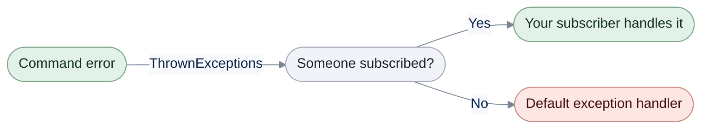

# Default Exception Handler

[Run the complete page example](https://github.com/reactiveui/ReactiveUI/blob/main/src/examples/Documentation/Pages/default-exception-handler/default-exception-handler.csproj).

A [command](commands/index.md) exposes its failures through `ThrownExceptions`, a stream of every error the command's execution logic throws. Subscribing to it is how you handle a failure yourself. When nobody subscribes, the error does not vanish: it travels on to a single, application-wide fallback.



An unwatched error always reaches the default exception handler, whether or not anything else in your app is watching.

`RxState.DefaultExceptionHandler` holds that fallback. Until you replace it, it breaks into the debugger if one is attached. Then it throws an `UnhandledErrorException` on `RxSchedulers.MainThreadScheduler`, and that throw crashes the app. Replace it with `WithExceptionHandler` on the ReactiveUI builder.

## Replace the default exception handler

You install the handler once, when the app starts ReactiveUI. It goes on the same builder as the rest of the app's setup, before the app's single `BuildApp` call.

**1. Build an `IObserver<Exception>` and install it at startup.** `Witness.Create` turns a lambda into an `IObserver<Exception>`. `WithExceptionHandler` hands it to the builder, and `BuildApp` makes it `RxState.DefaultExceptionHandler` for the rest of the app's life. The example is a console app, so `WithMainThreadScheduler(Sequencer.Immediate)` runs main-thread work in place; a UI app leaves the platform's main-thread scheduler alone.

```csharp
IObserver<Exception> handler = Witness.Create<Exception>(static error => Console.WriteLine($"Unhandled: {error.Message}"));

// A console app has no UI thread, so main-thread work runs in place.
_ = RxAppBuilder.CreateReactiveUIBuilder()
    .WithMainThreadScheduler(Sequencer.Immediate)
    .WithExceptionHandler(handler)
    .WithCoreServices()
    .BuildApp();

Console.WriteLine(ReferenceEquals(RxState.DefaultExceptionHandler, handler));
```

```text
True
```

**2. Let a command's error go unwatched.** The command below fails because the server is down, and nothing subscribes to its `ThrownExceptions`. The error reaches the installed handler. `await`ing `Execute` also throws it to the caller.

```csharp
BankAccountService server = new() { ServerIsDown = true };
using ReactiveCommand<string, decimal> loadBalance = ReactiveCommand.CreateFromObservable<string, decimal>(server.LoadBalance);

try
{
    _ = await loadBalance.Execute("checking-01");
}
catch (AccountServiceException error)
{
    // The caller sees the error too, because it awaited Execute.
    Console.WriteLine($"Caller: {error.Message}");
}
```

```text
Unhandled: The bank server could not load account 'checking-01'.
Caller: The bank server could not load account 'checking-01'.
```

Call `WithExceptionHandler` once. If you call it again before `BuildApp`, the later call wins. A null handler throws `ArgumentNullException`. Only the first build in a process installs a handler. A later `BuildApp` leaves `RxState.DefaultExceptionHandler` as it is, so put the handler on the builder the app starts with. The [app builder](rxappbuilder.md) page covers startup in full.

## What the unreplaced handler does

Left unreplaced, `RxState.DefaultExceptionHandler` throws an `UnhandledErrorException`, ReactiveUI's own exception type for an error nobody caught. Its message names `ThrownExceptions` as the way to prevent the crash. Construct the same type for your own unrecoverable failures, with or without an inner exception.

```csharp
UnhandledErrorException bare = new();
UnhandledErrorException withMessage = new("The bank server never replied.");
AccountServiceException connectionReset = new("Connection reset.");
UnhandledErrorException withInner = new("Could not load the account balance.", connectionReset);

Console.WriteLine(bare.Message);
Console.WriteLine(withMessage.Message);
Console.WriteLine(withInner.Message);
Console.WriteLine(withInner.InnerException?.Message);
```

```text
Exception of type 'ReactiveUI.UnhandledErrorException' was thrown.
The bank server never replied.
Could not load the account balance.
Connection reset.
```

## Log each notification

`Log` writes every notification a stream delivers to the [Splat](../../splat/logging/index.md) log for the object you give it, then passes each value on unchanged. The object must implement `IEnableLogger`. With no message, each line starts with the object's own type name.

```csharp
AppLocator.CurrentMutable.RegisterConstant<ILogger>(new ConsoleLogger { Level = LogLevel.Info });

BankAccountService server = new();
List<decimal> balances = [];

using IDisposable subscription = server.LoadBalance("checking-01").Log(server).Subscribe(balances.Add);

Console.WriteLine(balances[0]);
```

```text
BankAccountService:  OnNext: 500.00
BankAccountService:  OnCompleted
500.00
```

A message names which stream is logging, and a stringifier controls how `Log` writes each value. `Log(logObject)`, `Log(logObject, message)` and `Log(logObject, message, stringifier)` are the same operator with more control at each step.

```csharp
AppLocator.CurrentMutable.RegisterConstant<ILogger>(new ConsoleLogger { Level = LogLevel.Info });

BankAccountService server = new();

using IDisposable checking = server.LoadBalance("checking-01")
    .Log(server, "Checking balance")
    .Subscribe(static _ => { });

using IDisposable savings = server.LoadBalance("savings-02")
    .Log(server, "Savings balance", static balance => $"${balance:F2}")
    .Subscribe(static _ => { });
```

```text
BankAccountService: Checking balance OnNext: 500.00
BankAccountService: Checking balance OnCompleted
BankAccountService: Savings balance OnNext: $1200.50
BankAccountService: Savings balance OnCompleted
```

## Recover from a failure after logging

`LoggedCatch` logs a failure as a warning, then continues with a fallback stream in place of the error. With no fallback, it emits the element type's default value and completes.

```csharp
AppLocator.CurrentMutable.RegisterConstant<ILogger>(new ConsoleLogger { Level = LogLevel.Error });

BankAccountService server = new() { ServerIsDown = true };
List<decimal> balances = [];

using IDisposable subscription = server.LoadBalance("checking-01")
    .LoggedCatch(server)
    .Subscribe(balances.Add);

Console.WriteLine(balances[0]);
```

```text
0
```

Pass a fallback stream to continue with real data instead of a default value. A message names the load in the warning `LoggedCatch` writes.

```csharp
AppLocator.CurrentMutable.RegisterConstant<ILogger>(new ConsoleLogger { Level = LogLevel.Error });

BankAccountService server = new() { ServerIsDown = true };
IObservable<decimal> lastKnownBalance = Signal.Emit(475.00M);

List<decimal> checking = [];
using IDisposable first = server.LoadBalance("checking-01")
    .LoggedCatch(server, lastKnownBalance)
    .Subscribe(checking.Add);

List<decimal> savings = [];
using IDisposable second = server.LoadBalance("savings-02")
    .LoggedCatch(server, lastKnownBalance, "Loading savings balance")
    .Subscribe(savings.Add);

Console.WriteLine(checking[0]);
Console.WriteLine(savings[0]);
```

```text
475.00
475.00
```

The typed overloads catch only the exception type you name; every other exception still fails the stream. The handler you give receives the exception and returns the fallback stream.

```csharp
AppLocator.CurrentMutable.RegisterConstant<ILogger>(new ConsoleLogger { Level = LogLevel.Error });

BankAccountService server = new() { ServerIsDown = true };
List<string> reasons = [];

List<decimal> checking = [];
using IDisposable first = server.LoadBalance("checking-01")
    .LoggedCatch(
        server,
        (AccountServiceException failure) =>
        {
            reasons.Add(failure.Message);
            return Signal.Emit(0M);
        })
    .Subscribe(checking.Add);

List<decimal> savings = [];
using IDisposable second = server.LoadBalance("savings-02")
    .LoggedCatch(
        server,
        static (AccountServiceException _) => Signal.Emit(0M),
        "Loading savings balance")
    .Subscribe(savings.Add);

Console.WriteLine(checking[0]);
Console.WriteLine(savings[0]);
Console.WriteLine(reasons[0]);
```

```text
0
0
The bank server could not load account 'checking-01'.
```

Dispose every `Log` and `LoggedCatch` subscription, the same as any other subscription; see [dispose your subscriptions](../guidelines/framework/dispose-your-subscriptions.md) for why.

## Filter out a missing lookup

A lookup that can miss, such as finding an account by its id, delivers `null` when nothing matches. `WhereNotNull` drops those misses and converts the stream to its non-nullable element type, so the subscriber never sees `null`.

```csharp
BankAccountService server = new();
using Signal<string> selectedAccountId = new();
List<BankAccount> selectedAccounts = [];

using IDisposable subscription = selectedAccountId
    .Select(server.FindAccount)
    .WhereNotNull()
    .Subscribe(selectedAccounts.Add);

selectedAccountId.OnNext("checking-01");
selectedAccountId.OnNext("unknown-99");
selectedAccountId.OnNext("savings-02");

foreach (BankAccount account in selectedAccounts)
{
    Console.WriteLine(account.Owner);
}
```

```text
Ada Lovelace
Grace Hopper
```

`ReactiveUI` also ships as `ReactiveUI.Reactive`, built from the same source for apps that use System.Reactive; `RxState`, `UnhandledErrorException`, `Log`, `LoggedCatch` and `WhereNotNull` all exist under both.

## At a glance

| Member | What it does |
| --- | --- |
| `RxState.DefaultExceptionHandler` | The `IObserver<Exception>` that receives an error nobody caught. Unconfigured, it breaks the debugger if attached, then throws `UnhandledErrorException` on the main thread. |
| `IReactiveUIBuilder.WithExceptionHandler(IObserver<Exception>)` | Sets the handler `RxState.DefaultExceptionHandler` returns once the app's first `BuildApp` runs. The last call before `BuildApp` wins. Throws `ArgumentNullException` on a null handler. |
| `UnhandledErrorException()` | Constructs the exception with the default message. |
| `UnhandledErrorException(string)` | Constructs the exception with your message. |
| `UnhandledErrorException(string, Exception)` | Constructs the exception with your message and an inner exception. |
| `Log<T, TObj>(IObservable<T>, TObj)` | Logs every notification with the object's own type name. |
| `Log<T, TObj>(IObservable<T>, TObj, string)` | Logs every notification with a message that names the stream. |
| `Log<T, TObj>(IObservable<T>, TObj, string, Func<T, string>)` | Logs every notification with a message and a stringifier that controls how each value is written. |
| `LoggedCatch<T, TObj>(IObservable<T>, TObj)` | Logs a failure as a warning and continues with the element type's default value. |
| `LoggedCatch<T, TObj>(IObservable<T>, TObj, IObservable<T>)` | Logs a failure as a warning and continues with a fallback stream. |
| `LoggedCatch<T, TObj>(IObservable<T>, TObj, IObservable<T>, string)` | The same, with a message naming the failed operation in the warning. |
| `LoggedCatch<T, TObj, TException>(IObservable<T>, TObj, Func<TException, IObservable<T>>)` | Catches only `TException`, logs it, and continues with the stream the handler returns. |
| `LoggedCatch<T, TObj, TException>(IObservable<T>, TObj, Func<TException, IObservable<T>>, string)` | The same, with a message naming the failed operation in the warning. |
| `WhereNotNull<T>(IObservable<T>)` | Drops `null` values and converts the stream to its non-nullable element type. |
