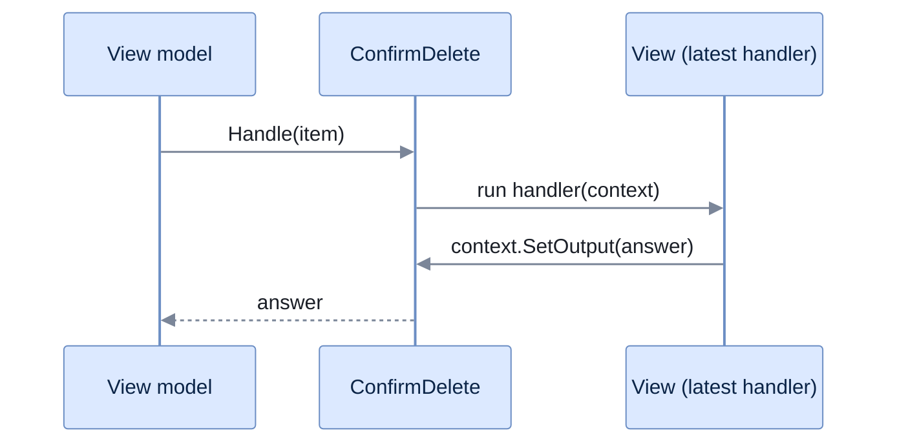

# Interactions

[Run the complete page example](https://github.com/reactiveui/ReactiveUI/blob/main/src/examples/Documentation/Pages/interactions/interactions.csproj).

A view model sometimes has to ask a question before it can go on: "delete this item?", "which file?", "retry or give up?". It could show a dialog itself, but then it would need to know about dialogs, windows and the UI thread, and a test could not run it without a screen. An interaction keeps the question in the view model and lets the view supply the answer, so the view model stays plain code you can test without a UI.

`Interaction<TInput, TOutput>` is the class that carries a question. `TInput` is what the view model asks with, and `TOutput` is what the view answers with. A view model that wants to know whether to delete a to-do item exposes an `Interaction<TodoItem, bool>`: it hands over the item and gets back `true` or `false`. Sometimes a question needs no input, or an answer carries no information beyond "done". Use `RxVoid` for that type parameter. It is the library's own stand-in for a value that carries nothing.

`Interaction<TInput, TOutput>` also takes an optional `ISequencer` in its constructor, the scheduler its handlers run on. A sequencer is a service that decides when and where work runs; leave the argument out and handlers run on the thread that calls `Handle`.

## Confirm a delete

**1. Expose the interaction.** `TodoListViewModel.ConfirmDelete` is an `Interaction<TodoItem, bool>` the view model owns. `DeleteAsync` calls `ConfirmDelete.Handle(item)` and awaits it directly, the same way it would await a `Task<bool>`.

```csharp
private async Task<bool> DeleteAsync(TodoItem item, CancellationToken cancellationToken)
{
    if (!await ConfirmDelete.Handle(item))
    {
        return false;
    }

    await _store.DeleteAsync(item.Id, cancellationToken);
    AllItems = [.. AllItems.Where(row => row.Id != item.Id)];
    return true;
}
```

**2. Register a handler.** `RegisterHandler` gives the interaction a delegate to call when a question arrives. This handler is synchronous: it receives an `InteractionContext<TodoItem, bool>`, reads the item from `context.Input`, and answers with `context.SetOutput`. `RegisterHandler` returns an `IDisposable` that unregisters the handler; dispose it when the view stops answering, such as when it is hidden.

```csharp
using TodoListViewModel viewModel = new(InMemoryTodoStore.CreateSeeded());
_ = await viewModel.Load.Execute();
bool answer = false;

using IDisposable handler = viewModel.ConfirmDelete.RegisterHandler(context =>
{
    Console.WriteLine($"Delete '{context.Input.Title}'?");
    context.SetOutput(answer);
});

Console.WriteLine(await viewModel.Delete.Execute(viewModel.Items[0]));

answer = true;
Console.WriteLine(await viewModel.Delete.Execute(viewModel.Items[0]));
Console.WriteLine(viewModel.Items.Count);
```

```text
Delete 'Buy groceries'?
False
Delete 'Buy groceries'?
True
3
```

**3. Deleting the item runs the whole path.** `Delete` is a `ReactiveCommand<TodoItem, bool>`. Its execution calls `DeleteAsync`, which calls `Handle`, which calls the handler above and waits for its answer. The first delete keeps the item because the handler answers `false`; the second removes it because `answer` is now `true`.

A stream is an `IObservable<T>`: a source of values that arrive over time, and you subscribe to it to receive them. `Handle` returns a cold `IObservable<TOutput>`, so nothing happens until something subscribes to it or, as here, awaits it. Awaiting an `IObservable<T>` works the same way as awaiting a `Task<T>`: it subscribes for you and completes with the first value.

The diagram below is the same round trip: the view model calls `Handle`, the registered handler answers, and the view model's `await` continues with that answer.



The view model never learns how the view asked. Only the answer comes back.

## Let the newest handler answer

An interaction can hold more than one registered handler at a time. `Handle` gives each handler a turn, starting with the one registered most recently, and stops at the first one that calls `SetOutput`. A handler that returns without calling `SetOutput` passes the question to the handler registered before it. `IInteractionContext<TInput, TOutput>.IsHandled` reports whether an earlier handler has already answered, and `SetOutput` throws if it is called a second time.

This lets an app register a default handler once, at the root, and let a specific screen override it while it is active. Here `finishedItemsOnly` is registered after `appWide`, so it runs first. It only answers when the item is already finished; otherwise it returns, and `appWide` answers instead.

```csharp
using TodoListViewModel viewModel = new(InMemoryTodoStore.CreateSeeded());
_ = await viewModel.Load.Execute();

using IDisposable appWide = viewModel.ConfirmDelete.RegisterHandler(static context =>
{
    Console.WriteLine("App-wide dialog");
    context.SetOutput(true);
});
using IDisposable finishedItemsOnly = viewModel.ConfirmDelete.RegisterHandler(static context =>
{
    if (!context.Input.IsDone)
    {
        return;
    }

    Console.WriteLine("Finished items are deleted without asking");
    context.SetOutput(true);
});

TodoItem billPaid = viewModel.Items[1];
_ = await viewModel.Delete.Execute(billPaid);
_ = await viewModel.Delete.Execute(viewModel.Items[0]);
```

```text
Finished items are deleted without asking
App-wide dialog
```

Deleting the finished item never reaches `appWide`. Deleting the unfinished item falls through `finishedItemsOnly`, which declines, down to `appWide`, which answers.

`RegisterHandler` has three overloads for how a handler answers:

- `RegisterHandler(Action<IInteractionContext<TInput, TOutput>> handler)`, used above, for a handler that can answer immediately.
- `RegisterHandler(Func<IInteractionContext<TInput, TOutput>, Task> handler)`, for a handler that awaits something, such as a dialog, before calling `SetOutput`.
- `RegisterHandler<TDontCare>(Func<IInteractionContext<TInput, TOutput>, IObservable<TDontCare>> handler)`, for a handler built from a stream; the interaction moves on once that stream completes.

Every overload returns the `IDisposable` that unregisters the handler. Check `IsHandled` before starting expensive work in a handler that might run after another handler has already answered: reading it costs nothing, while a wasted dialog or network call does. Dispose a handler's registration once the screen that registered it goes away, the same way you dispose any other subscription. See [dispose your subscriptions](../../guidelines/framework/dispose-your-subscriptions.md) for why a leaked registration is a problem.

## Fail when nobody answers

A question with no registered handler, or with handlers that all decline, is unhandled. `Handle` fails with `UnhandledInteractionException<TInput, TOutput>` in that case, so a missing dialog shows up as a test failure instead of a screen that hangs. The exception carries `Interaction`, the `Interaction<TInput, TOutput>` that went unanswered, and `Input`, the value the view model asked with.

```csharp
using TodoListViewModel viewModel = new(InMemoryTodoStore.CreateSeeded());
_ = await viewModel.Load.Execute();

try
{
    _ = await viewModel.Delete.Execute(viewModel.Items[0]);
}
catch (UnhandledInteractionException<TodoItem, bool> ex)
{
    Console.WriteLine(ex.Input.Title);
}

Console.WriteLine(viewModel.Items.Count);
```

```text
Buy groceries
4
```

No handler is registered here, so `Delete` never removes the item.

This is what makes an interaction testable. A test registers a handler exactly like the example above, but instead of writing to the console it asserts on the input it received. Then it answers, so the view model can carry on. A test for `DeleteAsync` can register a handler that answers `true`, execute `Delete`, and check that the store deleted the item. None of this needs a view, a window or a dialog on screen. A test that expects `UnhandledInteractionException<TInput, TOutput>` when it registers no handler proves that the view model actually asks its question, rather than assuming an answer.

## Bind the views handler

A view usually does not call `RegisterHandler` itself. `BindInteraction` finds the interaction on the view's current view model and registers a handler for it. If the view later gets another view model, `BindInteraction` moves the registration to that view model's interaction. Registering by hand would leave a handler on the old view model's interaction if you forgot to dispose it first; `BindInteraction` does that swap for you. Call it inside [`WhenActivated`](../when-activated.md), so the registration is dropped when the view is deactivated.

```csharp
using TodoListViewModel viewModel = new(InMemoryTodoStore.CreateSeeded());
_ = await viewModel.Load.Execute();
using TodoListView view = new() { ViewModel = viewModel };

using IDisposable binding = view.BindInteraction(viewModel, x => x.ConfirmDelete, static context =>
{
    Console.WriteLine($"The view asks: delete '{context.Input.Title}'?");
    context.SetOutput(true);
    return Task.CompletedTask;
});

_ = await viewModel.Delete.Execute(viewModel.Items[0]);
Console.WriteLine(viewModel.Items.Count);
```

```text
The view asks: delete 'Buy groceries'?
3
```

`BindInteraction` takes the view model, an expression that names the interaction property, and either a `Func<IInteractionContext<TInput, TOutput>, Task>` handler, as above, or a `Func<IInteractionContext<TInput, TOutput>, IObservable<TDontCare>>` handler. [Bindings](../../../binding/bindings.md) covers both overloads, and every other binding method, in depth.

Every `ReactiveUI.*` package that ships this API also ships as `ReactiveUI.*.Reactive`, built from the same source for apps that use System.Reactive.

## At a glance

| Member | What it does |
| --- | --- |
| `Interaction<TInput, TOutput>` | Holds the handlers for one kind of question and runs them when asked. |
| `RegisterHandler(Action<IInteractionContext<TInput, TOutput>>)` | Registers a handler that answers immediately. Returns an `IDisposable` that unregisters it. |
| `RegisterHandler(Func<IInteractionContext<TInput, TOutput>, Task>)` | Registers a handler that answers after awaiting something, such as a dialog. |
| `RegisterHandler<TDontCare>(Func<IInteractionContext<TInput, TOutput>, IObservable<TDontCare>>)` | Registers a handler built from a stream; the interaction moves on once that stream completes. |
| `Handle(TInput)` | Asks the question. Runs registered handlers newest first and returns the answer from the first one that sets it. |
| `IInteractionContext<TInput, TOutput>.Input` | The value the view model asked with. |
| `IInteractionContext<TInput, TOutput>.IsHandled` | Whether an earlier handler already answered. |
| `IInteractionContext<TInput, TOutput>.SetOutput(TOutput)` | Answers the question. Throws if called a second time on the same context. |
| `UnhandledInteractionException<TInput, TOutput>` | Thrown by `Handle` when no handler answers. `Interaction` and `Input` name the question that went unanswered. |
| `BindInteraction` | Registers a view's handler on the current view model's interaction and moves the registration when the view model changes. |
