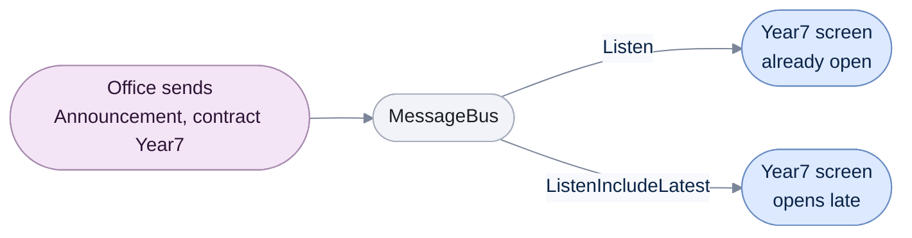

# Message Bus

[Run the complete page example](https://github.com/reactiveui/ReactiveUI/blob/main/src/examples/Documentation/Pages/message-bus/message-bus.csproj).

Two parts of an app sometimes need to talk without holding a reference to each other: a view that raises an
event a distant view model cares about, or a background service that has news for whichever screen happens to
be open. `MessageBus` and `IMessageBus` give every message a type and send it to whoever is listening for that
type, with no direct link between sender and listener.

A **stream** is a source of values that arrive over time, represented by `IObservable<T>`. You **subscribe** to
a stream to receive its values, and the subscription is an `IDisposable` you dispose when you no longer want
them. `Listen<T>()` on a message bus returns a stream of every message of type `T` sent on that bus. A
**contract** is a string that splits messages of the same type into separate channels, so two unrelated senders
can both use `Announcement` without one hearing the other's messages.

## Create a bus, listen, and send

**1. Create a `MessageBus`.** Each instance keeps its own messages, separate from every other bus.

**2. Listen for a message type.** `Listen<Announcement>()` returns a stream of every `Announcement` sent on this
bus from now on. Subscribing runs the lambda for each one.

**3. Send a message.** `SendMessage` delivers it to every current subscriber of that type.

```csharp
MessageBus office = new MessageBus();
using IDisposable subscription = office.Listen<Announcement>().Subscribe(static announcement => Console.WriteLine(announcement.Text));

office.SendMessage(new Announcement("Sports day starts at 9am"));
```

```text
Sports day starts at 9am
```

`Listen<T>()` never delivers a message sent before you subscribed; a subscriber sees only what happens next.
[Replay the latest message for a listener that joins late](#replay-the-latest-message-for-a-listener-that-joins-late)
covers `ListenIncludeLatest`, which does.

## When to reach for something else

Reach for a message bus only when the sender and the listener have no other way to reach each other. Two
independent features that must not know about each other's types are a fair example. A message bus is a
hidden path: nothing in the sender's code shows who is listening. A message with no subscriber disappears
silently, and a bug in delivery is hard to trace back to its cause.

When the sender already holds a reference to the listener, or could reasonably be given one, pass the value
directly or bind to it instead: a property, an event, or an `IObservable<T>` the listener subscribes to. Several
unrelated parts of the app sometimes need the same information. Give them a shared service instead, one both
sides depend on and construct with. Its own `IObservable<T>` or property keeps the connection visible in the
constructor, instead of hidden inside a `SendMessage` call.

A bus also keeps every type-and-contract channel it has created for as long as the bus itself lives. It holds
each one with a strong reference, not a weak one, so nothing about the channel is ever collected early. On the
shared `MessageBus.Current`, which lives for the whole app, a channel you register once stays around for the
rest of the run. That is fine for a handful of long-lived channels, such as the examples on this page. Sending
a fresh, unbounded contract for every item in a list or every request would instead build up channels for as
long as the app runs.

## Scope messages with a contract

Two listeners for the same message type stay apart when they listen with different contracts. `SendMessage` and
`RegisterMessageSource` take a contract in the same way. A message sent for one contract never reaches a
listener for another.

```csharp
MessageBus office = new MessageBus();
List<string> year7Notices = [];
List<string> year8Notices = [];

using IDisposable year7Subscription = office.Listen<ClassCancelled>("Year7").Subscribe(notice => year7Notices.Add(notice.ClassName));
using IDisposable year8Subscription = office.Listen<ClassCancelled>("Year8").Subscribe(notice => year8Notices.Add(notice.ClassName));

office.SendMessage(new ClassCancelled("Chemistry"), "Year7");

Console.WriteLine(year7Notices.Count);
Console.WriteLine(year8Notices.Count);
```

```text
1
0
```

## Check whether a screen is listening

`IsRegistered` reports whether a type, and optionally a contract, already has a listener or has already received
a sent message. It answers `false` for a contract nobody has used, even when the plain type has listeners.

```csharp
MessageBus office = new MessageBus();

Console.WriteLine(office.IsRegistered(typeof(Announcement)));

using IDisposable subscription = office.Listen<Announcement>().Subscribe(static _ => { });

Console.WriteLine(office.IsRegistered(typeof(Announcement)));
Console.WriteLine(office.IsRegistered(typeof(Announcement), "Year7"));
```

```text
False
True
False
```

## Reach the app-wide bus

Most of an app shares one bus instead of passing a `MessageBus` instance around. `MessageBus.Current` holds it.
Assigning `MessageBus.Current` swaps the shared instance for everyone who reads it after that, which is useful
in a test that wants its own bus for the duration of one test.

```csharp
IMessageBus original = MessageBus.Current;
MessageBus.Current = new MessageBus();

using IDisposable subscription = MessageBus.Current.Listen<Announcement>().Subscribe(static announcement => Console.WriteLine(announcement.Text));
MessageBus.Current.SendMessage(new Announcement("Assembly starts at 9am"));

MessageBus.Current = original;
```

```text
Assembly starts at 9am
```

Code that only needs to send or listen should depend on `IMessageBus`, not `MessageBus`, so a test can supply a
bus of its own.

## Replay the latest message for a listener that joins late

`ListenIncludeLatest<T>()` behaves like `Listen<T>()`, except a subscriber that joins after a message was already
sent still receives that message, right away. Each bus remembers only the single most recent message per type
and contract.

```csharp
MessageBus office = new MessageBus();
office.SendMessage(new Announcement("Sports day is cancelled"));

List<string> onTimeScreen = [];
using IDisposable onTimeSubscription = office.Listen<Announcement>().Subscribe(announcement => onTimeScreen.Add(announcement.Text));

List<string> lateTimetableScreen = [];
using IDisposable lateSubscription = office.ListenIncludeLatest<Announcement>().Subscribe(announcement => lateTimetableScreen.Add(announcement.Text));

Console.WriteLine(onTimeScreen.Count);
Console.WriteLine(lateTimetableScreen.Count);
Console.WriteLine(lateTimetableScreen[0]);
```

```text
0
1
Sports day is cancelled
```

The contract overload replays only the last message sent for that contract, so a year group that has had no
notice yet still receives nothing.

```csharp
MessageBus office = new MessageBus();
office.SendMessage(new ClassCancelled("Chemistry"), "Year7");
office.SendMessage(new ClassCancelled("Art"), "Year8");

List<string> year7NoticeBoard = [];
using IDisposable subscription = office.ListenIncludeLatest<ClassCancelled>("Year7").Subscribe(notice => year7NoticeBoard.Add(notice.ClassName));

Console.WriteLine(year7NoticeBoard[0]);
```

```text
Chemistry
```

The diagram below follows one contract through the bus. The office sends an announcement scoped to a year
group, and every screen listening on that contract receives it. A screen that opens after the send still gets
it, because it uses `ListenIncludeLatest`.



The screen that was already open and the screen that opens late both end up showing the same announcement; only
the late screen needed `ListenIncludeLatest` to catch up.

## Feed the bus from an existing stream

`RegisterMessageSource` subscribes to a stream you already have, and turns each value it delivers into a
message on the bus. Listeners never learn where the value came from.

```csharp
MessageBus office = new MessageBus();
List<double> readings = [];
using IDisposable subscription = office.Listen<WeatherReading>().Subscribe(reading => readings.Add(reading.TemperatureCelsius));

IObservable<WeatherReading> weatherStation = Signal.Emit(new WeatherReading(18.5));
using IDisposable sourceRegistration = office.RegisterMessageSource(weatherStation);

Console.WriteLine(readings.Count);
Console.WriteLine(readings[0]);
```

```text
1
18.5
```

`RegisterMessageSource` returns the subscription it created on the source stream; dispose it to stop feeding the
bus. The contract overload scopes the source to one channel, such as one building's weather station.

```csharp
MessageBus office = new MessageBus();
List<double> mainBuildingReadings = [];
using IDisposable subscription = office.Listen<WeatherReading>("MainBuilding").Subscribe(reading => mainBuildingReadings.Add(reading.TemperatureCelsius));

IObservable<WeatherReading> mainBuildingStation = Signal.Emit(new WeatherReading(19.2));
using IDisposable sourceRegistration = office.RegisterMessageSource(mainBuildingStation, "MainBuilding");

Console.WriteLine(mainBuildingReadings[0]);
```

```text
19.2
```

If the registered source stream fails or completes, the bus only logs it. No error or completion reaches the
bus's own listeners. A `Listen` subscription, whether started before or after that point, keeps running and
simply receives no more messages from that source.

## Choose which thread delivers a message

By default a bus delivers a message on the thread that called `SendMessage`, and it has already run every
subscriber's callback by the time `SendMessage` returns.

```csharp
MessageBus office = new MessageBus();
bool handled = false;
using IDisposable subscription = office.Listen<Announcement>().Subscribe(_ => handled = true);

office.SendMessage(new Announcement("Sports day is cancelled"));

Console.WriteLine(handled);
```

```text
True
```

`RegisterScheduler` picks a [sequencer](scheduling.md) to deliver a message type's notifications on instead. Call
it before the first `Listen` or `SendMessage` for that type and contract: the bus picks up the sequencer the
first time it needs one, and keeps that choice after. With `Sequencer.Default`, delivery moves to the thread
pool, so a subscriber's callback runs on another thread than the one that called `SendMessage`.

```csharp
MessageBus office = new MessageBus();
office.RegisterScheduler<Announcement>(Sequencer.Default);

int callingThreadId = Environment.CurrentManagedThreadId;
using ManualResetEventSlim delivered = new ManualResetEventSlim();
bool deliveredOnAnotherThread = false;

using IDisposable subscription = office.Listen<Announcement>().Subscribe(_ =>
{
    deliveredOnAnotherThread = Environment.CurrentManagedThreadId != callingThreadId;
    delivered.Set();
});

office.SendMessage(new Announcement("Sports day is cancelled"));
delivered.Wait();

Console.WriteLine(deliveredOnAnotherThread);
```

```text
True
```

`RegisterScheduler` changes only which thread delivers a message. It does not change the order messages arrive
in. That order follows from when `SendMessage` is called, even for a message a subscriber sends while handling
another one, and the sequencer plays no part in it.

The contract overload registers a sequencer for one contract only. A contract left unregistered keeps the
default, same-thread delivery.

```csharp
MessageBus office = new MessageBus();
office.RegisterScheduler<Announcement>(Sequencer.Default, "Year7");

int callingThreadId = Environment.CurrentManagedThreadId;
using ManualResetEventSlim year7Delivered = new ManualResetEventSlim();
bool year7OnAnotherThread = false;
bool year8Handled = false;

using IDisposable year7Subscription = office.Listen<Announcement>("Year7").Subscribe(_ =>
{
    year7OnAnotherThread = Environment.CurrentManagedThreadId != callingThreadId;
    year7Delivered.Set();
});
using IDisposable year8Subscription = office.Listen<Announcement>("Year8").Subscribe(_ => year8Handled = true);

office.SendMessage(new Announcement("Sports day is cancelled"), "Year7");
year7Delivered.Wait();

office.SendMessage(new Announcement("Sports day is cancelled"), "Year8");

Console.WriteLine(year7OnAnotherThread);
Console.WriteLine(year8Handled);
```

```text
True
True
```

Message bus delivery also ships as `ReactiveUI.Reactive`, the same source compiled against System.Reactive.

## Message bus members

| Member | What it does |
| --- | --- |
| `MessageBus()` | Creates a bus with no messages and no listeners yet. |
| `MessageBus.Current` | The shared bus most of an app uses; assign it to replace the shared instance. |
| `Listen<T>()`, `Listen<T>(string? contract)` | Returns a stream of every future message of type `T`, optionally scoped to a contract. |
| `ListenIncludeLatest<T>()`, `ListenIncludeLatest<T>(string? contract)` | Like `Listen`, but a subscriber that joins late still receives the most recent message. |
| `SendMessage<T>(T message)`, `SendMessage<T>(T message, string? contract)` | Delivers a message to every current subscriber of that type and contract. |
| `RegisterMessageSource<T>(IObservable<T> source)`, `RegisterMessageSource<T>(IObservable<T> source, string? contract)` | Subscribes to a stream and turns each value it delivers into a sent message. |
| `RegisterScheduler<T>(ISequencer scheduler)`, `RegisterScheduler<T>(ISequencer scheduler, string? contract)` | Picks the sequencer that delivers a type's (and optionally contract's) messages. |
| `IsRegistered(Type type)`, `IsRegistered(Type type, string? contract)` | Reports whether a type, optionally scoped to a contract, already has a listener or a sent message. |
| `IMessageBus` | The interface `MessageBus` implements; depend on it so a test can substitute another bus. |
