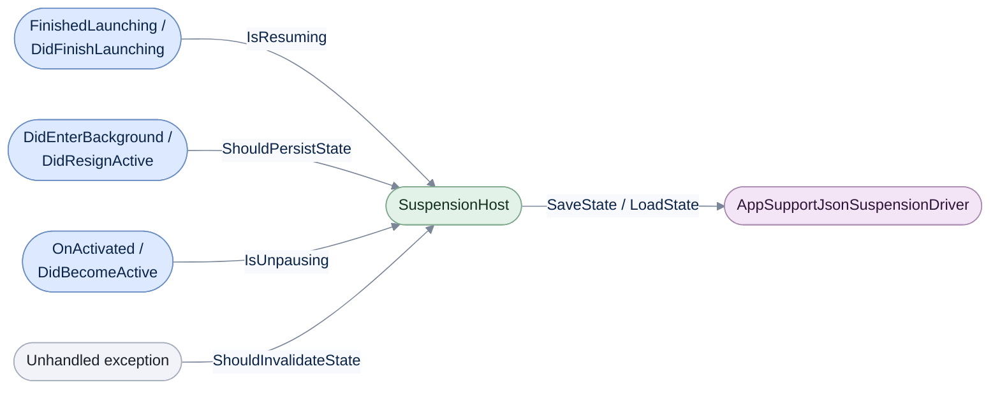

# Apple platforms

[Run the complete page example](https://github.com/reactiveui/ReactiveUI/blob/main/src/examples/Documentation/Pages/platform-apple/platform-apple.csproj).

iOS, Mac Catalyst, tvOS and macOS views come from UIKit or AppKit. Neither toolkit gives a view a built-in way to
raise a change notification, and neither has anything like a router or an activation lifecycle. The core
`ReactiveUI` package supplies all three. It builds for the `ios`, `maccatalyst`, `macos` and `tvos` target
frameworks, so there is no separate Apple package to install beyond `ReactiveUI` itself. It adds:

- base classes for view controllers, views, controls, image views and (on UIKit) navigation, tab bar and page
  containers, so each one is an `IViewFor<TViewModel>` with a `ViewModel` property and change notifications;
- `RoutedViewHost`, which follows a router's navigation stack on iOS, Mac Catalyst and tvOS, and
  `ViewModelViewHost`, which shows whatever view model you assign it, on every Apple platform including macOS;
- `AutoSuspendHelper<T>`, which turns app life-cycle callbacks into the [suspension](../data-persistence.md)
  signals a suspension driver needs, and `AppSupportJsonSuspensionDriver`, which saves and loads state under the
  platform's Application Support directory;
- `PlatformOperations`, which answers `IPlatformOperations.GetOrientation()` the way every platform does.

This page's example is a library app: a catalog of books, a loan flow that picks a member, and a members tab.
iOS and macOS share the same view models and the same `Book`, `Member`, `LoanViewModel` and `BookCatalogViewModel`
types; only the views differ, because UIKit and AppKit are different toolkits. On iPhone the root is a tab bar
with the catalog, members and a cover-paging tab. On iPad and on macOS the root is a split view: a catalog master
column and a `ViewModelViewHost` detail column that shows whichever book is selected.

## Start ReactiveUI

**1. Register the platform module.** `WithPlatformModule<PlatformRegistrations>()` on the
[app builder](../rxappbuilder.md) registers `IPlatformOperations`, `ISuspensionDriver` and the platform's
main-thread sequencer. Call it once, before any view appears: in `FinishedLaunching` on iOS, in
`DidFinishLaunching` on macOS.

```csharp
ReactiveUIBuilder builder = RxAppBuilder.CreateReactiveUIBuilder();
_ = builder.WithPlatformModule<PlatformRegistrations>().BuildApp();
```

Apple ships no `With<Platform>()` convenience method of its own; `PlatformRegistrations` is the same
`IWantsToRegisterStuff` module every platform package supplies, and `WithPlatformModule<T>()` is the general way
to load one.

**2. Wire up automatic state suspension.** `AutoSuspendHelper<T>` needs the app delegate as its type parameter,
so it can verify the delegate overrides every life-cycle method it depends on. Forward each override to the
matching helper method.

```csharp
_autoSuspendHelper = new AutoSuspendHelper<AppDelegate>(this);
_autoSuspendHelper.FinishedLaunching(application, launchOptions!);
Console.WriteLine($"FinishedLaunching captured {_autoSuspendHelper.LaunchOptions?.Count ?? 0} launch option(s).");
```

```text
FinishedLaunching captured 0 launch option(s).
```

```csharp
public override void OnActivated(UIApplication application) =>
    _autoSuspendHelper?.OnActivated(application);

public override void DidEnterBackground(UIApplication application) =>
    _autoSuspendHelper?.DidEnterBackground(application);
```

On macOS the helper watches a different set of notifications, because `NSApplicationDelegate` has no
`FinishedLaunching`/`OnActivated`/`DidEnterBackground` trio. It forwards `DidFinishLaunching`, `DidBecomeActive`,
`DidResignActive`, `DidHide` and `ApplicationShouldTerminate` instead:

```csharp
_autoSuspendHelper = new AutoSuspendHelper<AppDelegate>(this);
_autoSuspendHelper.DidFinishLaunching(notification);
```

```csharp
public override void DidBecomeActive(NSNotification notification) =>
    _autoSuspendHelper?.DidBecomeActive(notification);

public override void DidResignActive(NSNotification notification) =>
    _autoSuspendHelper?.DidResignActive(notification);

public override void DidHide(NSNotification notification) =>
    _autoSuspendHelper?.DidHide(notification);

public override NSApplicationTerminateReply ApplicationShouldTerminate(NSApplication sender) =>
    _autoSuspendHelper?.ApplicationShouldTerminate(sender) ?? NSApplicationTerminateReply.Now;
```

`ApplicationShouldTerminate` returns `NSApplicationTerminateReply.Later` and only lets AppKit quit once
`ShouldPersistState` subscribers finish, so a quit never races a save.

The helper itself is `IDisposable`. Dispose it from the app delegate's own `Dispose(bool)` override, the same
override `NSObject`/`UIApplicationDelegate` subclasses already carry:

```csharp
protected override void Dispose(bool disposing)
{
    if (disposing)
    {
        _autoSuspendHelper?.Dispose();
    }

    base.Dispose(disposing);
}
```

**3. Point the suspension host at a driver.** `AppSupportJsonSuspensionDriver` saves and loads state under
`~/Library/Application Support/<bundle id>/<subdirectory>/state.dat`. Its parameterless constructor uses a
`Data` subdirectory; the one-argument constructor names your own.

```csharp
RxSuspension.SuspensionHost.CreateNewAppState = static () => new LibraryAppState();

AppSupportJsonSuspensionDriver driver = new("Library");
RxSuspension.SuspensionHost.SetupDefaultSuspendResume(driver);

_ = driver.SaveState(new LibraryAppState { LastViewedBook = "Pride and Prejudice" }, LibraryAppStateJsonContext.Default.LibraryAppState)
    .Subscribe(static _ => Console.WriteLine("AppSupportJsonSuspensionDriver saved the app state."));
_ = driver.LoadState(LibraryAppStateJsonContext.Default.LibraryAppState)
    .Subscribe(
        static state => Console.WriteLine($"AppSupportJsonSuspensionDriver loaded state for {state?.LastViewedBook}."),
        static error => Console.WriteLine($"AppSupportJsonSuspensionDriver had nothing to load yet: {error.Message}."));
_ = driver.InvalidateState().Subscribe(static _ => Console.WriteLine("AppSupportJsonSuspensionDriver invalidated the saved state."));
```

`SaveState<T>(T, JsonTypeInfo<T>)` and `LoadState<T>(JsonTypeInfo<T>)` take a source-generated
`JsonTypeInfo<T>`, so serializing never needs reflection. `LibraryAppStateJsonContext` is a one-line
`JsonSerializerContext` for `LibraryAppState`:

```csharp
[JsonSerializable(typeof(LibraryAppState))]
public sealed partial class LibraryAppStateJsonContext : JsonSerializerContext;
```

`LoadState()` and `SaveState<T>(T)` are the same two operations without the type info, serializing through
reflection instead. They carry `[RequiresUnreferencedCode]` and `[RequiresDynamicCode]`, so a page built for
trimming and AOT calls only the typed overloads above.

A reader who stops here can already start ReactiveUI and persist state on both platforms. The rest of this page
gives a view controller a view model, wires up navigation, and covers the platform's other pieces.

## Give a view controller a view model

`ReactiveViewController<TViewModel>` wraps `UIViewController` on UIKit and `NSViewController` on AppKit with a
`ViewModel` property and its change notifications. Build the view in code inside `ViewDidLoad` (`LoadView` on
macOS, where `View` has no default), then bind inside `WhenActivated` so every binding tears down when the page
leaves and starts again if it returns.

```csharp
public sealed class BookListViewController : ReactiveViewController<BookCatalogViewModel>
{
    internal UIButton LoanButton { get; } = UIButton.FromType(UIButtonType.System);

    public override void ViewDidLoad()
    {
        base.ViewDidLoad();

        Title = "Catalog";
```

```csharp
        _ = this.WhenActivated(d =>
        {
            foreach (Book book in ViewModel!.Books)
            {
                // The frame constructor pre-sizes the row; Auto Layout resizes it once ViewModel bindings run.
                BookRowView row = new(CGRect.Empty) { ViewModel = book };
                UITapGestureRecognizer tap = new(() => ViewModel!.SelectedBook = book);
                row.AddGestureRecognizer(tap);
                _rows.AddArrangedSubview(row);
            }

            d(this.BindCommand(ViewModel, static vm => vm.OpenLoan, static v => v.LoanButton));
        });
    }
```

`LoanButton` is `internal`, not `private`: the `this.BindCommand(...)` call above compiles to a generated,
reflection-free dispatch, and the generator can only observe a `public` or `internal` member. A `private` target
fails the build with `RXUIBIND003`. `LoanViewController`, the page `RoutedViewHost` pushes next, follows the same
shape and adds a one-way bind with a converter:

```csharp
d(this.OneWayBind(
        ViewModel,
        static vm => vm.SelectedMember,
        static v => v.SelectedMemberLabel.Text,
        static member => member is null ? "(no member selected)" : $"To: {member.Name}"));
d(this.BindCommand(ViewModel, static vm => vm.ConfirmLoan, static v => v.ConfirmButton));
d(this.BindCommand(ViewModel, static vm => vm.Cancel, static v => v.CancelButton));
```

Every `ReactiveViewController<TViewModel>` also frees its own controls. Override `Dispose(bool)`, the same
`NSObject` override the base class itself overrides, and dispose what you built:

```csharp
protected override void Dispose(bool disposing)
{
    if (disposing)
    {
        _rows.Dispose();
        LoanButton.Dispose();
    }

    base.Dispose(disposing);
}
```

`ViewDidLoad`/`LoadView` run once, before the page ever appears; UIKit and AppKit call `ViewWillAppear` and
`ViewDidDisappear` (`ViewWillAppear()`/`ViewDidDisappear()`, no argument, on macOS) every time the page appears
and leaves. `ReactiveViewController<TViewModel>` overrides both to raise `Activated` and `Deactivated`, which
`WhenActivated` needs internally; application code never calls either override directly.

## Views, controls and image views

`ReactiveView<TViewModel>`, `ReactiveControl<TViewModel>` and `ReactiveImageView<TViewModel>` give the same
`ViewModel` property to a plain `UIView`/`NSView`, a `UIControl`/`NSControl`, and a `UIImageView`/`NSImageView`.
`BookRowView` is a `ReactiveView<Book>` that shows one catalog row; a real catalog would use a reactive table
source instead of a stack of rows, which is a different chunk of this API covered under
[Tables and collections](#tables-and-collections) below.

```csharp
public sealed class BookRowView : ReactiveView<Book>
{
    internal UILabel TitleLabel { get; } = new() { Font = UIFont.PreferredHeadline! };

    internal UILabel StatusLabel { get; } = new() { Font = UIFont.PreferredSubheadline!, TextColor = UIColor.SecondaryLabel };
```

```csharp
        _ = this.WhenActivated(d =>
        {
            d(this.OneWayBind(ViewModel, static vm => vm.Title, static v => v.TitleLabel.Text));
            d(this.OneWayBind(
                ViewModel,
                static vm => vm.IsOnLoan,
                static v => v.StatusLabel.Text,
                static onLoan => onLoan ? "On loan" : "Available"));
            d(Activated.Subscribe(static _ => Console.WriteLine("BookRowView activated.")));
            d(Deactivated.Subscribe(static _ => Console.WriteLine("BookRowView deactivated.")));
        });
```

Setting `ViewModel` happens before a view or control ever gains a superview, never after. `Activated` fires from
`WillMoveToSuperview`/`ViewWillMoveToSuperview` the moment a view or control gains one, so a `BookDetailViewController`
that hosts a cover and a rating control builds each one fully, `ViewModel` included, before adding it to its
stack:

```csharp
BookCoverImageView cover = new() { ViewModel = ViewModel, TranslatesAutoresizingMaskIntoConstraints = false };
```

```csharp
StarRatingControl rating = new() { ViewModel = ViewModel };
_layout.AddArrangedSubview(rating);
```

`StarRatingControl` is a `ReactiveControl<Book>` wrapping a `UIStepper`/`NSStepper`, since neither toolkit has a
built-in star control. It shows the full `ReactiveControl<TViewModel>` surface in one place: the classic
`PropertyChanged`/`PropertyChanging` events, the `Changed`/`Changing` observables, `ThrownExceptions`,
`SuppressChangeNotifications()`, and a two-way `Bind`:

```csharp
public event EventHandler? StarsChanged;

public int Stars
{
    get => (int)_stepper.Value;
    set => _stepper.Value = value;
}
```

```csharp
_stepper.ValueChanged += (_, _) => StarsChanged?.Invoke(this, EventArgs.Empty);

// A rating of 0 never fires a change notification on its own, so start silent rather than log a phantom change.
using (SuppressChangeNotifications())
{
    Stars = 0;
}

PropertyChanging += static (_, e) => Console.WriteLine($"StarRatingControl.{e.PropertyName} is changing.");
PropertyChanged += (_, e) => Console.WriteLine($"StarRatingControl.{e.PropertyName} changed to {Stars}.");

_ = this.WhenActivated(d =>
{
    d(this.Bind(ViewModel, static vm => vm.Rating, static v => v.Stars));
    d(Changed.Subscribe(static change => Console.WriteLine($"StarRatingControl.{change.PropertyName} changed (Changed stream).")));
    d(Changing.Subscribe(static change => Console.WriteLine($"StarRatingControl.{change.PropertyName} is changing (Changing stream).")));
    d(ThrownExceptions.Subscribe(static error => Console.WriteLine($"StarRatingControl threw: {error.Message}")));
    d(Activated.Subscribe(static _ => Console.WriteLine("StarRatingControl activated.")));
    d(Deactivated.Subscribe(static _ => Console.WriteLine("StarRatingControl deactivated.")));
});
```

`this.Bind(ViewModel, vm => vm.Rating, v => v.Stars)` works two-way because the binding layer finds a
`StarsChanged` event for the `Stars` property by name. Name a control's own change event `<Property>Changed` to
opt into the same convention.

`BookCoverImageView` is a `ReactiveImageView<Book>`. This page has no bundled cover art, so it sets a blank
placeholder image once and binds the accessibility label to the book's title instead of the image itself:

```csharp
public sealed class BookCoverImageView : ReactiveImageView<Book>
{
    public BookCoverImageView()
    {
        Image ??= new UIImage();

        _ = this.WhenActivated(d =>
        {
            d(this.OneWayBind(ViewModel, static vm => vm.Title, static v => v.AccessibilityLabel));
            d(ThrownExceptions.Subscribe(static error => Console.WriteLine($"BookCoverImageView threw: {error.Message}")));
        });
    }
}
```

## Navigate with RoutedViewHost

`RoutedViewHost` is a `ReactiveNavigationController` that pushes a view for whichever view model a
`RoutingState` router navigates to, and pops when the router navigates back. It exists on iOS, Mac Catalyst and
tvOS, because it wraps `UINavigationController`, which AppKit has no equivalent of. Give it the router and a
view locator, then navigate:

```csharp
RoutedViewHost catalogHost = new()
{
    Router = shell.Router,
    ViewLocator = catalogViewLocator,
};
catalogHost.TabBarItem = new UITabBarItem("Catalog", null, 0);
_ = shell.Router.Navigate.Execute(catalog).Subscribe();
```

`catalogViewLocator` is a `DefaultViewLocator` with a `Map` entry per view model, resolved without reflection:

```csharp
DefaultViewLocator catalogViewLocator = new();
catalogViewLocator.Map<BookCatalogViewModel, BookListViewController>();
catalogViewLocator.Map<LoanViewModel, LoanViewController>();
```

`RoutedViewHost`'s own constructor calls `WhenActivated` internally to track the router; its `PushViewController`
and `PopViewController` overrides run when the router's stack grows or shrinks, never when application code
calls them directly. `RoutedViewHostUnsafe`, the twin that also resolves a view registered only with the service
locator, carries `[RequiresDynamicCode]`; this page is built for trimming and AOT, so it never calls that twin,
the same way [data binding on Apple platforms](../data-binding/ios.md#which-views-the-hosts-find) recommends.

For a screen that is not driven by a router at all, `ReactiveNavigationController<TViewModel>` wraps a root view
controller directly. `MembersNavigationController` sets its own `ViewModel` once, for the tab bar to read:

```csharp
public sealed class MembersNavigationController : ReactiveNavigationController<MembersViewModel>
{
    public MembersNavigationController(MembersViewModel viewModel)
        : base(new MembersPlaceholderViewController { ViewModel = viewModel }) =>
        ViewModel = viewModel;
}
```

## Show any view model with ViewModelViewHost

`ViewModelViewHost` shows whatever view model you assign it, resolving a view through its own `ViewLocator`.
Unlike `RoutedViewHost`, it exists on macOS too, since it only needs `NSViewController`, not a navigation
controller. The library's iPad and macOS root is a split view whose detail column is a `ViewModelViewHost` that
tracks the catalog's selection:

```csharp
DefaultViewLocator detailLocator = new();
detailLocator.Map<Book, BookDetailViewController>();
_detailHost = new ViewModelViewHost
{
    DefaultContent = new UIViewController(),
    ViewLocator = detailLocator,
};
```

```csharp
_ = this.WhenActivated(d =>
    d(catalog.WhenAnyValue(static vm => vm.SelectedBook)
        .WhereNotNull()
        .Subscribe(book => _detailHost.ViewModel = book)));
```

`DefaultContent` shows while `ViewModel` is `null`, before anything is selected. `ViewModelViewHostUnsafe`
carries the same `[RequiresDynamicCode]` restriction as `RoutedViewHostUnsafe`, for the same reason.

## Page and split across screens

`ReactiveTabBarController<TViewModel>` and `ReactivePageViewController<TViewModel>` wrap
`UITabBarController` and `UIPageViewController`; both exist only on iOS, Mac Catalyst and tvOS.
`ReactiveSplitViewController<TViewModel>` wraps `UISplitViewController` on those three and `NSSplitViewController`
on macOS, so the library's split-view root is the one container this page shares across every Apple platform.

`LibraryTabBarController` is the iPhone root: a `RoutedViewHost` catalog tab, a `MembersNavigationController`
tab, and a `BookCoverPagerViewController` tab.

```csharp
public sealed class LibraryTabBarController : ReactiveTabBarController<LibraryShellViewModel>
{
    public LibraryTabBarController(LibraryShellViewModel shell, IViewLocator catalogViewLocator, BookCatalogViewModel catalog, MembersViewModel members)
    {
        ViewModel = shell;
```

```csharp
        ViewControllers = [catalogHost, membersNav, coverPager];

        _ = this.WhenActivated(d =>
        {
            d(Activated.Subscribe(static _ => Console.WriteLine("LibraryTabBarController activated.")));
            d(Deactivated.Subscribe(static _ => Console.WriteLine("LibraryTabBarController deactivated.")));
        });
    }
}
```

`BookCoverPagerViewController` pages through a `BookDetailViewController` per book. Give the base constructor a
transition style and orientation, implement `IUIPageViewControllerDataSource`, and set the first page once
`ViewModel` is known:

```csharp
public sealed class BookCoverPagerViewController : ReactivePageViewController<BookCatalogViewModel>, IUIPageViewControllerDataSource
{
    public BookCoverPagerViewController()
        : base(UIPageViewControllerTransitionStyle.Scroll, UIPageViewControllerNavigationOrientation.Horizontal)
    {
    }

    public override void ViewDidLoad()
    {
        base.ViewDidLoad();

        DataSource = this;

        _ = this.WhenActivated((Action<IDisposable> onDispose) =>
        {
            _ = onDispose;
            if (ViewModel!.Books.Count == 0)
            {
                return;
            }

            SetViewControllers([CreatePage(ViewModel.Books[0])], UIPageViewControllerNavigationDirection.Forward, false, null);
        });
    }
```

`GetPreviousViewController` and `GetNextViewController` are the data source methods `UIPageViewController` calls
as the reader swipes; the app never calls either directly. Both create a fresh `BookDetailViewController` with
its `ViewModel` already set, the same rule every view and control on this page follows.

`LibrarySplitViewController` shares its shape across iOS and macOS: a master column, a `ViewModelViewHost`
detail column, and a subscription that feeds the detail host from the master's selection. Only the master's
own type (`ReactiveViewController<BookCatalogViewModel>`) and how a split item is added
(`ViewControllers = [master, _detailHost]` on iOS, `AddSplitViewItem(NSSplitViewItem.FromViewController(...))`
on macOS) differ between the two.

```csharp
public sealed class LibrarySplitViewController : ReactiveSplitViewController<LibraryShellViewModel>
{
    public LibrarySplitViewController(LibraryShellViewModel shell, BookCatalogViewModel catalog)
    {
        ViewModel = shell;
        PreferredDisplayMode = UISplitViewControllerDisplayMode.OneBesideSecondary;
```

## The macOS window

`ReactiveWindowController` wraps `NSWindowController` with a `ViewModel` property, since AppKit has nothing like
a `UITableViewController` in this surface and needs its own window-level base class. `MainWindowController`
builds the window in `CreateWindow`, which its constructor passes straight to the base constructor, then builds
the split view once `WindowDidLoad` runs:

```csharp
public sealed class MainWindowController : ReactiveWindowController
{
    public MainWindowController()
        : base(CreateWindow())
    {
    }

    public override void WindowDidLoad()
    {
        base.WindowDidLoad();
```

```csharp
        Window!.ContentViewController = new LibrarySplitViewController(shell, catalog);

        // ReactiveWindowController does not implement IActivatableView, unlike the view and controller types, so
        // it subscribes to Activated/Deactivated directly rather than through WhenActivated.
        _ = Activated.Subscribe(static _ => Console.WriteLine("MainWindowController activated."));
        _ = Deactivated.Subscribe(static _ => Console.WriteLine("MainWindowController deactivated."));
    }
```

Every other Reactive base class on this page implements the interface `WhenActivated` needs and can use it
directly. `ReactiveWindowController` does not, so it subscribes to `Activated`/`Deactivated` itself instead of
wrapping the subscriptions in `WhenActivated`. Both still fire the same way, from `WindowDidLoad` and from
AppKit's `NSWindow.WillCloseNotification`.

## Read the device orientation

`PlatformOperations.GetOrientation()` answers the same question every platform's `IPlatformOperations` answers.
On UIKit it reads `UIDevice.CurrentDevice.Orientation`; AppKit has no concept of device orientation, so it always
returns `null` there.

```csharp
PlatformOperations platformOperations = new();
string? orientation = platformOperations.GetOrientation();
Console.WriteLine($"Device orientation: {orientation}.");
```

```text
Device orientation: Portrait.
```

## Suspension and life cycle, side by side



`AutoSuspendHelper<T>` turns four kinds of app life-cycle callback into the four signals `SuspensionHost`
exposes; `SetupDefaultSuspendResume` connects `ShouldPersistState` and `ShouldInvalidateState` to the driver's
`SaveState` and `InvalidateState`, and a resume connects `IsResuming` to `LoadState`.

Each `ReactiveUI.*` package also ships as `ReactiveUI.*.Reactive`, built from the same source for apps that use
System.Reactive instead of the primitives this page's samples use.

## Tables and collections

`ReactiveTableViewController<TViewModel>`, `ReactiveCollectionViewController<TViewModel>` and the sources and
cells that feed them are a different chunk of this API surface, covered separately.

## At a glance

| Member | What it does |
| --- | --- |
| `RxAppBuilder.CreateReactiveUIBuilder()` / `WithPlatformModule<PlatformRegistrations>()` | Builds and registers ReactiveUI's Apple platform module |
| `PlatformRegistrations` | The module `WithPlatformModule` loads: `IPlatformOperations`, `ISuspensionDriver` and the main-thread sequencer |
| `AutoSuspendHelper<T>` | Turns app life-cycle callbacks into suspend/resume signals; `T` is the app delegate type |
| `AutoSuspendHelper<T>.FinishedLaunching` / `OnActivated` / `DidEnterBackground` [ios] | The three UIKit callbacks to forward |
| `AutoSuspendHelper<T>.DidFinishLaunching` / `DidBecomeActive` / `DidResignActive` / `DidHide` / `ApplicationShouldTerminate` [macos] | The five AppKit callbacks to forward |
| `AutoSuspendHelper<T>.LaunchOptions` [ios] | The most recent launch options, as a string dictionary |
| `AutoSuspendHelper<T>.Dispose()` | Unsubscribes from `AppDomain.UnhandledException` and disposes the helper's signals |
| `AppSupportJsonSuspensionDriver` | Saves and loads state under Application Support |
| `AppSupportJsonSuspensionDriver.SaveState<T>(T, JsonTypeInfo<T>)` / `LoadState<T>(JsonTypeInfo<T>)` | Trim- and AOT-safe save and load through a source-generated `JsonTypeInfo<T>` |
| `AppSupportJsonSuspensionDriver.InvalidateState()` | Deletes the saved state file |
| `AppSupportJsonSuspensionDriver.SaveState<T>(T)` / `LoadState()` | The untyped, reflection-based overloads; not callable from a trimmed or AOT page |
| `PlatformOperations.GetOrientation()` | The device's current rotation on UIKit, or `null` on AppKit |
| `ReactiveViewController<TViewModel>` | A `UIViewController`/`NSViewController` that is an `IViewFor<TViewModel>` |
| `ReactiveView<TViewModel>` | A `UIView`/`NSView` that is an `IViewFor<TViewModel>` |
| `ReactiveControl<TViewModel>` | A `UIControl`/`NSControl` that is an `IViewFor<TViewModel>` |
| `ReactiveImageView<TViewModel>` | A `UIImageView`/`NSImageView` that is an `IViewFor<TViewModel>` |
| `ReactiveNavigationController<TViewModel>` [ios] | A `UINavigationController` that is an `IViewFor<TViewModel>` |
| `ReactiveTabBarController<TViewModel>` [ios] | A `UITabBarController` that is an `IViewFor<TViewModel>` |
| `ReactivePageViewController<TViewModel>` [ios] | A `UIPageViewController` that is an `IViewFor<TViewModel>` |
| `ReactiveSplitViewController<TViewModel>` | A `UISplitViewController`/`NSSplitViewController` that is an `IViewFor<TViewModel>` |
| `ReactiveWindowController` [macos] | An `NSWindowController` that is an `IViewFor<TViewModel>`-less `ReactiveObject`, with `WindowDidLoad` |
| `Activated` / `Deactivated` | Fire when a view, control or controller appears and leaves; feed [`WhenActivated`](../when-activated.md) |
| `Changed` / `Changing` / `PropertyChanged` / `PropertyChanging` | Observe and raise property changes, as on any `ReactiveObject` |
| `ThrownExceptions` | Reports errors raised inside reactive operators |
| `SuppressChangeNotifications()` | Pauses change notifications until the result is disposed |
| `RoutedViewHost` [ios] | Follows a `RoutingState`'s navigation stack, pushing and popping as it changes |
| `RoutedViewHost.Router` / `ViewLocator` / `ViewContractObservable` | The router to follow, the locator to resolve views with, and an optional contract stream |
| `RoutedViewHostUnsafe` [ios] | The `RoutedViewHost` twin that also resolves a service-locator-only view; carries `[RequiresDynamicCode]` |
| `ViewModelViewHost` | Shows whichever view model is assigned to it, resolved through its own `ViewLocator` |
| `ViewModelViewHost.ViewModel` / `ViewLocator` / `DefaultContent` / `ViewContract` / `ViewContractObservable` | The view model to show, the locator, the placeholder shown when `ViewModel` is `null`, and an optional contract |
| `ViewModelViewHostUnsafe` | The `ViewModelViewHost` twin that also resolves a service-locator-only view; carries `[RequiresDynamicCode]` |
