# Blazor

[Run the complete page example](https://github.com/reactiveui/ReactiveUI/blob/main/src/examples/Documentation/Pages/platform-blazor/platform-blazor.csproj).

A Blazor component re-renders when its state changes. A `ReactiveComponentBase<T>` renders a `TViewModel` in that
place. It wires the view model's `INotifyPropertyChanged.PropertyChanged` event into Blazor's own render cycle.
Setting a property on the view model then re-renders the component, the same way changing a Blazor `[Parameter]`
does.

`ReactiveUI.Blazor` builds on the base `ComponentBase` from `Microsoft.AspNetCore.Components`. It adds four base
classes, one for each way a Blazor app builds and owns a component. It adds an activation fetcher, so
[`WhenActivated`](../when-activated.md) knows when a component starts and stops. It also adds `Registrations`, the
type an app registers with a dependency resolver. Install the package as covered in
[Installation](../../getting-started/installation/index.md).

The example project is a console program, because a component needs Blazor's own renderer to run inside a browser
or a server circuit, and a console program has none. It calls each base class's `OnInitialized` step directly
instead of letting a renderer call it. It also sets `ViewModel` through the explicit `IViewFor` view, because
Blazor's analyzer flags a direct write to a `[Parameter]` property from outside the framework. In a real app,
`ViewModel` is a component parameter a page passes down, or a service a container injects through `[Inject]`. Two
runnable apps show the full picture:
[`ReactiveUI.Builder.BlazorServer`](https://github.com/reactiveui/ReactiveUI/tree/main/src/examples/ReactiveUI.Builder.BlazorServer)
and [`ReactiveUI.Builder.BlazorWasm`](https://github.com/reactiveui/ReactiveUI/tree/main/src/examples/ReactiveUI.Builder.BlazorWasm).

The example builds and runs on any operating system; Blazor Server and Blazor WebAssembly are browser-based, not
Windows-only.

## Show a view model on a page

**1. Derive from `ReactiveComponentBase<T>`.** `TodoPageComponent` shows a `TodoListViewModel`. Blazor calls
`OnInitialized` once the component is attached to a renderer; the example exposes that step through `Initialize` so
a console program can call it too.

```csharp
public sealed class TodoPageComponent : ReactiveComponentBase<TodoListViewModel>
{
    /// <summary>
    /// Runs the framework's <c>OnInitialized</c> step. A Blazor host calls this once the component is attached to a
    /// renderer; a console example has no renderer, so it calls the step directly.
    /// </summary>
    public void Initialize() => OnInitialized();

    /// <summary>
    /// Raises <see cref="ReactiveComponentBase{T}.PropertyChanged"/> for an explicit property name, the way a
    /// component announces a change to a value it computes from <see cref="ReactiveComponentBase{T}.ViewModel"/>.
    /// </summary>
    public void RaiseManualChange() => OnPropertyChanged(nameof(ViewModel));
}
```

**2. Set `ViewModel`.** A razor page normally passes it as a `[Parameter]`. The example goes through the explicit
`IViewFor` view instead. Blazor's analyzer rejects a direct write to a `[Parameter]` property from outside the
framework. Either path raises `PropertyChanged` for `ViewModel`.

```csharp
using TodoListViewModel viewModel = new(InMemoryTodoStore.CreateSeeded());
using TodoPageComponent page = new();
List<string?> changes = [];
page.PropertyChanged += (_, e) => changes.Add(e.PropertyName);

IViewFor pageAsView = page;
pageAsView.ViewModel = viewModel;

Console.WriteLine(ReferenceEquals(page.ViewModel, viewModel));
Console.WriteLine(string.Join(", ", changes));

// Output:
// True
// ViewModel
```

**3. Watch activation.** `ReactiveComponentBase<T>` raises `Activated` when the component initializes and
`Deactivated` when it disposes, so a view model's `WhenActivated` block starts and stops with the component.

```csharp
TodoPageComponent page = new();
List<string> events = [];
using IDisposable activatedSubscription = page.Activated.Subscribe(_ => events.Add("activated"));
using IDisposable deactivatedSubscription = page.Deactivated.Subscribe(_ => events.Add("deactivated"));

page.Initialize();
page.Dispose();

Console.WriteLine(string.Join(", ", events));

// Output:
// activated, deactivated
```



```mermaid
%%{init: {"theme": "base", "themeVariables": {"fontFamily": "Roboto, Helvetica, Arial, sans-serif", "fontSize": "15px", "primaryColor": "#DCE9FF", "primaryBorderColor": "#6C8EC4", "primaryTextColor": "#0B2447", "secondaryColor": "#E3F2E8", "secondaryBorderColor": "#7FA88C", "secondaryTextColor": "#12301C", "tertiaryColor": "#F3E5F5", "tertiaryBorderColor": "#A98BB0", "tertiaryTextColor": "#2E1437", "lineColor": "#7B8699", "textColor": "#1B1F27", "noteBkgColor": "#FFF4D6", "noteBorderColor": "#C9A94F", "noteTextColor": "#3A2A00", "actorBkg": "#DCE9FF", "actorBorder": "#6C8EC4", "actorTextColor": "#0B2447", "signalColor": "#7B8699", "signalTextColor": "#1B1F27", "labelBoxBkgColor": "#F1F3F8", "labelBoxBorderColor": "#A7AEBB", "edgeLabelBackground": "#F7F9FC", "clusterBkg": "#F7F9FC", "clusterBorder": "#C9D1DE"}}}%%
flowchart LR
    Set(["ViewModel set"]):::vm --> Active(["Activated"]):::vm
    Active --> Render(["Component re-renders on each view model change"]):::view
    Render --> Dispose(["Component disposed"]):::warn
    Dispose --> Deactive(["Deactivated"]):::vm
    classDef view fill:#DCE9FF,stroke:#6C8EC4,color:#0B2447
    classDef vm fill:#E3F2E8,stroke:#7FA88C,color:#12301C
    classDef warn fill:#FDE7E4,stroke:#C98A82,color:#410E0B
```

A component's life runs left to right. Setting `ViewModel` starts the view model showing on the page. Initializing
the component fires `Activated`. The component re-renders each time the view model raises `PropertyChanged`.
Disposing the component fires `Deactivated`, then releases the component's own resources.

**4. Raise a change explicitly.** A component calls `OnPropertyChanged` itself to announce a change to a value it
computes rather than reads straight from the view model.

```csharp
using TodoPageComponent page = new();
List<string?> changes = [];
page.PropertyChanged += (_, e) => changes.Add(e.PropertyName);

page.RaiseManualChange();

Console.WriteLine(changes[0]);

// Output:
// ViewModel
```

## Inject the view model instead of receiving it as a parameter

`ReactiveInjectableComponentBase<T>` fits a component whose view model comes from `[Inject]` rather than a razor
`[Parameter]`. It exposes the same `ViewModel`, `Activated`, `Deactivated` and `PropertyChanged` members.

```csharp
public sealed class InjectedTodoComponent : ReactiveInjectableComponentBase<TodoListViewModel>
{
    /// <summary>
    /// Runs the framework's <c>OnInitialized</c> step. A Blazor host calls this once the component is attached to a
    /// renderer; a console example has no renderer, so it calls the step directly.
    /// </summary>
    public void Initialize() => OnInitialized();

    /// <summary>
    /// Raises <see cref="ReactiveInjectableComponentBase{T}.PropertyChanged"/> for an explicit property name, the way
    /// a component announces a change to a value it computes from
    /// <see cref="ReactiveInjectableComponentBase{T}.ViewModel"/>.
    /// </summary>
    public void RaiseManualChange() => OnPropertyChanged(nameof(ViewModel));
}
```

A DI container assigns the injected `ViewModel` the same way any property setter is called, so the assignment still
raises `PropertyChanged` and is visible through the explicit `IViewFor` view.

```csharp
using TodoListViewModel viewModel = new(InMemoryTodoStore.CreateSeeded());
using InjectedTodoComponent page = new();
List<string?> changes = [];
page.PropertyChanged += (_, e) => changes.Add(e.PropertyName);

page.ViewModel = viewModel;

IViewFor pageAsView = page;
Console.WriteLine(ReferenceEquals(pageAsView.ViewModel, viewModel));
Console.WriteLine(string.Join(", ", changes));

// Output:
// True
// ViewModel
```

Initializing and disposing an injected component raises `Activated` and `Deactivated` the same way as
`ReactiveComponentBase<T>`, and it calls `OnPropertyChanged` itself the same way too.

## Build a layout around a view model

`ReactiveLayoutComponentBase<T>` fits a layout: the component that wraps every page. A layout can react to a view
model of its own, such as a header that shows a remaining item count next to the page content. It carries the same
`ViewModel`, `Activated`, `Deactivated` and `PropertyChanged` members.

```csharp
public sealed class TodoShellLayoutComponent : ReactiveLayoutComponentBase<TodoListViewModel>
{
    /// <summary>
    /// Runs the framework's <c>OnInitialized</c> step. A Blazor host calls this once the component is attached to a
    /// renderer; a console example has no renderer, so it calls the step directly.
    /// </summary>
    public void Initialize() => OnInitialized();

    /// <summary>
    /// Raises <see cref="ReactiveLayoutComponentBase{T}.PropertyChanged"/> for an explicit property name, the way a
    /// layout announces a change to a value it computes from <see cref="ReactiveLayoutComponentBase{T}.ViewModel"/>.
    /// </summary>
    public void RaiseManualChange() => OnPropertyChanged(nameof(ViewModel));
}
```

Setting `ViewModel` through `IViewFor`, watching `Activated` and `Deactivated`, and calling `OnPropertyChanged`
explicitly all work the same way as `ReactiveComponentBase<T>`.

## Own a scoped view model

`ReactiveOwningComponentBase<T>` fits a component that owns a scoped view model for as long as the component lives.
A DI container normally creates that scope and resolves the view model for the base class's own `Service` property.
This example sets `ViewModel` directly instead, because a console program has no DI-backed renderer to create the
scope. `ReactiveOwningComponentBase<T>` disposes only through `IDisposable`, so a caller casts to it, or holds the
component through an `IDisposable`-typed variable.

```csharp
public sealed class TodoScopedComponent : ReactiveOwningComponentBase<TodoListViewModel>
{
    /// <summary>
    /// Runs the framework's <c>OnInitialized</c> step. A Blazor host calls this once the component is attached to a
    /// renderer; a console example has no renderer, so it calls the step directly.
    /// </summary>
    public void Initialize() => OnInitialized();

    /// <summary>
    /// Raises <see cref="ReactiveOwningComponentBase{T}.PropertyChanged"/> for an explicit property name, the way a
    /// component announces a change to a value it computes from <see cref="ReactiveOwningComponentBase{T}.ViewModel"/>.
    /// </summary>
    public void RaiseManualChange() => OnPropertyChanged(nameof(ViewModel));
}
```

```csharp
using TodoListViewModel viewModel = new(InMemoryTodoStore.CreateSeeded());
TodoScopedComponent component = new();
List<string?> changes = [];
component.PropertyChanged += (_, e) => changes.Add(e.PropertyName);

IViewFor componentAsView = component;
componentAsView.ViewModel = viewModel;

Console.WriteLine(ReferenceEquals(component.ViewModel, viewModel));
Console.WriteLine(string.Join(", ", changes));

((IDisposable)component).Dispose();

// Output:
// True
// ViewModel
```

Initializing the component fires `Activated`; disposing the owning base class's scope through `IDisposable.Dispose`
fires `Deactivated` first, before the scope itself goes away.

```csharp
TodoScopedComponent component = new();
List<string> events = [];
using IDisposable activatedSubscription = component.Activated.Subscribe(_ => events.Add("activated"));
using IDisposable deactivatedSubscription = component.Deactivated.Subscribe(_ => events.Add("deactivated"));

component.Initialize();
((IDisposable)component).Dispose();

Console.WriteLine(string.Join(", ", events));

// Output:
// activated, deactivated
```

## Register Blazor's platform services

`Registrations.Register` adds Blazor's `IPlatformOperations` and its binding type converters, such as
`IntegerToStringTypeConverter`, to any `IRegistrar`. `WithBlazor` and `WithBlazorWasm`, covered below, call this for
you; call it directly only when you build a resolver by hand.

```csharp
ModernDependencyResolver resolver = new();
DependencyResolverRegistrar registrar = new(resolver);
Blazor.Registrations registrations = new();

registrations.Register(registrar);

IPlatformOperations? platformOperations = resolver.GetService<IPlatformOperations>();
IntegerToStringTypeConverter? integerConverter = resolver.GetServices<IBindingTypeConverter>()
    .OfType<IntegerToStringTypeConverter>()
    .FirstOrDefault();

Console.WriteLine(platformOperations is Blazor.PlatformOperations);
Console.WriteLine(integerConverter is not null);

// Output:
// True
// True
```

`PlatformOperations.GetOrientation` always returns `null` on Blazor; a browser has no orientation sensor this API
exposes.

```csharp
Blazor.PlatformOperations platformOperations = new();

string? orientation = platformOperations.GetOrientation();

Console.WriteLine(orientation is null);

// Output:
// True
```

## Configure the app builder

Call `WithBlazor` from a Blazor Server host or `WithBlazorWasm` from a Blazor WebAssembly host during startup. Each
sets the [app builder's](../rxappbuilder.md) main-thread scheduler and registers `Blazor.Registrations`.

```csharp
ReactiveUIBuilder builder = RxAppBuilder.CreateReactiveUIBuilder();

_ = builder.WithBlazor();

Console.WriteLine(ReferenceEquals(builder.MainThreadScheduler, BlazorReactiveUIBuilderExtensions.BlazorMainThreadScheduler));

// Output:
// True
```

```csharp
ReactiveUIBuilder builder = RxAppBuilder.CreateReactiveUIBuilder();

_ = builder.WithBlazorWasm();

Console.WriteLine(ReferenceEquals(builder.MainThreadScheduler, BlazorReactiveUIBuilderExtensions.BlazorWasmScheduler));

// Output:
// True
```

`WithBlazorScheduler` and `WithBlazorWasmScheduler` set only the [main-thread scheduler](../scheduling.md), without
the platform registrations. Use one of these when your host already registers `Blazor.Registrations` itself.

```csharp
ReactiveUIBuilder builder = RxAppBuilder.CreateReactiveUIBuilder();

_ = builder.WithBlazorScheduler();

Console.WriteLine(ReferenceEquals(builder.MainThreadScheduler, BlazorReactiveUIBuilderExtensions.BlazorMainThreadScheduler));

// Output:
// True
```

`BlazorMainThreadScheduler` is a current-thread scheduler for Blazor Server, where a circuit's UI updates run
synchronously on the circuit's own thread. `BlazorWasmScheduler` yields through the WebAssembly event loop instead,
which fits the single, cooperatively-scheduled thread a WebAssembly app runs on. Both hand back a working clock
through their `Timestamp` property.

```csharp
Console.WriteLine(BlazorReactiveUIBuilderExtensions.BlazorMainThreadScheduler.Timestamp >= 0);
Console.WriteLine(BlazorReactiveUIBuilderExtensions.BlazorWasmScheduler.Timestamp >= 0);

// Output:
// True
// True
```

`ReactiveUI.Blazor` also ships as `ReactiveUI.Blazor.Reactive`, built from the same source, for apps that use
System.Reactive.

## Members at a glance

| Member | What it does |
| --- | --- |
| `ReactiveComponentBase<T>` | Component base class for a page-style component that shows a `TViewModel` set as a `[Parameter]`. |
| `ReactiveInjectableComponentBase<T>` | Component base class for a `TViewModel` a DI container assigns through `[Inject]`. |
| `ReactiveLayoutComponentBase<T>` | Component base class for a layout that wraps pages and reacts to its own `TViewModel`. |
| `ReactiveOwningComponentBase<T>` | Component base class that owns a DI-scoped `TViewModel` for the component's lifetime; disposes through `IDisposable`. |
| `ViewModel` | The `TViewModel` each base class shows; raises `PropertyChanged` when set. |
| `Activated` | Stream that fires when the component initializes. |
| `Deactivated` | Stream that fires when the component (or, for `ReactiveOwningComponentBase<T>`, its scope) disposes. |
| `PropertyChanged` | The `INotifyPropertyChanged` event each base class raises, including for `ViewModel`. |
| `OnPropertyChanged(string)` | Raises `PropertyChanged` for the named property. |
| `Blazor.Registrations.Register(IRegistrar)` | Adds Blazor's `IPlatformOperations` and its binding type converters to a resolver. |
| `Blazor.PlatformOperations.GetOrientation()` | Always returns `null` on Blazor. |
| `WithBlazor(IReactiveUIBuilder)` | Sets the Blazor Server main-thread scheduler and registers `Blazor.Registrations`. |
| `WithBlazorWasm(IReactiveUIBuilder)` | Sets the Blazor WebAssembly main-thread scheduler and registers `Blazor.Registrations`. |
| `WithBlazorScheduler(IReactiveUIBuilder)` | Sets the Blazor Server main-thread scheduler only. |
| `WithBlazorWasmScheduler(IReactiveUIBuilder)` | Sets the Blazor WebAssembly main-thread scheduler only. |
| `BlazorMainThreadScheduler` | Current-thread scheduler for Blazor Server. |
| `BlazorWasmScheduler` | Scheduler that yields through the WebAssembly event loop. |
