# .NET MAUI

[Run the complete page example](https://github.com/reactiveui/ReactiveUI/blob/main/src/examples/Documentation/Pages/platform-maui/platform-maui.csproj).

A .NET MAUI page is a `BindableObject`, not a `ReactiveObject`, and it has no `ViewModel` property of its own. Something has to keep a page's `BindingContext` and its view model in step. Something has to turn a `bool` into the `Visibility` a MAUI control expects, tell [activation](../when-activated.md) when a page appears and disappears, and push the right page when [routing](../routing.md) changes the current view model. `ReactiveUI.Maui` does this for MAUI's page, view, shell and window types. See [installation](../../getting-started/installation/maui.md) for the packages to add. `ReactiveUI.Maui` also ships as `ReactiveUI.Maui.Reactive`, built from the same source, for apps that use System.Reactive.

The example project is a recipe book: a shell lists recipes, and opening one navigates to its detail page. It runs headless on plain `net10.0`, without the MAUI workload's UI running, except for the few members noted below that need a live dispatcher.

## Configure the app in MauiProgram

**1. Start from `MauiApp.CreateBuilder()`.** This gives you the `MauiAppBuilder` MAUI itself expects.

**2. Call `UseReactiveUI`, and give it a dispatcher.** `MauiAppBuilder.UseReactiveUI` configures ReactiveUI for MAUI and builds the app in one call. Passing a dispatcher lets it build a main-thread scheduler without asking the calling thread for MAUI's own dispatcher, which only exists once the app is running.

```csharp
MauiAppBuilder mauiBuilder = MauiApp.CreateBuilder();

MauiAppBuilder configured = mauiBuilder.UseReactiveUI(new ImmediateDispatcher());

Console.WriteLine(ReferenceEquals(mauiBuilder, configured));

// Output:
// True
```

**3. Add your own registrations with the delegate overload.** This overload lets the app add views, view models and other registrations after ReactiveUI's own core services are built. Call `WithMauiConverters`, `WithMauiScheduler` or `WithMaui` inside it, the same members [RxAppBuilder](../rxappbuilder.md) exposes for every platform.

```csharp
MauiAppBuilder mauiBuilder = MauiApp.CreateBuilder();
bool delegateRan = false;

_ = mauiBuilder.UseReactiveUI(builder =>
{
    _ = builder.WithMauiConverters();
    delegateRan = true;
});

Console.WriteLine(delegateRan);

// Output:
// True
```

`WithMauiConverters`, `WithMauiScheduler` and `WithMaui` each work directly on an `IReactiveUIBuilder`, the object `RxAppBuilder.CreateReactiveUIBuilder()` returns, for an app that builds its own chain of `With...` calls instead of using `UseReactiveUI`.

- **`WithMauiConverters`** registers `BooleanToVisibilityTypeConverter` and `VisibilityToBooleanTypeConverter` with the binding [converter service](../../../binding/converters.md).

```csharp
IReactiveUIBuilder builder = RxAppBuilder.CreateReactiveUIBuilder();

IReactiveUIBuilder configured = builder.WithMauiConverters();

Console.WriteLine(ReferenceEquals(builder, configured));

// Output:
// True
```

- **`WithMauiScheduler`**, given a dispatcher, points the main-thread scheduler at a sequencer built from it.

```csharp
IReactiveUIBuilder builder = RxAppBuilder.CreateReactiveUIBuilder()
    .WithMauiScheduler(new ImmediateDispatcher());

Console.WriteLine(builder is not null);

// Output:
// True
```

- **`WithMaui`**, given a dispatcher, registers MAUI's platform module, the converters and the scheduler in one call.

```csharp
IReactiveUIBuilder builder = RxAppBuilder.CreateReactiveUIBuilder()
    .WithMaui(new ImmediateDispatcher());

Console.WriteLine(builder is not null);

// Output:
// True
```

Each of `WithMauiScheduler`, `WithMaui` and `UseReactiveUI` also has an overload that takes no dispatcher. With no dispatcher, it asks the calling thread for `Microsoft.Maui.Dispatching.Dispatcher.Current`, which only exists once a MAUI app is running. **These overloads need a running app to call**; the example only builds them, reading the result back from the static `MauiReactiveUIBuilderExtensions.MauiMainThreadScheduler` property:

```csharp
IReactiveUIBuilder builder = RxAppBuilder.CreateReactiveUIBuilder();

_ = builder.WithMauiScheduler();
_ = builder.WithMaui();

Console.WriteLine(MauiReactiveUIBuilderExtensions.MauiMainThreadScheduler.GetType().Name);
```

## Bind a page or view to its view model

Every page and view base in `ReactiveUI.Maui` pairs a Microsoft.Maui.Controls type with `IViewFor<TViewModel>`. Each one gives you the same three members: a `ViewModelProperty` bindable field, a typed `ViewModel` property, and an override that keeps `BindingContext` and `ViewModel` equal, whichever one MAUI or your code sets. `ReactiveContentPage<TViewModel>` wraps `ContentPage`, the base most pages use.

```csharp
RecipeListPage page = new();
RecipeListViewModel first = new(new RecipeBookScreen());
RecipeListViewModel second = new(new RecipeBookScreen());

page.ViewModel = first;
Console.WriteLine(ReferenceEquals(page.BindingContext, first));

page.BindingContext = second;
Console.WriteLine(ReferenceEquals(page.ViewModel, second));

Console.WriteLine(ReactiveContentPage<RecipeListViewModel>.ViewModelProperty.PropertyName);

// Output:
// True
// True
// ViewModel
```

`ReactiveNavigationPage<TViewModel>`, `ReactiveFlyoutPage<TViewModel>`, `ReactiveMasterDetailPage<TViewModel>`, `ReactiveCarouselView<TViewModel>` and `ReactiveContentView<TViewModel>` follow the same pattern, over `NavigationPage`, `FlyoutPage` (under its old and new names), `CarouselView` and `ContentView`.

```csharp
RecipeListViewModel recipes = new(new RecipeBookScreen());
RecipeBookScreen screen = new();

RecipeNavigationPage navigationPage = new() { BindingContext = recipes };
Console.WriteLine($"{nameof(RecipeNavigationPage)}: {navigationPage.ViewModel == recipes}");

RecipeFlyoutPage flyoutPage = new() { BindingContext = screen };
Console.WriteLine($"{nameof(RecipeFlyoutPage)}: {flyoutPage.ViewModel == screen}");

RecipeMasterDetailPage masterDetailPage = new() { BindingContext = screen };
Console.WriteLine($"{nameof(RecipeMasterDetailPage)}: {masterDetailPage.ViewModel == screen}");

RecipeCarouselView carouselView = new() { BindingContext = recipes };
Console.WriteLine($"{nameof(RecipeCarouselView)}: {carouselView.ViewModel == recipes}");

RecipeSummaryView summaryView = new() { BindingContext = RecipeBook.Recipes[0] };
Console.WriteLine($"{nameof(RecipeSummaryView)}: {summaryView.ViewModel == RecipeBook.Recipes[0]}");

// Output:
// RecipeNavigationPage: True
// RecipeFlyoutPage: True
// RecipeMasterDetailPage: True
// RecipeCarouselView: True
// RecipeSummaryView: True
```

`ReactiveWindow<TViewModel>` and `ReactiveTitleBar<TViewModel>` wrap the desktop-only `Window` and `TitleBar` types, but follow the same `ViewModel`/`BindingContext` pattern.

```csharp
RecipeBookScreen screen = new();

RecipeWindow window = new() { BindingContext = screen };
Console.WriteLine($"{nameof(RecipeWindow)}: {window.ViewModel == screen}");

RecipeTitleBar titleBar = new() { BindingContext = screen };
Console.WriteLine($"{nameof(RecipeTitleBar)}: {titleBar.ViewModel == screen}");

// Output:
// RecipeWindow: True
// RecipeTitleBar: True
```

`ReactivePage<TViewModel>` is the older `Page` wrapper `ReactiveContentPage<TViewModel>` replaced. It follows the same pattern, and adds `BindingRoot`, an alias for `ViewModel` that XAML binds against.

```csharp
RecipePage page = new() { BindingContext = new RecipeListViewModel(new RecipeBookScreen()) };

Console.WriteLine(ReferenceEquals(page.BindingRoot, page.ViewModel));
Console.WriteLine(ReactivePage<RecipeListViewModel>.ViewModelProperty.PropertyName);

// Output:
// True
// ViewModel
```

`ReactiveShell<TViewModel>` wraps MAUI's app-shell root, following the same pattern.

```csharp
RecipeBookScreen screen = new();
RecipeShell shell = new() { BindingContext = screen };

Console.WriteLine(shell.ViewModel == screen);

// Output:
// True
```

`ReactiveTabbedPage<TViewModel>` and `ReactiveMultiPage<TPage, TViewModel>` follow the same pattern too, but MAUI's `TabbedPage` asks the constructing thread for a dispatcher as soon as it is built. **Both types need a running app to construct**, so the example below only builds and never runs on this page:

```csharp
RecipeBookScreen screen = new();

RecipeListViewModel recipes = new(screen);
RecipeTabbedPage tabbedPage = new() { BindingContext = recipes };
Console.WriteLine(ReferenceEquals(tabbedPage.ViewModel, recipes));

RecipeMultiPage multiPage = new() { BindingContext = recipes };
Console.WriteLine(ReferenceEquals(multiPage.ViewModel, recipes));

// Output:
// True
// True
```

`ReactiveMultiPage<TPage, TViewModel>` overrides `CreateDefault(object item)` to say what page it creates for an item with no view of its own; `RecipeMultiPage` in the example returns a plain `ContentPage`.

## Show a recipe in a list row

`ReactiveTextItemView<TViewModel>` and `ReactiveImageItemView<TViewModel>` are row views for a `CollectionView` item template. Each carries `Text`, `Detail`, `TextColor` and `DetailColor`; `ReactiveImageItemView<TViewModel>` adds an `ImageSource` beside them.

```csharp
RecipeItem soup = RecipeBook.Recipes[0];
RecipeRowView row = new()
{
    ViewModel = soup,
    Text = soup.Name,
    Detail = soup.Category,
    TextColor = Colors.Black,
    DetailColor = Colors.Gray,
};

Console.WriteLine($"{row.Text} ({row.Detail})");
Console.WriteLine($"{row.TextColor.Equals(Colors.Black)}, {row.DetailColor.Equals(Colors.Gray)}");

// Output:
// Tomato Soup (Starter)
// True, True
```

```csharp
RecipeItem chicken = RecipeBook.Recipes[1];
ImageSource photo = ImageSource.FromFile("roast-chicken.png");
RecipeImageRowView row = new()
{
    ViewModel = chicken,
    ImageSource = photo,
    Text = chicken.Name,
    Detail = chicken.Category,
    TextColor = Colors.Black,
    DetailColor = Colors.Gray,
};

Console.WriteLine(ReferenceEquals(row.ImageSource, photo));
Console.WriteLine($"{row.Text} ({row.Detail})");
Console.WriteLine($"{row.TextColor.Equals(Colors.Black)}, {row.DetailColor.Equals(Colors.Gray)}");

// Output:
// True
// Roast Chicken (Main)
// True, True
```

## Tell activation when a page appears

[Activation](../when-activated.md) needs to know when a view is shown and hidden. `ActivationForViewFetcher` is the `IActivationForViewFetcher` `WithMaui` registers for MAUI: it gives the strongest affinity to a `Page`, `View` or `Cell`, and none to an unrelated type.

```csharp
ActivationForViewFetcher fetcher = new();

Console.WriteLine(fetcher.GetAffinityForView(typeof(RecipeListPage)));
Console.WriteLine(fetcher.GetAffinityForView(typeof(RecipeSummaryView)));
Console.WriteLine(fetcher.GetAffinityForView(typeof(Label)));
Console.WriteLine(fetcher.GetAffinityForView(typeof(string)));

// Output:
// 10
// 10
// 10
// 0
```

`GetActivationForView` turns a page's own appearing, loaded and unloaded events into `true` and `false` values on a stream: `true` when the page appears, `false` when it disappears. Only a running app raises those events, so the example below only shows the subscription staying open with nothing to raise them yet.

```csharp
ActivationForViewFetcher fetcher = new();
RecipeListPage page = new();
List<bool> states = [];

using IDisposable subscription = fetcher.GetActivationForView(page).Subscribe(states.Add);

Console.WriteLine(states.Count);

// Output:
// 0
```

`DisableAnimationAttribute` marks a page to skip its push animation when a `RoutedViewHost` navigates to it. `RecipeDetailPage` in the example carries it.

```csharp
bool marked = typeof(RecipeDetailPage).IsDefined(typeof(DisableAnimationAttribute), inherit: false);

Console.WriteLine(marked);

// Output:
// True
```

## React to the app's lifecycle

MAUI's `Application` calls `OnStart`, `OnResume` and `OnSleep` as the app moves to and from the background. `AutoSuspendHelper` relays each one to [the suspension host](../data-persistence.md#the-suspension-host-launch-resume-persist-invalidate), so a state driver saves and restores view models at the right moment without reading MAUI's own lifecycle directly. Wire it up once, in your `Application` subclass's constructor and lifecycle overrides.

```csharp
List<string> events = [];
using AutoSuspendHelper helper = new();
using IDisposable launchSubscription = RxSuspension.SuspensionHost.IsLaunchingNew!.Subscribe(_ => events.Add("launching"));
using IDisposable startSubscription = RxSuspension.SuspensionHost.IsUnpausing!.Subscribe(_ => events.Add("starting"));
using IDisposable resumeSubscription = RxSuspension.SuspensionHost.IsResuming!.Subscribe(_ => events.Add("resuming"));
using IDisposable sleepSubscription = RxSuspension.SuspensionHost.ShouldPersistState!.Subscribe(_ => events.Add("sleeping"));

helper.OnCreate();
helper.OnStart();
helper.OnResume();
helper.OnSleep();

Console.WriteLine(string.Join(",", events));

// Output:
// launching,starting,resuming,sleeping
```

`AutoSuspendHelper.UntimelyDemise` is a static signal that fires when the app domain reports an unhandled exception. A driver can mark the saved state as stale before the next launch reads it.

```csharp
bool fired = false;
using IDisposable subscription = AutoSuspendHelper.UntimelyDemise.Subscribe(_ => fired = true);

AutoSuspendHelper.UntimelyDemise.OnNext(RxVoid.Default);

Console.WriteLine(fired);

// Output:
// True
```

`AutoSuspendHelper` implements `IDisposable`; [dispose it](../../guidelines/framework/dispose-your-subscriptions.md) when your `Application` goes away.

## Navigate between pages

A `RoutedViewHost` is a `NavigationPage` that keeps its own navigation stack in step with a [`RoutingState`](../routing.md). Constructing one needs a registered `IScreen`, the view model that owns the router; without one it throws.

```csharp
try
{
    _ = new RoutedViewHost();
}
catch (InvalidOperationException ex)
{
    Console.WriteLine(ex.Message);
}

// Output:
// You *must* register an IScreen class representing your App's main Screen
```



```mermaid
%%{init: {"theme": "base", "themeVariables": {"fontFamily": "Roboto, Helvetica, Arial, sans-serif", "fontSize": "15px", "primaryColor": "#DCE9FF", "primaryBorderColor": "#6C8EC4", "primaryTextColor": "#0B2447", "secondaryColor": "#E3F2E8", "secondaryBorderColor": "#7FA88C", "secondaryTextColor": "#12301C", "tertiaryColor": "#F3E5F5", "tertiaryBorderColor": "#A98BB0", "tertiaryTextColor": "#2E1437", "lineColor": "#7B8699", "textColor": "#1B1F27", "noteBkgColor": "#FFF4D6", "noteBorderColor": "#C9A94F", "noteTextColor": "#3A2A00", "actorBkg": "#DCE9FF", "actorBorder": "#6C8EC4", "actorTextColor": "#0B2447", "signalColor": "#7B8699", "signalTextColor": "#1B1F27", "labelBoxBkgColor": "#F1F3F8", "labelBoxBorderColor": "#A7AEBB", "edgeLabelBackground": "#F7F9FC", "clusterBkg": "#F7F9FC", "clusterBorder": "#C9D1DE"}}}%%
flowchart LR
    classDef view fill:#DCE9FF,stroke:#6C8EC4,color:#0B2447
    classDef vm fill:#E3F2E8,stroke:#7FA88C,color:#12301C
    classDef model fill:#F3E5F5,stroke:#A98BB0,color:#2E1437
    classDef neutral fill:#F1F3F8,stroke:#A7AEBB,color:#1B1F27
    Program(["MauiProgram: UseReactiveUI"]):::neutral --> Shell(["Shell"]):::view
    Shell --> List(["Recipe list page"]):::view
    List -- "RoutedViewHost navigates" --> Detail(["Recipe detail page"]):::view
```

`MauiProgram` wires up ReactiveUI once, at start-up. From there, the shell hosts the recipe list page, and a `RoutedViewHost` swaps in the detail page when the router navigates to it.

`Router` and `SetTitleOnNavigate` are bindable properties on `RoutedViewHost`. `Router` reads from the registered screen; `SetTitleOnNavigate` tells the host to copy each page's `UrlPathSegment` onto its `Title` as it navigates.

```csharp
RecipeBookScreen screen = new();
AppLocator.CurrentMutable.RegisterConstant<IScreen>(screen);

RoutedViewHost host = new() { SetTitleOnNavigate = true };

Console.WriteLine(ReferenceEquals(host.Router, screen.Router));
Console.WriteLine(host.SetTitleOnNavigate);
Console.WriteLine(RoutedViewHost.RouterProperty.PropertyName);
Console.WriteLine(RoutedViewHost.SetTitleOnNavigateProperty.PropertyName);

// Output:
// True
// True
// Router
// SetTitleOnNavigate
```

Everyday navigation goes through `Router.Navigate` and `Router.NavigateBack`, and [Routing](../routing.md) covers them in full. A `RoutedViewHost` follows both without any extra code. Below, the host starts with no pages. Each `Navigate` pushes the page registered for the view model it is given.

```csharp
RecipeBookScreen screen = new();
AppLocator.CurrentMutable.RegisterConstant<IScreen>(screen);
AppLocator.CurrentMutable.Register<IViewFor<RecipeListViewModel>>(static () => new RecipeListPage());
AppLocator.CurrentMutable.Register<IViewFor<RecipeDetailViewModel>>(static () => new RecipeDetailPage());

RoutedViewHost host = new();

_ = await screen.Router.Navigate.Execute(new RecipeListViewModel(screen));
_ = await screen.Router.Navigate.Execute(new RecipeDetailViewModel(screen, RecipeBook.Recipes[0]));

foreach (Page page in host.Navigation.NavigationStack)
{
    Console.WriteLine(page.GetType().Name);
}

// Output:
// RecipeListPage
// RecipeDetailPage
```

`SyncNavigationStacksAsync` is for the other case: when something changes `Router.NavigationStack` directly, such as restoring a saved stack, call it to push the router's current stack onto the host's own `Navigation.NavigationStack`. In the example below, `RecipeRoutedViewHost` exposes it as `SyncAsync` so the example can call it directly.

```csharp
RecipeBookScreen screen = new();
AppLocator.CurrentMutable.RegisterConstant<IScreen>(screen);
AppLocator.CurrentMutable.Register<IViewFor<RecipeListViewModel>>(static () => new RecipeListPage());

RecipeRoutedViewHost host = new();
screen.Router.NavigationStack.Add(new RecipeListViewModel(screen));

await host.SyncAsync();

Console.WriteLine(host.Navigation.NavigationStack.Count);
Console.WriteLine(host.Navigation.NavigationStack[0].GetType().Name);

// Output:
// 1
// RecipeListPage
```

The example calls `SyncNavigationStacksAsync` after every direct change to `Router.NavigationStack`, including a single push. Watch `Router.Navigate` and `Router.NavigateBack` instead for changes the host should follow on its own; reach for `SyncNavigationStacksAsync` when you change the stack outside of them.

`PageForViewModel` and `PagesForViewModel` are the protected members `SyncNavigationStacksAsync` itself calls to resolve a page for a view model, applying the title when `SetTitleOnNavigate` is set. An app overriding one of them for a custom page-resolution policy calls the base member the same way. `RecipeRoutedViewHost` exposes them as `ResolvePage` and `ResolvePages` below. `PagesForViewModel` given `null` returns an empty stream.

```csharp
RecipeBookScreen screen = new();
AppLocator.CurrentMutable.RegisterConstant<IScreen>(screen);
AppLocator.CurrentMutable.Register<IViewFor<RecipeDetailViewModel>>(static () => new RecipeDetailPage());

RecipeRoutedViewHost host = new() { SetTitleOnNavigate = true };
RecipeDetailViewModel soup = new(screen, RecipeBook.Recipes[0]);

Console.WriteLine(host.ResolvePage(soup).GetType().Name);

List<string> pageNames = [];
using IDisposable subscription = host.ResolvePages(soup).Subscribe(page => pageNames.Add(page.GetType().Name));
Console.WriteLine(string.Join(",", pageNames));

List<string> emptyNames = [];
using IDisposable emptySubscription = host.ResolvePages(null).Subscribe(page => emptyNames.Add(page.GetType().Name));
Console.WriteLine(emptyNames.Count);

// Output:
// RecipeDetailPage
// RecipeDetailPage
// 0
```

`RoutedViewHost<TViewModel>` fixes the host to one view model type, so `PageForViewModel` resolves through that compile-time type. Like the non-generic host, it uses no reflection, so both are safe to trim and to publish with Native AOT.

```csharp
RecipeBookScreen screen = new();
AppLocator.CurrentMutable.RegisterConstant<IScreen>(screen);
AppLocator.CurrentMutable.Register<IViewFor<RecipeDetailViewModel>>(static () => new RecipeDetailPage());

RecipeRoutedViewHostOfDetail host = new();
RecipeDetailViewModel chicken = new(screen, RecipeBook.Recipes[1]);

Console.WriteLine(host.ResolvePage(chicken).GetType().Name);

List<string> pageNames = [];
using IDisposable subscription = host.ResolvePages(chicken).Subscribe(page => pageNames.Add(page.GetType().Name));
Console.WriteLine(string.Join(",", pageNames));

List<string> emptyNames = [];
using IDisposable emptySubscription = host.ResolvePages(null).Subscribe(page => emptyNames.Add(page.GetType().Name));
Console.WriteLine(emptyNames.Count);

// Output:
// RecipeDetailPage
// RecipeDetailPage
// 0
```

`InvalidateCurrentViewModel` reassigns the current page's view model from the router, when the two are the same type. Call it after replacing the router's current view model in place, without pushing or popping.

```csharp
RecipeBookScreen screen = new();
AppLocator.CurrentMutable.RegisterConstant<IScreen>(screen);
AppLocator.CurrentMutable.Register<IViewFor<RecipeListViewModel>>(static () => new RecipeListPage());

RecipeRoutedViewHost host = new();
RecipeListViewModel first = new(screen);
screen.Router.NavigationStack.Add(first);
await host.SyncAsync();

RecipeListViewModel second = new(screen);
screen.Router.NavigationStack[0] = second;
host.RefreshCurrentViewModel();

RecipeListPage page = (RecipeListPage)host.Navigation.NavigationStack[0];
Console.WriteLine(ReferenceEquals(page.ViewModel, second));

// Output:
// True
```

## Pick a tab's content by contract

`ReactiveShellContent<TViewModel>` is the tab content a `ReactiveShell<TViewModel>` hosts. It looks up the registered `IViewFor<TViewModel>` for its `ViewModel` and, optionally, its `Contract`, a string that [view location](../view-location/index.md) uses to pick between several views registered for the same view model. Below, two views are registered for the same view model, one for the default contract and one for `"Compact"`.

```csharp
AppLocator.CurrentMutable.Register<IViewFor<RecipeListViewModel>>(static () => new RecipeListPage());
AppLocator.CurrentMutable.Register<IViewFor<RecipeListViewModel>>(static () => new RecipeListCompactPage(), "Compact");

RecipeListViewModel recipes = new(new RecipeBookScreen());
ReactiveShellContent<RecipeListViewModel> defaultContent = new() { ViewModel = recipes };
ReactiveShellContent<RecipeListViewModel> compactContent = new() { Contract = "Compact", ViewModel = recipes };

Console.WriteLine(defaultContent.Contract ?? "(none)");
Console.WriteLine(ReferenceEquals(defaultContent.ViewModel, recipes));
Console.WriteLine(((IViewFor)defaultContent.ContentTemplate.CreateContent()).GetType().Name);
Console.WriteLine(compactContent.Contract);
Console.WriteLine(((IViewFor)compactContent.ContentTemplate.CreateContent()).GetType().Name);
Console.WriteLine(ReactiveShellContent<RecipeListViewModel>.ContractProperty.PropertyName);
Console.WriteLine(ReactiveShellContent<RecipeListViewModel>.ViewModelProperty.PropertyName);

// Output:
// (none)
// True
// RecipeListPage
// Compact
// RecipeListCompactPage
// Contract
// ViewModel
```

## Show one view model at a time

`ViewModelViewHost` is a `ContentView` that shows the view registered for whatever view model is assigned to it. Unlike `RoutedViewHost` it keeps no navigation stack: it always shows one view model, and setting `ViewModel` resolves the registered view and shows it as `Content`.

```csharp
AppLocator.CurrentMutable.Register<IViewFor<RecipeListViewModel>>(static () => new RecipeListContentView());

ViewModelViewHost host = new();
RecipeListViewModel recipes = new(new RecipeBookScreen());

host.ViewModel = recipes;

Console.WriteLine(host.Content?.GetType().Name);
Console.WriteLine(ReferenceEquals(((IViewFor)host.Content!).ViewModel, recipes));
Console.WriteLine(ViewModelViewHost.ViewModelProperty.PropertyName);

// Output:
// RecipeListContentView
// True
// ViewModel
```

With no view model, the host shows `DefaultContent` instead.

```csharp
ViewModelViewHost host = new() { DefaultContent = new Label { Text = "Pick a recipe" } };

host.ViewModel = new RecipeListViewModel(new RecipeBookScreen());
host.ViewModel = null;

Console.WriteLine(((Label)host.Content).Text);
Console.WriteLine(ViewModelViewHost.DefaultContentProperty.PropertyName);

// Output:
// Pick a recipe
// DefaultContent
```

A contract picks between several views for the same view model. Mark a view with `[ViewContract]` and the source generator's view lookup files it under that contract. `RecipeListWideContentView` carries `[ViewContract("Wide")]`:

```csharp
[ViewContract("Wide")]
public sealed class RecipeListWideContentView : ReactiveContentView<RecipeListViewModel>;
```

Set `ViewContract` and the host resolves the view for that contract, then shows it. `ViewContract` reads back the contract the host is using.

```csharp
AppLocator.CurrentMutable.Register<IViewFor<RecipeListViewModel>>(static () => new RecipeListContentView());

ViewModelViewHost host = new() { ViewModel = new RecipeListViewModel(new RecipeBookScreen()) };
Console.WriteLine(host.Content?.GetType().Name);

host.ViewContract = "Wide";
Console.WriteLine(host.ViewContract);
Console.WriteLine(host.Content?.GetType().Name);

// Output:
// RecipeListContentView
// Wide
// RecipeListWideContentView
```

`ViewContract` suits a fixed contract, such as one set in XAML. When the contract changes over time, give the host a stream of contracts through `ViewContractObservable`. The host resolves the view again for each contract the stream emits. Below, a `Signal<string?>` stands in for a stream that follows the window's width; a `null` contract picks the default view.

```csharp
using Signal<string?> layout = new();
ViewModelViewHost host = new()
{
    ViewModel = new RecipeListViewModel(new RecipeBookScreen()),
    ViewContractObservable = layout,
};

layout.OnNext("Wide");
Console.WriteLine(host.Content?.GetType().Name);

layout.OnNext(null);
Console.WriteLine(host.Content?.GetType().Name);
Console.WriteLine(ViewModelViewHost.ViewContractObservableProperty.PropertyName);

// Output:
// RecipeListWideContentView
// RecipeListContentView
// ViewContractObservable
```

Assigning `ViewContractObservable` again drops the host's subscription to the previous stream, so only the latest stream drives the view. Setting `ViewContract` does the same, with a stream that emits the one contract.

When no view is registered under the contract, the host falls back to the default view. Set `ContractFallbackByPass` to `true` to turn that fallback off. The host then throws an `InvalidOperationException`, so a missing view shows up at once instead of hiding behind the default one.

```csharp
AppLocator.CurrentMutable.Register<IViewFor<RecipeListViewModel>>(static () => new RecipeListContentView());

ViewModelViewHost fallingBack = new() { ViewModel = new RecipeListViewModel(new RecipeBookScreen()) };
fallingBack.ViewContract = "Print";
Console.WriteLine(fallingBack.Content?.GetType().Name);

ViewModelViewHost strict = new()
{
    ContractFallbackByPass = true,
    ViewModel = new RecipeListViewModel(new RecipeBookScreen()),
};

try
{
    strict.ViewContract = "Print";
}
catch (InvalidOperationException exception)
{
    Console.WriteLine(exception.GetType().Name);
}

Console.WriteLine(ViewModelViewHost.ContractFallbackByPassProperty.PropertyName);

// Output:
// RecipeListContentView
// InvalidOperationException
// ContractFallbackByPass
```

Setting `ViewLocator` overrides the service-located locator for this host alone, ignoring the contract entirely if the locator chooses to.

```csharp
ViewModelViewHost host = new() { ViewLocator = new AlwaysWideViewLocator() };

host.ViewModel = new RecipeListViewModel(new RecipeBookScreen());

Console.WriteLine(host.Content?.GetType().Name);

// Output:
// RecipeListWideContentView
```

`ViewModelViewHost<TViewModel>` gives `ViewModel` its view model's own type, so no cast is needed to read it back.

```csharp
AppLocator.CurrentMutable.Register<IViewFor<RecipeListViewModel>>(static () => new RecipeListContentView());

ViewModelViewHost<RecipeListViewModel> host = new();
RecipeListViewModel recipes = new(new RecipeBookScreen());

host.ViewModel = recipes;

Console.WriteLine(host.ViewModel.Recipes.Count);

// Output:
// 3
```

## Show a view only the service locator knows

`ViewModelViewHost` and `RoutedViewHost` ask the [view locator](../view-location/index.md) for a view in two steps, and neither step uses reflection. The first step is the view lookup the source generator writes for every view class in your project that implements `IViewFor<T>`. That lookup asks Splat's service locator for the view first, which is why the examples above can register `RecipeListContentView` there. The second step is the views you add to the view locator with `Map`. So the hosts are safe to trim and to publish with Native AOT.

A view registered only in the service locator, whose class the generator never sees, sits outside both steps. So does a view the service locator holds under a contract the generator does not know. One example is a view from a plug-in library built without the generator. Each host has an Unsafe twin for that view. A twin asks both steps first, then the service locator for `IViewFor<T>` closed over the view model's run-time type. Building that type while the app runs needs code the compiler never generated, so each twin is marked `[RequiresDynamicCode]`.

| AOT-safe type | Unsafe twin | When the view is only in the service locator |
| --- | --- | --- |
| `ViewModelViewHost` | `ViewModelViewHostUnsafe` | The safe host throws an `InvalidOperationException` that names the twin. |
| `RoutedViewHost` | `RoutedViewHostUnsafe` | The safe host fails the page lookup with an `InvalidOperationException` that names the twin. |

The generic hosts, `ViewModelViewHost<TViewModel>` and `RoutedViewHost<TViewModel>`, have no twin. The example's shopping plug-in supplies `ShoppingListView` and `ShoppingListPage`, registered only with the service locator. `[ExcludeFromViewRegistration]` keeps them out of the generated lookup, the way a view from a library built without the generator is.

**1. Host it with `ViewModelViewHostUnsafe`.** The default host throws; the twin shows the view:

```csharp
AppLocator.CurrentMutable.Register<IViewFor<ShoppingListViewModel>>(static () => new ShoppingListView());
ShoppingListViewModel shopping = new(new RecipeBookScreen());

ViewModelViewHost host = new();
try
{
    host.ViewModel = shopping;
}
catch (InvalidOperationException exception)
{
    Console.WriteLine(exception.GetType().Name);
}

ViewModelViewHostUnsafe unsafeHost = new() { ViewModel = shopping };
Console.WriteLine(unsafeHost.Content?.GetType().Name);

// Output:
// InvalidOperationException
// ShoppingListView
```

**2. Push its page with `RoutedViewHostUnsafe`.**

```csharp
RecipeBookScreen screen = new();
AppLocator.CurrentMutable.RegisterConstant<IScreen>(screen);
AppLocator.CurrentMutable.Register<IViewFor<ShoppingListViewModel>>(static () => new ShoppingListPage());

RoutedViewHostUnsafe host = new();
_ = await screen.Router.Navigate.Execute(new ShoppingListViewModel(screen));

Console.WriteLine(host.Navigation.NavigationStack[0].GetType().Name);

// Output:
// ShoppingListPage
```

**3. Or keep the default host and bridge the registration.** `MapFromServiceLocator` adds a `Map` entry whose view comes from the service locator. The default host finds it in its second step, and the app stays safe to compile ahead of time. `TView` is the type the view is registered under. Prefer this to the twins.

```csharp
AppLocator.CurrentMutable.Register<IViewFor<ShoppingListViewModel>>(static () => new ShoppingListView());
DefaultViewLocator locator = new();
_ = locator.CreateMappingBuilder().MapFromServiceLocator<ShoppingListViewModel, IViewFor<ShoppingListViewModel>>();

ViewModelViewHost host = new() { ViewLocator = locator, ViewModel = new ShoppingListViewModel(new RecipeBookScreen()) };

Console.WriteLine(host.Content?.GetType().Name);

// Output:
// ShoppingListView
```

The example uses a view locator of its own. In your own app, make the same call inside `ConfigureViewLocator(static locator => ...)` on the builder, so every host uses it. When the service locator holds more than one registration of the same `IViewFor<TViewModel>` type, [the contracted overload](../../../binding/views.md#reach-two-contracted-views-registered-in-the-service-locator) tells them apart.

## Convert bool to Visibility

A view model's `bool` property and a MAUI control's `Visibility` property need a converter between them. [Converters](../../../binding/converters.md) covers the converter, conversion hint and affinity terms this section builds on. `BooleanToVisibilityTypeConverter` reads the hint from `BooleanToVisibilityHint`: `None` maps `true` to `Visible` and `false` to `Collapsed`, and the other members change that mapping.

```csharp
BooleanToVisibilityTypeConverter converter = new();

_ = converter.TryConvert(true, BooleanToVisibilityHint.None, out Visibility visible);
_ = converter.TryConvert(false, BooleanToVisibilityHint.None, out Visibility collapsed);
_ = converter.TryConvert(false, BooleanToVisibilityHint.UseHidden, out Visibility hidden);
_ = converter.TryConvert(true, BooleanToVisibilityHint.Inverse, out Visibility invertedTrue);

Console.WriteLine(visible);
Console.WriteLine(collapsed);
Console.WriteLine(hidden);
Console.WriteLine(invertedTrue);

// Output:
// Visible
// Collapsed
// Hidden
// Collapsed
```

`VisibilityToBooleanTypeConverter` converts back, for a two-way bind.

```csharp
VisibilityToBooleanTypeConverter converter = new();

_ = converter.TryConvert(Visibility.Visible, BooleanToVisibilityHint.None, out bool visibleIsTrue);
_ = converter.TryConvert(Visibility.Collapsed, BooleanToVisibilityHint.None, out bool collapsedIsFalse);
_ = converter.TryConvert(Visibility.Visible, BooleanToVisibilityHint.Inverse, out bool invertedVisibleIsFalse);

Console.WriteLine(visibleIsTrue);
Console.WriteLine(collapsedIsFalse);
Console.WriteLine(invertedVisibleIsFalse);

// Output:
// True
// False
// False
```

## Register MAUI's own services

`WithMaui` and `UseReactiveUI` load `ReactiveUI.Maui.Registrations`, the module that fills a [dependency resolver](../registration.md) with the two services MAUI binding needs: the activation fetcher and the two visibility converters above. `ReactiveUI.Maui` and plain `ReactiveUI` each have a type named `Registrations`, so an app that needs both keeps the platform one's full name, as the example below does.

```csharp
ModernDependencyResolver resolver = new();
DependencyResolverRegistrar registrar = new(resolver);

new ReactiveUI.Maui.Registrations().Register(registrar);

Console.WriteLine(resolver.GetService<IActivationForViewFetcher>()?.GetType().FullName);
Console.WriteLine(resolver.GetServices<IBindingTypeConverter>().Count());

// Output:
// ReactiveUI.Maui.ActivationForViewFetcher
// 2
```

Two further members appear only in the Windows build of `ReactiveUI.Maui`, alongside its WinUI-based sequencer. `AutoDataTemplateBindingHook` supplies a default `DataTemplate` for an `ItemsControl` that has none of its own, so an unbound item still shows through `ViewModelViewHost`. `ReactiveUserControl<TViewModel>` is a WinUI `UserControl` base with the same `ViewModel`/`BindingContext` pattern as the page bases above. Neither needs WinUI to compile against on this page's plain `net10.0` target, so the example project does not exercise them.

## Check device orientation

`PlatformOperations` is MAUI's answer to "what orientation is the device in?". MAUI has no cross-platform orientation API of its own, so the answer is always `null`.

```csharp
PlatformOperations operations = new();

Console.WriteLine(operations.GetOrientation() ?? "(null)");

// Output:
// (null)
```

## Members at a glance

| Member | What it does |
| --- | --- |
| `MauiReactiveUIBuilderExtensions.UseReactiveUI(MauiAppBuilder, IDispatcher)` | Configures ReactiveUI for MAUI with an explicit dispatcher and builds the app. |
| `MauiReactiveUIBuilderExtensions.UseReactiveUI(MauiAppBuilder, Action<IReactiveUIBuilder>)` | Builds the app, then runs the delegate for your own registrations. |
| `MauiReactiveUIBuilderExtensions.WithMauiConverters()` | Registers the two visibility converters. |
| `MauiReactiveUIBuilderExtensions.WithMauiScheduler(IDispatcher)` / `()` | Points the main-thread scheduler at a sequencer for the given (or ambient) dispatcher. |
| `MauiReactiveUIBuilderExtensions.WithMaui(IDispatcher)` / `()` | Registers the platform module, converters and scheduler in one call. |
| `MauiReactiveUIBuilderExtensions.MauiMainThreadScheduler` | The sequencer the no-dispatcher overloads build. |
| `ReactiveContentPage<TViewModel>` | `ContentPage` with `ViewModel`/`BindingContext` sync. |
| `ReactiveNavigationPage<TViewModel>` | `NavigationPage` with the same sync. |
| `ReactiveFlyoutPage<TViewModel>` | `FlyoutPage` with the same sync. |
| `ReactiveMasterDetailPage<TViewModel>` | `FlyoutPage` under its old name, with the same sync. |
| `ReactiveCarouselView<TViewModel>` | `CarouselView` with the same sync. |
| `ReactiveContentView<TViewModel>` | `ContentView` with the same sync. |
| `ReactiveWindow<TViewModel>` | Desktop `Window` with the same sync. |
| `ReactiveTitleBar<TViewModel>` | Desktop `TitleBar` with the same sync. |
| `ReactivePage<TViewModel>` | The older `Page` wrapper; adds `BindingRoot`. |
| `ReactiveShell<TViewModel>` | MAUI's app-shell root, with the same sync. |
| `ReactiveTabbedPage<TViewModel>` | `TabbedPage` with the same sync; needs a running app to construct. |
| `ReactiveMultiPage<TPage, TViewModel>` | Base for `ReactiveTabbedPage<TViewModel>`; needs a running app to construct. |
| `ReactiveTextItemView<TViewModel>` | Row view with primary and detail text. |
| `ReactiveImageItemView<TViewModel>` | Row view that adds an `ImageSource`. |
| `ActivationForViewFetcher` | Turns a `Page`, `View` or `Cell`'s own appearing and disappearing events into the activation signal. |
| `DisableAnimationAttribute` | Marks a page to skip its push animation on a `RoutedViewHost`. |
| `AutoSuspendHelper` | Relays `OnCreate`/`OnStart`/`OnResume`/`OnSleep` to the suspension host. |
| `AutoSuspendHelper.UntimelyDemise` | Static signal that fires on an unhandled exception. |
| `RoutedViewHost` | `NavigationPage` that follows a `RoutingState`; finds generated and `Map` views without reflection. |
| `RoutedViewHostUnsafe` | A `RoutedViewHost` that also asks the service locator; marked `[RequiresDynamicCode]`. |
| `RoutedViewHost.Router` / `SetTitleOnNavigate` | Bindable properties for the screen's router and the title-copy behaviour. |
| `RoutedViewHost.SyncNavigationStacksAsync()` | Pushes the router's stack onto the host's navigation stack. |
| `RoutedViewHost.PageForViewModel(IRoutableViewModel)` / `PagesForViewModel(IRoutableViewModel?)` | Resolve a page (or a stream of pages) for a view model; override for a custom policy. |
| `RoutedViewHost.InvalidateCurrentViewModel()` | Reassigns the current page's view model from the router. |
| `RoutedViewHost<TViewModel>` | Fixes the host to one view model type. |
| `ReactiveShellContent<TViewModel>` | Shell tab content that resolves a view by view model and `Contract`. |
| `ViewModelViewHost` | `ContentView` that always shows the view for its `ViewModel`; finds generated and `Map` views without reflection. |
| `ViewModelViewHostUnsafe` | A `ViewModelViewHost` that also asks the service locator; marked `[RequiresDynamicCode]`. |
| `ViewModelViewHost.DefaultContent` | Content shown when `ViewModel` is `null`. |
| `ViewModelViewHost.ViewContract` / `ViewContractObservable` | The contract used to resolve the view, fixed or as a stream; each new contract resolves the view again. |
| `ViewModelViewHost.ContractFallbackByPass` | Stops falling back to the default view for an unregistered contract. |
| `ViewModelViewHost.ViewLocator` | Overrides the service-located locator for this host alone. |
| `ViewModelViewHost.ResolveViewForViewModel(object, string?)` | Protected resolution member `ViewModel` and contract changes call. |
| `ViewModelViewHost<TViewModel>` | Types `ViewModel` to the view model's own type. |
| `BooleanToVisibilityTypeConverter` | Converts `bool` to `Visibility`. |
| `VisibilityToBooleanTypeConverter` | Converts `Visibility` back to `bool`. |
| `BooleanToVisibilityHint` | `None`, `Inverse` and `UseHidden`, the hints both converters read. |
| `ReactiveUI.Maui.Registrations` | Registers the activation fetcher and the two converters. |
| `AutoDataTemplateBindingHook` | Windows-only default item template for an unbound `ItemsControl`. |
| `ReactiveUserControl<TViewModel>` | Windows-only WinUI `UserControl` base with the same sync. |
| `PlatformOperations` | Reports device orientation; always `null` on MAUI. |
