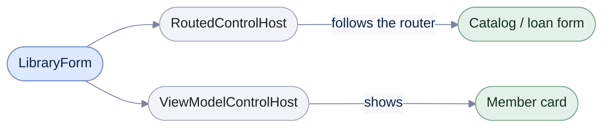

# Windows Forms

[Run the complete page example](https://github.com/reactiveui/ReactiveUI/blob/main/src/examples/Documentation/Pages/platform-winforms/platform-winforms.csproj).

A Windows Forms app builds its screens from `Control` objects: `Form`, `Panel`, `TableLayoutPanel`, `Label`,
`Button`, and the rest. None of them know what a view model is. `ReactiveUI.WinForms` connects the two. It adds
a base class that makes a `UserControl` an `IViewFor<TViewModel>`. It adds hosts that show a view for a routed
or a plain view model. It adds the converters that let a binding fill a `Panel` or a `TableLayoutPanel` with
controls. The package also ships as `ReactiveUI.WinForms.Reactive`, built from the same source for apps that use
System.Reactive. For the packages to reference, see [Installation](../../getting-started/installation/windows-forms.md).

The example below is a library desk. A catalog view lists books in a `ListBox` and shows a read-only card per
book in a `Panel`. Picking a book and clicking **Loan selected book** navigates to a loan form, which lists
members as buttons in a `TableLayoutPanel`. Confirming the loan marks the book on loan, shows the member's card,
and returns to the catalog.

## Start ReactiveUI for WinForms

**1. Register the platform module.** `WithWinForms` on the [app builder](../rxappbuilder.md) registers
`ReactiveUI.Winforms.Registrations` and points ReactiveUI's main-thread sequencer at the WinForms UI thread.
`WithWinFormsScheduler` sets only that sequencer, for an app that registers its platform module another way.
Call this once, from `Main`, before creating any view.

```csharp
IReactiveUIBuilder builder = RxAppBuilder.CreateReactiveUIBuilder()
    .WithWinForms()
    .WithWinFormsScheduler();

_ = builder.BuildApp();

Console.WriteLine(ReferenceEquals(WinFormsReactiveUIBuilderExtensions.WinFormsMainThreadScheduler, RxSchedulers.MainThreadScheduler));

// Output:
// True
```

Both calls point `RxSchedulers.MainThreadScheduler` at the same sequencer,
`WinFormsReactiveUIBuilderExtensions.WinFormsMainThreadScheduler`, which is why the two references above are
equal.

**2. Give a view a view model.** `ReactiveUserControl<TViewModel>` is a `UserControl` that already implements
`IViewFor<TViewModel>`, with a `ViewModel` property the designer can see. The member card view below reads its
`ViewModel` and redraws a label. `WhenActivated` runs its lambda while the view is on screen and disposes
everything added to `disposables` once it leaves; [When activated](../when-activated.md) covers activation in
depth. `DisposeWith` adds a subscription to that bag.

```csharp
public MemberCardView()
{
    Controls.Add(Summary);

    _ = this.WhenActivated(disposables =>
    {
        _ = this.WhenAnyValue(static x => x.ViewModel)
            .Subscribe(UpdateSummary)
            .DisposeWith(disposables);
    });
}
```

**3. Host the view.** `ViewModelControlHost` is itself a `UserControl`. Give it a view model and it resolves
the matching view through the view locator and shows it. The library desk's main window builds one to hold
whichever member's card the librarian is looking at.

```csharp
MemberCardHost.PropertyChanging += OnMemberCardHostPropertyChanging;
MemberCardHost.PropertyChanged += OnMemberCardHostPropertyChanged;
MemberCardHost.CacheViews = true;
MemberCardHost.DefaultContent = new Label { Text = "Pick a member during a loan to see their card.", AutoSize = true };
```

```csharp
_memberCardSubscription = _shell.Router.CurrentViewModel
    .OfType<LoanFormViewModel>()
    .SelectMany(static loan => loan.WhenAnyValue(static x => x.SelectedMember))
    .Subscribe(member => MemberCardHost.ViewModel = member is null ? null : new MemberCardViewModel(member, CountBooksOnLoan()));
```

Setting `MemberCardHost.ViewModel` is enough: the host resolves `MemberCardView` because it implements
`IViewFor<MemberCardViewModel>`, even though the host only knows the view model as `object`. `DefaultContent`
shows in its place until the first view model arrives.



`LibraryForm` hosts two children: a `RoutedControlHost` that follows the shell's router between the catalog and
the loan form, and the `ViewModelControlHost` above, which the router subscription updates whenever a loan
picks a member.

A reader who stops here can already give a view a view model, and host it two ways. The rest of this page
covers routing, WinForms-specific binding, activation, and the platform module in more depth.

## Route between views

`RoutedControlHost` follows a `RoutingState` the way `ViewModelControlHost` follows a single view model: give
it the router, and it shows whatever view matches the top of the navigation stack. `LibraryForm` builds one for
the catalog and the loan form.

```csharp
BooksHost.PropertyChanging += OnBooksHostPropertyChanging;
BooksHost.PropertyChanged += OnBooksHostPropertyChanged;
BooksHost.Router = _shell.Router;
BooksHost.DefaultContent = new Label { Text = "Loading catalog...", AutoSize = true };
BooksHost.ViewLocator = ViewLocator.GetCurrent();
BooksHost.ViewContractObservable = Signal.Emit(string.Empty);
```

Navigating pushes the first view model onto the router's stack, which `BooksHost` then shows:

```csharp
_shell.Router.Navigate.Execute(new BookListViewModel(_shell, _catalog, _members)).Subscribe();
```

`RoutedControlHost` and `ViewModelControlHost` both raise `PropertyChanging` and `PropertyChanged`, the classic
.NET events, for every property listed in [the table](#at-a-glance). `LibraryForm` subscribes to both events on
both hosts and records the last property name each one reports; the [full scenario](#run-the-whole-scenario)
below shows what those subscriptions see once the app runs.

## Bind a list of controls into a Panel

`Panel.Controls` is a `Control.ControlCollection`, not a list your code can assign to directly. The binding's
generated code knows this collection type, and clears and refills it for you. The catalog view binds one read-only `Label` per
book into a `Panel`:

```csharp
_ = this.WhenActivated(d =>
{
    BooksListBox.Items.Clear();
    BooksListBox.Items.AddRange(ViewModel!.Books.Cast<object>().ToArray());

    _ = ViewModel!.WhenAnyValue(static vm => vm.BookCards)
        .Select(CreateCardLabels)
        .BindTo(this, static v => v.BooksPanel.Controls)
        .DisposeWith(d);

    _ = this.BindCommand(ViewModel, static vm => vm.LoanSelectedBook, static v => v.LoanButton)
        .DisposeWith(d);
});
```

The view model holds data only. `BookCards` is an `IReadOnlyList<string>` with the text of each card.
`WhenAnyValue` returns a stream of the property's values: it emits the current value, then each new one.
`Select` turns each value into something else. Here the view turns the text into labels with its own
`CreateCardLabels` method:

```csharp
private static List<Label> CreateCardLabels(IReadOnlyList<string> cards)
{
    List<Label> labels = [];
    foreach (string card in cards)
    {
        labels.Add(new Label { Text = card, AutoSize = true });
    }

    return labels;
}
```

`BindTo` takes that list of labels, clears `BooksPanel.Controls` and adds the new labels in one pass. The labels
belong to the view. Once they sit in `BooksPanel`, disposing the view disposes them with the panel. Keep controls
out of your view models. `RoutedControlHost` disposes a view when it navigates away. A control a view model
built would then be disposed while the view model lives on, and the next view would bind a dead control.
`BindCommand` wires `LoanSelectedBook` to a plain `Button`, the same way on every platform.

## Bind a list of controls into a TableLayoutPanel

A `TableLayoutPanel` holds its children in a `TableLayoutControlCollection`, a different collection type than
`Panel`'s. The same `BindTo` call works against either one: the binding's generated code knows both collection
types and clears and refills them itself. The loan form binds one `Button` per member into a
`TableLayoutPanel`:

```csharp
_ = this.WhenActivated(d =>
{
    BookLabel.Text = $"Loaning: {ViewModel!.Book.Title}";

    _ = ViewModel!.WhenAnyValue(static vm => vm.Members)
        .Select(CreateMemberButtons)
        .BindTo(this, static v => v.MembersTable.Controls)
        .DisposeWith(d);

    _ = this.OneWayBind(
            ViewModel,
            static vm => vm.SelectedMember,
            static v => v.SelectedMemberLabel.Text,
            static member => member is null ? "(no member selected)" : $"To: {member.Name}")
        .DisposeWith(d);

    _ = this.BindCommand(ViewModel, static vm => vm.ConfirmLoan, static v => v.ConfirmButton)
        .DisposeWith(d);

    _ = this.BindCommand(ViewModel, static vm => vm.Cancel, static v => v.CancelButton)
        .DisposeWith(d);
});
```

`Members` is the view model's `IReadOnlyList<Member>`. The view's own `CreateMemberButtons` method builds a
button per member, and a click sets the view model's `SelectedMember`. The `OneWayBind` call takes a selector
as its last argument, which turns `SelectedMember` into the label's text instead of assigning the member
directly.

`WithWinForms` also registers two converters, `PanelSetMethodBindingConverter` and
`TableContentSetMethodBindingConverter`. Each gives an affinity of 10 to a source that implements
`IEnumerable<Control>` against its own collection type, and 0 to anything else. The generated binding fills
both collection types itself, so these converters matter only for code that asks the converter registry
directly.

## Detect activation

`ActivationForViewFetcher` turns a control's window handle and visibility into the activation signal
`WhenActivated` relies on. `ReactiveUI.Winforms.Registrations` already registers one for every view in the app;
this example builds one directly to show its own two members. It is qualified as `Winforms.ActivationForViewFetcher`
here because another platform's fetcher of the same short name lives directly under `ReactiveUI`.

A `Control` gets the strongest affinity ReactiveUI defines for a view; an unrelated type gets none:

```csharp
Winforms.ActivationForViewFetcher fetcher = new();

Console.WriteLine(fetcher.GetAffinityForView(typeof(MemberCardView)));
Console.WriteLine(fetcher.GetAffinityForView(typeof(string)));

// Output:
// 10
// 0
```

Creating the control's window handle is enough to raise the signal, before the control is ever shown:

```csharp
Winforms.ActivationForViewFetcher fetcher = new();
using MemberCardView view = new();
List<bool> states = [];

using IDisposable subscription = fetcher.GetActivationForView(view).Subscribe(states.Add);

_ = view.Handle;

Console.WriteLine(states.Contains(true));

// Output:
// True
```

## Cache views in a ViewModelControlHost

`CacheViews` decides whether a `ViewModelControlHost` keeps a resolved view around and reuses it for the next
view model of the same type, instead of resolving a new one. `DefaultCacheViewsEnabled` is a static switch that
sets what every new host's `CacheViews` starts as; `LibraryForm`'s member card host sets `CacheViews` directly
to `true` instead.

```csharp
ViewModelControlHost.DefaultCacheViewsEnabled = true;

using ViewModelControlHost host = new();

Console.WriteLine(host.CacheViews);

// Output:
// True
```

A host also lets you assign `ViewLocator` and `ViewContractObservable` directly, instead of the defaults every
host starts with: the current view locator and an empty contract. Setting `ViewModel` then resolves the
matching view, which `CurrentView` exposes as a plain `Control`.

```csharp
using ViewModelControlHost host = new()
{
    ViewLocator = ViewLocator.GetCurrent(),
    ViewContractObservable = Signal.Emit(string.Empty),
};

Member member = new("M-1", "Ada");
host.ViewModel = new MemberCardViewModel(member, LoanCount: 1);

Console.WriteLine(host.CurrentView is MemberCardView);

host.CurrentView?.Dispose();

// Output:
// True
```

## Show a view only the service locator knows

`ViewModelControlHost` and `RoutedControlHost` ask the [view locator](../view-location/index.md) for a view in two
steps, and neither step uses reflection. The first step is the view lookup the ReactiveUI.Binding source generator
writes for every view class in your project that implements `IViewFor<T>`. That is how `MemberCardView` is found with
no registration. The second step is the views you add to the view locator with `Map`. So both hosts are safe to trim
and to compile ahead of time.

A view registered only in Splat's service locator, whose class the generator never sees, sits outside both steps.
One example is a view from a plug-in library built without the generator. Each host has an Unsafe twin for that
view. A twin asks both steps first, then the service locator for `IViewFor<T>` closed over the view model's run-time
type. Building that type while the app runs needs code the compiler never generated, so each twin is marked
`[RequiresDynamicCode]`.

| AOT-safe type | Unsafe twin | When the view is only in the service locator |
| --- | --- | --- |
| `ViewModelControlHost` | `ViewModelControlHostUnsafe` | The safe host shows no view, and `CurrentView` stays `null`. |
| `RoutedControlHost` | `RoutedControlHostUnsafe` | The safe host shows no view for that page. |

The example's reading-challenge plug-in supplies `ReadingChallengeView`. `[ExcludeFromViewRegistration]` keeps it out
of the generated lookup, the way a view from a library built without the generator is.

**1. Host it with `ViewModelControlHostUnsafe`.** The default host finds nothing; the twin finds the view:

```csharp
AppLocator.CurrentMutable.Register<IViewFor<ReadingChallengeViewModel>>(static () => new ReadingChallengeView());
ReadingChallengeViewModel challenge = new(new LibraryShellViewModel(), "Summer reading: 10 books");

using ViewModelControlHost host = new();
using ViewModelControlHostUnsafe unsafeHost = new();
host.ViewModel = challenge;
unsafeHost.ViewModel = challenge;

Console.WriteLine(host.CurrentView?.GetType().Name ?? "(no view)");
Console.WriteLine(unsafeHost.CurrentView?.GetType().Name ?? "(no view)");

unsafeHost.CurrentView?.Dispose();

// Output:
// (no view)
// ReadingChallengeView
```

**2. Route to it with `RoutedControlHostUnsafe`.** The router here uses `Sequencer.Immediate`, so the navigation
finishes before the next line runs. [Routing](../routing.md) covers the router's sequencer.

```csharp
AppLocator.CurrentMutable.Register<IViewFor<ReadingChallengeViewModel>>(static () => new ReadingChallengeView());
RoutingState router = new(Sequencer.Immediate);

using RoutedControlHostUnsafe host = new() { Router = router };
using IDisposable navigation = router.Navigate.Execute(new ReadingChallengeViewModel(new LibraryShellViewModel(), "Winter reading: 5 books")).Subscribe();

Console.WriteLine(host.Controls[0].GetType().Name);

// Output:
// ReadingChallengeView
```

**3. Or keep the default host and bridge the registration.** `MapFromServiceLocator` adds a `Map` entry whose view
comes from the service locator. The default host finds it in its second step, and the app stays safe to compile
ahead of time. `TView` is the type the view is registered under. Prefer this to the twins.

```csharp
AppLocator.CurrentMutable.Register<IViewFor<ReadingChallengeViewModel>>(static () => new ReadingChallengeView());
DefaultViewLocator locator = new();
_ = locator.CreateMappingBuilder().MapFromServiceLocator<ReadingChallengeViewModel, IViewFor<ReadingChallengeViewModel>>();

using ViewModelControlHost host = new() { ViewLocator = locator };
host.ViewModel = new ReadingChallengeViewModel(new LibraryShellViewModel(), "Summer reading: 10 books");

Console.WriteLine(host.CurrentView?.GetType().Name ?? "(no view)");

host.CurrentView?.Dispose();

// Output:
// ReadingChallengeView
```

The example uses a view locator of its own. In your own app, make the same call inside
`ConfigureViewLocator(static locator => ...)` on the builder, so every host uses it. When the service locator holds
more than one registration of the same `IViewFor<TViewModel>` type,
[the contracted overload](../../../binding/views.md#reach-two-contracted-views-registered-in-the-service-locator)
tells them apart.

## Read the device orientation

`PlatformOperations` answers the same `GetOrientation` question every platform's `IPlatformOperations`
answers. The desktop has no orientation, so WinForms always returns `null`.

```csharp
Winforms.PlatformOperations operations = new();

Console.WriteLine(operations.GetOrientation() ?? "(null)");

// Output:
// (null)
```

## Let a binding proceed

`IPropertyBindingHook` lets custom logic run before a property binding executes. `ContentControlBindingHook` is
the hook WinForms registers by default: it always returns `true`, so it never blocks a binding.

```csharp
ContentControlBindingHook hook = new();

bool allowed = hook.ExecuteHook(
    source: null,
    target: new object(),
    getCurrentViewModelProperties: static () => [],
    getCurrentViewProperties: static () => [],
    direction: BindingDirection.OneWay);

Console.WriteLine(allowed);

// Output:
// True
```

## Register the platform's services by hand

`WithWinForms` calls `Registrations.Register` for you. Calling it directly, against a fresh resolver, shows
everything it adds: the platform operations above, the activation fetcher, the two `ISetMethodBindingConverter`s
from the last two sections, and four `IBindingTypeConverter`s that turn numeric types into strings for display.
It is qualified as `Winforms.Registrations` here because `ReactiveUI` also carries its own core `Registrations`
type.

```csharp
ModernDependencyResolver resolver = new();
DependencyResolverRegistrar registrar = new(resolver);

new Winforms.Registrations().Register(registrar);

Console.WriteLine(resolver.GetService<IPlatformOperations>()?.GetOrientation() ?? "(null)");
Console.WriteLine(resolver.GetServices<ISetMethodBindingConverter>().Count());
Console.WriteLine(resolver.GetServices<IBindingTypeConverter>().Count());

// Output:
// (null)
// 2
// 4
```

`ReactiveUserControlNonGeneric` is a base for a view that implements the non-generic `IViewFor` itself, instead
of the generic `IViewFor<TViewModel>` that `ReactiveUserControl<TViewModel>` gives you. A view needs it when the
WinForms Designer must be able to edit it, because the Designer cannot open a control whose base class is
generic. `LibraryNoticeView`, a front-desk notice banner, derives from it and adds its own strongly typed
`ViewModel` property over the base's non-generic one:

```csharp
public AnnouncementViewModel? ViewModel
{
    get => (AnnouncementViewModel?)((IViewFor)this).ViewModel;
    set
    {
        ((IViewFor)this).ViewModel = value;
        NoticeLabel.Text = value?.Message ?? string.Empty;
    }
}
```

Setting it stores the notice through `IViewFor.ViewModel` and updates the label:

```csharp
using LibraryNoticeView view = new();

view.ViewModel = new AnnouncementViewModel("The library closes early on Fridays.");

Console.WriteLine(view.NoticeLabel.Text);

// Output:
// The library closes early on Fridays.
```

## Run the whole scenario

The example project builds on any operating system, since it only references WinForms types. Running it, and
the smoke test below, needs Windows: WinForms controls need a real window handle to raise the events
`ActivationForViewFetcher` and the hosts depend on. The smoke test drives the library desk the way a user
would. It pumps the message loop between steps, so every navigation and binding update gets a chance to run;
each one posts its work through the WinForms main-thread sequencer instead of running immediately.

```csharp
BookListView catalogView = (BookListView)form.BooksHost.Controls[0];
Book book = catalogView.BooksListBox.Items.Cast<Book>().First();
catalogView.BooksListBox.SelectedItem = book;
Pump();
Console.WriteLine($"Selected book: {book.Title}");

catalogView.LoanButton.PerformClick();
Pump();

LoanFormView loanView = (LoanFormView)form.BooksHost.Controls[0];
Console.WriteLine("Navigated to the loan form");

Button memberButton = (Button)loanView.MembersTable.Controls[0];
Member member = (Member)memberButton.Tag!;
memberButton.PerformClick();
Pump();
Console.WriteLine($"Selected member: {member.Name}");
Console.WriteLine($"Member card shows: {(form.MemberCardHost.Content as MemberCardView)?.ViewModel?.Member.Name}");

loanView.ConfirmButton.PerformClick();
Pump();
Console.WriteLine($"Book on loan after confirming: {book.IsOnLoan}");

BookListView catalogAgain = (BookListView)form.BooksHost.Controls[0];
Console.WriteLine($"Back on the catalog: {!ReferenceEquals(catalogAgain, catalogView)}");
Console.WriteLine($"Last RoutedControlHost property changed: {form.LastBooksHostPropertyChanged}");
Console.WriteLine($"Last ViewModelControlHost property changed: {form.LastMemberCardHostPropertyChanged}");
```

`form.BooksHost.Controls[0]` reads the view `RoutedControlHost` currently hosts, cast to the view type the
current step expects. After the loan is confirmed, the router navigates back, so the catalog view the test
reads at the end is a new `BookListView` instance, not the one the test started with. Run on Windows with
`--smoke`, the example prints the output below. `Main` runs the example methods from earlier on this page
first, so their output comes before the library desk's eight lines.

```text
True
(null)
(null)
2
4
10
0
True
True
True
True
(no view)
ReadingChallengeView
ReadingChallengeView
ReadingChallengeView
The library closes early on Fridays.
Selected book: Dune
Navigated to the loan form
Selected member: Ada
Member card shows: Ada
Book on loan after confirming: True
Back on the catalog: True
Last RoutedControlHost property changed: ViewContractObservable
Last ViewModelControlHost property changed: ViewModel
```

The last two lines come from the `PropertyChanged` subscriptions [set up above](#route-between-views):
`RoutedControlHost` last changed `ViewContractObservable` when it was constructed, and `ViewModelControlHost`
last changed `ViewModel` when the router subscription assigned the member's card.

## At a glance

| Member | What it does |
| --- | --- |
| `WinFormsReactiveUIBuilderExtensions.WithWinForms()` | Registers the WinForms platform module and its main-thread sequencer |
| `WinFormsReactiveUIBuilderExtensions.WithWinFormsScheduler()` | Sets only the main-thread sequencer |
| `WinFormsReactiveUIBuilderExtensions.WinFormsMainThreadScheduler` | The shared sequencer for the WinForms UI thread |
| `ReactiveUserControl<TViewModel>` | A `UserControl` that implements `IViewFor<TViewModel>` |
| `ReactiveUserControlNonGeneric` | A base for a view that implements the non-generic `IViewFor` itself |
| `RoutedControlHost` | Shows the view for a router's current view model; finds generated and `Map` views without reflection |
| `RoutedControlHostUnsafe` | A `RoutedControlHost` that also asks the service locator; marked `[RequiresDynamicCode]` |
| `ViewModelControlHost` | Shows the view for a view model you assign directly; finds generated and `Map` views without reflection |
| `ViewModelControlHostUnsafe` | A `ViewModelControlHost` that also asks the service locator; marked `[RequiresDynamicCode]` |
| `ViewModelControlHost.CacheViews` / `DefaultCacheViewsEnabled` | Reuses a resolved view for the next view model of the same type |
| `ActivationForViewFetcher` | Turns a control's handle and visibility events into the activation signal |
| `PlatformOperations` | Answers `GetOrientation()`; always `null` on the desktop |
| `PanelSetMethodBindingConverter` | Binds a collection of controls into a `Panel` |
| `TableContentSetMethodBindingConverter` | Binds a collection of controls into a `TableLayoutPanel` |
| `ContentControlBindingHook` | A binding hook that always lets the binding proceed |
| `Registrations` | The module `WithWinForms` loads: platform operations, activation fetcher, both converters, four type converters |
