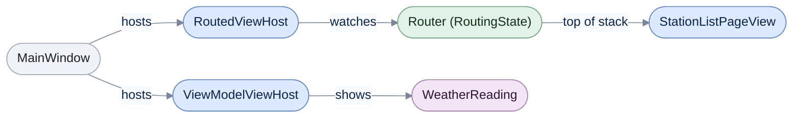

# WinUI

[Run the complete page example](https://github.com/reactiveui/ReactiveUI/blob/main/src/examples/Documentation/Pages/platform-winui/platform-winui.csproj).

A WinUI 3 `Window` is not a `DependencyObject`, so it cannot bind and has no `ViewModel` property of its own.
`ReactiveUI.WinUI` gives you base classes for the pages and controls that live inside a window. It also gives you
hosts that show a view for a view model, converters, an activation fetcher, and a `WithWinUI()` call that wires all
of it into the [builder](../rxappbuilder.md).

The example is a weather-station dashboard: a code-first WinUI 3 app with no `.xaml` files, one page that lists
every station and a detail page for one of them, reached through [routing](../routing.md). It opens a real WinUI
window, so it only runs on Windows and needs an interactive desktop session. The output shown on this page is what
the example printed on a real Windows machine. `ReactiveUI.WinUI` also ships as `ReactiveUI.WinUI.Reactive`, built
from the same source, for apps that use System.Reactive. See [Installation](../../getting-started/installation/winui.md)
for the packages and project setup.

## Configure ReactiveUI for WinUI

**1. Call `WithWinUI()` on the builder.** It configures the core services, sets the main thread
[sequencer](../scheduling.md) and the task-pool sequencer, registers the WinUI converters, and installs
`WinUI.Registrations`. The dashboard's own startup also registers its three views with the
[view locator](../view-location/index.md), and adds one more view with `Map`. It registers one last view with
Splat's service locator only. The
[view lookup section](#which-views-the-hosts-find) explains which hosts find which of these views.

```csharp
private static void ConfigureReactiveUI()
{
    _ = RxAppBuilder.CreateReactiveUIBuilder()
        .WithWinUI()
        .RegisterView<StationListPageView, StationListPageViewModel>()
        .RegisterView<StationDetailPageView, StationDetailPageViewModel>()
        .RegisterView<AlertView, AlertViewModel>()
        .ConfigureViewLocator(static locator => locator.Map<SensorMaintenanceViewModel, SensorMaintenanceView>())
        .BuildApp();

    // WeatherReading is a plain class, not an IReactiveObject, so RegisterView (which requires IReactiveObject)
    // cannot register it; it is registered with Splat directly instead.
    Locator.CurrentMutable.Register(static () => new WeatherReadingRowView(), typeof(IViewFor<WeatherReading>));

    // The radar vendor's library registers its view with the service locator only, so the default hosts cannot
    // find it; the radar panel uses the Unsafe twins.
    AppLocator.CurrentMutable.Register<IViewFor<RadarImageViewModel>>(static () => new RadarImageView());
}
```

The default hosts find `WeatherReadingRowView`, even though Splat holds its registration. It implements
`IViewFor<WeatherReading>`, so the generated view lookup has an entry for it, and that entry asks Splat first.
`RadarImageView` has no such entry, as the view lookup section shows.

`WinUI.Registrations` is what `WithWinUI()` installs behind the scenes. Its `Register` method adds
`WinUI.ActivationForViewFetcher`, `BooleanToVisibilityTypeConverter`, `VisibilityToBooleanTypeConverter`,
`PlatformOperations` and `AutoDataTemplateBindingHook` to the resolver, and turns off a startup warning about view
command bindings that does not apply to WinUI.

**2. Call the individual extensions when you want less.** `WithWinUI` calls `WithWinUIConverters`,
`WithWinUIScheduler` and registers `WinUI.Registrations` for you. An app that wants only the WinUI converters or
scheduler can call them on their own. `WinUIMainThreadScheduler` is the sequencer `WithWinUIScheduler` sets: the
shared `DispatcherQueueSequencer.Main` for the WinUI UI thread.

```csharp
using ModernDependencyResolver resolver = new();
IReactiveUIBuilder builder = (IReactiveUIBuilder)new ReactiveUIBuilder(resolver, resolver).WithCoreServices();
IReactiveUIBuilder configured = builder.WithWinUIConverters().WithWinUIScheduler().WithPlatformModule<WinUI.Registrations>();

Console.WriteLine($"WithWinUIConverters/WithWinUIScheduler/Registrations configured: {configured is not null}");
Console.WriteLine($"WinUI main-thread scheduler: {WinUIMainThreadScheduler.GetType().Name}");
```

```text
WithWinUIConverters/WithWinUIScheduler/Registrations configured: True
WinUI main-thread scheduler: DispatcherQueueSequencer
```

## Host the routed page stack and one view model at a time

The dashboard's window hosts four controls. A `RoutedViewHost` follows its own router's navigation stack, and a
generic `RoutedViewHost<AlertViewModel>` always shows the same view model type. A `ViewModelViewHost` and its
generic counterpart `ViewModelViewHost<WeatherReading>` each show one reading directly, without going through a
router. All four find views without reflection: through the view lookup the source generator writes, then through
the view locator's `Map` entries. So they are safe to trim and to compile ahead of time.



The routed host never touches the view model directly; it watches the router and asks the view locator for
whatever page is on top. The view model host skips the router and shows the view model you assign.

**1. Give the routed host a router.** `RoutedViewHost.RouterProperty` is a `DependencyProperty`. The example sets it
with `SetValue`, as well as through the `Router` property, to show both ways of doing it. `DefaultContent` is what
the host shows while nothing has navigated yet.

**2. Assign a view model to each view model host.** `_quickGlanceHost` is the non-generic `ViewModelViewHost`,
set through `SetValue` the same way. `_compactGlanceHost` is the generic `ViewModelViewHost<WeatherReading>`, set
through its typed `ViewModel` property. `ContractFallbackByPass` controls what happens when a [view contract](../view-location/index.md)
does not match a registered view.

**3. Give the alert panel its own router, and host it through the generic `RoutedViewHost<TViewModel>`.** Use the
generic form when a host only ever shows one view model type, as the alert panel does with `AlertViewModel`.

**4. Navigate the main router to the station list.** Once a page model is on the stack, the routed host resolves
and shows its view. The last two panels, `CreateMaintenancePanel` and `CreateRadarPanel`, are covered in the
[view lookup section](#which-views-the-hosts-find).

```csharp
public MainWindow(IReadOnlyList<WeatherReading> readings)
{
    Title = "Weather Station";

    _pageHost.SetValue(RoutedViewHost.RouterProperty, _shell.Router);
    _pageHost.DefaultContent = new TextBlock { Text = "Loading stations..." };

    AlertViewModel alert = new(_alertShell);
    _alertHost.Router = _alertShell.Router;
    _alertHost.DefaultContent = new TextBlock { Text = "(no alert yet)" };
    _ = _alertShell.Router.Navigate.Execute(alert).Subscribe();

    _quickGlanceHost.SetValue(ViewModelViewHost.ViewModelProperty, readings[0]);
    _quickGlanceHost.ContractFallbackByPass = false;
    _quickGlanceHost.DefaultContent = new TextBlock { Text = "(no reading)" };

    _compactGlanceHost.ViewModel = readings[^1];
    _compactGlanceHost.ContractFallbackByPass = true;
    _compactGlanceHost.DefaultContent = new TextBlock { Text = "(no reading)" };

    StackPanel layout = new();
    layout.Children.Add(_alertHost);
    layout.Children.Add(_pageHost);
    layout.Children.Add(_quickGlanceHost);
    layout.Children.Add(_compactGlanceHost);
    layout.Children.Add(CreateMaintenancePanel());
    layout.Children.Add(CreateRadarPanel());
    Content = layout;

    StationListPageViewModel list = new(_shell, readings);
    _ = _shell.Router.Navigate.Execute(list).Subscribe();

    AlertPanel = alert;
    StationList = list;
}
```

`RoutedViewHost` and its generic form share the same shape: `Router`, `DefaultContent`, `ViewContract`,
`ViewContractObservable` and `ViewLocator`, each backed by a `DependencyProperty` field of the same name plus
`Property` (`RouterProperty`, `DefaultContentProperty`, `ViewContractObservableProperty`). Setting `ViewContract`
also pushes the new value onto `ViewContractObservable`, so a binding that watches the observable sees it too. When
no view is registered for the routed view model, `ResolveViewForViewModel` throws an `InvalidOperationException`
rather than showing nothing.

`ViewModelViewHost` and its generic form add `ViewModel` and `ContractFallbackByPass` to the same set of properties
(`ViewModelProperty` and `ContractFallbackByPassProperty`). Assign `null` and the host shows `DefaultContent`. When
`ContractFallbackByPass` is `false` and no view matches the contract, the host falls back to a view without one;
when it is `true`, that fallback is skipped. If no view is found at all, the host logs a warning and shows
`DefaultContent` instead of throwing.

Both hosts derive from `TransitioningContentControl`, a plain `ContentControl` with a single transition. It carries
no members of its own beyond what `ContentControl` gives it, and the example also uses it directly, further down,
to wrap a panel that appears and disappears.

## Write a page or a control

A view that hosts other content, such as a window's page, derives from `ReactivePage<TViewModel>`. A smaller,
reusable piece derives from `ReactiveUserControl<TViewModel>`. Both implement `IViewFor<TViewModel>` through a
`ViewModel` dependency property, so the view locator can find them and a binding can read `ViewModel` like any other
property.

**1. Derive from `ReactivePage<TViewModel>`.** `StationDetailPageView` shows one reading. It builds its content in
the constructor: a label, a storm badge, and a panel wrapped in `TransitioningContentControl`.

```csharp
public sealed class StationDetailPageView : ReactivePage<StationDetailPageViewModel>
{
    private static readonly BooleanToVisibilityTypeConverter ToVisibility = new();

    private static readonly VisibilityToBooleanTypeConverter ToBoolean = new();

    private readonly TextBlock _readingLabel = new();

    private readonly TextBlock _stormBadge = new() { Text = "STORM" };

    private readonly TransitioningContentControl _overridePanel = new() { Content = new TextBlock { Text = "Manual override active" } };

    public StationDetailPageView()
    {
        StackPanel panel = new();
        panel.Children.Add(_readingLabel);
        panel.Children.Add(_stormBadge);
        panel.Children.Add(_overridePanel);
        Content = panel;
```

**2. Read the platform's orientation, and convert `bool` to `Visibility` inside `WhenActivated`.**
[`WhenActivated`](../when-activated.md) runs this block while the page is shown. It disposes what the block creates
once the page leaves the router's stack. `PlatformOperations.GetOrientation()` is the WinUI implementation of
`IPlatformOperations`; it always returns `null`, because WinUI has no orientation API to report.
`BooleanToVisibilityTypeConverter` and `VisibilityToBooleanTypeConverter` are [converters](../../../binding/converters.md);
their conversion hint is a `BooleanToVisibilityHint`, with members `None`, `Inverse` and `UseHidden`. WinUI ignores
`UseHidden` and always collapses a hidden element; `UseHidden` only changes anything on MAUI.

```csharp
        this.WhenActivated(disposables =>
        {
            StationDetailPageViewModel? viewModel = ViewModel;
            if (viewModel is null)
            {
                return;
            }

            string? orientation = new PlatformOperations().GetOrientation();
            _readingLabel.Text = $"{viewModel.Reading.StationName}: {viewModel.Reading.TemperatureCelsius:0.0} C "
                + $"(orientation: {orientation ?? "unknown"})";

            _ = ToVisibility.TryConvert(viewModel.Reading.IsStormy, BooleanToVisibilityHint.None, out Visibility stormVisibility);
            _stormBadge.Visibility = stormVisibility;

            IDisposable subscription = viewModel.WhenAnyValue(vm => vm.ManualOverrideVisible)
                .Subscribe(visible =>
                {
                    // Inverse: the panel is shown when the flag is false (nothing overridden yet needs no extra chrome)
                    // and hidden once an operator sets it, exercising the hint alongside the default conversion.
                    _ = ToVisibility.TryConvert(visible, BooleanToVisibilityHint.Inverse, out Visibility panelVisibility);
                    _overridePanel.Visibility = panelVisibility;

                    _ = ToBoolean.TryConvert(_overridePanel.Visibility, BooleanToVisibilityHint.Inverse, out bool roundTripped);
                    System.Diagnostics.Debug.Assert(roundTripped == visible, "The hint should round-trip the original flag.");
                });
            disposables(subscription);
        });
    }
}
```

`ToVisibility.TryConvert` with `BooleanToVisibilityHint.None` maps `true` to `Visibility.Visible` and `false` to
`Visibility.Collapsed`; with `Inverse`, the mapping flips. `ToBoolean.TryConvert` does the opposite conversion, so
the assertion above proves that converting a `Visibility` back with the same hint reproduces the original flag.

## Fill a list without an `ItemTemplate`

`AutoDataTemplateBindingHook` watches every binding that sets an `ItemsControl`'s `ItemsSource`. When the control
has no `ItemTemplate`, no `ItemTemplateSelector` and no `DisplayMemberPath`, the hook assigns `DefaultItemTemplate`.
That template hosts each item in a `ViewModelViewHost`, so the host finds a view for every item and you write no
template by hand.

**1. Leave the list's `ItemTemplate` unset and bind its `ItemsSource`.** The station list binds its readings inside
`WhenActivated`. The binding itself triggers the hook, so the template is in place as soon as the binding returns.

```csharp
public sealed class StationListPageView : ReactiveUserControl<StationListPageViewModel>
{
    public StationListPageView()
    {
        Content = ReadingsList;

        this.WhenActivated(disposables =>
        {
            // ReadingsList has no ItemTemplate, so AutoDataTemplateBindingHook gives it the default one as this binds.
            IDisposable subscription = this.OneWayBind(ViewModel, viewModel => viewModel.Readings, view => view.ReadingsList.ItemsSource);
            disposables(subscription);

            bool usesDefaultTemplate = ReferenceEquals(ReadingsList.ItemTemplate, AutoDataTemplateBindingHook.DefaultItemTemplate.Value);
            Console.WriteLine($"Default item template assigned: {usesDefaultTemplate}, items: {ReadingsList.Items.Count}");
        });
    }

    internal ItemsControl ReadingsList { get; } = new();
}
```

**2. Check what each row shows.** Once WinUI lays the list out, the example's `--smoke` run follows the first row
down the template to the view inside it:

```text
Default item template assigned: True, items: 3
First station row shows: ViewModelViewHost -> WeatherReadingRowView
```

The template names only WinUI types. Each item sits in a `ContentControl`, and a value converter creates the
`ViewModelViewHost` for it in code. WinUI never has to look up a ReactiveUI type in XAML. So the template works in
an app built entirely in code, with no `.xaml` files and no `IXamlMetadataProvider`, like this one. The hook keeps
that converter in `Application.Current.Resources`, under the key `ReactiveUI.ViewModelViewHostConverter`. Leave that
entry in place; the hook adds it back the next time it assigns the template.

A list you give an `ItemTemplate` of your own keeps it. The hook only fills in a template that is missing.

## Which views the hosts find

The hosts and the hook ask the [view locator](../view-location/index.md) for a view in two steps, and neither step
uses reflection:

1. The view lookup that the ReactiveUI.Binding source generator writes while your app builds. It covers every view
   class in your project that implements `IViewFor<T>`, with no registration.
2. The views you add to the view locator with `Map`, matched on the view model's run-time type.

So the default hosts are safe to trim and to publish with Native AOT. See
[Members that need reflection](../reflection.md) for what trimming and Native AOT are.

One kind of view sits outside both steps: a view registered only in Splat's service locator, whose class the
generator never sees. One example is a view from a library built without the generator. For that view, each type
has an Unsafe twin. A twin asks both steps first, then the service locator for `IViewFor<T>` closed over the view
model's run-time type. Building that type while the app runs needs code the compiler never generated. So each twin
is marked `[RequiresDynamicCode]`, and a project that publishes with Native AOT gets a build warning where it uses one.

| AOT-safe type | Unsafe twin | When the view is only in the service locator |
| --- | --- | --- |
| `RoutedViewHost` | `RoutedViewHostUnsafe` | The safe host throws an `InvalidOperationException` that names the twin. |
| `ViewModelViewHost` | `ViewModelViewHostUnsafe` | The safe host logs a warning that names the twin and shows `DefaultContent`. |
| `AutoDataTemplateBindingHook` | `AutoDataTemplateBindingHookUnsafe` | Each row's `ViewModelViewHost` shows nothing. |

The generic hosts, `RoutedViewHost<TViewModel>` and `ViewModelViewHost<TViewModel>`, have no twin. Prefer
`MapFromServiceLocator` (step 4) to the twins: it keeps the default hosts and stays safe to compile ahead of time. The
example app does not publish with Native AOT, so it uses the twins without a warning.

**1. Add a view with `Map`, and host it with the default hosts.** The dashboard's maintenance panel shows a
`SensorMaintenanceView`. It implements only the non-generic `IViewFor`, so the generated lookup has no entry for
it. Startup adds it with `locator.Map<SensorMaintenanceViewModel, SensorMaintenanceView>()`, as shown in
[Configure ReactiveUI for WinUI](#configure-reactiveui-for-winui).

```csharp
public sealed class SensorMaintenanceView : UserControl, IViewFor
{
    private readonly TextBlock _label = new();

    public SensorMaintenanceView() => Content = _label;

    public object? ViewModel
    {
        get;
        set
        {
            field = value;
            _label.Text = value is SensorMaintenanceViewModel visit
                ? $"{visit.StationName}: {visit.Task}"
                : "(no visit)";
        }
    }
```

The panel hosts it with a plain `RoutedViewHost` and a plain `ViewModelViewHost`:

```csharp
private StackPanel CreateMaintenancePanel()
{
    _maintenancePageHost.Router = _maintenanceShell.Router;
    _maintenancePageHost.DefaultContent = new TextBlock { Text = "(no visit booked)" };
    SensorMaintenanceViewModel visit = new SensorMaintenanceViewModel(_maintenanceShell, "Harbor", "Replace the wind vane");
    _ = _maintenanceShell.Router.Navigate.Execute(visit).Subscribe();

    _nextVisitHost.DefaultContent = new TextBlock { Text = "(no visit booked)" };
    _nextVisitHost.ViewModel = new SensorMaintenanceViewModel(_maintenanceShell, "Riverside", "Clean the rain gauge");

    StackPanel panel = new StackPanel();
    panel.Children.Add(_maintenancePageHost);
    panel.Children.Add(_nextVisitHost);
    return panel;
}
```

The `--smoke` run prints what each host shows:

```text
RoutedViewHost shows: SensorMaintenanceView (Harbor: Replace the wind vane)
ViewModelViewHost shows: SensorMaintenanceView (Riverside: Clean the rain gauge)
```

**2. Host a view the service locator alone knows with the Unsafe twins.** The radar panel shows a
`RadarImageView`. It stands in for a view from a radar vendor's library that registers its views with the service
locator only. `[ExcludeFromViewRegistration]` keeps this copy out of the generated lookup in the same way, and
startup registers it with `AppLocator.CurrentMutable.Register`.

```csharp
[ExcludeFromViewRegistration]
public sealed class RadarImageView : ReactiveUserControl<RadarImageViewModel>
```

`RoutedViewHostUnsafe` and `ViewModelViewHostUnsafe` derive from the default hosts, so they take the same `Router`,
`ViewModel` and `DefaultContent` properties.

```csharp
private StackPanel CreateRadarPanel()
{
    _radarPageHost.Router = _radarShell.Router;
    _radarPageHost.DefaultContent = new TextBlock { Text = "(no radar)" };
    _ = _radarShell.Router.Navigate.Execute(new RadarImageViewModel(_radarShell, "Highlands")).Subscribe();

    _radarGlanceHost.DefaultContent = new TextBlock { Text = "(no radar)" };
    _radarGlanceHost.ViewModel = new RadarImageViewModel(_radarShell, "Riverside");

    StackPanel panel = new StackPanel();
    panel.Children.Add(_radarPageHost);
    panel.Children.Add(_radarGlanceHost);
    return panel;
}
```

```text
RoutedViewHostUnsafe shows: RadarImageView (Highlands radar)
ViewModelViewHostUnsafe shows: RadarImageView (Riverside radar)
```

**3. Register `AutoDataTemplateBindingHookUnsafe` for lists of those views.** Add it next to the safe hook that
`WithWinUI()` registers. Its `DefaultItemTemplate` hosts each item in a `ViewModelViewHostUnsafe`. It replaces only
the template the safe hook assigned, never one you set yourself, so the registration order does not matter. The
example registers it on a resolver of its own, so the dashboard's lists keep the safe template:

```csharp
using ModernDependencyResolver resolver = new ModernDependencyResolver();
_ = resolver.CreateReactiveUIBuilder()
    .WithWinUI()
    .WithRegistration(static registrar => registrar.RegisterConstant<IPropertyBindingHook>(new AutoDataTemplateBindingHookUnsafe()));

foreach (IPropertyBindingHook hook in resolver.GetServices<IPropertyBindingHook>())
{
    Console.WriteLine($"Binding hook: {hook.GetType().Name}");
}
```

```text
Binding hook: AutoDataTemplateBindingHook
Binding hook: AutoDataTemplateBindingHookUnsafe
```

In your own app, add the same `WithRegistration` call to the `RxAppBuilder.CreateReactiveUIBuilder()` chain, before
`BuildApp()`. Every list that gets a default template then uses the Unsafe one.

**4. Or bridge the registration with `MapFromServiceLocator` and keep the default hosts.**
`CreateMappingBuilder().MapFromServiceLocator<TViewModel, TView>()` adds a `Map` entry whose view comes from the
service locator. `TView` is the type the view is registered under, here `IViewFor<RadarImageViewModel>`. The default
host then finds the view in step 2 of its lookup, with no reflection. The example uses a view locator of its own so
the dashboard keeps its setup:

```csharp
DefaultViewLocator locator = new DefaultViewLocator();
_ = locator.CreateMappingBuilder().MapFromServiceLocator<RadarImageViewModel, IViewFor<RadarImageViewModel>>();

ViewModelViewHost host = new ViewModelViewHost { ViewLocator = locator };
host.ViewModel = new RadarImageViewModel(new WeatherShell(), "Harbor");

Console.WriteLine($"ViewModelViewHost shows: {host.Content?.GetType().Name ?? "(nothing)"}");
```

```text
ViewModelViewHost shows: RadarImageView
```

In your own app, make the same call inside `ConfigureViewLocator(static locator => ...)` on the builder. The mapping
asks the service locator each time it resolves, so the lifetime you registered the view with still applies.

## Know when a view is active

`WhenActivated` on a view needs to know when that view appears and disappears. `WinUI.ActivationForViewFetcher` is
the `IActivationForViewFetcher` `WinUI.Registrations` installs to answer that for a WinUI view.

**1. Ask for the fetcher's affinity.** `GetAffinityForView` reports how well the fetcher matches a view type; a
higher number wins when more than one fetcher could serve the same view. It returns `10` for any `FrameworkElement`
and `0` for anything else.

**2. Ask for the activation stream.** `GetActivationForView` reports `true` between the view's `Loading` event and
its `Unloaded` event, except while the view's `IsHitTestVisible` is `false`.

```csharp
// Qualified with the WinUI. namespace prefix on purpose: ReactiveUI.Registrations exists as an unrelated
// core type, and this code's own namespace nests under ReactiveUI, so an unqualified "ActivationForViewFetcher"
// would still compile if a same-named core type ever existed, silently binding to the wrong one.
WinUI.ActivationForViewFetcher fetcher = new();

int affinity = fetcher.GetAffinityForView(view.GetType());
Console.WriteLine($"Affinity for {nameof(StationListPageView)}: {affinity}");

using IDisposable subscription = fetcher.GetActivationForView(view)
    .Subscribe(static isActive => Console.WriteLine($"Activated: {isActive}"));
```

```text
Affinity for StationListPageView: 10
```

The example calls this after the station list view has already finished loading. Its `Loading` event has already
fired, so this fresh subscription has nothing to deliver yet, and only the affinity line prints.
`GetActivationForView` still reports `false` as soon as the view unloads.

## At a glance

| Member | What it does |
| --- | --- |
| `WithWinUI()` | Configures core services, the WinUI main-thread and task-pool sequencers, the WinUI converters and `WinUI.Registrations`. |
| `WithWinUIScheduler()` | Sets the builder's main-thread sequencer to `WinUIMainThreadScheduler`. |
| `WithWinUIConverters()` | Registers `BooleanToVisibilityTypeConverter` and `VisibilityToBooleanTypeConverter`. |
| `WinUIMainThreadScheduler` | The shared `DispatcherQueueSequencer.Main` sequencer for the WinUI UI thread. |
| `WinUI.Registrations` | The `IWantsToRegisterStuff` `WithWinUI` installs; registers the fetcher, both converters, `PlatformOperations` and `AutoDataTemplateBindingHook`. |
| `WinUI.ActivationForViewFetcher` | Reports affinity `10` for any `FrameworkElement`; its activation stream follows `Loading`/`Unloaded`, gated on `IsHitTestVisible`. |
| `RoutedViewHost` / `RoutedViewHost<TViewModel>` | Shows the view for whichever page is on top of a `Router`'s stack. Finds generated and `Map` views without reflection. Properties: `Router`, `DefaultContent`, `ViewContract`, `ViewContractObservable`, `ViewLocator`. |
| `ViewModelViewHost` / `ViewModelViewHost<TViewModel>` | Shows the view for a view model you assign directly. Adds `ViewModel` and `ContractFallbackByPass` to the routed host's properties. |
| `ReactivePage<TViewModel>` | A `Page` that implements `IViewFor<TViewModel>` through a `ViewModel` dependency property. |
| `ReactiveUserControl<TViewModel>` | A `UserControl` that implements `IViewFor<TViewModel>` the same way. |
| `TransitioningContentControl` | A `ContentControl` with a single transition; the base class both view hosts build on. |
| `AutoDataTemplateBindingHook` | Assigns `DefaultItemTemplate` to an `ItemsControl` bound with no `ItemTemplate` of its own. The template names only WinUI types, so it works in a code-only app. |
| `RoutedViewHostUnsafe` / `ViewModelViewHostUnsafe` | The hosts with one more lookup step: the service locator, for `IViewFor<T>` of the view model's run-time type. Marked `[RequiresDynamicCode]`. |
| `AutoDataTemplateBindingHookUnsafe` | Replaces the safe hook's default template with its own `DefaultItemTemplate`, which hosts each item in a `ViewModelViewHostUnsafe`. Marked `[RequiresDynamicCode]`. |
| `BooleanToVisibilityTypeConverter` / `VisibilityToBooleanTypeConverter` | Convert between `bool` and `Visibility`, honoring a `BooleanToVisibilityHint`. |
| `BooleanToVisibilityHint` | `None`, `Inverse` and `UseHidden`; WinUI ignores `UseHidden`. |
| `PlatformOperations` | `GetOrientation()` always returns `null` on WinUI. |
