# WPF

[Run the complete page example](https://github.com/reactiveui/ReactiveUI/blob/main/src/examples/Documentation/Pages/platform-wpf/platform-wpf.csproj).

`ReactiveUI.WPF` connects ReactiveUI to Windows Presentation Foundation. It gives your windows, pages and user
controls a `ViewModel` property WPF can bind to. It adds a host that shows the current page of a [router](../routing.md), and a way to preview a view model
without navigating to it. It also adds the main-thread sequencer that delivers results onto WPF's dispatcher. The example below is a small grade book: a window lists every
student, and opening one navigates to a page where you can edit their grade. Add the package by following
[Installation](../../getting-started/installation/windows-presentation-foundation.md). `ReactiveUI.WPF` also ships as
`ReactiveUI.WPF.Reactive`, built from the same source, for apps that use System.Reactive.

The example project builds on any operating system, but a WPF app only runs on Windows. Headings below that show
`--smoke` output ran the compiled app on a real Windows machine, driving the window the way a person would: opening
a student, typing a grade, and going back.

## Configure ReactiveUI for WPF

**1. Call `WithWpf` on the app builder.** [`RxAppBuilder`](../rxappbuilder.md) creates the builder; `WithWpf`
registers the WPF view hosts, the activation fetcher and the dispatcher-backed main-thread sequencer, then
`BuildApp` applies everything. Do this once, in your `Application`'s startup.

```csharp
_ = RxAppBuilder.CreateReactiveUIBuilder().WithWpf().BuildApp();
```

**2. Wire up automatic state saving.** `AutoSuspendHelper` watches the WPF `Application` for you: it forwards
`Startup`, `Activated`, `Deactivated` and `Exit` into ReactiveUI's suspension host. `IdleTimeout` is how long the
app waits, after losing focus, before it asks you to save. See [Data Persistence](../data-persistence.md) for the
suspension host itself.

```csharp
AutoSuspendHelper autoSuspendHelper = new(this) { IdleTimeout = IdleTimeout };
Console.WriteLine($"Auto-suspend idle timeout: {autoSuspendHelper.IdleTimeout}");
RxSuspension.SuspensionHost.CreateNewAppState = static () => new GradeBookState();
_persistSubscription = RxSuspension.SuspensionHost.ShouldPersistState.Subscribe(static token =>
{
    Console.WriteLine("Saving grade book state...");
    token.Dispose();
});
```

```text
Auto-suspend idle timeout: 00:00:20
```

**3. Show the main window.** Everything below builds on this window and the pages it navigates to.

```csharp
MainWindow = new MainWindow();
MainWindow.Show();
```

## Show the current page in a window

A router needs a host that watches its stack and swaps in whatever view is current. `RoutedViewHost` is that host
for WPF. Put one in your window and give it a `Router` and a `ViewLocator`. It shows the view for whichever page
is on top of the stack, and shows `DefaultContent` instead when the stack is empty. `RoutedViewHost` derives from
`TransitioningContentControl`, so a change of content plays an animation instead of popping in. `Transition`
picks the animation, `Direction` and `Duration` shape it, and `TransitionStarted`/`TransitionCompleted` fire
around it.

The window itself is a `ReactiveWindow<TViewModel>`, a `Window` that implements `IViewFor<TViewModel>`: it has a
`ViewModel` property WPF can bind to, and `BindingRoot` exposes the same view model under the name every ReactiveUI
view uses. The window's XAML names the generic argument with `x:TypeArguments`.

```xml
<reactiveui:ReactiveWindow
    x:Class="ReactiveUI.Documentation.PlatformWpf.MainWindow"
    x:TypeArguments="local:AppShell"
    xmlns="http://schemas.microsoft.com/winfx/2006/xaml/presentation"
    xmlns:x="http://schemas.microsoft.com/winfx/2006/xaml"
    xmlns:reactiveui="http://reactiveui.net"
    xmlns:local="clr-namespace:ReactiveUI.Documentation.PlatformWpf"
    Title="Grade Book"
    Width="640"
    Height="360"
    WindowStartupLocation="CenterScreen">

    <DockPanel>
        <Button x:Name="AboutButton" DockPanel.Dock="Top" Content="About" HorizontalAlignment="Right" Margin="8" />
        <StackPanel DockPanel.Dock="Bottom" Margin="8">
            <reactiveui:RoutedViewHostUnsafe x:Name="NoticeBoardHost" />
            <reactiveui:ViewModelViewHostUnsafe x:Name="LatestNoticeHost" />
        </StackPanel>
        <reactiveui:RoutedViewHost x:Name="Host" />
    </DockPanel>

</reactiveui:ReactiveWindow>
```

The two Unsafe hosts in the bottom panel show the school office's notices. The
[service locator section](#show-a-view-only-the-service-locator-knows) covers them.

The code-behind sets `Transition`, `Direction`, `Duration` and `DefaultContent`, then assigns `Router` and
`ViewLocator` inside `WhenActivated` so the host attaches only while the window is on screen. See
[When Activated](../when-activated.md) for the activation lifetime. Once `Router` is set, navigating to a page is
one call to `Router.Navigate.Execute`; [Routing](../routing.md) covers the router itself.

```csharp
Host.Transition = TransitioningContentControl.TransitionType.Slide;
Host.Direction = TransitioningContentControl.TransitionDirection.Left;
Host.Duration = TimeSpan.FromMilliseconds(250);
Host.DefaultContent = "Pick a student to begin.";
Host.TransitionStarted += static (_, _) => Console.WriteLine("Transition started.");
Host.TransitionCompleted += static (_, _) => Console.WriteLine("Transition completed.");

// The "d(...)" style registers one disposable at a time, rather than collecting them into a
// MultipleDisposable first; RoutedViewHost's own constructor uses the same style internally.
_ = this.WhenActivated(d =>
{
    Host.Router = ViewModel!.Router;
    Host.ViewLocator = ViewLocator.GetCurrent();
    d(ViewModel.Router.Navigate.Execute(new CourseListViewModel(ViewModel, courses))
        .Subscribe());
    Console.WriteLine($"View contract: {Host.ViewContract ?? "(none)"}");

    // BindingRoot is the same view model as ViewModel, exposed under the name every ReactiveUI view uses.
    Console.WriteLine($"BindingRoot's router has {BindingRoot?.Router.NavigationStack.Count} page(s) on screen.");
});
```

```text
View contract: (none)
BindingRoot's router has 1 page(s) on screen.
```

On real Windows, navigating to the course list and then to a student's grade page plays a transition each time:

```text
Transition started.
...
Transition completed.
```

`GetIsDesignMode` guards constructors like this one: WPF's designer surface constructs every view in a project to
lay it out, and a router with nothing to navigate to would throw in that environment. The constructor returns
before touching the router when the view is running under the designer.

```csharp
if (this.GetIsDesignMode())
{
    return;
}
```



```mermaid
%%{init: {"theme": "base", "themeVariables": {"fontFamily": "Roboto, Helvetica, Arial, sans-serif", "fontSize": "15px", "primaryColor": "#DCE9FF", "primaryBorderColor": "#6C8EC4", "primaryTextColor": "#0B2447", "secondaryColor": "#E3F2E8", "secondaryBorderColor": "#7FA88C", "secondaryTextColor": "#12301C", "tertiaryColor": "#F3E5F5", "tertiaryBorderColor": "#A98BB0", "tertiaryTextColor": "#2E1437", "lineColor": "#7B8699", "textColor": "#1B1F27", "noteBkgColor": "#FFF4D6", "noteBorderColor": "#C9A94F", "noteTextColor": "#3A2A00", "actorBkg": "#DCE9FF", "actorBorder": "#6C8EC4", "actorTextColor": "#0B2447", "signalColor": "#7B8699", "signalTextColor": "#1B1F27", "labelBoxBkgColor": "#F1F3F8", "labelBoxBorderColor": "#A7AEBB", "edgeLabelBackground": "#F7F9FC", "clusterBkg": "#F7F9FC", "clusterBorder": "#C9D1DE"}}}%%
flowchart LR
    classDef view fill:#DCE9FF,stroke:#6C8EC4,color:#0B2447
    classDef vm fill:#E3F2E8,stroke:#7FA88C,color:#12301C
    MainWindow(["MainWindow"]):::view -- "hosts" --> Host(["RoutedViewHost"]):::view
    Host -- "watches" --> Router(["Router"]):::vm
    Router -- "current page" --> PageView(["Course list / student detail view"]):::view
    PageView -- "SelectedStudent" --> SummaryHost(["ViewModelViewHost"]):::view
    SummaryHost -- "shows" --> SummaryView(["Student summary view"]):::view
```

`RoutedViewHost` swaps the page view as the router's stack changes; the course list also hosts a
`ViewModelViewHost` of its own, shown next.

## Bind a view to its view model

A page like `CourseListView` is a `ReactiveUserControl<TViewModel>`: a `UserControl` that is also an
`IViewFor<TViewModel>`, with the same `ViewModel` and `BindingRoot` shape as `ReactiveWindow<TViewModel>`.

```xml
<reactiveui:ReactiveUserControl
    x:Class="ReactiveUI.Documentation.PlatformWpf.CourseListView"
    x:TypeArguments="local:CourseListViewModel"
    xmlns="http://schemas.microsoft.com/winfx/2006/xaml/presentation"
    xmlns:x="http://schemas.microsoft.com/winfx/2006/xaml"
    xmlns:reactiveui="http://reactiveui.net"
    xmlns:local="clr-namespace:ReactiveUI.Documentation.PlatformWpf">

    <DockPanel Margin="16">
        <TextBlock DockPanel.Dock="Top" Text="Students" FontSize="18" Margin="0,0,0,8" />

        <StackPanel DockPanel.Dock="Right" Width="180" Margin="16,0,0,0">
            <TextBlock Text="Selected student" FontWeight="Bold" Margin="0,0,0,8" />
            <reactiveui:ViewModelViewHost x:Name="SummaryHost" />
            <Button x:Name="OpenButton" Content="Open grade" Margin="0,16,0,0" />
        </StackPanel>

        <ListBox x:Name="StudentList" DisplayMemberPath="Name" />
    </DockPanel>

</reactiveui:ReactiveUserControl>
```

Its code-behind binds inside `WhenActivated`, using the `Action<Action<IDisposable>>` overload: `d` registers one
subscription at a time. `OneWayBind`, `Bind` and `BindCommand` are the same binding methods every ReactiveUI
platform uses; [Bindings](../../../binding/bindings.md) covers them, and
[Bind both ways](../../../binding/bindings.md#bind-both-ways) covers the two-way case `Bind` handles here.

```csharp
_ = this.WhenActivated(d =>
{
    SummaryHost.ViewLocator = ViewLocator.GetCurrent();
    _ = this.OneWayBind(ViewModel, vm => vm.Students, v => v.StudentList.ItemsSource)
        .DisposeWith(d);
    _ = this.Bind(ViewModel, vm => vm.SelectedStudent, v => v.StudentList.SelectedItem)
        .DisposeWith(d);
    _ = this.OneWayBind(ViewModel, vm => vm.Summary, v => v.SummaryHost.ViewModel)
        .DisposeWith(d);
    _ = this.BindCommand(
            ViewModel,
            vm => vm.OpenStudent,
            v => v.OpenButton,
            this.WhenAnyValue(v => v.ViewModel!.SelectedStudent).WhereNotNull())
        .DisposeWith(d);
});
```

`SummaryHost` is a second host, of a different kind: a `ViewModelViewHost` needs no router, only a `ViewModel` to
show. Unlike `Host`, it shows nothing until a student is selected, so it gets its own `DefaultContent`. It also gets
its own `Transition` and `Direction`: a preview panel changing next to the list reads better as a small upward move
than the full-width slide `Host` uses.

```csharp
SummaryHost.DefaultContent = "Select a student to preview their grade.";
SummaryHost.Transition = TransitioningContentControl.TransitionType.Move;
SummaryHost.Direction = TransitioningContentControl.TransitionDirection.Up;
```

A view can build its bindings and return them instead of registering each one through `d`. `StudentSummaryView`
uses the `Func<IEnumerable<IDisposable>>` overload: `WhenActivated` disposes every item in the list when the view
deactivates.

```csharp
_ = this.WhenActivated(CreateBindings);
```

```csharp
private IEnumerable<IDisposable> CreateBindings() =>
[
    this.OneWayBind(ViewModel, vm => vm.Student.Name, v => v.NameText.Text),
    this.OneWayBind(ViewModel, vm => vm.Student.Grade, v => v.GradeText.Text, static grade => $"Grade: {grade}")
];
```

## Preview a view model in place

`ViewModelViewHost` shows whichever view model its own `ViewModel` property holds, resolving the matching view the
same way `RoutedViewHost` does. Unlike `RoutedViewHost`, it needs no router: bind its `ViewModel` to any property
and it swaps views as that property changes. The course list above binds `SummaryHost.ViewModel` to `vm.Summary`,
a `StudentSummaryViewModel`. That view model never joins the router's stack; the list shows it as a preview next
to itself, not as a separate page.

Both hosts ask the [view locator](../view-location/index.md) for a view in two steps, and neither step uses
reflection. The first step is the view lookup the ReactiveUI.Binding source generator writes for every view class in
your project that implements `IViewFor<T>`. The second is the views you add to the view locator with `Map`. So both
hosts are safe to trim and to compile ahead of time, and `StudentSummaryView` needs no registration at all.

## Show a view only the service locator knows

A view registered only in Splat's service locator, whose class the source generator never sees, sits outside both
steps. One example is a view from a library built without the generator. Each default type has an Unsafe twin for
that view. A twin asks both steps first, then the service locator for `IViewFor<T>` closed over the view model's
run-time type. Building that type while the app runs needs code the compiler never generated, so each twin is marked
`[RequiresDynamicCode]`.

| AOT-safe type | Unsafe twin | When the view is only in the service locator |
| --- | --- | --- |
| `RoutedViewHost` | `RoutedViewHostUnsafe` | The safe host throws an `InvalidOperationException` that names the twin. |
| `ViewModelViewHost` | `ViewModelViewHostUnsafe` | The safe host logs a warning that names the twin and shows `DefaultContent`. |
| `AutoDataTemplateBindingHook` | `AutoDataTemplateBindingHookUnsafe` | Each item's `ViewModelViewHost` shows nothing. |

Prefer to bridge the registration instead:
`locator.CreateMappingBuilder().MapFromServiceLocator<TViewModel, IViewFor<TViewModel>>()` adds a `Map` entry whose
view comes from the service locator, so the default hosts find it and the app stays safe to compile ahead of time.
[WinUI](winui.md#which-views-the-hosts-find) shows it end to end.

**1. Register the view with the service locator.** The school office's `OfficeNoticeView` stands in for a view from
the office's shared library. `[ExcludeFromViewRegistration]` keeps it out of the generated lookup, and startup
registers it with Splat only:

```csharp
// The school office's library registers its view with the service locator only, so the window's notice
// board shows it through the Unsafe twins.
AppLocator.CurrentMutable.Register<IViewFor<OfficeNoticeViewModel>>(static () => new OfficeNoticeView());
```

**2. Host it with the Unsafe twins.** `RoutedViewHostUnsafe` and `ViewModelViewHostUnsafe` derive from the default
hosts, so they take the same `Router` and `ViewModel` properties. The window's XAML above declares both. The
code-behind gives the routed twin a router of its own and shows the latest notice in the other:

```csharp
// OfficeNoticeView is registered only with the service locator, so the notice board uses the Unsafe twins.
NoticeBoard noticeBoard = new();
NoticeBoardHost.Router = noticeBoard.Router;
LatestNoticeHost.ViewModel = new OfficeNoticeViewModel(noticeBoard, "Reports are due on Friday.");
```

Inside `WhenActivated`, the window pins a notice to the board:

```csharp
d(noticeBoard.Router.Navigate.Execute(new OfficeNoticeViewModel(noticeBoard, "Parent evening is on Tuesday."))
    .Subscribe());
```

The `--smoke` run prints what each twin shows:

```text
RoutedViewHostUnsafe shows: OfficeNoticeView (Parent evening is on Tuesday.)
ViewModelViewHostUnsafe shows: OfficeNoticeView (Reports are due on Friday.)
```

**3. Register `AutoDataTemplateBindingHookUnsafe` for lists of those views.** Add it next to the safe hook that
`WithWpf` registers. It replaces only the template the safe hook assigned, so the registration order does not
matter. The example registers it on a resolver of its own, so the grade book keeps the safe template:

```csharp
using ModernDependencyResolver resolver = new();
_ = resolver.CreateReactiveUIBuilder()
    .WithWpf()
    .WithRegistration(static registrar => registrar.RegisterConstant<IPropertyBindingHook>(new AutoDataTemplateBindingHookUnsafe()));

foreach (IPropertyBindingHook hook in resolver.GetServices<IPropertyBindingHook>())
{
    Console.WriteLine($"Binding hook: {hook.GetType().Name}");
}
```

```text
Binding hook: AutoDataTemplateBindingHook
Binding hook: AutoDataTemplateBindingHookUnsafe
```

In your own app, add the same `WithRegistration` call to the `RxAppBuilder.CreateReactiveUIBuilder()` chain, before
`BuildApp()`.

## Bind with validation

`BindWithValidation` binds a control two-way to a view model property without a generated field for the control.
It walks the view's visual tree to find the control by the name in your view expression, then sets a WPF
`Binding` in `TwoWay` mode with `UpdateSourceTrigger.PropertyChanged`. Use it on a view that resolves its bound
control at run time instead of through source-generated `Bind`.

```csharp
_ = this.BindWithValidation(ViewModel!, vm => vm.Grade, v => v.GradeBox.Text)
    .DisposeWith(d);
```

```xml
<TextBox x:Name="GradeBox" Margin="0,0,0,16" />
```

## Show a page outside the router

Not every WPF app navigates only through a router; `Frame` and `NavigationWindow` navigate their own `Page`
objects. `ReactivePage<TViewModel>` gives a WPF `Page` the same `ViewModel`/`BindingRoot` pair as
`ReactiveUserControl<TViewModel>` and `ReactiveWindow<TViewModel>`, so a page shown that way binds the same way.
The example's "About" button opens one in its own `NavigationWindow`, outside the router entirely.

```xml
<reactiveui:ReactivePage
    x:Class="ReactiveUI.Documentation.PlatformWpf.CourseInfoPage"
    x:TypeArguments="local:CourseInfoPageViewModel"
    xmlns="http://schemas.microsoft.com/winfx/2006/xaml/presentation"
    xmlns:x="http://schemas.microsoft.com/winfx/2006/xaml"
    xmlns:reactiveui="http://reactiveui.net"
    xmlns:local="clr-namespace:ReactiveUI.Documentation.PlatformWpf"
    Title="About the Grade Book">

    <StackPanel Margin="24">
        <TextBlock Text="Grade Book" FontSize="20" Margin="0,0,0,12" />
        <TextBlock x:Name="CourseCountText" Margin="0,0,0,4" />
        <TextBlock x:Name="StudentCountText" />
    </StackPanel>

</reactiveui:ReactivePage>
```

```csharp
_ = this.WhenActivated(d =>
{
    _ = this.OneWayBind(ViewModel, vm => vm.CourseCount, v => v.CourseCountText.Text, static count => $"Courses: {count}")
        .DisposeWith(d);
    _ = this.OneWayBind(ViewModel, vm => vm.StudentCount, v => v.StudentCountText.Text, static count => $"Students: {count}")
        .DisposeWith(d);

    // BindingRoot is the same view model as ViewModel, exposed under the name every ReactiveUI view uses so
    // XAML resource lookups and view-agnostic code can read it without knowing the concrete view model type.
    Console.WriteLine($"About page shows {BindingRoot?.CourseCount} courses.");
});
```

## Use WithWpf's pieces on their own

`WithWpf` calls three smaller extensions for you: `WithWpfConverters` registers the WPF-specific value converters,
`WithWpfScheduler` sets the dispatcher-backed main-thread sequencer, and `WpfMainThreadScheduler` is the sequencer
itself. An app that wants the converters or the sequencer without the rest of `WithWpf` can call these directly.

```csharp
using ModernDependencyResolver resolver = new();
ReactiveUIBuilder builder = new(resolver, resolver);
IReactiveUIBuilder coreServices = (IReactiveUIBuilder)builder.WithCoreServices();
IReactiveUIBuilder configured = coreServices.WithWpfConverters().WithWpfScheduler();

Console.WriteLine($"WithWpfConverters/WithWpfScheduler configured: {configured is not null}");
Console.WriteLine($"WPF main-thread scheduler: {WpfMainThreadScheduler.GetType().Name}");
```

```text
WithWpfConverters/WithWpfScheduler configured: True
WPF main-thread scheduler: DispatcherSequencer
```

`WithWpf` also has an overload on `IAppBuilder`, the interface every ReactiveUI builder and most Splat app
builders implement. It forwards to the same configuration as the `IReactiveUIBuilder` overload the app's own
startup calls above.

```csharp
using ModernDependencyResolver resolver = new();
ReactiveUIBuilder builder = new(resolver, resolver);
IReactiveUIBuilder configured = ((IAppBuilder)builder).WithWpf();
Console.WriteLine($"IAppBuilder.WithWpf() configured: {configured is not null}");
```

```text
IAppBuilder.WithWpf() configured: True
```

## What ran on Windows

The example's `--smoke` argument drives the grade book without a person at the keyboard: it opens the window,
selects a student, opens their grade page, edits the grade, and goes back. This is what it printed on a real
Windows machine:

```text
IAppBuilder.WithWpf() configured: True
WithWpfConverters/WithWpfScheduler configured: True
WPF main-thread scheduler: DispatcherSequencer
Binding hook: AutoDataTemplateBindingHook
Binding hook: AutoDataTemplateBindingHookUnsafe
Auto-suspend idle timeout: 00:00:20
View contract: (none)
BindingRoot's router has 1 page(s) on screen.
Transition started.
Transition completed.
Courses loaded: 2
Students listed: 4
RoutedViewHostUnsafe shows: OfficeNoticeView (Parent evening is on Tuesday.)
ViewModelViewHostUnsafe shows: OfficeNoticeView (Reports are due on Friday.)
Selected in the summary panel: Ada Lovelace
Transition started.
Editing Ada Lovelace's grade.
Navigated to: students/Ada Lovelace
Typed grade: 97
Saved grade for Ada Lovelace: 97
Back on: courses
Closing window.
```

The `Transition started.` and `Transition completed.` lines come from the WPF dispatcher, so where they fall between
the other lines can differ from run to run.

Selecting a student updates the `ViewModelViewHost` preview immediately, without navigating. Opening a student
navigates the router, plays a transition, and shows `students/Ada Lovelace` as the current page's
`UrlPathSegment`. Going back saves the typed grade to the student and returns to `courses`.

## ReactiveUI.Blend

`ReactiveUI.Blend` adds a Microsoft.Xaml.Behaviors trigger and a behavior that read from a stream instead of an
event. They suit a WPF app that already builds its view logic out of Blend behaviors. Both deliver on the WPF
main-thread sequencer, so a behavior stays free to touch controls directly. The weather-station dashboard example
uses each one.

`FollowObservableStateBehavior` drives a `VisualStateManager` state from a stream of state names. Attach it to any
`FrameworkElement` that defines a `VisualStateGroup`, point `StateObservable` at a stream of state names, and it
calls `VisualStateManager.GoToState` each time the stream delivers.

```xml
<Border x:Name="StatusPanel" Padding="12" BorderThickness="1" BorderBrush="Gray">
    <Border.Background>
        <SolidColorBrush x:Name="StatusBrush" Color="LightGreen" />
    </Border.Background>

    <i:Interaction.Behaviors>
        <blend:FollowObservableStateBehavior
            StateObservable="{Binding StateChanges}"
            TargetObject="{Binding ElementName=StatusPanel}"
            AutoResubscribeOnError="True" />
    </i:Interaction.Behaviors>

    <VisualStateManager.VisualStateGroups>
        <VisualStateGroup x:Name="WeatherStates">
            <VisualState Name="Calm">
                <Storyboard>
                    <ColorAnimation
                        Storyboard.TargetName="StatusBrush"
                        Storyboard.TargetProperty="Color"
                        To="LightGreen"
                        Duration="0" />
                </Storyboard>
            </VisualState>
            <VisualState Name="Windy">
                <Storyboard>
                    <ColorAnimation
                        Storyboard.TargetName="StatusBrush"
                        Storyboard.TargetProperty="Color"
                        To="Khaki"
                        Duration="0" />
                </Storyboard>
            </VisualState>
            <VisualState Name="Stormy">
                <Storyboard>
                    <ColorAnimation
                        Storyboard.TargetName="StatusBrush"
                        Storyboard.TargetProperty="Color"
                        To="IndianRed"
                        Duration="0" />
                </Storyboard>
            </VisualState>
        </VisualStateGroup>
    </VisualStateManager.VisualStateGroups>

    <TextBlock Text="{Binding State}" FontWeight="Bold" HorizontalAlignment="Center" />
</Border>
```

The view model's `StateChanges` is nothing more than a `WhenAnyValue` on the current condition:

```csharp
StateChanges = this.WhenAnyValue(viewModel => viewModel.State);
```

`ObservableTrigger` runs its actions each time an observable delivers, instead of each time a routed event fires.
Point `Observable` at a command's result stream, where each execution of the command is one delivery. Give it an
action, such as this example's `ShowAlertAction`, that writes the delivered value into the view.

```xml
<TextBlock x:Name="AlertText" Margin="0,12,0,0" Text="(no alert)" />
<i:Interaction.Triggers>
    <blend:ObservableTrigger Observable="{Binding RaiseAlert}" AutoResubscribeOnError="True">
        <local:ShowAlertAction TargetText="{Binding ElementName=AlertText}" />
    </blend:ObservableTrigger>
</i:Interaction.Triggers>
```

```csharp
RaiseAlert = ReactiveCommand.Create<string, object>(static message => message);
```

On real Windows, moving through every weather state and raising an alert printed:

```text
State: Windy, panel background: #FFF0E68C
State: Stormy, panel background: #FFCD5C5C
State: Calm, panel background: #FF90EE90
Alert label: Storm warning issued
```

Both `AutoResubscribeOnError="True"` above tell the behavior and the trigger to re-subscribe to `StateObservable`
and `Observable` if either ever fails, instead of leaving the panel or the alert label stuck. Both types also have a
`SchedulerOverride`, for a test that wants to assert their effect right after raising it instead of pumping a
dispatcher: setting it to `Sequencer.Immediate` before assigning `StateObservable`/`Observable` delivers on the
calling thread, with no dispatcher involved.

```csharp
FollowObservableStateBehavior stateBehavior = new() { SchedulerOverride = Sequencer.Immediate };
stateBehavior.Attach(probeElement);
stateBehavior.StateObservable = Signal.Emit("Stormy");
```

`SchedulerOverride` only changes delivery the next time `StateObservable`/`Observable` is assigned; setting it on a
behavior that has already been given one does nothing until that property is set again.

[Run the complete Blend example](https://github.com/reactiveui/ReactiveUI/blob/main/src/examples/Documentation/Pages/platform-blend-drawing/platform-blend-drawing.csproj).

## ReactiveUI.Drawing

`ReactiveUI.Drawing` registers an `IBitmapLoader` for platforms that need one — WPF among them. Call `WithDrawing`
on the app builder next to `WithWpf`, and `Locator.Current.GetService<IBitmapLoader>()` resolves a
`PlatformBitmapLoader` afterward.

```csharp
_ = RxAppBuilder.CreateReactiveUIBuilder().WithWpf().WithDrawing().BuildApp();

// ReactiveUI.Drawing.Registrations only registers an IBitmapLoader on Windows (or .NET Framework); this
// process is a real WPF app on Windows, so WithDrawing's registration is now resolvable.
IBitmapLoader? bitmapLoader = Locator.Current.GetService<IBitmapLoader>();
Console.WriteLine($"IBitmapLoader after WithDrawing(): {bitmapLoader?.GetType().Name ?? "(none)"}");
```

On real Windows this printed:

```text
IBitmapLoader after WithDrawing(): PlatformBitmapLoader
```

[Run the complete Drawing example](https://github.com/reactiveui/ReactiveUI/blob/main/src/examples/Documentation/Pages/platform-blend-drawing/platform-blend-drawing.csproj).

## ReactiveUI.WPF members

A handful of members work behind the scenes rather than through a call the example makes directly.
`Wpf.Registrations.Register` is what `WithWpf` calls to add the platform services below to the dependency resolver.
It does not register the Unsafe twins; you choose those yourself.
`ActivationForViewFetcher` is the `IActivationForViewFetcher` that registration installs. It watches a
`FrameworkElement`'s `Loaded`, `Unloaded` and `IsHitTestVisibleChanged` events, and a `Window`'s `Closed` event, so
`WhenActivated` knows when a WPF view is on screen. `AutoDataTemplateBindingHook` gives an `ItemsControl` a
default `DataTemplate` when it is bound straight to a list of view models. That template shows each item through
a `ViewModelViewHost`, so such a list needs no template of its own. `PlatformOperations.GetOrientation` reads
whether the screen is in portrait or landscape; `RoutedViewHost` and `ViewModelViewHost` use it to build the view
contract that changes with orientation.

| Member | What it does |
| --- | --- |
| `ActivationForViewFetcher` | Tells `WhenActivated` when a WPF `FrameworkElement` (or its containing `Window`) is on screen. Installed by `Wpf.Registrations`. |
| `AutoDataTemplateBindingHook` | Supplies a default `DataTemplate` for an `ItemsControl` bound to view models, showing each one through a `ViewModelViewHost`. |
| `AutoDataTemplateBindingHookUnsafe` | The same default template, with each item shown through a `ViewModelViewHostUnsafe`. Marked `[RequiresDynamicCode]`. |
| `AutoSuspendHelper` | Forwards a WPF `Application`'s `Startup`, `Activated`, `Deactivated` and `Exit` events into the suspension host, with `IdleTimeout` controlling how long it waits before asking you to save. |
| `WpfReactiveUIBuilderExtensions.WithWpf(IReactiveUIBuilder)` / `WithWpf(IAppBuilder)` | Registers the WPF view hosts, activation fetcher, converters and main-thread sequencer. |
| `WpfReactiveUIBuilderExtensions.WithWpfConverters` | Registers the WPF-specific value converters on their own. |
| `WpfReactiveUIBuilderExtensions.WithWpfScheduler` | Sets the dispatcher-backed main-thread sequencer on its own. |
| `WpfReactiveUIBuilderExtensions.WpfMainThreadScheduler` | The dispatcher-backed sequencer `WithWpfScheduler` installs. |
| `PlatformOperations.GetOrientation` | Reads the current screen orientation, used to build a view contract that changes with it. |
| `ReactivePage<TViewModel>` | A WPF `Page` that implements `IViewFor<TViewModel>`, for apps that navigate with `Frame`/`NavigationWindow` instead of, or alongside, a router. |
| `ReactiveUserControl<TViewModel>` | A `UserControl` that implements `IViewFor<TViewModel>`. |
| `ReactiveWindow<TViewModel>` | A `Window` that implements `IViewFor<TViewModel>`. |
| `RoutedViewHost` | Shows the view for the router's current page, resolved through `ViewLocator` from generated and `Map` views without reflection; shows `DefaultContent` when the stack is empty. |
| `RoutedViewHostUnsafe` | A `RoutedViewHost` that also asks the service locator, for a view registered only there. Marked `[RequiresDynamicCode]`. |
| `TransitioningContentControl` | The `ContentControl` `RoutedViewHost` and `ViewModelViewHost` build on; animates between old and new content with `Transition`, `Direction` and `Duration`, and raises `TransitionStarted`/`TransitionCompleted`. |
| `ValidationBindingMixins.BindWithValidation` | Binds a control two-way to a view model property, finding the control by name in the view's visual tree instead of through a generated field. |
| `ViewModelViewHost` | Shows the view for whatever view model its own `ViewModel` property holds, with no router involved. Finds generated and `Map` views without reflection. |
| `ViewModelViewHostUnsafe` | A `ViewModelViewHost` that also asks the service locator, for a view registered only there. Marked `[RequiresDynamicCode]`. |
| `Wpf.Registrations` | The `IWantsToRegisterStuff` that `WithWpf` runs to register the platform services above; not the Unsafe twins. |
| `WpfViewForMixins.GetIsDesignMode` | Reports whether the WPF designer is loading the view, so a constructor can skip work the designer cannot run. |
| `WpfViewForMixins.WhenActivated` | The `Action<Action<IDisposable>>`, `Func<IEnumerable<IDisposable>>`, `Action<MultipleDisposable>` and no-argument overloads that run a block while a WPF view is active. |
| `ReactiveUI.Blend.FollowObservableStateBehavior` | A Blend behavior that drives a `VisualStateManager` state from a stream of state names. |
| `ReactiveUI.Blend.ObservableTrigger` | A Blend trigger that runs its actions each time an observable delivers a value. |
| `ReactiveUIBuilderDrawingExtensions.WithDrawing` | Registers an `IBitmapLoader` for platforms, including WPF, that need one. |
| `ReactiveUI.Drawing.Registrations` | The `IWantsToRegisterStuff` that `WithDrawing` runs. |
