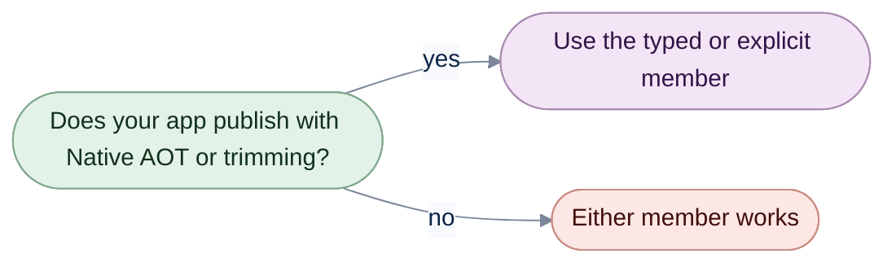

# Members that need reflection

[Run the complete page example](https://github.com/reactiveui/ReactiveUI/blob/main/src/examples/Documentation/Pages/reflection/reflection.csproj).

Most of ReactiveUI never inspects a type at run time. A handful of members still do. Each one scans an assembly,
reads a `[DataMember]` attribute, or casts an `object` to the type a view model asked for. Each of those jobs
needs to look at a type the compiler cannot know about in advance. This page covers every one of those members,
what they cost you, and the alternative that avoids the cost.

**Trimming** removes code your app never calls before publishing it, so the app ships smaller. The trimmer decides
what to remove by following every reference it can see in your code: a method call, a `new SomeType()`, a property
access. Reflection defeats that. A call such as `Activator.CreateInstance(someType)`, where `someType` is a
runtime value, leaves the trimmer no reference to follow, so the trimmer can remove the very code that call needed.

**Native AOT** compiles your app straight to native machine code before you ship it, instead of shipping
intermediate code the .NET runtime compiles as the app runs. It starts faster and needs no .NET runtime on the
target machine. It also cannot compile a method or build a type it does not know about ahead of time, so it
cannot support arbitrary reflection either. See [Native AOT deployment](https://learn.microsoft.com/dotnet/core/deploying/native-aot/)
on Microsoft Learn.

A member that reflects over a runtime type carries `[RequiresUnreferencedCode]`, `[RequiresDynamicCode]`, or both.
`[RequiresUnreferencedCode]` marks a member that can break under trimming, because it reaches for a member the
trimmer might have removed. `[RequiresDynamicCode]` marks a member that can break under Native AOT, because it
needs to generate code at run time, such as a generic type built from a runtime `Type`. Ahead-of-time compilation
gets no chance to produce that code. Call a member carrying either attribute from a project that publishes
trimmed or as Native AOT, and the compiler reports it: `IL2026` for `[RequiresUnreferencedCode]`, `IL3050` for
`[RequiresDynamicCode]`. Both are warnings, not errors, so the project still builds. The failure, if any, only
shows up once the trimmed or native binary runs and finds the member it needed is gone.

Every member on this page is `[RequiresUnreferencedCode]` or `[RequiresDynamicCode]`. Every other example project
on this site publishes as Native AOT and would fail to build against these calls. This page's own example project
turns off `PublishAot` and the trim and AOT analyzers instead, the documented way to host reflection-based code on
purpose.

```csharp
Console.WriteLine("This project runs with the JIT, not Native AOT: every member below uses reflection.");

// Output:
// This project runs with the JIT, not Native AOT: every member below uses reflection.
```



If your app never publishes trimmed or as Native AOT, every member below works exactly as documented and this page
is only background. If it does, or might later, reach for the alternative named in each section instead.

## AutoPersist and AutoPersistCollection without metadata

`AutoPersistHelperMixins.AutoPersist` and `AutoPersistCollection` save an object a moment after its last change.
The overloads below take no `AutoPersistMetadata`, so they reflect over the object's runtime type on every save to
find its `[DataContract]` and `[DataMember]` attributes.

```csharp
PlaylistTrack track = new("Africa");

int saveCount = 0;
IDisposable subscription = track.AutoPersist(_ =>
{
    saveCount++;
    return Signal.Emit(RxVoid.Default);
});

track.IsFavorite = true;

// Disposed straight away: the default three-second quiet period never elapses, so no save runs.
subscription.Dispose();

Console.WriteLine(saveCount);

// Output:
// 0
```

An explicit interval lets a save happen once the object has been quiet for that long, and a manual save signal
forces a save even without a change:

```csharp
PlaylistTrack track = new("Clocks");
Signal<RxVoid> manualSave = new();

int saveCount = 0;
using IDisposable subscription = track.AutoPersist(
    _ =>
    {
        saveCount++;
        return Signal.Emit(RxVoid.Default);
    },
    manualSave,
    TimeSpan.FromMilliseconds(30));

manualSave.OnNext(RxVoid.Default);
await Task.Delay(TimeSpan.FromMilliseconds(60));

Console.WriteLine(saveCount);

// Output:
// 1
```

`AutoPersistCollection` applies the same behavior to every item already in a collection, and to every item added
later:

```csharp
ObservableCollection<PlaylistTrack> timed = [];
List<string> saved = [];
using IDisposable timedSubscription = timed.AutoPersistCollection(
    track =>
    {
        saved.Add(track.Title);
        return Signal.Emit(RxVoid.Default);
    },
    TimeSpan.FromMilliseconds(30));

PlaylistTrack clocks = new("Clocks");
timed.Add(clocks);

// Only a change after the track joins the collection requests a save.
clocks.IsFavorite = true;
await Task.Delay(TimeSpan.FromMilliseconds(100));

Console.WriteLine(string.Join(", ", saved));

// Output:
// Clocks
```

`AutoPersistCollection` works the same way on a `ReadOnlyObservableCollection<T>`: it watches the read-only view,
but new items still have to arrive through the writable source collection behind it.

| Overload | Manual save signal |
| --- | --- |
| `AutoPersist(this T, Func<T, IObservable<RxVoid>> doPersist, TimeSpan? interval = null)` | no |
| `AutoPersist(this T, Func<T, IObservable<RxVoid>> doPersist, IObservable<TDontCare> manualSaveSignal, TimeSpan? interval = null)` | yes |
| `AutoPersistCollection(this TCollection, Func<TItem, IObservable<RxVoid>> doPersist, TimeSpan? interval = null)` | no |
| `AutoPersistCollection(this TCollection, Func<TItem, IObservable<RxVoid>> doPersist, IObservable<TDontCare> manualSaveSignal, TimeSpan? interval = null)` | yes |

[Data Persistence](data-persistence.md#save-a-note-a-moment-after-its-last-change) shows the AOT-safe alternative:
build an `AutoPersistHelperMixins.AutoPersistMetadata` once, either by hand or with
`AutoPersistHelperMixins.CreateMetadata<T>`, and pass it to the matching overload. That overload never reflects,
because the metadata already names the properties to watch.

## The untyped suspension driver and host

`ISuspensionDriver.SaveState` and `LoadState` serialize whatever object you give them by reflecting over its
runtime type. `DummySuspensionDriver`, an `ISuspensionDriver` that saves and loads nothing, implements both the
same way:

```csharp
DummySuspensionDriver driver = new();

_ = await driver.SaveState(new PlayerState("Africa", 210));
object? loaded = await driver.LoadState();

Console.WriteLine(loaded is null);

// Output:
// True
```

`SuspensionHostExtensions.GetAppState` casts `ISuspensionHost.AppState` to the type you ask for, and
`ObserveAppState` watches it the same way, through a reflection-based `WhenAny`:

```csharp
ISuspensionHost host = RxSuspension.SuspensionHost;
host.AppState = new PlayerState("Bohemian Rhapsody", 0);

List<PlayerState> observed = [];
using IDisposable subscription = host.ObserveAppState<PlayerState>().Subscribe(observed.Add);

PlayerState current = host.GetAppState<PlayerState>();
host.AppState = new PlayerState("Africa", 45);

Console.WriteLine(current.Track);
Console.WriteLine(string.Join(", ", observed.Select(static state => state.Track)));

// Output:
// Bohemian Rhapsody
// Bohemian Rhapsody, Africa
```

`SuspensionHostExtensions.SetupDefaultSuspendResume` wires a host to a driver, either resolved from the service
locator or passed explicitly; both overloads load once and save through the same untyped driver calls:

```csharp
DummySuspensionDriver driver = new();
AppLocator.CurrentMutable.RegisterConstant<ISuspensionDriver>(driver);

// No driver given: resolves the one just registered and loads the app state immediately, because
// IsLaunchingNew already has a value.
using IDisposable resolvedSubscription = host.SetupDefaultSuspendResume();
PlayerState createdState = host.GetAppState<PlayerState>();
Console.WriteLine(createdState.Track);

// The same driver, passed explicitly instead of resolved.
using IDisposable explicitSubscription = host.SetupDefaultSuspendResume(driver);
Console.WriteLine(explicitSubscription is not null);

// Output:
// Nothing queued
// True
```

| Member | Typed, reflection-free version |
| --- | --- |
| `ISuspensionDriver.SaveState(object)` / `DummySuspensionDriver.SaveState(object)` | `SaveState<T>(T, JsonTypeInfo<T>)` |
| `ISuspensionDriver.LoadState()` / `DummySuspensionDriver.LoadState()` | `LoadState<T>(JsonTypeInfo<T>)` |
| `SuspensionHostExtensions.GetAppState<T>(ISuspensionHost)` | `GetAppState()` on `ISuspensionHost<TAppState>` |
| `SuspensionHostExtensions.ObserveAppState<T>(ISuspensionHost)` | `ObserveAppState()` on `ISuspensionHost<TAppState>` |
| `SuspensionHostExtensions.SetupDefaultSuspendResume(ISuspensionHost)` / `(ISuspensionHost, ISuspensionDriver)` | `SetupDefaultSuspendResume(JsonTypeInfo<TAppState>)` / `(JsonTypeInfo<TAppState>, ISuspensionDriver)` on `ISuspensionHost<TAppState>` |

[Data Persistence](data-persistence.md#a-strongly-typed-host) covers `SuspensionHost<TAppState>` and the typed
overloads above it: they take a source-generated `JsonTypeInfo<T>` in place of a runtime type, so none of them
reflects.

## Scanning an assembly for views

`DependencyResolverMixins.RegisterViewsForViewModels` walks every type in an assembly, finds the ones that
implement `IViewFor<T>`, and registers each against the view model type it names:

```csharp
using ModernDependencyResolver resolver = new();
resolver.InitializeSplat();

resolver.RegisterViewsForViewModels(typeof(MusicPlayerScreen).Assembly);

IViewFor<MusicPlayerViewModel>? view = resolver.GetService<IViewFor<MusicPlayerViewModel>>();
Console.WriteLine(view?.GetType().Name);

// Output:
// MusicPlayerScreen
```

`IReactiveUIBuilder.WithViewsFromAssembly` runs the same scan while the app starts, as part of the builder chain,
instead of calling `RegisterViewsForViewModels` directly:

```csharp
using ModernDependencyResolver resolver = new();
resolver.InitializeSplat();

ReactiveUIBuilder builder = resolver.CreateReactiveUIBuilder();
_ = builder.WithCoreServices().BuildApp();
_ = builder.WithViewsFromAssembly(typeof(MusicPlayerScreen).Assembly);

IViewFor<MusicPlayerViewModel>? view = resolver.GetService<IViewFor<MusicPlayerViewModel>>();
Console.WriteLine(view?.GetType().Name);

// Output:
// MusicPlayerScreen
```

| Member | Description |
| --- | --- |
| `DependencyResolverMixins.RegisterViewsForViewModels(Assembly)` | Scans an assembly by reflection and registers every `IViewFor` implementation it finds. |
| `IReactiveUIBuilder.WithViewsFromAssembly(Assembly)` / `ReactiveUIBuilder.WithViewsFromAssembly(Assembly)` / `BuilderMixins.WithViewsFromAssembly(IReactiveUIBuilder, Assembly)` | Runs the same scan as part of the builder chain, while the app starts. |

Neither scan has a drop-in replacement, because scanning an assembly is itself the reflection. The AOT-safe
alternative is to stop scanning: [Registration](registration.md#write-a-feature-module) covers `IRegistrar` and
registering a view with `RegisterViewForViewModel<TView, TViewModel>`, one call per view, and
[RxAppBuilder](rxappbuilder.md) covers wiring those calls into the builder chain instead of
`WithViewsFromAssembly`.

## Validating a property by its DataAnnotations attributes

`ReactivePropertyMixins.AddValidation` reads the `[Required]`, `[StringLength]` and similar
`System.ComponentModel.DataAnnotations` attributes off the property an expression names, and turns them into
validators. Reading those attributes needs reflection over the property the expression resolves to:

```csharp
PlaylistTrackFormViewModel form = new();

form.Title.Value = "Africa";
Console.WriteLine(form.Title.HasErrors);

string? latestError = null;
using IDisposable subscription = form.Title.ObserveValidationErrors().Subscribe(error => latestError = error);

form.Title.Value = string.Empty;
Console.WriteLine(form.Title.HasErrors);
Console.WriteLine(latestError);

form.Title.Value = "Clocks";
Console.WriteLine(form.Title.HasErrors);

// Output:
// False
// True
// A track needs a title.
// False
```

[Reactive Property](view-models/reactive-property.md#validate-every-value) covers `AddValidationError`, which
attaches a validator you write as a plain delegate. It checks the same kind of rule — here, that a value is not
empty — without reading any attribute at run time.

| Member | Description |
| --- | --- |
| `ReactivePropertyMixins.AddValidation(ReactiveProperty<T>, Expression<Func<TProperty>>)` | Reads DataAnnotations attributes off the named property by reflection and attaches a validator for each one. |

## Reflection-based WhenActivated

The view-side `WhenActivated` overloads below discover a view's ViewModel with an expression-based `WhenAnyValue`,
which needs reflection to evaluate. The no-block overload activates only the ViewModel it discovers on the view
itself:

```csharp
using MusicPlayerViewModel viewModel = new("Africa");
using MusicPlayerScreen screen = new() { ViewModel = viewModel };

using IDisposable subscription = screen.WhenActivated();

screen.Show();
Console.WriteLine(viewModel.IsPlaying);
screen.Hide();
Console.WriteLine(viewModel.IsPlaying);

// Output:
// True
// False
```

Three block styles cover the rest: a function that returns the disposables to keep, a callback that registers one
disposable at a time, and a container the block adds disposables to.

```csharp
using MusicPlayerViewModel viewModel = new("Bohemian Rhapsody");
using MusicPlayerScreen screen = new() { ViewModel = viewModel, NowPlayingText = viewModel.Title };

using IDisposable subscription = screen.WhenActivated(
    static () => [new ActionDisposable(static () => Console.WriteLine("Stopped"))]);

screen.Show();
Console.WriteLine(screen.NowPlayingText);
Console.WriteLine(viewModel.IsPlaying);
screen.Hide();

// Output:
// Bohemian Rhapsody
// True
// Stopped
```

```csharp
using MusicPlayerViewModel viewModel = new("Africa");
using MusicPlayerScreen screen = new() { ViewModel = viewModel };

using IDisposable subscription = screen.WhenActivated(
    static register => register(new ActionDisposable(static () => Console.WriteLine("Stopped"))));

screen.Show();
Console.WriteLine(viewModel.IsPlaying);
screen.Hide();

// Output:
// True
// Stopped
```

Every block style also takes an explicit `IViewFor`. That overload suits a code-behind that raises activation but
is not itself a view, such as a templated container activating a data-bound content control it does not own:

```csharp
using MusicPlayerViewModel functionViewModel = new("Yellow");
using MusicPlayerScreen functionView = new() { ViewModel = functionViewModel };
using MusicPlayerCodeBehind functionCodeBehind = new();
using IDisposable functionSubscription = functionCodeBehind.WhenActivated(
    static () => [new ActionDisposable(static () => Console.WriteLine("Function block stopped"))],
    functionView);
```

| Overload | Block style |
| --- | --- |
| `WhenActivated()` | No block; discovers the ViewModel by reflection. |
| `WhenActivated(Func<IEnumerable<IDisposable>> block)` / `(Func<IEnumerable<IDisposable>> block, IViewFor? view)` | Return a list of disposables, for the view itself or an explicit view. |
| `WhenActivated(Action<Action<IDisposable>> block)` / `(Action<Action<IDisposable>> block, IViewFor view)` | Register each disposable through a callback, for the view itself or an explicit view. |
| `WhenActivated(Action<ActivationDisposables> block)` / `(Action<ActivationDisposables> block, IViewFor? view)` | Add each disposable to a container, for the view itself or an explicit view. |

[WhenActivated](when-activated.md#give-a-view-an-activation-block) shows the AOT-safe alternative: pass the
overloads on that page an `IObservable<object?>` for the ViewModel change directly, such as
`this.WhenAnyValue(x => x.ViewModel)` on a view that implements `IViewFor<TViewModel>`. None of them reflects.

## View hosts that also ask the service locator

The default view hosts on every platform find a view without reflection. They check the view lookup the
ReactiveUI.Binding source generator writes, then the views you add to the view locator with `Map`. So they carry
no trim or AOT attributes. [View location](view-location/index.md#which-lookup-the-view-hosts-use) explains both
steps.

Each default host has an Unsafe twin with one more step: it asks Splat's service locator for `IViewFor<T>` closed
over the view model's run-time type. Building that type needs code the compiler never generated, so each twin
carries `[RequiresDynamicCode]`. On Android, the twins instead add a constructor that wires child controls to
properties by reflection, so they carry both attributes.

| AOT-safe type | Unsafe twin | Platforms |
| --- | --- | --- |
| `ViewModelViewHost` | `ViewModelViewHostUnsafe` | [WinUI](platforms/winui.md#which-views-the-hosts-find), [WPF](platforms/wpf.md#show-a-view-only-the-service-locator-knows), [.NET MAUI](platforms/maui.md#show-a-view-only-the-service-locator-knows), [iOS and macOS](data-binding/ios.md#which-views-the-hosts-find) |
| `RoutedViewHost` | `RoutedViewHostUnsafe` | WinUI, WPF, .NET MAUI, iOS, Mac Catalyst and tvOS |
| `AutoDataTemplateBindingHook` | `AutoDataTemplateBindingHookUnsafe` | WinUI, WPF |
| `ViewModelControlHost` | `ViewModelControlHostUnsafe` | [Windows Forms](platforms/winforms.md#show-a-view-only-the-service-locator-knows) |
| `RoutedControlHost` | `RoutedControlHostUnsafe` | Windows Forms |
| `LayoutViewHost` | `LayoutViewHostUnsafe` | [Android](platforms/android.md#host-a-view-without-an-activity-or-fragment) |
| `ReactiveViewHost<TViewModel>` | `ReactiveViewHostUnsafe<TViewModel>` | Android |

The alternative to a service-locator twin is one call while the app starts:
`locator.CreateMappingBuilder().MapFromServiceLocator<TViewModel, IViewFor<TViewModel>>()`. It adds a `Map` entry
whose view comes from the service locator, so the default hosts find the view and stay safe to trim. The
alternative to an Android twin is the reflection-free `bind` callback constructor.

## Members at a glance

| Member | What it does |
| --- | --- |
| `AutoPersist(this T, Func<T, IObservable<RxVoid>>, TimeSpan?)` / with a manual save signal | Saves an object by reflecting over its `[DataContract]`/`[DataMember]` attributes on every save. |
| `AutoPersistCollection(this TCollection, Func<TItem, IObservable<RxVoid>>, TimeSpan?)` / with a manual save signal | Applies the reflection-based `AutoPersist` to every item in a collection. |
| `ISuspensionDriver.SaveState(object)` / `LoadState()` and `DummySuspensionDriver`'s implementations | Save and load state by reflecting over its runtime type. |
| `SuspensionHostExtensions.GetAppState<T>` / `ObserveAppState<T>` | Cast or watch `ISuspensionHost.AppState` as the requested type. |
| `SuspensionHostExtensions.SetupDefaultSuspendResume(ISuspensionHost)` / `(ISuspensionHost, ISuspensionDriver)` | Wire a host's lifecycle signals to a driver, resolved or explicit. |
| `DependencyResolverMixins.RegisterViewsForViewModels(Assembly)` | Scans an assembly and registers every `IViewFor` implementation it finds. |
| `IReactiveUIBuilder.WithViewsFromAssembly(Assembly)` (and its mixin overloads) | Runs the same assembly scan as part of the builder chain. |
| `ReactivePropertyMixins.AddValidation(ReactiveProperty<T>, Expression<Func<TProperty>>)` | Reads DataAnnotations attributes off a property by reflection and attaches a validator for each one. |
| `ViewForMixins.WhenActivated()` and its block and explicit-view overloads | Activates a view, discovering its ViewModel by reflection unless a signal-based overload is used instead. |
| The `...Unsafe` view hosts (`ViewModelViewHostUnsafe`, `RoutedViewHostUnsafe`, `ViewModelControlHostUnsafe`, `RoutedControlHostUnsafe`, `AutoDataTemplateBindingHookUnsafe`) | Also ask the service locator for a view by the view model's run-time type. |
| `LayoutViewHostUnsafe` / `ReactiveViewHostUnsafe<TViewModel>` | Wire an Android host's child controls to its properties by reflection. |
