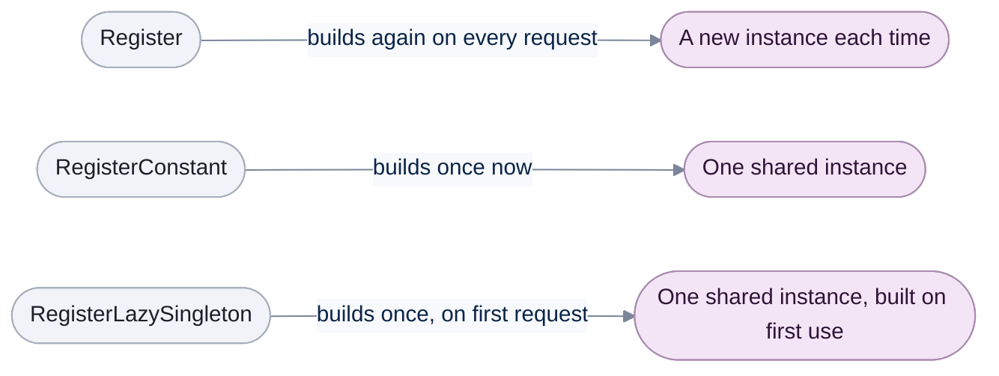

# Registration

[Run the complete page example](https://github.com/reactiveui/ReactiveUI/blob/main/src/examples/Documentation/Pages/registration/registration.csproj).

An app is built from parts that do not know about each other: a library screen, a player, a settings
screen. Each part needs services, such as a track catalog or a playback engine, and it should not have to
know how those services are built. A dependency resolver solves this. It is a container that holds services
by type and hands them back when asked. [RxAppBuilder](rxappbuilder.md) builds one for you and fills it with
the services a running app needs. This page covers the pieces it uses, so you can add your own services the
same way, or work with a resolver directly outside a builder. [Splat's dependency injection guide](../../splat/dependency-injection/index.md)
covers the resolver itself in more depth.

## Write a feature module

**1. Implement `IWantsToRegisterStuff`.** Its `Register` method receives an `IRegistrar`, an interface with
generic methods that add a service without reflection. A module adds only the services its own feature owns.

```csharp
public sealed class TrackLibraryModule : IWantsToRegisterStuff
{
    /// <inheritdoc/>
    public void Register(IRegistrar registrar) =>
        registrar.RegisterLazySingleton<ITrackLibrary>(static () => new TrackLibrary());
}
```

**2. Register the module against a resolver.** `DependencyResolverRegistrar` is the `IRegistrar` that forwards
every call to a Splat `IMutableDependencyResolver`, the resolver Splat and ReactiveUI share.

**3. Ask the resolver for the service.** `GetService<T>` returns the registered instance, or `null` when
nothing is registered for that type.

```csharp
using ModernDependencyResolver resolver = new();
DependencyResolverRegistrar registrar = new(resolver);
TrackLibraryModule libraryModule = new();

libraryModule.Register(registrar);

ITrackLibrary? library = resolver.GetService<ITrackLibrary>();

Console.WriteLine(library?.Titles.Count);

// Output:
// 3
```



```mermaid
%%{init: {"theme": "base", "themeVariables": {"fontFamily": "Roboto, Helvetica, Arial, sans-serif", "fontSize": "15px", "primaryColor": "#DCE9FF", "primaryBorderColor": "#6C8EC4", "primaryTextColor": "#0B2447", "secondaryColor": "#E3F2E8", "secondaryBorderColor": "#7FA88C", "secondaryTextColor": "#12301C", "tertiaryColor": "#F3E5F5", "tertiaryBorderColor": "#A98BB0", "tertiaryTextColor": "#2E1437", "lineColor": "#7B8699", "textColor": "#1B1F27", "noteBkgColor": "#FFF4D6", "noteBorderColor": "#C9A94F", "noteTextColor": "#3A2A00", "actorBkg": "#DCE9FF", "actorBorder": "#6C8EC4", "actorTextColor": "#0B2447", "signalColor": "#7B8699", "signalTextColor": "#1B1F27", "labelBoxBkgColor": "#F1F3F8", "labelBoxBorderColor": "#A7AEBB", "edgeLabelBackground": "#F7F9FC", "clusterBkg": "#F7F9FC", "clusterBorder": "#C9D1DE"}}}%%
flowchart LR
    classDef view fill:#DCE9FF,stroke:#6C8EC4,color:#0B2447
    classDef vm fill:#E3F2E8,stroke:#7FA88C,color:#12301C
    classDef model fill:#F3E5F5,stroke:#A98BB0,color:#2E1437
    classDef warn fill:#FDE7E4,stroke:#C98A82,color:#410E0B
    classDef neutral fill:#F1F3F8,stroke:#A7AEBB,color:#1B1F27
    Module(["Feature module"]):::model -- "Register(registrar)" --> Registrar(["IRegistrar"]):::neutral
    Registrar -- "forwards to" --> Resolver(["Dependency resolver"]):::neutral
    App(["App"]):::vm -- "asks for a service" --> Resolver
    Resolver -- "returns the service" --> App
```

A module never touches the resolver directly. It only ever sees the narrower `IRegistrar`. That keeps a module
built against `IRegistrar` working the same way whether `RxAppBuilder` built the resolver behind it, or you
built one by hand, as this walkthrough does.

## Combine feature modules

Every feature module registers against the same resolver, so an app assembles from independent parts. Each
module in this example owns one feature: the library, the player and settings.

```csharp
using ModernDependencyResolver resolver = new();
DependencyResolverRegistrar registrar = new(resolver);
IWantsToRegisterStuff[] modules = [new TrackLibraryModule(), new PlayerModule(), new SettingsModule()];

foreach (IWantsToRegisterStuff module in modules)
{
    module.Register(registrar);
}

Console.WriteLine(resolver.GetService<ITrackLibrary>()?.Titles.Count);
Console.WriteLine(resolver.GetService<IPlaybackEngine>() is not null);
Console.WriteLine(resolver.GetService<ISettingsStore>()?.Volume);

// Output:
// 3
// True
// 80
```

## Choose a lifetime

`IRegistrar` and `DependencyResolverRegistrar` offer three ways to hand back a service. They differ in when the
factory runs and whether every caller gets the same instance.



**`Register` calls its factory again every time the service is asked for**, so each instance differs.

```csharp
using ModernDependencyResolver resolver = new();
DependencyResolverRegistrar registrar = new(resolver);
registrar.Register<IPlaybackEngine>(static () => new PlaybackEngine());

IPlaybackEngine? first = resolver.GetService<IPlaybackEngine>();
IPlaybackEngine? second = resolver.GetService<IPlaybackEngine>();

Console.WriteLine(first?.InstanceId != second?.InstanceId);

// Output:
// True
```

**`RegisterConstant` builds the service once and hands back that same instance every time.** The factory runs
immediately, when you call `RegisterConstant`, not when a caller first asks for the service.

```csharp
using ModernDependencyResolver resolver = new();
DependencyResolverRegistrar registrar = new(resolver);
registrar.RegisterConstant<ISettingsStore>(static () => new SettingsStore());

ISettingsStore? first = resolver.GetService<ISettingsStore>();
ISettingsStore? second = resolver.GetService<ISettingsStore>();

Console.WriteLine(ReferenceEquals(first, second));

// Output:
// True
```

**`RegisterLazySingleton` shares one instance too, but waits for the first request before building it.** Use it
for a service that is costly to build and might never be asked for.

```csharp
using ModernDependencyResolver resolver = new();
DependencyResolverRegistrar registrar = new(resolver);
int timesBuilt = 0;
registrar.RegisterLazySingleton<ITrackLibrary>(() =>
{
    timesBuilt++;
    return new TrackLibrary();
});

Console.WriteLine(timesBuilt);

_ = resolver.GetService<ITrackLibrary>();
_ = resolver.GetService<ITrackLibrary>();

Console.WriteLine(timesBuilt);

// Output:
// 0
// 1
```

## Pick one of several registrations with a contract

A contract is a string that picks out one of several registrations of the same service type.
`Register`, `RegisterConstant` and `RegisterLazySingleton` all take an optional contract as their last
argument. Pass the same contract to `GetService<T>` to read the matching registration back.

This module passes a contract to all three methods through `IRegistrar`:

```csharp
public sealed class ContractModule : IWantsToRegisterStuff
{
    /// <inheritdoc/>
    public void Register(IRegistrar registrar)
    {
        registrar.Register<IPlaybackEngine>(static () => new PlaybackEngine(), "preview");
        registrar.RegisterConstant<IPlatformOperations>(static () => new MobileOrientationOperations(), "mobile");
        registrar.RegisterConstant<IPlatformOperations>(static () => new DesktopOrientationOperations(), "desktop");
        registrar.RegisterLazySingleton<ITrackLibrary>(static () => new TrackLibrary(), "shared");
    }
}
```

The same overloads exist on `DependencyResolverRegistrar` itself. Here the app registers the module, adds one
more contract through the registrar, then reads each registration back by its contract:

```csharp
using ModernDependencyResolver resolver = new();
DependencyResolverRegistrar registrar = new(resolver);
ContractModule contractModule = new();
contractModule.Register(registrar);
registrar.RegisterLazySingleton<ISettingsStore>(static () => new SettingsStore(), "concrete");

Console.WriteLine(resolver.GetService<IPlaybackEngine>("preview") is not null);
Console.WriteLine(resolver.GetService<IPlatformOperations>("mobile")?.GetOrientation());
Console.WriteLine(resolver.GetService<IPlatformOperations>("desktop") is DesktopOrientationOperations);
Console.WriteLine(resolver.GetService<ITrackLibrary>("shared")?.Titles.Count);
Console.WriteLine(resolver.GetService<ISettingsStore>("concrete")?.Volume);

// Output:
// True
// Portrait
// True
// 3
// 80
```

`GetService<IPlatformOperations>()`, with no contract, returns whichever of the two registrations the
resolver looks up first. The compact "now playing" strip and print settings examples further down use
contracts the same way, to pick a second view of the same view model.

## What the built-in modules add

`Registrations` and `PlatformRegistrations` are the `IWantsToRegisterStuff` modules that `RxAppBuilder`'s
`WithCoreServices` and `WithPlatformServices` run for you when an app starts. They are shown here against a
resolver of their own, so you can see what they add without starting a whole app.

`Registrations` adds the default view locator and activation fetcher that every ReactiveUI app needs.

```csharp
using ModernDependencyResolver resolver = new();
DependencyResolverRegistrar registrar = new(resolver);
Registrations coreRegistrations = new();

coreRegistrations.Register(registrar);

Console.WriteLine(resolver.GetService<IViewLocator>()?.GetType().Name);
Console.WriteLine(resolver.GetService<IActivationForViewFetcher>()?.GetType().Name);

// Output:
// DefaultViewLocator
// CanActivateViewFetcher
```

`PlatformRegistrations` sets the schedulers `RxSchedulers` exposes. A module that runs this itself, outside of
app start-up, restores the previous scheduler afterwards so it does not change behaviour for the rest of the
process. See [Scheduling](scheduling.md) for what `RxSchedulers` and a sequencer are.

```csharp
ISequencer previousMainThreadScheduler = RxSchedulers.MainThreadScheduler;
using ModernDependencyResolver resolver = new();
DependencyResolverRegistrar registrar = new(resolver);
PlatformRegistrations platformRegistrations = new();

platformRegistrations.Register(registrar);

Console.WriteLine(RxSchedulers.MainThreadScheduler.GetType().Name);
Console.WriteLine(RxSchedulers.TaskpoolScheduler.GetType().Name);

RxSchedulers.MainThreadScheduler = previousMainThreadScheduler;

// Output:
// TaskPoolSequencer
// TaskPoolSequencer
```

## Register a view for a view model

`RegisterViewForViewModel` and `RegisterSingletonViewForViewModel` are extension methods on
`IMutableDependencyResolver`, so they register directly against the resolver rather than through an
`IRegistrar`. A view is the on-screen part of a screen; a view model holds its state and behaviour. `IViewFor<T>`
is the interface that connects a view to the view model type `T` it displays.

**`RegisterViewForViewModel` registers a new view every time one is asked for.** A contract picks a second
view of the same view model, such as a compact "now playing" strip next to the full playlist view.

```csharp
using ModernDependencyResolver resolver = new();
resolver.RegisterViewForViewModel<PlaylistView, PlaylistViewModel>();
resolver.RegisterViewForViewModel<CompactPlaylistView, PlaylistViewModel>("compact");

Console.WriteLine(resolver.GetService<IViewFor<PlaylistViewModel>>()?.GetType().Name);
Console.WriteLine(resolver.GetService<IViewFor<PlaylistViewModel>>("compact")?.GetType().Name);

// Output:
// PlaylistView
// CompactPlaylistView
```

**`RegisterSingletonViewForViewModel` builds the view once and hands back that same instance every time**,
following the same lifetime `RegisterLazySingleton` follows for a plain service. A contract works the same
way it does for `RegisterViewForViewModel`.

```csharp
using ModernDependencyResolver resolver = new();
resolver.RegisterSingletonViewForViewModel<SettingsView, SettingsViewModel>();
resolver.RegisterSingletonViewForViewModel<PrintSettingsView, SettingsViewModel>("print");

IViewFor<SettingsViewModel>? first = resolver.GetService<IViewFor<SettingsViewModel>>();
IViewFor<SettingsViewModel>? second = resolver.GetService<IViewFor<SettingsViewModel>>();
IViewFor<SettingsViewModel>? printView = resolver.GetService<IViewFor<SettingsViewModel>>("print");

Console.WriteLine(ReferenceEquals(first, second));
Console.WriteLine(printView?.GetType().Name);

// Output:
// True
// PrintSettingsView
```

Both methods require `TView` to have a public parameterless constructor, and both return the resolver so you
can chain further calls.

## Register every view in an assembly

Registering each view by hand does not scale to a large app. `DependencyResolverMixins.RegisterViewsForViewModels`
scans an assembly with reflection and registers every `IViewFor` implementation it finds. See
[Reflection](reflection.md) for what the scan does and when to prefer it over registering views one at a time.
[RxAppBuilder's `WithViewsFromAssembly`](rxappbuilder.md) calls it for you at app start-up.

## Track a loaded module

A host that loads modules dynamically may want a diagnostics screen that lists what is loaded. `NotAWeakReference`
holds that list entry. Unlike a `WeakReference`, its target is never collected while the reference itself is
held, so the diagnostics screen can read it at any time.

```csharp
PlayerModule playerModule = new();
NotAWeakReference loadedModule = new(playerModule);

Console.WriteLine(ReferenceEquals(loadedModule.Target, playerModule));
Console.WriteLine(loadedModule.IsAlive);

// Output:
// True
// True
```

Every `ReactiveUI` package on this page also ships as `ReactiveUI.Reactive`, built from the same source, for
apps that use System.Reactive.

## Members at a glance

| Member | What it does |
| --- | --- |
| `IWantsToRegisterStuff.Register(IRegistrar)` | The method a feature module implements to add the services it owns. |
| `IRegistrar` | The interface a module's `Register` method receives: `Register`, `RegisterConstant` and `RegisterLazySingleton`, each with an optional contract. |
| `DependencyResolverRegistrar(IMutableDependencyResolver)` | The `IRegistrar` that forwards every call to a Splat resolver. |
| `DependencyResolverRegistrar.Register<TService>(Func<TService>, string?)` | Builds a new instance from the factory on every request. |
| `DependencyResolverRegistrar.RegisterConstant<TService>(Func<TService>, string?)` | Builds the instance once, immediately, and shares it. |
| `DependencyResolverRegistrar.RegisterLazySingleton<TService>(Func<TService>, string?)` | Builds the instance once, on the first request, and shares it. |
| `Registrations` | The module that adds the default view locator and activation fetcher. |
| `PlatformRegistrations` | The module that sets `RxSchedulers`' schedulers for the running platform. |
| `IPlatformOperations.GetOrientation()` | An example service resolved through a contract. |
| `MutableDependencyResolverExtensions.RegisterViewForViewModel<TView, TViewModel>(string?)` | Registers a new view instance for a view model type on every request. |
| `MutableDependencyResolverExtensions.RegisterSingletonViewForViewModel<TView, TViewModel>(string?)` | Registers one shared view instance for a view model type. |
| `DependencyResolverMixins.RegisterViewsForViewModels(Assembly)` | Scans an assembly by reflection and registers every `IViewFor` implementation it finds. See [Reflection](reflection.md). |
| `NotAWeakReference(object)` | Holds a strong reference that always reports its target as alive, for tracking a loaded module. |
| `PreserveAttribute` | Marks a code element to keep during trimming, so reflection-based registration keeps working in a trimmed app. |
