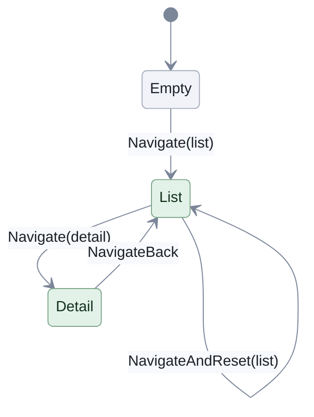
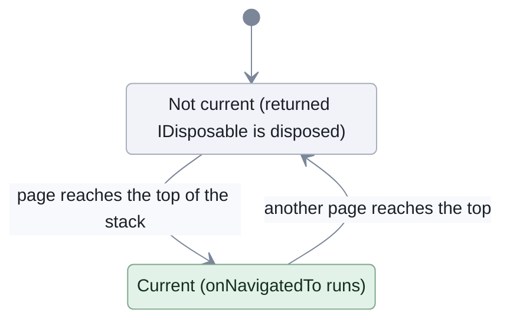

# Routing

[Run the complete page example](https://github.com/reactiveui/ReactiveUI/blob/main/src/examples/Documentation/Pages/routing/routing.csproj).

An app with several pages needs something to track which page is current. It has to push a new page on top, pop back to the one before it, and keep the screen in sync with that stack. Writing that by hand means a lot of bookkeeping: where the stack lives, what happens when a page starts and stops being current, which thread delivers each change.

Routing solves this. An `IScreen` is a view model that owns the stack: it exposes a `RoutingState`, which holds the stack of pages and the commands that change it. Each page on the stack is an `IRoutableViewModel`. It carries an `IScreen HostScreen` back to the screen that owns it, so a page can navigate without a reference to anything else. It also carries a `UrlPathSegment`, a short string such as `"todos"` that names the page, useful for logging or building a path. A view that shows the current page, such as a platform's `RoutedViewHost` control, watches the `RoutingState`. It asks a view locator for the view that matches whichever page is on top.

The main `ReactiveUI` package carries every routing type. It also ships as `ReactiveUI.Reactive`, built from the same source, for apps that use System.Reactive.

`RoutingState` reports navigation through three streams. A stream is an `IObservable<T>`. You subscribe to it with a lambda, and the stream calls that lambda with each new value:

- `CurrentViewModel` hands you the page on top of the stack.
- `NavigationStackChanged` hands you the whole stack after each change.
- `CanNavigateBack` hands you whether there is a page to go back to.

## Navigate and go back

**1. Define a page.** A page implements `IRoutableViewModel`. `TodoListPage` lists to-do items and its `Open` command navigates to a page for one of them, through the `HostScreen`'s router.

```csharp
public sealed class TodoListPage : ReactiveObject, IRoutableViewModel
{
    public TodoListPage(IScreen hostScreen, IReadOnlyList<TodoItem> items)
    {
        HostScreen = hostScreen;
        Items = items;
        Open = ReactiveCommand.CreateFromObservable<TodoItem, IRoutableViewModel>(
            item => HostScreen.Router.Navigate.Execute(new TodoDetailPage(HostScreen, item)));
    }

    public string UrlPathSegment => "todos";

    public IScreen HostScreen { get; }

    public IReadOnlyList<TodoItem> Items { get; }

    public ReactiveCommand<TodoItem, IRoutableViewModel> Open { get; }
}
```

**2. Give the app a screen.** `AppShell` implements `IScreen`. Its `Router` is the `RoutingState` every page navigates through.

```csharp
public sealed class AppShell : ReactiveObject, IScreen
{
    public AppShell()
        : this(new RoutingState())
    {
    }

    public AppShell(RoutingState router) => Router = router;

    public RoutingState Router { get; }
}
```

**3. Navigate, then navigate back.** Navigating pushes a page and going back pops it; the stack reads like the path in a browser. `list.Open.Execute(...)` calls `Navigate.Execute` internally, as shown above; `NavigateBack.Execute` needs no argument because it always removes the top of the stack.

```csharp
AppShell shell = new();
TodoListPage list = await OpenListAsync(shell);

_ = await list.Open.Execute(list.Items[0]);
Console.WriteLine(Path(shell));

_ = await shell.Router.NavigateBack.Execute();
Console.WriteLine(Path(shell));

// Output:
// todos > todos/1
// todos
```

```text
todos > todos/1
todos
```

`Path` joins `NavigationStack`'s `UrlPathSegment` values with `" > "`, oldest first, so you can see the whole stack at a glance. `OpenListAsync` is a helper in the example that seeds a list of to-do items and calls `shell.Router.Navigate.Execute(list)` to put the list page on the stack.

## Enable the back button

Going back is possible only when there is a page to go back to, so `NavigateBack` follows `CanExecute`, like any `ReactiveCommand`. Bind a back button's `IsEnabled` to it and the button disables itself on the first page of the stack.

```csharp
AppShell shell = new();
using IDisposable subscription = shell.Router.NavigateBack.CanExecute.Subscribe(Console.WriteLine);

TodoListPage list = await OpenListAsync(shell);
_ = await list.Open.Execute(list.Items[0]);

// Output:
// False
// True
```

```text
False
True
```

`CanNavigateBack` is the stream `NavigateBack` uses for its `CanExecute`. Subscribe to it directly when something other than a command needs the answer, such as a gesture handler. It delivers the current answer when you subscribe, then again only when the answer changes.

```csharp
AppShell shell = new();
using IDisposable subscription = shell.Router.CanNavigateBack.Subscribe(Console.WriteLine);

TodoListPage list = await OpenListAsync(shell);
_ = await list.Open.Execute(list.Items[0]);
_ = await shell.Router.NavigateBack.Execute();
_ = await list.Open.Execute(list.Items[1]);

// Output:
// False
// True
// False
// True
```

```text
False
True
False
True
```

Opening the list page makes the stack one page deep, so the answer stays `False` and nothing is delivered for it.

## Show the view for the current page

A routed host, such as a platform's `RoutedViewHost` control, follows `CurrentViewModel` and asks a view locator to resolve the view for each page. `CurrentViewModel` is an `IObservable<IRoutableViewModel?>`: it delivers `null` while the stack is empty. Before the first navigation there is no page, so the host skips the view locator and falls back to its own default content. The example stands in for that fallback with a literal string.

```csharp
AppShell shell = new();
IViewLocator locator = ViewLocator.GetCurrent();
using IDisposable host = shell.Router.CurrentViewModel
    .Select(page => page is null ? null : locator.ResolveView<object>(page, null))
    .Subscribe(static view => Console.WriteLine(view?.GetType().Name ?? "(default content)"));

TodoListPage list = await OpenListAsync(shell);
_ = await list.Open.Execute(list.Items[0]);
_ = await shell.Router.NavigateBack.Execute();

// Output:
// (default content)
// TodoListPageView
// TodoDetailPageView
// TodoListPageView
```

```text
(default content)
TodoListPageView
TodoDetailPageView
TodoListPageView
```

`CurrentViewModel` delivers the page on top of the stack when you subscribe, then again after each change to the stack, including when a `NavigateBack` uncovers the page beneath it. See [View Location](view-location/index.md) for how a view locator finds a view for a page's type.

## Reset the stack

`NavigateAndReset` replaces the whole stack in one step, the way signing out returns a user to a fresh start page instead of leaving their old pages underneath it.

```csharp
AppShell shell = new();
TodoListPage list = await OpenListAsync(shell);
_ = await list.Open.Execute(list.Items[0]);
_ = await list.Open.Execute(list.Items[1]);
Console.WriteLine(Path(shell));

_ = await shell.Router.NavigateAndReset.Execute(new TodoListPage(shell, list.Items));
Console.WriteLine(Path(shell));

// Output:
// todos > todos/1 > todos/2
// todos
```

```text
todos > todos/1 > todos/2
todos
```



`Navigate` and `NavigateAndReset` push; `NavigateBack` pops. `NavigateAndReset` is the only one of the three that can leave the stack the same size it started, by replacing every entry at once.

## Start and stop work on a page

`WhenNavigatedTo` lets a page start work of its own the moment it becomes the current page, and clean it up the moment the user leaves. Pass it a lambda that starts the work and returns the `IDisposable` that stops it. `CookingTimerPage` uses it to start a cooking timer while its page is on top of the stack.

```csharp
public sealed class CookingTimerPage : ReactiveObject, IRoutableViewModel, IDisposable
{
    private readonly IDisposable _navigationSubscription;

    public CookingTimerPage(IScreen hostScreen, Recipe recipe)
    {
        HostScreen = hostScreen;
        Recipe = recipe;
        _navigationSubscription = this.WhenNavigatedTo(StartTimer);
    }

    public string UrlPathSegment => $"recipes/{Recipe.Id}/timer";

    public IScreen HostScreen { get; }

    public Recipe Recipe { get; }

    public ReactiveCommand<RxVoid, RxVoid> Tick { get; } = ReactiveCommand.Create(static () => { });

    public int SecondsElapsed { get; private set; }

    public void Dispose() => _navigationSubscription.Dispose();

    private IDisposable StartTimer()
    {
        Console.WriteLine($"Timer started for {Recipe.Name}");
        IDisposable subscription = Tick.Subscribe(_ =>
        {
            SecondsElapsed++;
            Console.WriteLine($"{Recipe.Name}: {SecondsElapsed}s");
        });

        return new ActionDisposable(() =>
        {
            subscription.Dispose();
            Console.WriteLine($"Timer stopped for {Recipe.Name}");
        });
    }
}
```

```csharp
RecipeShell shell = new();
RecipeListPage list = new(shell, RecipeBook.Seeded());
_ = await shell.Router.Navigate.Execute(list);

RecipeDetailPage detail = (RecipeDetailPage)await list.Open.Execute(list.Recipes[0]);
using CookingTimerPage timer = (CookingTimerPage)await detail.StartCooking.Execute();

_ = await timer.Tick.Execute();
_ = await timer.Tick.Execute();

_ = await shell.Router.NavigateBack.Execute();

// Output:
// Timer started for Pancakes
// Pancakes: 1s
// Pancakes: 2s
// Timer stopped for Pancakes
```

```text
Timer started for Pancakes
Pancakes: 1s
Pancakes: 2s
Timer stopped for Pancakes
```

`WhenNavigatedTo` returns an `IDisposable` of its own. Disposing it, as `CookingTimerPage.Dispose` does, tears down the most recently started work and stops watching the stack.



The work runs only while the page sits on top of the stack. It starts once, the first time the page arrives, and stops the moment another page covers it or the page leaves the stack for good.

## Observe arrival and departure

`WhenNavigatedToObservable` fires each time a page becomes the current one, and completes once the page leaves the stack for good. `WhenNavigatingFromObservable` fires just before a page stops being the current one. Use these instead of `WhenNavigatedTo` when you want a stream rather than a single scope, for example to combine arrivals with another stream.

```csharp
RecipeShell shell = new();
IReadOnlyList<Recipe> recipes = RecipeBook.Seeded();
RecipeDetailPage detail = new(shell, recipes[0]);

using IDisposable arrivals = detail.WhenNavigatedToObservable().Subscribe(
    static _ => Console.WriteLine("Detail arrived"),
    static () => Console.WriteLine("Detail completed"));
using IDisposable departures = detail.WhenNavigatingFromObservable().Subscribe(
    static _ => Console.WriteLine("Detail left"));

_ = await shell.Router.Navigate.Execute(detail);
_ = await shell.Router.Navigate.Execute(new RecipeDetailPage(shell, recipes[1]));
_ = await shell.Router.NavigateBack.Execute();
_ = await shell.Router.NavigateBack.Execute();

// Output:
// Detail arrived
// Detail left
// Detail arrived
// Detail completed
```

```text
Detail arrived
Detail left
Detail arrived
Detail completed
```

Both streams complete when their page is removed from the stack, so subscribe again if you put a removed page back on the stack later.

The same page object can sit on the stack more than once, for example when an "All recipes" link on a detail page opens the list page again. The stream then completes only when the last copy leaves the stack. Going back past one copy while another is still underneath does not complete it.

```csharp
RecipeShell shell = new();
RecipeListPage list = new(shell, RecipeBook.Seeded());

using IDisposable arrivals = list.WhenNavigatedToObservable().Subscribe(
    static _ => Console.WriteLine("List arrived"),
    static () => Console.WriteLine("List completed"));

_ = await shell.Router.Navigate.Execute(list);
_ = await list.Open.Execute(list.Recipes[0]);

// An "All recipes" link on the detail page opens the same list page again.
_ = await shell.Router.Navigate.Execute(list);
_ = await shell.Router.NavigateBack.Execute();
Console.WriteLine("Back on the detail page");

_ = await shell.Router.NavigateAndReset.Execute(new RecipeDetailPage(shell, list.Recipes[1]));

// Output:
// List arrived
// List arrived
// Back on the detail page
// List completed
```

```text
List arrived
List arrived
Back on the detail page
List completed
```

`NavigateAndReset` clears the stack before it pushes the new page, which removes the last copy of the list page and completes the stream.

## Choose which thread navigation results land on

`RoutingState`'s parameterless constructor delivers navigation results on `RxSchedulers.MainThreadScheduler`, the [sequencer](scheduling.md) that decides which thread runs UI work. An app sets up that sequencer when it registers its platform, for example through `RxAppBuilder`'s [`WithMainThreadScheduler`](rxappbuilder.md#configure-schedulers-explicitly) call. `RoutingState(ISequencer?)` takes any sequencer in place of the default.

Awaiting `Execute()` returns the page you navigated to, whichever sequencer the router uses. Below, the router delivers on a background sequencer, and each `await` still gets its page back.

```csharp
AppShell shell = new(new RoutingState(TaskPoolSequencer.Default));

IRoutableViewModel first = await shell.Router.Navigate.Execute(new TodoListPage(shell, []));
IRoutableViewModel second = await shell.Router.Navigate.Execute(new TodoListPage(shell, []));

Console.WriteLine(first.UrlPathSegment);
Console.WriteLine(second.UrlPathSegment);
Console.WriteLine(shell.Router.NavigationStack.Count);

// Output:
// todos
// todos
// 2
```

A console program or a test has no platform to register, so it has no UI thread to post to. There, `Sequencer.Immediate` is a useful choice for a fixed order: it delivers a navigation result to a plain subscriber before `Execute()` returns, with no `await`. The examples on this page start their app with `Sequencer.Immediate` as the main-thread sequencer for that reason.

```csharp
AppShell shell = new(new RoutingState(Sequencer.Immediate));
TodoListPage list = new(shell, []);

IRoutableViewModel? result = null;
using IDisposable subscription = shell.Router.Navigate.Execute(list).Subscribe(page => result = page);

Console.WriteLine(result?.UrlPathSegment);

// Output:
// todos
```

```text
todos
```

## Watch the stack

`NavigationStackChanged` hands you the whole stack after every change, oldest page first and the current page last. Use it when a view shows more than the current page, such as a breadcrumb trail.

```csharp
AppShell shell = new();
using IDisposable subscription = shell.Router.NavigationStackChanged
    .Subscribe(static stack => Console.WriteLine(string.Join(" > ", stack.Select(static page => page.UrlPathSegment))));

TodoListPage list = await OpenListAsync(shell);
_ = await list.Open.Execute(list.Items[0]);
_ = await shell.Router.NavigateBack.Execute();

// Output:
// todos
// todos > todos/1
// todos
```

```text
todos
todos > todos/1
todos
```

Each value is an `IReadOnlyList<IRoutableViewModel>` copy of the stack. Later navigation does not change a copy you already hold. The stream delivers nothing when you subscribe, only after a change. Read `NavigationStack` for the stack as it is at that moment.

### Tell a push from a pop

A view that animates a page sliding in or out needs to know which way the stack moved. Compare the size of each copy with the one before it: a bigger stack is a push, and a smaller one is a pop. `NavigateAndReset` shows up as an empty stack followed by a push.

```csharp
AppShell shell = new();
int previousCount = shell.Router.NavigationStack.Count;
using IDisposable subscription = shell.Router.NavigationStackChanged.Subscribe(stack =>
{
    string change = stack.Count switch
    {
        0 => "Cleared",
        int count when count > previousCount => $"Slide in {stack[^1].UrlPathSegment}",
        _ => $"Slide back to {stack[^1].UrlPathSegment}",
    };

    previousCount = stack.Count;
    Console.WriteLine(change);
});

TodoListPage list = await OpenListAsync(shell);
_ = await list.Open.Execute(list.Items[0]);
_ = await shell.Router.NavigateBack.Execute();
_ = await shell.Router.NavigateAndReset.Execute(new TodoListPage(shell, list.Items));

// Output:
// Slide in todos
// Slide in todos/1
// Slide back to todos
// Cleared
// Slide in todos
```

```text
Slide in todos
Slide in todos/1
Slide back to todos
Cleared
Slide in todos
```

The lambda captures `previousCount`, so it cannot be `static`. Read the starting size from `NavigationStack` before you subscribe, because the stream does not deliver it.

### Watch each page added or removed

`NavigationStack` is an `ObservableCollection<IRoutableViewModel>`, so the [collection helpers](collections.md) work on it directly. `ToReactiveChangeSet` hands you a batch of changes for each edit to the stack. Each change says whether a page was added or removed, and at which position.

```csharp
AppShell shell = new();
using IDisposable subscription = shell.Router.NavigationStack.ToReactiveChangeSet().Subscribe(static changeSet =>
{
    foreach (ReactiveChange<IRoutableViewModel> change in changeSet)
    {
        Console.WriteLine($"{change.Reason} at {change.CurrentIndex}: {change.Current.UrlPathSegment}");
    }
});

TodoListPage list = await OpenListAsync(shell);
_ = await list.Open.Execute(list.Items[0]);
_ = await shell.Router.NavigateBack.Execute();

// Output:
// Add at 0: todos
// Add at 1: todos/1
// Remove at 1: todos/1
```

```text
Add at 0: todos
Add at 1: todos/1
Remove at 1: todos/1
```

`ActOnEveryObject` is shorter when you only need one method for a page that enters the stack and another for a page that leaves it. It also calls the enter method for every page already on the stack when you subscribe.

```csharp
AppShell shell = new();
using IDisposable subscription = shell.Router.NavigationStack.ActOnEveryObject(
    static page => Console.WriteLine($"enter {page.UrlPathSegment}"),
    static page => Console.WriteLine($"leave {page.UrlPathSegment}"));

TodoListPage list = await OpenListAsync(shell);
_ = await list.Open.Execute(list.Items[0]);
_ = await shell.Router.NavigateBack.Execute();

// Output:
// enter todos
// enter todos/1
// leave todos/1
// leave todos
```

```text
enter todos
enter todos/1
leave todos/1
leave todos
```

The last line comes from disposing the subscription at the end of the method. Disposing it calls the leave method for every page still on the stack, so each enter has a matching leave.

## Find a page, or read the top of the stack

`FindViewModelInStack<T>` searches the stack from the top down for the first page of a given type. A deep page can use it to reach back to an ancestor without walking the stack itself.

```csharp
AppShell shell = new();
TodoListPage list = await OpenListAsync(shell);
_ = await list.Open.Execute(list.Items[0]);
_ = await list.Open.Execute(list.Items[1]);

TodoListPage? found = shell.Router.FindViewModelInStack<TodoListPage>();
Console.WriteLine(found?.UrlPathSegment);

// Output:
// todos
```

```text
todos
```

`GetCurrentViewModel` reads the page on top of the stack once, without subscribing to `CurrentViewModel`.

```csharp
AppShell shell = new();
TodoListPage list = await OpenListAsync(shell);
_ = await list.Open.Execute(list.Items[0]);

IRoutableViewModel? current = shell.Router.GetCurrentViewModel();
Console.WriteLine(current?.UrlPathSegment);

// Output:
// todos/1
```

```text
todos/1
```

Both return `null` when the stack is empty or holds no match; neither throws.

## Where to go next

- [Migration Guide: Routing](../upgrading/routing-migration.md) maps older routing members, such as `NavigationChanges`, to the streams on this page.
- [View Location](view-location/index.md) covers how a view locator resolves the view for a page.
- [Interactions](interactions/index.md) suit a modal or a pop-up dialog better than routing does.
- [Scheduling](scheduling.md) explains sequencers in more detail.
- Dispose every navigation subscription; see [Dispose your subscriptions](../guidelines/framework/dispose-your-subscriptions.md) for why.

## At a glance

| Member | What it does |
| --- | --- |
| `IScreen.Router` | The `RoutingState` that owns the navigation stack for this screen. |
| `IRoutableViewModel.UrlPathSegment` | A short string naming the page, such as `"todos"`. |
| `IRoutableViewModel.HostScreen` | The screen the page navigates through. |
| `RoutingState()` / `RoutingState(ISequencer?)` | Creates a router. The default delivers navigation results on the main-thread sequencer; passing a sequencer changes that. Awaiting `Execute()` returns the page on any sequencer. |
| `RoutingState.NavigationStack` | The stack of pages, oldest first, with the current page last. |
| `RoutingState.Navigate` | Pushes a page onto the stack. |
| `RoutingState.NavigateBack` | Pops the top of the stack; `CanExecute` follows `CanNavigateBack`. |
| `RoutingState.NavigateAndReset` | Replaces the whole stack with one page. |
| `RoutingState.CurrentViewModel` | The page on top of the stack, when you subscribe and after each change; `null` while the stack is empty. |
| `RoutingState.NavigationStackChanged` | A read-only copy of the whole stack after each change, oldest page first. |
| `RoutingState.CanNavigateBack` | Whether there is a page to go back to, when you subscribe and each time the answer changes. |
| `RoutingStateMixins.FindViewModelInStack<T>` | The first page of type `T`, searching from the top down. |
| `RoutingStateMixins.GetCurrentViewModel` | The page on top of the stack, read once. |
| `RoutableViewModelMixins.WhenNavigatedTo` | Runs a scope while a page is current; disposes it when the page loses focus or leaves the stack. |
| `RoutableViewModelMixins.WhenNavigatedToObservable` | A stream that fires on each arrival and completes when the page leaves the stack for good. |
| `RoutableViewModelMixins.WhenNavigatingFromObservable` | A stream that fires just before a page stops being current. |
| `NavigationStack.ToReactiveChangeSet()` / `NavigationStack.ActOnEveryObject(...)` | The [collection helpers](collections.md), applied to the stack: each page added or removed. |
