# RxAppBuilder

[Run the complete page example](https://github.com/reactiveui/ReactiveUI/blob/main/src/examples/Documentation/Pages/rxappbuilder/rxappbuilder.csproj).

A ReactiveUI app needs its services in place before anything asks for them: a scheduler to run work on the UI
thread, a message bus, the views that go with each view model. `RxAppBuilder` is where an app builds all of
that, once, at start-up. It creates a `ReactiveUIBuilder`, a fluent object you configure with `With...` calls
and finish with `BuildApp`. `ReactiveUIBuilder` registers into a **dependency resolver**, a container that
holds services by type and hands them back when asked. [Registration](registration.md) covers the resolver and
the lifetimes a service can have, in depth. `ReactiveUI.Builder` also ships as `ReactiveUI.Reactive.Builder`,
built from the same source, for apps that use System.Reactive.

## Start the app

**1. Create a builder.** `RxAppBuilder.CreateReactiveUIBuilder()` builds against Splat's own resolver, the one
the rest of your app reads from by default.

**2. Configure it.** `WithRegistration` runs a feature module's registration immediately. Each `With...` call
returns the builder, so a real app chains as many as it needs; the next section shows a full chain.

```csharp
ReactiveUIBuilder builder = RxAppBuilder.CreateReactiveUIBuilder();
_ = builder.WithRegistration(new PantryRegistrations());
```

**3. Build it.** `BuildApp()` applies every registration and makes ReactiveUI ready to use.

```mermaid
%%{init: {"theme": "base", "themeVariables": {"fontFamily": "Roboto, Helvetica, Arial, sans-serif", "fontSize": "15px", "primaryColor": "#DCE9FF", "primaryBorderColor": "#6C8EC4", "primaryTextColor": "#0B2447", "secondaryColor": "#E3F2E8", "secondaryBorderColor": "#7FA88C", "secondaryTextColor": "#12301C", "tertiaryColor": "#F3E5F5", "tertiaryBorderColor": "#A98BB0", "tertiaryTextColor": "#2E1437", "lineColor": "#7B8699", "textColor": "#1B1F27", "noteBkgColor": "#FFF4D6", "noteBorderColor": "#C9A94F", "noteTextColor": "#3A2A00", "actorBkg": "#DCE9FF", "actorBorder": "#6C8EC4", "actorTextColor": "#0B2447", "signalColor": "#7B8699", "signalTextColor": "#1B1F27", "labelBoxBkgColor": "#F1F3F8", "labelBoxBorderColor": "#A7AEBB", "edgeLabelBackground": "#F7F9FC", "clusterBkg": "#F7F9FC", "clusterBorder": "#C9D1DE"}}}%%
flowchart LR
    Create(["CreateReactiveUIBuilder"]):::neutral --> With(["With... calls"]):::neutral
    With --> Build(["BuildApp"]):::neutral
    Build --> App(["App"]):::vm -- "resolves its services" --> Resolver(["Dependency resolver"]):::neutral
    classDef view fill:#DCE9FF,stroke:#6C8EC4,color:#0B2447
    classDef vm fill:#E3F2E8,stroke:#7FA88C,color:#12301C
    classDef model fill:#F3E5F5,stroke:#A98BB0,color:#2E1437
    classDef warn fill:#FDE7E4,stroke:#C98A82,color:#410E0B
    classDef neutral fill:#F1F3F8,stroke:#A7AEBB,color:#1B1F27
```



Every `With...` call is one of the options this page covers next: schedulers, services, views and view
models, converters, the message bus, suspension, platforms and plain Splat modules.

## Build the whole app

A real app configures far more than one view. The recipe book app below sets its platform services and its
schedulers. It adds an exception handler, a message bus, cache sizes and a suspension host. It also adds two
plain Splat modules, a deferred registration, five views and view models, a print layout on its view locator
and a suspension driver, then it builds.

```csharp
ReactiveUIBuilder builder = RxAppBuilder.CreateReactiveUIBuilder();
_ = builder.WithRegistration(new PantryRegistrations());

MessageBus kitchenEvents = new();
using IDisposable subscription = kitchenEvents.Listen<string>().Subscribe(Console.WriteLine);

_ = builder
    .WithPlatformServices()
    .WithMainThreadScheduler(Sequencer.Immediate)
    .WithTaskPoolScheduler(TaskPoolSequencer.Default, false)
    .WithExceptionHandler(Witness.Create<Exception>(static error => Console.WriteLine($"error: {error.Message}")))
    .WithMessageBus(kitchenEvents)
    .WithCacheSizes(32, 128)
    .WithSuspensionHost<RecipeBookState>()
    .UsingSplatModule(new PantryModule())
    .UsingSplatBuilder(static appBuilder => appBuilder.UsingModule(new SpiceRackModule()))
    .WithRegistrationOnBuild(static resolver => resolver.RegisterConstant<IPantryClock>(new PantryClock()))
    .RegisterView<RecipeBookView, RecipeBookViewModel>()
    .RegisterSingletonView<ShoppingListView, ShoppingListViewModel>()
    .RegisterViewModel<IngredientListViewModel>()
    .RegisterConstantViewModel<AppSettingsViewModel>()
    .RegisterSingletonViewModel<PantryViewModel>()
    .ConfigureViewLocator(static locator => locator.Map<RecipeBookViewModel, PrintableRecipeBookView>("Print"))
    .ConfigureSuspensionDriver(static driver =>
    {
        using IDisposable invalidated = driver.InvalidateState().Subscribe();
    })
    .BuildApp();

RxState.DefaultExceptionHandler.OnNext(new InvalidOperationException("Burnt the toast"));
kitchenEvents.SendMessage("Sunday roast is in the oven");

// Output:
// error: Burnt the toast
// Sunday roast is in the oven
```

`ConfigureViewLocator` hands you the app's `DefaultViewLocator`, the object that finds the view for each view
model. Its action runs once, when `BuildApp` runs, on the locator the app registered. Here it maps a
print-friendly view for `RecipeBookViewModel` under the `"Print"` contract, a name that picks one of several
views for the same view model. Mappings that `RegisterViews` and `WithViewModule` add to that locator stay in
place. If no `DefaultViewLocator` is registered yet, `ConfigureViewLocator` configures a new one and registers
it as the app's `IViewLocator`. [View location](view-location/index.md) covers the locator and its contracts.

`WithRegistration(new PantryRegistrations())` runs its registration immediately, against a plain
`IWantsToRegisterStuff` module. [Registration](registration.md) covers that interface and the lifetimes
`RegisterLazySingleton`, `Register` and `RegisterConstant` give a service. `WithRegistrationOnBuild` instead
defers its action until `BuildApp` runs, which is why the constant it registers here does not appear until the
app is built.

`WithExceptionHandler` replaces the handler ReactiveUI calls when an observable's error reaches nowhere else;
the output shows it catching the error sent through `RxState.DefaultExceptionHandler`. `WithCacheSizes` sets
the capacity of ReactiveUI's internal memoizing caches; leave it out and the library picks a platform default.
`WithSuspensionHost<TAppState>()` and the non-generic `WithSuspensionHost()` register the object that tracks
your app's lifecycle state, and `ConfigureSuspensionDriver` reaches the driver that saves and loads it once the
app is built. `UsingSplatModule<T>` and `UsingSplatBuilder` reach a plain Splat `IModule`, the kind written
before the builder had its own registration methods; they sit on the builder because `ReactiveUIBuilder`
extends Splat's own `AppBuilder`.

The five `Register...` calls are one family. They differ in how many instances a view model gets and whether
a call registers a view or a view model:

| Call | Registers | Instances |
| --- | --- | --- |
| `RegisterView<TView, TViewModel>()` | a view | a new one each resolve |
| `RegisterSingletonView<TView, TViewModel>()` | a view | one shared instance |
| `RegisterViewModel<TViewModel>()` | a view model | a new one each resolve |
| `RegisterConstantViewModel<TViewModel>()` | a view model | one instance, built now |
| `RegisterSingletonViewModel<TViewModel>()` | a view model | one instance, built on first resolve |

## Add views after building

A view locator only exists once the builder has registered one, so a call that reaches it, such as
`RegisterViews` or `WithViewModule`, has to run after `BuildApp`. The recipe book app above adds one more view
this way, once it is built.

```csharp
// Views and view models resolved after BuildApp() finished, so the view locator it registered is ready.
_ = builder
    .RegisterViews(static views => views.Map<MealPlanViewModel, MealPlanView>())
    .WithViewModule<RecipeBookViewModule>();
```

`RegisterViews` takes a lambda that maps views inline. `WithViewModule<TModule>` instead takes a reusable
`IViewModule`, a type whose `RegisterViews` method maps a whole feature's views in one place; `PantryViewModel`
above resolves through `RecipeBookViewModule`. Resolving the mapped views back out shows all three ways, with
the `ConfigureViewLocator` mapping first:

```csharp
IViewLocator? locator = null;
_ = builder.WithInstance<IViewLocator>(resolved => locator = resolved);
Console.WriteLine(locator?.ResolveView(new RecipeBookViewModel(), "Print")?.GetType().Name);
Console.WriteLine(locator?.ResolveView(new MealPlanViewModel(), null)?.GetType().Name);
Console.WriteLine(locator?.ResolveView(new PantryViewModel(), null)?.GetType().Name);

_ = builder.WithInstance<IIngredientCatalog, ISpiceRack>(
    static (catalog, spices) =>
    {
        Console.WriteLine(catalog?.Ingredients.Count);
        Console.WriteLine(spices?.Spices.Count);
    });
_ = builder.WithInstance<IPantryClock>(static clock => Console.WriteLine(clock is not null));

// Output:
// PrintableRecipeBookView
// MealPlanView
// PantryView
// 3
// 2
// True
```

All three mappings live on the one locator the app resolves. The last three lines confirm that the two plain
Splat modules, and the deferred registration, all reached the resolver once `BuildApp` ran.

## Discover views by scanning an assembly

`WithViewsFromAssembly(Assembly)` scans an assembly with reflection and registers every `IViewFor`
implementation it finds. It needs no explicit `Register...` call per view, at the cost of that reflection scan
and its trimming risk. See [Reflection](reflection.md) for what that scan does and when to avoid it.

## Resolve what you registered

`WithInstance` reads services back out of the resolver `BuildApp` filled, once the app is built. It comes in
sixteen forms, one for each count of services from one to sixteen, each taking an `Action` with that many
parameters. It works on `IReactiveUIInstance`, the app instance that `Build()` and `BuildApp()` return.
`ReactiveUIBuilder` and `IReactiveUIBuilder` declare the same sixteen forms, so the builder itself answers them
too. The method below takes the recipe book app as an `IReactiveUIInstance`, and resolves one service at a
time, then two at once:

```csharp
_ = app.WithInstance<ISuspensionDriver>(static driver => Console.WriteLine(driver?.GetType().Name));
_ = app.WithInstance<IViewFor<RecipeBookViewModel>>(static view => Console.WriteLine(view?.GetType().Name));
_ = app.WithInstance<IViewFor<ShoppingListViewModel>>(static view => Console.WriteLine(view?.GetType().Name));
_ = app.WithInstance<IngredientListViewModel, AppSettingsViewModel>(
    static (ingredients, settings) =>
    {
        Console.WriteLine(ingredients?.Count);
        Console.WriteLine(settings?.MetricUnits);
    });
_ = app.WithInstance<PantryViewModel>(static pantry => Console.WriteLine(pantry?.ItemsInStock));

// Output:
// InMemorySuspensionDriver
// RecipeBookView
// ShoppingListView
// 0
// True
// 12
```

A type nothing registered resolves to `null`, so the action's parameters are nullable. `WithInstance` reads
from the same resolver the builder configured; it needs no separate service locator call. When the instance has
no resolver, or the action is `null`, `WithInstance` does nothing and returns the instance.

## Choose how the app gets its message bus

Three overloads give the builder a message bus, differing in who creates it and when.

```csharp
using ModernDependencyResolver resolver = new();
MessageBus kitchenEvents = new();
List<string> announcements = [];
using IDisposable subscription = kitchenEvents.Listen<string>().Subscribe(announcements.Add);

_ = resolver.CreateReactiveUIBuilder()
    .WithMessageBus()
    .WithMessageBus(static bus => bus.RegisterScheduler<string>(Sequencer.Immediate))
    .WithMessageBus(kitchenEvents);

kitchenEvents.SendMessage("New recipe: Tomato Soup");

Console.WriteLine(announcements[0]);

// Output:
// New recipe: Tomato Soup
```

`WithMessageBus()` and `WithMessageBus(configure)` both build a new `MessageBus` when the app is built.
`WithMessageBus(bus)` takes one your app already made, which is why the recipe book app above uses it: the
subscriber and the app share the same `kitchenEvents` bus. When more than one of these calls chains together,
the last one wins, which is why only the message sent on `kitchenEvents` reaches the subscriber above.

## Configure schedulers explicitly

`WithMainThreadScheduler` and `WithTaskPoolScheduler` each take a `setRxApp` argument that decides whether the
sequencer also replaces `RxSchedulers.MainThreadScheduler` or `RxSchedulers.TaskpoolScheduler` once the app is
built. Leaving it out defaults to `true`. [Scheduling](scheduling.md) covers those two shared sequencers.

```csharp
using ModernDependencyResolver resolver = new();
ReactiveUIBuilder builder = resolver.CreateReactiveUIBuilder();

_ = builder
    .WithMainThreadScheduler(Sequencer.Immediate, true)
    .WithTaskPoolScheduler(TaskPoolSequencer.Default);

Console.WriteLine(ReferenceEquals(builder.MainThreadScheduler, Sequencer.Immediate));
Console.WriteLine(ReferenceEquals(builder.TaskpoolScheduler, TaskPoolSequencer.Default));

// Output:
// True
// True
```

`builder.MainThreadScheduler` and `builder.TaskpoolScheduler` read back the sequencer you gave, before the app
is even built. The recipe book app above passes `false` to `WithTaskPoolScheduler`, so its scheduler stays on
the builder without ever replacing `RxSchedulers.TaskpoolScheduler`.

## Register binding converters

Every `WithConverter...` call reaches the builder's `ConverterService` immediately, so none of them needs
`BuildApp`. `WithConverter` and `WithConverter<TFrom, TTo>` each take an instance or a factory; `WithConverters`
registers several instances at once. `WithFallbackConverter` and `WithSetMethodConverter` each take an instance
or a factory of their own kind.

```csharp
using ModernDependencyResolver resolver = new();
ReactiveUIBuilder builder = resolver.CreateReactiveUIBuilder();

IBindingTypeConverter servingsAsPlainConverter = new ServingsConverter();

_ = builder
    .WithConverter(new CookTimeConverter())
    .WithConverter(servingsAsPlainConverter)
    .WithConverter(static () => new CookTimeConverter())
    .WithConverter(static () => (IBindingTypeConverter)new ServingsConverter())
    .WithConverters(new CookTimeConverter(), new ServingsConverter())
    .WithFallbackConverter(new SpiceLevelFallbackConverter())
    .WithFallbackConverter(static () => new SpiceLevelFallbackConverter())
    .WithSetMethodConverter(new IngredientSetConverter())
    .WithSetMethodConverter(static () => new IngredientSetConverter());

Console.WriteLine(builder.ConverterService.ResolveConverter(typeof(TimeSpan), typeof(string))?.GetType().Name);
Console.WriteLine(builder.ConverterService.ResolveConverter(typeof(int), typeof(string))?.GetType().Name);
Console.WriteLine(builder.ConverterService.ResolveConverter(typeof(byte), typeof(string))?.GetType().Name);
Console.WriteLine(builder.ConverterService.ResolveSetMethodConverter(typeof(string), typeof(List<string>))?.GetType().Name);

// Output:
// CookTimeConverter
// ServingsConverter
// SpiceLevelFallbackConverter
// IngredientSetConverter
```

`builder.ConverterService` holds three registries, one per converter kind, and answers `ResolveConverter` and
`ResolveSetMethodConverter` from them straight away. `WithConvertersFrom` imports every converter another
resolver already holds, useful when migrating from plain Splat registration:

```csharp
using ModernDependencyResolver sourceResolver = new();
sourceResolver.RegisterConstant<IBindingTypeConverter>(new OvenTemperatureConverter());

using ModernDependencyResolver resolver = new();
ReactiveUIBuilder builder = resolver.CreateReactiveUIBuilder();

Console.WriteLine(builder.ConverterService.ResolveConverter(typeof(double), typeof(string)) is null);

_ = builder.WithConvertersFrom(sourceResolver);

Console.WriteLine(builder.ConverterService.ResolveConverter(typeof(double), typeof(string))?.GetType().Name);

// Output:
// True
// OvenTemperatureConverter
```

## Configure an isolated builder for a custom platform

`CreateReactiveUIBuilder` on an `IMutableDependencyResolver` scopes the whole builder to that resolver. A plugin
host or a test fixture can then read back what it registered, without ever calling `BuildApp` and without
touching the app-wide Splat resolver.

```csharp
using ModernDependencyResolver resolver = new();
ReactiveUIBuilder builder = resolver.CreateReactiveUIBuilder();

_ = builder
    .WithRegistration(static mutable => mutable.RegisterConstant<IPantryClock>(new PantryClock()))
    .WithPlatformModule<PantryRegistrations>()
    .WithSuspensionHost();

// ForCustomPlatform's platform-services action, like WithRegistrationOnBuild, only runs once BuildApp() does,
// so this example checks the scheduler it sets immediately instead of the registration it defers.
IReactiveUIBuilder customPlatform = builder.ForCustomPlatform(
    Sequencer.Immediate,
    static mutable => mutable.RegisterConstant<PlatformName>(new("Custom Console")));

_ = customPlatform.ForPlatforms(
    static platform => platform.WithRegistration(static mutable => mutable.RegisterConstant("north", typeof(string), "compass")),
    static platform => platform.WithRegistration(static mutable => mutable.RegisterConstant("south", typeof(string), "compass")));

_ = customPlatform.WithInstance<IPantryClock, ISuspensionDriver>(static (clock, driver) =>
{
    Console.WriteLine(clock is not null);
    Console.WriteLine(driver?.GetType().Name);
});
Console.WriteLine(ReferenceEquals(builder.MainThreadScheduler, Sequencer.Immediate));
Console.WriteLine(resolver.GetServices<string>("compass").Count());

// Output:
// True
// InMemorySuspensionDriver
// True
// 2
```

`WithPlatformModule<T>()` registers a platform module by type, the same `IWantsToRegisterStuff` module
`WithRegistration(IWantsToRegisterStuff)` runs from an instance. `ForCustomPlatform` sets a main-thread
sequencer and defers a platform-services action, for a platform with no shipped module of its own.
`ForPlatforms` takes several configuration actions and runs each one against the same builder, so more than one
platform's setup can share it, as the two `compass` registrations above show. `WithInstance` on the returned
`IReactiveUIBuilder` reads the clock and the suspension driver back from the builder's own resolver.

## Build once per process

`Build()` and `BuildApp()` are the same call: `BuildApp()` calls `Build()` directly. The first time either one
runs in a process, it applies every registration the builder collected and marks ReactiveUI as initialized. A
later `BuildApp()` call, on that builder or a new one, changes nothing. It skips the builder's registrations,
and it leaves the exception handler, the schedulers, the cache sizes, the converters and the message bus as the
first build set them. Put all of your app's setup on one builder and build it once, at start-up.

The recipe book app has already built, so a second builder shows what a later build does. It adds a plain Splat
module, a deferred registration and a message bus of its own, then calls `Build()`:

```csharp
using ModernDependencyResolver resolver = new();
ReactiveUIBuilder lateBuilder = resolver.CreateReactiveUIBuilder();
MessageBus lateEvents = new();

IReactiveUIInstance lateApp = lateBuilder
    .UsingSplatBuilder(static appBuilder => appBuilder.UsingModule(new SpiceRackModule()))
    .WithRegistrationOnBuild(static mutable => mutable.RegisterConstant<IPantryClock>(new PantryClock()))
    .WithMessageBus(lateEvents)
    .Build();

Console.WriteLine(ReferenceEquals(MessageBus.Current, lateEvents));
_ = lateApp.WithInstance<ISpiceRack, IPantryClock>(static (spices, clock) =>
{
    Console.WriteLine(spices is null);
    Console.WriteLine(clock is null);
});

// Output:
// False
// True
// True
```

`Build()` still returns an `IReactiveUIInstance`, so `WithInstance` works on it. The module and the deferred
registration never ran, so both services resolve to `null`. `MessageBus.Current` is still the bus the first
build set.

`EnsureInitialized` fails fast when nothing has called `BuildApp` yet.

```csharp
try
{
    RxAppBuilder.EnsureInitialized();
}
catch (InvalidOperationException exception)
{
    Console.WriteLine(exception.GetType().Name);
}

// Output:
// InvalidOperationException
```

Once `BuildApp` has run, the same call succeeds, and the settings it applied are live process-wide.

```csharp
bool initializedWithoutError = true;
try
{
    RxAppBuilder.EnsureInitialized();
}
catch (InvalidOperationException)
{
    initializedWithoutError = false;
}

Console.WriteLine(initializedWithoutError);
Console.WriteLine(RxCacheSize.SmallCacheLimit);
Console.WriteLine(RxCacheSize.BigCacheLimit);
Console.WriteLine(RxSuspension.SuspensionHost.GetType().IsGenericType);

// Output:
// True
// 32
// 128
// True
```

A test suite still needs a freshly built app for every test, without one test's builder leaking into the next.
[Testing](testing.md) covers `ReactiveUI.Testing`, the package that resets the builder, the message bus and the
two schedulers around each test.

## At a glance

| Group | Member | What it does |
| --- | --- | --- |
| Build | `RxAppBuilder.CreateReactiveUIBuilder()` | Creates a builder against Splat's own resolver |
| Build | `IMutableDependencyResolver.CreateReactiveUIBuilder()` | Creates a builder scoped to your own resolver |
| Build | `RxAppBuilder.EnsureInitialized()` | Throws until a process's first `BuildApp` has run |
| Build | `Build()` / `BuildApp()` | Applies every registration and returns the app's `IReactiveUIInstance`; the same call under two names |
| Schedulers | `WithMainThreadScheduler(scheduler)` | Sets the UI-thread sequencer and RxApp's own |
| Schedulers | `WithMainThreadScheduler(scheduler, setRxApp)` | Sets the UI-thread sequencer; `setRxApp` controls RxApp |
| Schedulers | `WithTaskPoolScheduler(scheduler)` | Sets the background sequencer and RxApp's own |
| Schedulers | `WithTaskPoolScheduler(scheduler, setRxApp)` | Sets the background sequencer; `setRxApp` controls RxApp |
| Schedulers | `MainThreadScheduler` / `TaskpoolScheduler` | Read back the sequencer the builder holds |
| Services | `WithRegistration(configureAction)` | Registers against the resolver immediately |
| Services | `WithRegistration(IWantsToRegisterStuff)` | Runs a feature module's registration immediately |
| Services | `WithRegistrationOnBuild(configureAction)` | Registers once `BuildApp` runs |
| Services | `WithPlatformModule<T>()` | Registers a named `IWantsToRegisterStuff` module |
| Services | `WithPlatformServices()` | Registers the current platform's services, once per builder |
| Services | `WithCacheSizes(small, big)` | Sets the size of ReactiveUI's memoizing caches |
| Services | `WithExceptionHandler(handler)` | Replaces the handler for unhandled observable errors |
| Views and view models | `RegisterView<TView, TViewModel>()` | Registers a view, a new instance each resolve |
| Views and view models | `RegisterSingletonView<TView, TViewModel>()` | Registers a view, one shared instance |
| Views and view models | `RegisterViewModel<TViewModel>()` | Registers a view model, a new instance each resolve |
| Views and view models | `RegisterConstantViewModel<TViewModel>()` | Registers a view model instance built now |
| Views and view models | `RegisterSingletonViewModel<TViewModel>()` | Registers a view model built on first resolve |
| Views and view models | `RegisterViews(configure)` | Maps views inline once the view locator exists |
| Views and view models | `WithViewModule<TModule>()` | Registers a reusable feature's view mappings |
| Views and view models | `WithViewsFromAssembly(assembly)` | Scans an assembly by reflection and registers its views |
| Views and view models | `ConfigureViewLocator(configure)` | Configures the app's registered `DefaultViewLocator` when `BuildApp` runs |
| Converters | `WithConverter(...)` | Registers a typed converter, by instance or factory |
| Converters | `WithConverters(...)` | Registers several typed converters at once |
| Converters | `WithFallbackConverter(...)` | Registers a fallback converter, by instance or factory |
| Converters | `WithSetMethodConverter(...)` | Registers a set-method converter, by instance or factory |
| Converters | `WithConvertersFrom(resolver)` | Imports every converter another resolver holds |
| Converters | `ConverterService` | The builder's typed, fallback and set-method registries |
| Message bus | `WithMessageBus()` | Builds a new message bus when the app is built |
| Message bus | `WithMessageBus(configure)` | Builds a new message bus and configures it first |
| Message bus | `WithMessageBus(bus)` | Uses a message bus your app already made |
| Suspension | `WithSuspensionHost()` | Registers a non-generic suspension host |
| Suspension | `WithSuspensionHost<TAppState>()` | Registers a suspension host typed to your app's state |
| Suspension | `ConfigureSuspensionDriver(configure)` | Configures the suspension driver once the app is built |
| Platforms | `ForCustomPlatform(scheduler, platformServices)` | Sets a sequencer and defers a platform's registrations |
| Platforms | `ForPlatforms(configurations)` | Runs several platform configurations against one builder |
| Splat | `UsingSplatModule<T>(module)` | Runs a plain Splat `IModule` |
| Splat | `UsingSplatBuilder(configure)` | Reaches the builder as a plain Splat `IAppBuilder` |
| Instances | `WithInstance<T1, ..., T16>(action)` | Resolves one to sixteen services and passes them to `action`, on an `IReactiveUIInstance` or a builder |
