# Scheduling

[Run the complete page example](https://github.com/reactiveui/ReactiveUI/blob/main/src/examples/Documentation/Pages/scheduling/scheduling.csproj).

A view model often does work on a background thread, such as downloading data or reading a file, but a screen can
only be changed on its UI thread. Changing a control from the wrong thread throws on most platforms, or corrupts
the screen silently. A **sequencer** is an object that decides where and when a piece of work runs. It implements
`ISequencer`. See [Sequencers and scheduling](../../primitives/scheduling.md) in ReactiveUI.Primitives for that
interface and the built-in sequencers. ReactiveUI keeps two sequencers that your whole app can share, so every
piece of code agrees on where work goes:

- **`RxSchedulers.TaskpoolScheduler`** runs work on the thread pool, the same pool `Task.Run` uses.
- **`RxSchedulers.MainThreadScheduler`** runs work on the UI thread. On a platform with a dispatcher, it posts to
  that dispatcher.

Both are static properties on `RxSchedulers`, so any part of your app can read or replace them. Use them instead
of starting a `Thread` or calling a platform's dispatcher directly: code that goes through a sequencer can be
swapped for a test sequencer, so a test controls it instead of waiting on a real thread. This page also covers
`ScheduledSubject<T>`, which delivers its values through a sequencer, and `WaitForDispatcherScheduler`, which
covers for a dispatcher that is not ready yet.

## Move work to the task pool, then to the UI thread

**1. Schedule the background work on `TaskpoolScheduler`.** The lambda downloads a reading and reports it back
through a `TaskCompletionSource<T>`.

**2. Await the result.** `Schedule` returns immediately; the calling code awaits the `Task` to pick up the
result once the background work finishes.

**3. Schedule the UI update on `MainThreadScheduler`.** A console program has no UI thread. `MainThreadScheduler`
defaults to a sequencer that runs in place there. On a UI platform, the same call posts to the dispatcher instead.

```csharp
const double Reading = 18.5;
TaskCompletionSource<double> downloaded = new(TaskCreationOptions.RunContinuationsAsynchronously);

using IDisposable download = RxSchedulers.TaskpoolScheduler.Schedule(downloaded, static (_, completion) =>
{
    Console.WriteLine($"Downloaded reading: {Reading}°C");
    completion.SetResult(Reading);
    return EmptyDisposable.Instance;
});

double reading = await downloaded.Task;

using IDisposable display = RxSchedulers.MainThreadScheduler.Schedule(reading, static (_, value) =>
{
    Console.WriteLine($"Displayed on the main thread: {value}°C");
    return EmptyDisposable.Instance;
});
```

```text
Downloaded reading: 18.5°C
Displayed on the main thread: 18.5°C
```

`Schedule` takes the state to pass in (`downloaded`, then `reading`) and a lambda that receives the sequencer and
that state. The lambda returns an `IDisposable` that cancels the work if you dispose it before it runs; here the
work has nothing to cancel, so it returns `EmptyDisposable.Instance`. `using` on the result of `Schedule` disposes
that cancellation handle once the method returns, not the scheduled work itself.

```mermaid
%%{init: {"theme": "base", "themeVariables": {"fontFamily": "Roboto, Helvetica, Arial, sans-serif", "fontSize": "15px", "primaryColor": "#DCE9FF", "primaryBorderColor": "#6C8EC4", "primaryTextColor": "#0B2447", "secondaryColor": "#E3F2E8", "secondaryBorderColor": "#7FA88C", "secondaryTextColor": "#12301C", "tertiaryColor": "#F3E5F5", "tertiaryBorderColor": "#A98BB0", "tertiaryTextColor": "#2E1437", "lineColor": "#7B8699", "textColor": "#1B1F27", "noteBkgColor": "#FFF4D6", "noteBorderColor": "#C9A94F", "noteTextColor": "#3A2A00", "actorBkg": "#DCE9FF", "actorBorder": "#6C8EC4", "actorTextColor": "#0B2447", "signalColor": "#7B8699", "signalTextColor": "#1B1F27", "labelBoxBkgColor": "#F1F3F8", "labelBoxBorderColor": "#A7AEBB", "edgeLabelBackground": "#F7F9FC", "clusterBkg": "#F7F9FC", "clusterBorder": "#C9D1DE"}}}%%
flowchart LR
    classDef model fill:#F3E5F5,stroke:#A98BB0,color:#2E1437
    classDef neutral fill:#F1F3F8,stroke:#A7AEBB,color:#1B1F27
    classDef view fill:#DCE9FF,stroke:#6C8EC4,color:#0B2447
    Work(["Download runs on TaskpoolScheduler"]):::model -- "result" --> Hop(["Result hops to MainThreadScheduler"]):::neutral
    Hop -- "update" --> View(["View shows the value"]):::view
```



Work starts on the task pool, the result hops across to the main thread, and only then does the view change. This
is the shape to follow whenever a view model fetches or computes something: never touch a control from the branch
that ran on the task pool.

Read more about why the UI thread matters and how deadlocks and thread-pool starvation can creep in at
[UI thread and schedulers](../guidelines/framework/ui-thread-and-schedulers.md). `WhenAnyValue` and the other
observation APIs return ordinary streams. `WitnessOn(RxSchedulers.MainThreadScheduler)` moves a stream's values to
the main thread before a subscriber touches the screen. A `ReactiveCommand`'s `outputScheduler` and an
`ObservableAsPropertyHelper`'s `scheduler` accept the same sequencer, for the same reason. See
[Commands](commands/index.md) and [collections and helpers](collections.md) for those.

## Run a test synchronously

Pointing both schedulers at the same sequencer, then restoring the originals, makes asynchronous code in a test
run to completion before the next line, with no real wait. `Sequencer.Immediate` runs work on the calling thread
as soon as it is scheduled.

```csharp
ISequencer originalMainThreadScheduler = RxSchedulers.MainThreadScheduler;
ISequencer originalTaskpoolScheduler = RxSchedulers.TaskpoolScheduler;

RxSchedulers.MainThreadScheduler = Sequencer.Immediate;
RxSchedulers.TaskpoolScheduler = Sequencer.Immediate;

Console.WriteLine(ReferenceEquals(RxSchedulers.MainThreadScheduler, RxSchedulers.TaskpoolScheduler));

RxSchedulers.MainThreadScheduler = originalMainThreadScheduler;
RxSchedulers.TaskpoolScheduler = originalTaskpoolScheduler;
```

```text
True
```

Read both properties before you change them. Restore them in a `finally` block or a test fixture's teardown. An
assertion failure part-way through the test would otherwise leave the process-wide schedulers pointed at
`Sequencer.Immediate` for every later test. To control time instead of collapsing it, use `VirtualClock` from
`ReactiveUI.Testing`; see [Testing](testing.md) and
[testing with a virtual clock](../../primitives/scheduling.md#testing-with-a-virtual-clock).

## Silence view command-binding logging

`RxSchedulers.SuppressViewCommandBindingMessage` stops ReactiveUI logging a message every time a command binds
to a control. A platform integration sets this once at startup. The example below stands in for a platform: a
console host has no controls to bind, so it silences the message itself and restores the previous value
afterwards.

```csharp
bool original = RxSchedulers.SuppressViewCommandBindingMessage;

RxSchedulers.SuppressViewCommandBindingMessage = true;
Console.WriteLine(RxSchedulers.SuppressViewCommandBindingMessage);

RxSchedulers.SuppressViewCommandBindingMessage = original;
```

```text
True
```

## Read the cache size limits

`RxCacheSize.SmallCacheLimit` and `RxCacheSize.BigCacheLimit` are the sizes ReactiveUI's internal memoizing
caches use. A builder sets its own sizes with `WithCacheSizes`; without that call, both properties fall back to
platform defaults the first time either is read.

```csharp
Console.WriteLine(RxCacheSize.SmallCacheLimit);
Console.WriteLine(RxCacheSize.BigCacheLimit);
```

```text
64
256
```

These numbers are the desktop defaults. Mobile platforms default lower, to hold less memory in cache.

## Build an isolated instance

`ReactiveUIBuilder.BuildApp()` returns an `IReactiveUIInstance`, whose `MainThreadScheduler` and
`TaskpoolScheduler` properties report the schedulers that instance was built with. Building an instance with
`setRxApp: false` gives you those schedulers without changing the global `RxSchedulers` values. This is how a
test host keeps its own schedulers separate from any code that still reads `RxSchedulers` directly.

```csharp
ReactiveUIBuilder builder = RxAppBuilder.CreateReactiveUIBuilder();
builder.WithMainThreadScheduler(Sequencer.Immediate, setRxApp: false);
builder.WithTaskPoolScheduler(TaskPoolSequencer.Default, setRxApp: false);
builder.WithCoreServices();
IReactiveUIInstance instance = builder.BuildApp();

Console.WriteLine(instance.MainThreadScheduler?.GetType().Name);
Console.WriteLine(instance.TaskpoolScheduler?.GetType().Name);
```

```text
ImmediateSequencer
TaskPoolSequencer
```

Both properties are nullable on the interface. See [RxAppBuilder](rxappbuilder.md) for the rest of the builder.

## Deliver values through a sequencer with `ScheduledSubject<T>`

`ScheduledSubject<T>` is a subject: an object that is both an `IObserver<T>` you push values into and an
`IObservable<T>` others subscribe to. It hands every value, error and completion to its subscribers through the
sequencer you give it. A music player's now-playing subject uses one so every listener hears updates delivered
the same way. `Sequencer.Immediate` delivers in place, which stands in here for a UI thread.

```csharp
using ScheduledSubject<NowPlayingTrack> nowPlaying = new(Sequencer.Immediate);
List<NowPlayingTrack> played = [];

Console.WriteLine(nowPlaying.HasObservers);

IObserver<NowPlayingTrack> witness = Witness.Create<NowPlayingTrack>(played.Add);
using IDisposable subscription = nowPlaying.Subscribe(witness);
Console.WriteLine(nowPlaying.HasObservers);

nowPlaying.OnNext(new NowPlayingTrack("Clocks", "Coldplay"));

Console.WriteLine(played[0]);
Console.WriteLine(nowPlaying.IsDisposed);
```

```text
False
True
NowPlayingTrack { Title = Clocks, Artist = Coldplay }
False
```

`Witness.Create` builds an `IObserver<T>` from a delegate; a **witness** is what this page's naming rule calls an
`IObserver<T>`. `HasObservers` reports whether anyone is currently subscribed, and `IsDisposed` reports whether
`Dispose()` has run. `OnNext`, `OnError` and `OnCompleted` forward straight to the subject's own signal, so
calling any of them after `Dispose()` reaches a disposed signal.

### Fall back to a default observer

The two-argument constructor takes a default witness that keeps receiving values while nobody else is listening,
and stops the moment a real subscriber joins. It starts listening again the instant the last real subscriber
leaves, so a music player can log tracks to a file while no speaker is connected.

```csharp
List<NowPlayingTrack> offlineLog = [];
IObserver<NowPlayingTrack> offlineWitness = Witness.Create<NowPlayingTrack>(offlineLog.Add);
using ScheduledSubject<NowPlayingTrack> nowPlaying = new(Sequencer.Immediate, offlineWitness);

nowPlaying.OnNext(new NowPlayingTrack("Paradise", "Coldplay"));
Console.WriteLine(offlineLog.Count);

List<NowPlayingTrack> speakerLog = [];
using (IDisposable subscription = nowPlaying.Subscribe(speakerLog.Add))
{
    nowPlaying.OnNext(new NowPlayingTrack("Adventure of a Lifetime", "Coldplay"));
}

nowPlaying.OnNext(new NowPlayingTrack("Hymn for the Weekend", "Coldplay"));

Console.WriteLine(speakerLog.Count);
Console.WriteLine(offlineLog.Count);
```

```text
1
1
2
```

### Replay history with a custom signal

The three-argument constructor takes a signal of its own: `ISignal<T>` is the interface behind ReactiveUI's
subjects. Passing one lets `ScheduledSubject<T>` replay history the way that signal does. A `BehaviorSignal<T>`,
covered in [signals that remember](../../primitives/signals.md#signals-that-remember), hands a joining
subscriber the most recent value straight away instead of nothing.

```csharp
BehaviorSignal<NowPlayingTrack?> latest = new(null);
using ScheduledSubject<NowPlayingTrack?> nowPlaying = new(Sequencer.Immediate, null, latest);

nowPlaying.OnNext(new NowPlayingTrack("Sky Full of Stars", "Coldplay"));

List<NowPlayingTrack?> log = [];
using IDisposable subscription = nowPlaying.Subscribe(log.Add);

Console.WriteLine(log[0]);
```

```text
NowPlayingTrack { Title = Sky Full of Stars, Artist = Coldplay }
```

`ScheduledSubject<T>` also exists in ReactiveUI.Primitives as `ScheduledSignal<T>`, covered in
[delivering through a sequencer](../../primitives/signals.md#delivering-through-a-sequencer); reach for
`ScheduledSubject<T>` when you are already working with ReactiveUI's other subject-based types.

### Complete or fail like a plain subject

An error or a completion reaches every current subscriber, the same way either would on a plain subject.

```csharp
List<string> log = [];

using ScheduledSubject<NowPlayingTrack> nowPlaying = new(Sequencer.Immediate);
using IDisposable errorSubscription = nowPlaying.Subscribe(
    static _ => { },
    error => log.Add($"Error: {error.Message}"),
    () => log.Add("Completed"));
nowPlaying.OnError(new InvalidOperationException("Track unavailable"));

using ScheduledSubject<NowPlayingTrack> playlist = new(Sequencer.Immediate);
using IDisposable completedSubscription = playlist.Subscribe(
    static _ => { },
    static _ => { },
    () => log.Add("Playlist finished"));
playlist.OnCompleted();

Console.WriteLine(log[0]);
Console.WriteLine(log[1]);
```

```text
Error: Track unavailable
Playlist finished
```

### Run your own cleanup on dispose

`Dispose(bool)` is `protected virtual`, so a subclass overrides it to run its own cleanup alongside the base
subject's. Call `base.Dispose(isDisposing)` so the base class still releases its own resources.

```csharp
List<string> disposalLog = [];

using (LoggingScheduledSubject<NowPlayingTrack> nowPlaying = new(Sequencer.Immediate, disposalLog))
{
    nowPlaying.OnNext(new NowPlayingTrack("Speed of Sound", "Coldplay"));
}

Console.WriteLine(disposalLog.Count);
```

```text
1
```

## Run before the dispatcher is ready

Some platforms make the real dispatcher unavailable for a moment at startup, before the app has finished
launching. `WaitForDispatcherScheduler` wraps a factory lambda that builds the real sequencer. Until that factory
stops throwing, `WaitForDispatcherScheduler` runs scheduled work on the current thread instead of failing. A view
model's subject can use it from the very first line of the app. It catches `InvalidOperationException` and
`ArgumentNullException` from the factory. Any other exception the factory throws still propagates.

```csharp
WaitForDispatcherScheduler scheduler = new(static () => throw new InvalidOperationException("Dispatcher not ready yet"));

using IDisposable subscription = scheduler.Schedule("Bohemian Rhapsody", static (_, track) =>
{
    Console.WriteLine($"Now playing: {track}");
    return EmptyDisposable.Instance;
});

Console.WriteLine(scheduler.Now > DateTimeOffset.MinValue);
Console.WriteLine(scheduler.Timestamp > 0);
```

```text
Now playing: Bohemian Rhapsody
True
True
```

`Now` and `Timestamp` also go through the factory, falling back the same way, so both keep reporting real values
while the dispatcher is unavailable. Once the factory succeeds, `WaitForDispatcherScheduler` caches the sequencer
it returned and uses it for every later call, including `Now` and `Timestamp`.

A relative delay and an absolute due time schedule through the same fallback path as the immediate overload
above. Both examples below give a sequencer that never throws, so the fallback never triggers.

```csharp
WaitForDispatcherScheduler scheduler = new(static () => Sequencer.CurrentThread);

using IDisposable subscription = scheduler.Schedule("Fix You", TimeSpan.FromMilliseconds(5), static (_, track) =>
{
    Console.WriteLine($"Now playing: {track}");
    return EmptyDisposable.Instance;
});
```

```text
Now playing: Fix You
```

```csharp
WaitForDispatcherScheduler scheduler = new(static () => Sequencer.CurrentThread);
DateTimeOffset dueTime = scheduler.Now.AddMilliseconds(5);

using IDisposable subscription = scheduler.Schedule("Clocks", dueTime, static (_, track) =>
{
    Console.WriteLine($"Now playing: {track}");
    return EmptyDisposable.Instance;
});
```

```text
Now playing: Clocks
```

### Schedule a work item instead of a lambda

`IWorkItem` is a lower-level shape a sequencer accepts: a class with an `Execute()` method, instead of a lambda.
`Schedule(IWorkItem)` runs it the same way a lambda-based `Schedule` call does.

```csharp
WaitForDispatcherScheduler scheduler = new(static () => Sequencer.CurrentThread);
NowPlayingWorkItem workItem = new("Yellow");

scheduler.Schedule(workItem);
```

```text
Now playing: Yellow
```

`Schedule(IWorkItem, long)` targets an absolute monotonic timestamp instead of running the item straight away.
Read `Timestamp` from the scheduler to get a value on its own timeline.

```csharp
WaitForDispatcherScheduler scheduler = new(static () => Sequencer.CurrentThread);
NowPlayingWorkItem workItem = new("Viva la Vida");

scheduler.Schedule(workItem, scheduler.Timestamp);
```

```text
Now playing: Viva la Vida
```

## Internal plumbing you will not call directly

`ReactiveUI.Internal.StartWithObservable<T>` and `ReactiveUI.Internal.TaskObservable<T>` back two of the
library's own operators. They are not part of the public surface you write against. `StartWithObservable<T>`
emits a seed value and then forwards a source stream. That is what the `Prepend` operator does for you.
`TaskObservable<T>` turns a `Task<T>` into a stream that emits the task's result and completes, or forwards a
fault or cancellation as an error. Plain `await` on a `Task` already gives you that, with no stream involved. Use
`Prepend` or `await` in your own code instead of these types.

Each `ReactiveUI` package also ships as a `ReactiveUI.Reactive` package for apps that use System.Reactive, built
from the same source. `RxSchedulers`, `ScheduledSubject<T>` and `WaitForDispatcherScheduler` are the same types
under `ReactiveUI.Reactive` as they are here.

## At a glance

| Member | What it does |
| --- | --- |
| `RxSchedulers.MainThreadScheduler` | The sequencer for UI-thread work; runs in place outside a UI platform. |
| `RxSchedulers.TaskpoolScheduler` | The sequencer for background work; runs on the thread pool. |
| `RxSchedulers.SuppressViewCommandBindingMessage` | Stops ReactiveUI logging a message on every command-to-control binding. |
| `RxCacheSize.SmallCacheLimit` | The size of ReactiveUI's smaller internal memoizing caches. |
| `RxCacheSize.BigCacheLimit` | The size of ReactiveUI's larger internal memoizing caches. |
| `IReactiveUIInstance.MainThreadScheduler` | The UI-thread sequencer a built instance was given; nullable. |
| `IReactiveUIInstance.TaskpoolScheduler` | The background sequencer a built instance was given; nullable. |
| `ScheduledSubject<T>(ISequencer)` | Creates a subject that delivers through the given sequencer. |
| `ScheduledSubject<T>(ISequencer, IObserver<T>?)` | Adds a default witness that receives values while no one else is subscribed. |
| `ScheduledSubject<T>(ISequencer, IObserver<T>?, ISignal<T>?)` | Adds a signal of your own to hold and replay values. |
| `ScheduledSubject<T>.HasObservers` | Whether anyone is currently subscribed. |
| `ScheduledSubject<T>.IsDisposed` | Whether `Dispose()` has run. |
| `ScheduledSubject<T>.Subscribe(IObserver<T>)` | Adds a witness and stops the default witness, if there was one. |
| `ScheduledSubject<T>.OnNext(T)` | Pushes a value to the underlying signal. |
| `ScheduledSubject<T>.OnError(Exception)` | Fails the underlying signal. |
| `ScheduledSubject<T>.OnCompleted()` | Completes the underlying signal. |
| `ScheduledSubject<T>.Dispose()` | Disposes the subject and its signal. |
| `ScheduledSubject<T>.Dispose(bool)` | `protected virtual`; override to run cleanup of your own alongside the base subject's. |
| `WaitForDispatcherScheduler(Func<ISequencer>)` | Wraps a factory for the real sequencer, falling back to the current thread until it succeeds. |
| `WaitForDispatcherScheduler.Now` | The current time, from the real sequencer once available. |
| `WaitForDispatcherScheduler.Timestamp` | The current monotonic timestamp, from the real sequencer once available. |
| `WaitForDispatcherScheduler.Schedule<TState>(TState, Func<ISequencer,TState,IDisposable>)` | Schedules immediate work through the fallback path. |
| `WaitForDispatcherScheduler.Schedule<TState>(TState, TimeSpan, Func<ISequencer,TState,IDisposable>)` | Schedules delayed work through the fallback path. |
| `WaitForDispatcherScheduler.Schedule<TState>(TState, DateTimeOffset, Func<ISequencer,TState,IDisposable>)` | Schedules work at an absolute time through the fallback path. |
| `WaitForDispatcherScheduler.Schedule(IWorkItem)` | Runs a work item immediately through the fallback path. |
| `WaitForDispatcherScheduler.Schedule(IWorkItem, long)` | Runs a work item at an absolute timestamp through the fallback path. |
| `ReactiveUI.Internal.StartWithObservable<T>` | Library plumbing behind `Prepend`; use `Prepend` instead. |
| `ReactiveUI.Internal.TaskObservable<T>` | Library plumbing that turns a `Task<T>` into a stream; `await` the task instead. |
