# Testing

[Run the complete page example](https://github.com/reactiveui/ReactiveUI/blob/main/src/examples/Documentation/Pages/testing/testing.csproj).

A ReactiveUI app leans on state that lives for the whole process: the app builder's registered services,
`MessageBus.Current`, and the [sequencers](scheduling.md) behind `RxSchedulers.MainThreadScheduler` and
`RxSchedulers.TaskpoolScheduler`. A sequencer decides which thread, and when, a piece of work runs. Tests share
that same process. One test's setup can leak into the next. And a view model that waits for a real timer or a
real thread makes a test slow, with a result that can change from run to run.

The `ReactiveUI.Testing` package addresses each of those problems. It resets the app builder around a test,
swaps `MessageBus.Current` for an isolated bus, swaps the two schedulers for one a test controls, and lets a
test rendezvous with a background worker phase by phase. `ReactiveUI.Testing` also ships as
`ReactiveUI.Testing.Reactive`, built from the same source, for apps that use System.Reactive. Install whichever
one matches your app into your test project.

```text
using ReactiveUI;
using ReactiveUI.Builder;
using ReactiveUI.Primitives;
using ReactiveUI.Primitives.Concurrency;
using ReactiveUI.Testing;
```

The examples on this page are plain static methods that print with `Console.WriteLine` instead of asserting, so
the complete page example can run them from `Program.cs` and check the output. In your own test project, drop
the same code into a test method. Replace the `Console.WriteLine` calls with the assertions your test framework
gives you, for example `Assert.Equal` in xUnit or `ClassicAssert.AreEqual` in NUnit.

## Reset the app builder around a test

A test that builds a `GradeCalculatorViewModel` needs the app builder to have run first. It also needs its own
run to start from a clean builder, rather than one left over from another test.

**1. Derive a fixture from `AppBuilderTestBase`.** It gives a fixture the protected `RunAppBuilderTestAsync`
helpers: the `Action` overload wraps a synchronous test body, and the `Func<Task>` overload wraps an asynchronous
one. Call one from each of your own methods:

```csharp
private sealed class GradeCalculatorAppBuilderTests : AppBuilderTestBase
{
    /// <summary>Builds a student and prints its name and average inside a reset app-builder context.</summary>
    /// <returns>A task that completes once the test body has run.</returns>
    public Task BuildAStudentSynchronously() =>
        RunAppBuilderTestAsync(static () =>
        {
            IReactiveUIBuilder builder = RxAppBuilder.CreateReactiveUIBuilder().WithMainThreadScheduler(Sequencer.Immediate);
            _ = builder.WithCoreServices().BuildApp();

            using GradeCalculatorViewModel viewModel = new StudentBuilder()
                .WithName("Katherine Johnson")
                .WithGrades([95, 89])
                .Build();

            Console.WriteLine(viewModel.StudentName);
            Console.WriteLine(viewModel.Average);
        });

    /// <summary>Records a grade and prints it inside a reset app-builder context.</summary>
    /// <returns>A task that completes once the test body has run.</returns>
    public Task RecordAGradeAsynchronously() =>
        RunAppBuilderTestAsync(static async () =>
        {
            IReactiveUIBuilder builder = RxAppBuilder.CreateReactiveUIBuilder().WithMainThreadScheduler(Sequencer.Immediate);
            _ = builder.WithCoreServices().BuildApp();

            using GradeCalculatorViewModel viewModel = new StudentBuilder().WithName("Rosalind Franklin").Build();

            GradeRecorded recorded = await viewModel.RecordGrade.Execute(84);
            Console.WriteLine(recorded.StudentName);
            Console.WriteLine(recorded.Grade);
        });
}
```

**2. Run the fixture's synchronous method.** `RunAppBuilderTestAsync(Action)` wraps a synchronous test body:

```csharp
GradeCalculatorAppBuilderTests fixture = new();
Task test = fixture.BuildAStudentSynchronously();

return test;

// Output:
// Katherine Johnson
// 92
```

In a real test project, `BuildAStudentSynchronously` would be the test method itself, marked with your test
framework's attribute, for example `[Fact]`. The test runner awaits the task `RunAppBuilderTestAsync` returns, so
the `[Fact]` method's body is exactly the lambda above with `Assert.Equal("Katherine Johnson",
viewModel.StudentName)` and `Assert.Equal(92, viewModel.Average)` in place of the two `Console.WriteLine` calls.

Run the asynchronous method the same way. `RecordAGradeAsynchronously` awaits a command's result before printing it:

```csharp
GradeCalculatorAppBuilderTests fixture = new();
Task test = fixture.RecordAGradeAsynchronously();

return test;

// Output:
// Rosalind Franklin
// 84
```

Under the hood, both overloads call `RxTest.AppBuilderTestAsync`. It resets the app builder's state before the
test body runs and again once it finishes, even if the test body throws, so the next app-builder test starts
clean. It also serializes every app-builder test in the process behind one gate, so only one runs at a time:
because they all reset and rebuild the same static app-builder state, two running together would race on that
state and could reset one test's builder out from under another. The gate waits up to 60 seconds by default,
then fails with a `TimeoutException`; the test body itself gets the same 60 seconds before it is judged to have
hung.

## Call the gate directly with `RxTest`

`AppBuilderTestBase` is a convenience for a fixture that derives from it. `RxTest.AppBuilderTestAsync` is the
same gate and reset behavior as a static method, for a test that does not derive from the base class:

```csharp
Task test = RxTest.AppBuilderTestAsync(static () =>
{
    IReactiveUIBuilder builder = RxAppBuilder.CreateReactiveUIBuilder().WithMainThreadScheduler(Sequencer.Immediate);
    _ = builder.WithCoreServices().BuildApp();

    using GradeCalculatorViewModel viewModel = new StudentBuilder().WithName("Ada Lovelace").WithGrade(92).Build();
    Console.WriteLine(viewModel.StudentName);

    return Task.CompletedTask;
});

return test;

// Output:
// Ada Lovelace
```

`AppBuilderTestAsync(Func<Task>, int)` takes an explicit timeout, in milliseconds, for both the gate and the
test body, instead of the 60-second default:

```csharp
Task test = RxTest.AppBuilderTestAsync(
    static () =>
    {
        IReactiveUIBuilder builder = RxAppBuilder.CreateReactiveUIBuilder().WithMainThreadScheduler(Sequencer.Immediate);
        _ = builder.WithCoreServices().BuildApp();

        using GradeCalculatorViewModel viewModel = new StudentBuilder().WithName("Grace Hopper").WithGrade(88).Build();
        Console.WriteLine(viewModel.Grades.Count);

        return Task.CompletedTask;
    },
    5_000);

return test;

// Output:
// 1
```

## Build test data with a fluent builder

`GradeCalculatorViewModel` takes a name, a list of grades and a dictionary of course credits. `StudentBuilder`
assembles one field at a time by implementing the marker interface `IBuilder`, which gives it the `With`
overloads from `IBuilderExtensions`:

```csharp
public StudentBuilder WithName(string name) => this.With(out _name, name);

public StudentBuilder WithGrade(int grade) => this.With(ref _grades, grade);

public StudentBuilder WithGrades(IEnumerable<int> grades) => this.With(ref _grades, grades);
```

`With(out TField, TField)` sets a single field and returns the builder, so calls chain:

```csharp
StudentBuilder builder = new StudentBuilder().WithName("Ada Lovelace");
GradeCalculatorViewModel student = builder.Build();

Console.WriteLine(student.StudentName);

// Output:
// Ada Lovelace
```

The two `List<TField>` overloads add one grade at a time or add several grades at once:

```csharp
StudentBuilder builder = new StudentBuilder()
    .WithName("Grace Hopper")
    .WithGrade(88)
    .WithGrades([92, 79]);

GradeCalculatorViewModel student = builder.Build();

Console.WriteLine(student.Grades.Count);
Console.WriteLine(string.Join(", ", student.Grades));

// Output:
// 3
// 88, 92, 79
```

The three dictionary overloads add a key and value, add a key/value pair, or replace the whole dictionary:

```csharp
StudentBuilder builder = new StudentBuilder()
    .WithName("Katherine Johnson")
    .WithCourseCredit("Calculus", 4)
    .WithCourseCredit(new KeyValuePair<string, int>("Physics", 3));

GradeCalculatorViewModel beforeReplace = builder.Build();
Console.WriteLine(beforeReplace.CourseCredits.Count);

builder.WithCourseCredits(new Dictionary<string, int> { ["Statistics"] = 4 });
GradeCalculatorViewModel afterReplace = builder.Build();

Console.WriteLine(afterReplace.CourseCredits.Count);
Console.WriteLine(afterReplace.CourseCredits["Statistics"]);

// Output:
// 2
// 1
// 4
```

Every `With` overload takes the field by `ref` or `out` and writes straight into it. `IBuilder` needs no
properties of its own, so implement it on any class whose fields you want a fluent setter for.

## Isolate the message bus for a test

`GradeCalculatorViewModel.RecordGrade` sends a `GradeRecorded` message on `MessageBus.Current`, the shared
[message bus](message-bus.md). A test that listens for that message should not also receive messages from a
test running at the same time, so `MessageBusExtensions` gives it a bus of its own.

`WithMessageBus` installs a message bus until the returned token is disposed, then restores the previous one:

```csharp
MessageBus isolatedBus = new();
IMessageBus originalBus = MessageBus.Current;

using (isolatedBus.WithMessageBus())
{
    Console.WriteLine(ReferenceEquals(MessageBus.Current, isolatedBus));
}

Console.WriteLine(ReferenceEquals(MessageBus.Current, originalBus));

// Output:
// True
// True
```

The `Action` overload of `With` runs a side effect against an isolated message bus, so a test does not need the
`using` block itself:

```csharp
MessageBus isolatedBus = new();
List<GradeRecorded> received = [];

isolatedBus.With(() =>
{
    using IDisposable subscription = MessageBus.Current.Listen<GradeRecorded>().Subscribe(received.Add);
    MessageBus.Current.SendMessage(new GradeRecorded("Ada Lovelace", 92));
});

Console.WriteLine(received.Count);
Console.WriteLine(received[0].Grade);

// Output:
// 1
// 92
```

The `Func<TRet>` overload runs a function against an isolated message bus and returns its result once the
previous bus is restored:

```csharp
MessageBus isolatedBus = new();

double average = isolatedBus.With(static () =>
{
    using GradeCalculatorViewModel viewModel = new StudentBuilder()
        .WithName("Grace Hopper")
        .WithGrades([88, 92, 79])
        .Build();

    MessageBus.Current.SendMessage(new GradeRecorded(viewModel.StudentName, viewModel.Grades[0]));
    return viewModel.Average;
});

Console.WriteLine(average);

// Output:
// 86.33333333333333
```

## Swap the main-thread and task-pool schedulers

A test runner has no UI thread, so `RxSchedulers.MainThreadScheduler` has nothing real to post to. Waiting for a
real timer or a real thread-pool hop also makes a test slow, with timing that can differ from run to run. A test
swaps both schedulers for `Sequencer.CurrentThread` instead. It runs scheduled work in line, on the calling
thread, the moment the work is due. That makes the test deterministic: work happens in a fixed order, on the
thread the test itself runs on, so the test can assert right after triggering the work instead of waiting.

`WithScheduler` installs a scheduler as both `RxSchedulers.MainThreadScheduler` and
`RxSchedulers.TaskpoolScheduler` until the returned token is disposed, then restores the previous ones:

```csharp
ISequencer originalMainThread = RxSchedulers.MainThreadScheduler;

using (Sequencer.CurrentThread.WithScheduler())
{
    Console.WriteLine(ReferenceEquals(RxSchedulers.MainThreadScheduler, Sequencer.CurrentThread));
    Console.WriteLine(ReferenceEquals(RxSchedulers.TaskpoolScheduler, Sequencer.CurrentThread));
}

Console.WriteLine(ReferenceEquals(RxSchedulers.MainThreadScheduler, originalMainThread));

// Output:
// True
// True
// True
```

The `Func<T, TRet>` overload of `With` runs a function under the test scheduler and returns its result once the
previous schedulers are restored:

```csharp
double average = Sequencer.CurrentThread.With(static scheduler =>
{
    using GradeCalculatorViewModel viewModel = new StudentBuilder()
        .WithName("Ada Lovelace")
        .WithGrades([88, 92, 79])
        .Build();

    return viewModel.Average;
});

Console.WriteLine(average);

// Output:
// 86.33333333333333
```

The `Action<T>` overload runs a side effect under the test scheduler. Here it lets the test assert on
`RecordGrade`'s result the moment `Execute` runs, with no wait:

```csharp
List<GradeRecorded> recorded = [];

using GradeCalculatorViewModel viewModel = new StudentBuilder().WithName("Grace Hopper").Build();
using IDisposable subscription = viewModel.RecordGrade.Subscribe(recorded.Add);

Sequencer.CurrentThread.With(_ =>
{
    using IDisposable execution = viewModel.RecordGrade.Execute(97).Subscribe();
});

Console.WriteLine(recorded.Count);
Console.WriteLine(recorded[0].Grade);

// Output:
// 1
// 97
```

`WithAsync` covers the same two shapes, `Func<T, Task<TRet>>` and `Func<T, Task>`, for a test body that awaits:

```csharp
double average = await Sequencer.CurrentThread.WithAsync(static async scheduler =>
{
    await Task.Yield();

    using GradeCalculatorViewModel viewModel = new StudentBuilder()
        .WithName("Katherine Johnson")
        .WithGrades([95, 89])
        .Build();

    return viewModel.Average;
});

Console.WriteLine(average);

// Output:
// 92
```

```csharp
List<GradeRecorded> recorded = [];

using GradeCalculatorViewModel viewModel = new StudentBuilder().WithName("Rosalind Franklin").Build();
using IDisposable subscription = viewModel.RecordGrade.Subscribe(recorded.Add);

await Sequencer.CurrentThread.WithAsync(async scheduler =>
{
    await Task.Yield();
    await viewModel.RecordGrade.Execute(84);
});

Console.WriteLine(recorded.Count);
Console.WriteLine(recorded[0].StudentName);

// Output:
// 1
// Rosalind Franklin
```

A `ReactiveCommand` sends its results through `RxSchedulers.MainThreadScheduler` by default, so these overloads
reach it. An `ObservableAsPropertyHelper` with no `scheduler` argument raises `PropertyChanged` on the thread its
value arrived on instead. `With` does not affect that thread; see [Scheduling](scheduling.md) for passing a
sequencer to `ToProperty` directly. [Keep blocking work off the UI thread](../guidelines/framework/ui-thread-and-schedulers.md)
covers the reasoning behind choosing a sequencer deliberately.

## Step a background worker phase by phase

Some tests need to look at state while a background worker is paused partway through its own work, not only
after it finishes. `TestSequencer` gives a worker task and the test a rendezvous point: each side calls
`AdvancePhaseAsync`, and neither continues past that call until the other has also called it. `CheckpointDelay`
below is a short `TimeSpan` the test waits before it looks at the sequencer, to give the worker time to reach its
side of the rendezvous first.

```csharp
using TestSequencer sequencer = new();
List<int> grades = [];

Task recorder = Task.Run(async () =>
{
    grades.Add(88);
    await sequencer.AdvancePhaseAsync("first grade recorded");

    grades.Add(92);
    await sequencer.AdvancePhaseAsync("second grade recorded");
});

await Task.Delay(CheckpointDelay);
Console.WriteLine(sequencer.CurrentPhase);
Console.WriteLine(sequencer.CompletedPhases);
Console.WriteLine(grades.Count);

await sequencer.AdvancePhaseAsync();

await Task.Delay(CheckpointDelay);
Console.WriteLine(sequencer.CurrentPhase);
Console.WriteLine(sequencer.CompletedPhases);
Console.WriteLine(grades.Count);

await sequencer.AdvancePhaseAsync();
await recorder;

Console.WriteLine(sequencer.CompletedPhases);
Console.WriteLine(grades.Count);

// Output:
// 1
// 0
// 1
// 2
// 1
// 2
// 2
// 2
```

The worker reaches `AdvancePhaseAsync("first grade recorded")` first and waits there. `CurrentPhase` moves to 1
as soon as the first participant arrives, while `CompletedPhases` stays at 0 until the test also calls
`AdvancePhaseAsync` and the phase actually completes: that gap is what lets the test see `grades.Count` equal to
1, a state the worker would otherwise run straight past. Calling `AdvancePhaseAsync(comment)` with a string is
the same rendezvous as the parameterless overload; the comment exists only to make a debugger's view of the
sequencer easier to read.

The following diagram follows one such rendezvous: the worker runs ahead to a phase boundary, the test catches
up and inspects state, and only then does the boundary release both sides together.

```mermaid
%%{init: {"theme": "base", "themeVariables": {"fontFamily": "Roboto, Helvetica, Arial, sans-serif", "fontSize": "15px", "primaryColor": "#DCE9FF", "primaryBorderColor": "#6C8EC4", "primaryTextColor": "#0B2447", "secondaryColor": "#E3F2E8", "secondaryBorderColor": "#7FA88C", "secondaryTextColor": "#12301C", "tertiaryColor": "#F3E5F5", "tertiaryBorderColor": "#A98BB0", "tertiaryTextColor": "#2E1437", "lineColor": "#7B8699", "textColor": "#1B1F27", "noteBkgColor": "#FFF4D6", "noteBorderColor": "#C9A94F", "noteTextColor": "#3A2A00", "actorBkg": "#DCE9FF", "actorBorder": "#6C8EC4", "actorTextColor": "#0B2447", "signalColor": "#7B8699", "signalTextColor": "#1B1F27", "labelBoxBkgColor": "#F1F3F8", "labelBoxBorderColor": "#A7AEBB", "edgeLabelBackground": "#F7F9FC", "clusterBkg": "#F7F9FC", "clusterBorder": "#C9D1DE"}}}%%
flowchart LR
    classDef view fill:#DCE9FF,stroke:#6C8EC4,color:#0B2447
    classDef vm fill:#E3F2E8,stroke:#7FA88C,color:#12301C
    classDef neutral fill:#F1F3F8,stroke:#A7AEBB,color:#1B1F27
    Worker(["Worker: add grade 88"]):::vm --> Gate1{{"Both call AdvancePhaseAsync"}}:::neutral
    Test1(["Test: check CurrentPhase and CompletedPhases"]):::view --> Gate1
    Gate1 --> Worker2(["Worker: add grade 92"]):::vm
    Worker2 --> Gate2{{"Both call AdvancePhaseAsync again"}}:::neutral
    Test2(["Test: check grades.Count"]):::view --> Gate2
    Gate2 --> Done(["Worker finishes, test sees 2 grades"]):::neutral
```



Notice that each gate needs an arrow from both the worker and the test before work moves past it. That shared
gate is what lets the test look at state mid-way through the worker's run, instead of only at the end.

`TestSequencer` implements `IDisposable`. `Dispose()` calls `Dispose(true)` and suppresses finalization;
`Dispose(bool)` is the protected hook behind it, where the sequencer disposes the barrier it rendezvous on.
[Dispose every subscription](../guidelines/framework/dispose-your-subscriptions.md) covers the same reasoning
for `IDisposable` values generally, and applies here: create a `TestSequencer` in a `using` statement, as the
example does, so it disposes even if the test body throws.

## At a glance

| Member | What it does |
| --- | --- |
| `AppBuilderTestBase` | Base class giving a test fixture protected `RunAppBuilderTestAsync` helpers. |
| `AppBuilderTestBase.RunAppBuilderTestAsync(Action)` | Runs a synchronous test body inside a reset, gated app-builder context. |
| `AppBuilderTestBase.RunAppBuilderTestAsync(Func<Task>)` | Runs an asynchronous test body the same way. |
| `RxTest.AppBuilderTestAsync(Func<Task>)` | The static entry point behind both `RunAppBuilderTestAsync` overloads, with the default 60-second timeout. |
| `RxTest.AppBuilderTestAsync(Func<Task>, int)` | The same gate with an explicit timeout, in milliseconds. |
| `IBuilder` | Marker interface that gives an implementing type the `With` fluent-setter overloads. |
| `IBuilderExtensions.With(TBuilder, out TField, TField)` | Sets a single field and returns the builder. |
| `IBuilderExtensions.With(TBuilder, ref List<TField>, TField)` | Adds one item to a list field. |
| `IBuilderExtensions.With(TBuilder, ref List<TField>, IEnumerable<TField>)` | Adds several items to a list field. |
| `IBuilderExtensions.With(TBuilder, ref Dictionary<TKey,TField>, TKey, TField)` | Adds a key and value to a dictionary field. |
| `IBuilderExtensions.With(TBuilder, ref Dictionary<TKey,TField>, KeyValuePair<TKey,TField>)` | Adds a key/value pair to a dictionary field. |
| `IBuilderExtensions.With(TBuilder, ref Dictionary<TKey,TField>, IDictionary<TKey,TField>)` | Replaces a dictionary field outright. |
| `MessageBusExtensions.WithMessageBus(IMessageBus)` | Installs a message bus until the returned token is disposed. |
| `MessageBusExtensions.With(IMessageBus, Action)` | Runs a side effect against an isolated message bus. |
| `MessageBusExtensions.With<TRet>(IMessageBus, Func<TRet>)` | Runs a function against an isolated message bus and returns its result. |
| `SchedulerExtensions.WithScheduler(ISequencer)` | Installs a scheduler as both `MainThreadScheduler` and `TaskpoolScheduler` until disposed. |
| `SchedulerExtensions.With<T>(T, Action<T>)` | Runs a side effect under a scheduler installed for the block. |
| `SchedulerExtensions.With<T,TRet>(T, Func<T,TRet>)` | Runs a function under a scheduler installed for the block. |
| `SchedulerExtensions.WithAsync<T>(T, Func<T,Task>)` | The asynchronous side-effect form of `With`. |
| `SchedulerExtensions.WithAsync<T,TRet>(T, Func<T,Task<TRet>>)` | The asynchronous function form of `With`. |
| `TestSequencer` | Lets a background worker and the test rendezvous phase by phase. |
| `TestSequencer.AdvancePhaseAsync()` | Waits until every participant reaches this call, then lets both continue. |
| `TestSequencer.AdvancePhaseAsync(string)` | The same rendezvous, with a comment for a debugger's view. |
| `TestSequencer.CurrentPhase` | The phase a participant has reached, ahead of `CompletedPhases` while the other is still arriving. |
| `TestSequencer.CompletedPhases` | The number of phases every participant has finished. |
| `TestSequencer.Dispose()` | Disposes the sequencer's barrier. |
| `TestSequencer.Dispose(bool)` | The protected cleanup hook `Dispose()` calls; override it to add cleanup in a derived sequencer. |
