# Extending IViewFor

[Run the complete page example](https://github.com/reactiveui/ReactiveUI/blob/main/src/examples/Documentation/Pages/view-location/view-location.csproj).

`ReactiveContentPage<TViewModel>`, `ReactiveUserControl<TViewModel>` and ReactiveUI's other platform bases give
a view its `ViewModel` property and its bindings for free. Sometimes you cannot use one, because a control
library already gives you the base class you must derive from: a popup, a dialog box, or a third-party window.
C# does not let a class derive from two classes, so a view built on that base cannot also derive from a
ReactiveUI base.

The fix is the same one ReactiveUI's own bases use: implement `IViewFor<TViewModel>` yourself, on top of the
base class you were given. `IViewFor<T>` is an interface, not a base class, so any class can implement it.
Once a class implements `IViewFor<T>`, the view locator finds it like any other view. The binding methods
(`Bind`, `OneWayBind`, `BindCommand`) become available on it too, the same as on a view built on a ReactiveUI base.

```mermaid
%%{init: {"theme": "base", "themeVariables": {"fontFamily": "Roboto, Helvetica, Arial, sans-serif", "fontSize": "15px", "primaryColor": "#DCE9FF", "primaryBorderColor": "#6C8EC4", "primaryTextColor": "#0B2447", "secondaryColor": "#E3F2E8", "secondaryBorderColor": "#7FA88C", "secondaryTextColor": "#12301C", "tertiaryColor": "#F3E5F5", "tertiaryBorderColor": "#A98BB0", "tertiaryTextColor": "#2E1437", "lineColor": "#7B8699", "textColor": "#1B1F27", "noteBkgColor": "#FFF4D6", "noteBorderColor": "#C9A94F", "noteTextColor": "#3A2A00", "actorBkg": "#DCE9FF", "actorBorder": "#6C8EC4", "actorTextColor": "#0B2447", "signalColor": "#7B8699", "signalTextColor": "#1B1F27", "labelBoxBkgColor": "#F1F3F8", "labelBoxBorderColor": "#A7AEBB", "edgeLabelBackground": "#F7F9FC", "clusterBkg": "#F7F9FC", "clusterBorder": "#C9D1DE"}}}%%
flowchart LR
    classDef view fill:#DCE9FF,stroke:#6C8EC4,color:#0B2447
    classDef vm fill:#E3F2E8,stroke:#7FA88C,color:#12301C
    classDef neutral fill:#F1F3F8,stroke:#A7AEBB,color:#1B1F27
    Vendor(["VendorDialog\n(third-party base)"]):::neutral --> Base(["ReactiveVendorDialog&lt;TViewModel&gt;\nimplements IViewFor&lt;TViewModel&gt;"]):::view
    Base --> Dialog(["BookReturnDialog"]):::view
    Dialog -- "binds to" --> VM(["BookReturnViewModel"]):::vm
```



`VendorDialog` stands in for the base a real dialog library would ship. `ReactiveVendorDialog<TViewModel>`
is the bridge you write once; every concrete dialog then derives from it the way `BookReturnDialog` does.

## Bridge a third-party base

**1. Give the vendor base its own context object.** `VendorDialog` is the stand-in third-party base: an app
must derive from it to show a dialog, and it exposes a loosely typed context, the way a host framework's
`DataContext` or `BindingContext` works.

```csharp
[System.Diagnostics.DebuggerDisplay("VendorDialog DialogContext = {DialogContext}")]
public class VendorDialog
{
    /// <summary>Raised when <see cref="DialogContext"/> changes.</summary>
    public event EventHandler? DialogContextChanged;

    /// <summary>Raised when the dialog is shown.</summary>
    public event EventHandler? Opened;

    /// <summary>Raised when the dialog is closed.</summary>
    public event EventHandler? Closed;

    /// <summary>Gets or sets the context object the dialog's controls bind against.</summary>
    public object? DialogContext
    {
        get;
        set
        {
            if (ReferenceEquals(field, value))
            {
                return;
            }

            field = value;
            DialogContextChanged?.Invoke(this, EventArgs.Empty);
        }
    }

    /// <summary>Shows the dialog, raising <see cref="Opened"/>.</summary>
    public void Show() => Opened?.Invoke(this, EventArgs.Empty);

    /// <summary>Closes the dialog, raising <see cref="Closed"/>.</summary>
    public void Close() => Closed?.Invoke(this, EventArgs.Empty);
}
```

**2. Write the bridge once, as a generic base.** `ReactiveVendorDialog<TViewModel>` derives from `VendorDialog`
and implements `IViewFor<TViewModel>`. It keeps `ViewModel` and `DialogContext` in step in both directions.
`ReactiveContentPage<TViewModel>` does the same for `ViewModel` and `BindingContext`.
`ReactiveUserControl<TViewModel>` skips that step and exposes `ViewModel` directly, because WinForms has no
separate context object to sync with. Setting `ViewModel` also raises `PropertyChanged`. `WhenAnyValue` and the
binding methods read a property's changes through `INotifyPropertyChanged`. `VendorDialog` is a plain class
with no change notification of its own, so the bridge has to raise it.

```csharp
[System.Diagnostics.DebuggerDisplay("ReactiveVendorDialog ViewModel = {ViewModel}")]
public class ReactiveVendorDialog<TViewModel> : VendorDialog, IViewFor<TViewModel>, INotifyPropertyChanged
    where TViewModel : class
{
    /// <summary>Initializes a new instance of the <see cref="ReactiveVendorDialog{TViewModel}"/> class.</summary>
    protected ReactiveVendorDialog() => DialogContextChanged += (_, _) => ViewModel = DialogContext as TViewModel;

    /// <inheritdoc/>
    public event PropertyChangedEventHandler? PropertyChanged;

    /// <summary>Gets or sets the view model the dialog displays.</summary>
    public TViewModel? ViewModel
    {
        get;
        set
        {
            if (ReferenceEquals(field, value))
            {
                return;
            }

            field = value;
            DialogContext = value;
            PropertyChanged?.Invoke(this, new PropertyChangedEventArgs(nameof(ViewModel)));
        }
    }

    /// <inheritdoc/>
    object? IViewFor.ViewModel
    {
        get => ViewModel;
        set => ViewModel = (TViewModel?)value;
    }
}
```

`IViewFor<T>` requires the explicit `object? IViewFor.ViewModel` property alongside the typed one: code that
only knows it has an `IViewFor`, such as the view locator, reads and sets the view model through that member.
`IViewFor<T>` extends `IViewFor`, which extends `IActivatableView`, a marker interface with no members of its
own. Implementing `IViewFor<T>` is what makes `ReactiveVendorDialog<TViewModel>` an `IActivatableView` too, so
`WhenActivated` accepts it without any extra work.

**3. Derive a concrete dialog.** `BookReturnDialog`, a library app's book-return confirmation dialog, derives
from `ReactiveVendorDialog<BookReturnViewModel>` and binds the way any ReactiveUI view does.

```csharp
[System.Diagnostics.DebuggerDisplay("BookReturnDialog ViewModel = {ViewModel}")]
public sealed class BookReturnDialog : ReactiveVendorDialog<BookReturnViewModel>
{
    /// <summary>Initializes a new instance of the <see cref="BookReturnDialog"/> class.</summary>
    public BookReturnDialog() =>
        this.WhenActivated(
            disposables =>
            {
                disposables(this.OneWayBind(ViewModel, x => x.BookTitle, v => v.TitleLabel.Text));
                disposables(this.Bind(ViewModel, x => x.IsDamaged, v => v.DamagedCheckBox.IsChecked));
            },
            this.WhenAnyValue(x => x.ViewModel));

    /// <summary>Gets the label that shows the title of the book being returned.</summary>
    public Label TitleLabel { get; } = new();

    /// <summary>Gets the check box the librarian ticks when the book comes back damaged.</summary>
    public CheckBox DamagedCheckBox { get; } = new();
}
```

**4. Tell ReactiveUI how the dialog activates.** `WhenActivated` needs to know when a view turns on and off.
ReactiveUI's MAUI package ships an `IActivationForViewFetcher` that watches a page's `Appearing` and
`Disappearing` events, which is what makes `WhenActivated` work on `ReactiveContentPage<TViewModel>`.
`VendorDialog` is not a platform type ReactiveUI already knows. Nothing recognizes it until you write the same
kind of fetcher, translating `Opened` and `Closed` into the stream `WhenActivated` reads.

```csharp
public sealed class VendorDialogActivationFetcher : IActivationForViewFetcher
{
    /// <inheritdoc/>
    public int GetAffinityForView(Type view) => typeof(VendorDialog).IsAssignableFrom(view) ? BindingAffinity.ExactType : 0;

    /// <inheritdoc/>
    public IObservable<bool> GetActivationForView(IActivatableView view)
    {
        VendorDialog dialog = (VendorDialog)view;
        return Signal.Create<bool>(witness =>
        {
            EventHandler onOpened = (_, _) => witness.OnNext(true);
            EventHandler onClosed = (_, _) => witness.OnNext(false);

            dialog.Opened += onOpened;
            dialog.Closed += onClosed;

            return new ActionDisposable(() =>
            {
                dialog.Opened -= onOpened;
                dialog.Closed -= onClosed;
            });
        });
    }
}
```

Register it once, when the app starts, the way a platform package registers its own fetcher:

```csharp
ExampleApp.Start(static builder => builder
    .WithViewModule<GitHubViewModule>()
    .WithRegistration(static resolver => resolver.RegisterConstant<IActivationForViewFetcher>(new VendorDialogActivationFetcher())));
```

**5. Show the dialog.** Setting `ViewModel` binds the controls straight away; `Show` and `Close` drive
activation through the fetcher.

```csharp
BookReturnViewModel viewModel = new("Clean Code");
BookReturnDialog dialog = new() { ViewModel = viewModel };

dialog.Show();
Console.WriteLine(dialog.TitleLabel.Text);

dialog.DamagedCheckBox.IsChecked = true;
Console.WriteLine(viewModel.IsDamaged);

dialog.Close();
dialog.DamagedCheckBox.IsChecked = false;
Console.WriteLine(viewModel.IsDamaged);
```

```text
Clean Code
True
True
```

`viewModel.IsDamaged` stays `True` after `Close`. `Close` raises `false` through `VendorDialogActivationFetcher`,
which deactivates `WhenActivated`'s block and disposes the `Bind` subscription set up inside it. The check box
itself still accepts the new value; it is the two-way flow back to `ViewModel` that stops.

## The locator finds it like any other view

`BookReturnDialog` needs no attribute or registration to be found: implementing `IViewFor<T>` is all a view
needs, whatever base class it derives from. The source generator that scans the project for `IViewFor<T>`
implementations at compile time finds `BookReturnDialog` the same way it finds a view built on a ReactiveUI
base.

```csharp
BookReturnViewModel viewModel = new("Refactoring");

IViewFor? view = ViewLocator.GetCurrent().ResolveView(viewModel);

Console.WriteLine(view?.GetType().Name);
Console.WriteLine(ReferenceEquals(view?.ViewModel, viewModel));
```

```text
BookReturnDialog
True
```

## Mopups already has one

[ReactiveUI.Maui.Plugins.Popup](../../../maui-plugins-popup.md) ships `ReactivePopupPage<TViewModel>`, the
same bridge shown above already written for [Mopups](https://github.com/LuckyDucko/Mopups)' `PopupPage`. Take a
dependency on that package for a Mopups popup, rather than writing your own bridge. Write your own bridge only
when your base class has no ReactiveUI package for it yet.

`ReactiveUI` also ships as `ReactiveUI.Reactive`, built from the same source for apps that use System.Reactive
instead of the streams in [ReactiveUI.Primitives](../../../primitives/index.md).

## At a glance

| Member | What it does |
| --- | --- |
| `IViewFor<T>` | The interface a view implements to be found by the view locator and bound with `Bind`, `OneWayBind` and `BindCommand`. Requires an explicit `object? IViewFor.ViewModel` alongside the typed `ViewModel`. |
| `IActivatableView` | The marker interface every `IViewFor` implements; `WhenActivated` and `IActivationForViewFetcher` work against it. |
| `IActivationForViewFetcher` | The interface a base class that is not already wired up implements, to turn its own show/hide signal into the `bool` stream `WhenActivated` reads. |
| `BindingAffinity.ExactType` | The affinity value an `IActivationForViewFetcher` returns for a view type it recognizes exactly. |
| `WithRegistration` | Registers a custom `IActivationForViewFetcher` (or any other service) with the app's dependency resolver at start-up. |
| `ReactivePopupPage<TViewModel>` | The bridge ReactiveUI.Maui.Plugins.Popup already ships for Mopups' `PopupPage`, so most Mopups apps need none of the above. |
