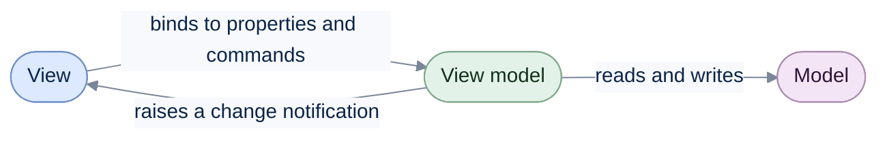

# View Models

[Run the complete page example](https://github.com/reactiveui/ReactiveUI/blob/main/src/examples/Documentation/Pages/view-models/view-models.csproj).

A view shows things on the screen: buttons, text boxes, lists. Testing it usually means driving a real window,
which is slow and brittle. A view model is a plain class that holds the same values and the same commands, with no
button or window in sight. A test can create one and check its properties directly. The view's job shrinks to
binding its controls to the view model's properties and commands; the view model's job is everything else. This
split is the Model-View-ViewModel pattern (MVVM), and ReactiveUI is built around it.

A view model raises a change notification each time one of its properties changes. The view listens for that
notification and updates the control bound to the property. [`ReactiveObject`](reactive-object.md) is the base
class ReactiveUI gives you for this.



The view model sits between the view and the model, the data your app works with (a database row, a web service
response). It never references a control or a window, so the same view model works on every platform and runs in
a plain unit test.

## Keep the view model free of view types

A view model never references a control, a window or a UI framework type. It only describes values and commands,
and how they relate to each other: "the add button is enabled when the title is not blank", "the error message
clears ten seconds after it appears". The view maps those values and commands onto its own controls. This
separation is what makes a view model reusable across platforms, and what lets a test create one without a
window on screen.

`TodoListViewModel` on this page loads items through `ITodoStore`, an interface, rather than talking to a database
or a file directly. Keep a view model's dependencies behind interfaces the same way, so a test can supply a fake
one. `TodoListViewModel` also implements `IActivatableViewModel`, so it can start and stop work while the screen
is shown or hidden; [Activation](../when-activated.md) covers that lifecycle.

## Write a property the view can bind to

**1. Derive from `ReactiveObject`.** `TodoListViewModel`, the example view model on this page, drives a to-do list
screen: a title box for a new item, a filter box, and the list of items that match it.

**2. Give a read-write property a setter that calls `RaiseAndSetIfChanged`.** Write every settable property this
way: it sets the backing field and raises the change notification, but only when the value actually changes.

```csharp
public string NewTitle
{
    get;
    set => this.RaiseAndSetIfChanged(ref field, value);
} = string.Empty;
```

**3. Subscribe, then change the property.** This test creates the view model, counts how many times `NewTitle`
raises its change, then sets it three times, twice with the same value.

```csharp
using TodoListViewModel viewModel = new(InMemoryTodoStore.CreateSeeded());
int raised = 0;
viewModel.PropertyChanged += (_, e) =>
{
    if (e.PropertyName != nameof(TodoListViewModel.NewTitle))
    {
        return;
    }

    raised++;
};

viewModel.NewTitle = GroceriesTitle;
viewModel.NewTitle = GroceriesTitle;
viewModel.NewTitle = DentistTitle;

Console.WriteLine(raised);
```

```text
2
```

The second assignment sets the value the property already holds, so `RaiseAndSetIfChanged` raises nothing for it;
only two of the three assignments raise a notification. [Reactive Object](reactive-object.md) covers
`RaiseAndSetIfChanged`, the `Changing`/`Changed` streams and suppressing notifications in full.

You do not have to write this setter yourself. ReactiveUI brings
[ReactiveUI.SourceGenerators](../../../source-generators/index.md), and its `[Reactive]` attribute writes the setter
for you. [Let a source generator write the boilerplate](#let-a-source-generator-write-the-boilerplate) shows how.

## Read a property as a stream with WhenAnyValue

A view model often needs to react to its own property changes, not just announce them: enable a command once a
box is filled in, or recompute one property from another. `WhenAnyValue` turns a property into a stream, the
opposite direction from `RaiseAndSetIfChanged`. A stream is an `IObservable<T>`, a source of values that arrive
over time; you subscribe to it to receive them.

```csharp
using TodoListViewModel viewModel = new(InMemoryTodoStore.CreateSeeded());

using IDisposable subscription = viewModel.WhenAnyValue(x => x.NewTitle)
    .Subscribe(static title => Console.WriteLine($"[{title}]"));

viewModel.NewTitle = GroceriesTitle;
viewModel.NewTitle = DentistTitle;
```

```text
[]
[Buy groceries]
[Book dentist appointment]
```

`WhenAnyValue` delivers the current value as soon as you subscribe, then a new value after each change. Skip the
first value with the `Select`-family operator `Skip(1)` to get changes only.

```csharp
using TodoListViewModel viewModel = new(InMemoryTodoStore.CreateSeeded());

using IDisposable subscription = viewModel.WhenAnyValue(x => x.NewTitle)
    .Skip(1)
    .Subscribe(Console.WriteLine);

viewModel.NewTitle = GroceriesTitle;
```

```text
Buy groceries
```

Name two or more properties to recompute a value whenever either one changes. This example builds a hint under
the add box from both `NewTitle` and `FilterText`.

```csharp
using TodoListViewModel viewModel = new(InMemoryTodoStore.CreateSeeded());

using IDisposable subscription = viewModel.WhenAnyValue(
        x => x.NewTitle,
        x => x.FilterText,
        static (title, filter) => title.Length > 0 && filter.Length > 0
            ? "Clear the filter to see the new item"
            : "Ready")
    .Subscribe(Console.WriteLine);

viewModel.NewTitle = GroceriesTitle;
viewModel.FilterText = "bill";
viewModel.FilterText = string.Empty;
```

```text
Ready
Ready
Clear the filter to see the new item
Ready
```

`WhenAnyValue` also follows a path through another object, so an outer object being replaced and an inner
property changing both report. `SelectionHolder.Selected` below holds a `TodoItem`; the path
`x => x.Selected!.Title` follows whichever item is currently selected.

```csharp
TodoItem groceries = new() { Title = GroceriesTitle };
TodoItem dentist = new() { Title = DentistTitle };
SelectionHolder holder = new() { Selected = groceries };

using IDisposable subscription = holder.WhenAnyValue(x => x.Selected!.Title)
    .Subscribe(Console.WriteLine);

groceries.Title = "Buy groceries and milk";
holder.Selected = dentist;
```

```text
Buy groceries
Buy groceries and milk
Book dentist appointment
```

`WhenAnyValue` is one of six related ways to observe a property or a path, and `ObservableForProperty` observes
the same thing by reflection instead of source-generated code. [Observing](../../../binding/observing.md), part of
`ReactiveUI.Binding`, covers all six in full, including how a path behaves when an object in the middle is
replaced or null.

## Turn a stream back into a property with ToProperty

Some properties should not be set directly at all: a filtered list, a count of unfinished items, a command's busy
flag. These are output properties, and `ToProperty` builds one from a stream. It returns an
`ObservableAsPropertyHelper<T>`, which you keep in a field and read from the property getter.

The example's filtered list combines the loaded items with the filter text, and recomputes whenever either
changes.

```csharp
using TodoListViewModel viewModel = new(InMemoryTodoStore.CreateSeeded());
await viewModel.Load.Execute();

Console.WriteLine(viewModel.Items.Count);

viewModel.FilterText = "book";

Console.WriteLine(viewModel.Items.Count);
Console.WriteLine(viewModel.Items[0].Title);
```

```text
4
1
Book dentist appointment
```

`RemainingCount` follows the loaded items alone, and raises its own change notification, so a view bound to it
updates without knowing anything about the underlying list.

```csharp
using TodoListViewModel viewModel = new(InMemoryTodoStore.CreateSeeded());
using IDisposable subscription = viewModel.WhenAnyValue(x => x.RemainingCount)
    .Subscribe(static count => Console.WriteLine($"{count} left"));

await viewModel.Load.Execute();
await viewModel.Complete.Execute(viewModel.Items[0]);
```

```text
0 left
3 left
2 left
```

A command's own `IsExecuting` stream backs an output property too, here to drive a loading indicator while
`Load` runs.

```csharp
using TodoListViewModel viewModel = new(InMemoryTodoStore.CreateSeeded());
using IDisposable subscription = viewModel.WhenAnyValue(x => x.IsLoading)
    .Subscribe(static loading => Console.WriteLine(loading ? "Loading..." : "Idle"));

_ = await viewModel.Load.Execute();
```

```text
Idle
Loading...
Idle
```

A search box shows the same pattern with a slower source: typing runs a command, and the command's results and
busy flag both become output properties. Short text is ignored, so typing "pl" starts no search.

```csharp
InMemoryGitHubApi api = new();
using RepositorySearchViewModel viewModel = new(api);
Task<IReadOnlyList<Repository>> answered = viewModel.Search.FirstAsync().ToTask();

viewModel.SearchText = "pl";
Console.WriteLine(api.RequestCount);

viewModel.SearchText = "platform";
await answered;

Console.WriteLine(api.RequestCount);
foreach (Repository repository in viewModel.Results)
{
    Console.WriteLine($"{repository.FullName} ({repository.Stars})");
}
```

```text
0
1
reactiveui/ReactiveUI (8400)
reactiveui/splat (1000)
```

Write an output property the same way every time: a private `ObservableAsPropertyHelper<T>` field, a public
getter that returns its `Value`, and a `ToProperty` call in the constructor. Never put logic in a settable
property's setter beyond `RaiseAndSetIfChanged`; use `WhenAnyValue` and `ToProperty` to describe how one property
follows another instead. [Properties backed by observables](../../../binding/properties.md) covers `ToProperty`
in full, including `deferSubscription` and how the helper raises your type's change notification.

`ObservableAsPropertyHelper<T>` is itself `IDisposable`, and so is every subscription `Subscribe` returns.
Dispose both when the view model is done, the same way `TodoListViewModel.Dispose` does above. See
[Dispose your subscriptions](../../guidelines/framework/dispose-your-subscriptions.md) for the reasoning.

## Let a source generator write the boilerplate

Every read-write property on this page follows the same shape, and every output property follows the same
shape too. [ReactiveUI.SourceGenerators](../../../source-generators/index.md) writes that shape for you, and
ReactiveUI brings it, so there is nothing extra to install. Mark a `partial` property with `[Reactive]` for a
read-write property, or a method with `[ReactiveCommand]` for a command. The generator writes the property or
command while your project builds. For an output property, mark a `partial` get-only property with
`[ObservableAsProperty]` from ReactiveUI.Binding, and assign its generated helper field with `ToProperty`.
[Boilerplate code](boilerplate-code.md) maps each hand-written shape to its attribute.

## Where commands fit

`TodoListViewModel.Load`, `Add`, `Complete` and `Delete` are all `ReactiveCommand`, the type a view model uses for
an action the view triggers: pressing a button, submitting a form. A command is itself a stream of its results,
which is why `Load.IsExecuting` can back the `IsLoading` output property above. [Commands](../commands/index.md)
covers creating one, enabling and disabling it, and reporting its progress and errors.

## Namespaces for System.Reactive

`ReactiveUI` also ships as `ReactiveUI.Reactive`, compiled from the same source, for apps that use System.Reactive
instead of ReactiveUI.Primitives.

## View Models at a glance

| Member | What it does |
| --- | --- |
| `ReactiveObject` | Base class for a view model; see [Reactive Object](reactive-object.md) for its full surface. |
| `RaiseAndSetIfChanged<TObj, TRet>` | Sets a backing field and raises a change notification, only when the value differs. |
| `WhenAnyValue` | Turns one or more properties, or a path through several objects, into a stream of their values; see [Observing](../../../binding/observing.md). |
| `ObservableForProperty` | Observes a property by reflection instead of source-generated code; see [Observing](../../../binding/observing.md). |
| `ObservableAsPropertyHelper<T>` | Holds the latest value of a stream and raises the property's change notification when it arrives. |
| `ToProperty` | Builds an `ObservableAsPropertyHelper<T>` from a stream; see [Properties backed by observables](../../../binding/properties.md). |
| `ReactiveProperty<T>` | A settable, validating, bindable property in one object; see [Reactive Property](reactive-property.md). |
| `[Reactive]` / `[ReactiveCommand]` | ReactiveUI.SourceGenerators attributes, which come with ReactiveUI, that write a read-write property or a command at compile time; see [ReactiveUI.SourceGenerators](../../../source-generators/index.md). |
