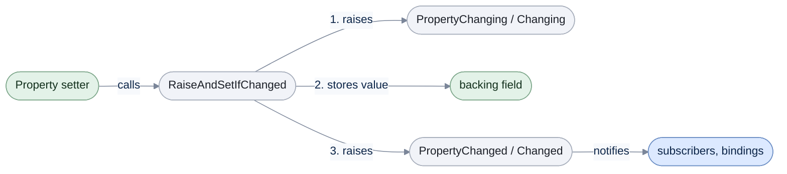

# Reactive Object

[Run the complete page example](https://github.com/reactiveui/ReactiveUI/blob/main/src/examples/Documentation/Pages/reactive-object/reactive-object.csproj).

A [view model](index.md) holds values a view displays, and the view needs to know the moment one of those values changes. `ReactiveObject` is the base class that gives a view model that ability: it implements `INotifyPropertyChanged`, the standard .NET interface a data-bound control watches, and it adds two streams, `Changing` and `Changed`, that any other code can subscribe to as well. A stream is an `IObservable<T>`, a source of values that arrive over time; you subscribe to it to receive its values, and disposing the subscription stops them.

`ReactiveObject` also raises the classic `PropertyChanged` and `PropertyChanging` events, so ordinary `INotifyPropertyChanged` bindings keep working. Everything on this page works whether a caller uses the events or the streams.

## Write a property that raises change notifications

**1. Derive from `ReactiveObject`.** `Student`, the example type on this page, is a plain class with no other base.

**2. Give the property a setter that calls `RaiseAndSetIfChanged`.** It sets the backing field and raises `PropertyChanging` and `PropertyChanged` around the change. It only does this when the new value is different from the old one. `field` refers to the property's own compiler-generated backing field.

```csharp
public string Name
{
    get;
    set => this.RaiseAndSetIfChanged(ref field, value);
} = string.Empty;
```

**3. Subscribe, then change the property.** The example below subscribes to the classic `PropertyChanged` event and edits two properties, one of them twice with the same value.

```csharp
Student student = new();
List<string> changedProperties = [];
student.PropertyChanged += (_, e) => changedProperties.Add(e.PropertyName ?? string.Empty);

student.Name = "Ada Lovelace";
student.Course = "Mathematics";
student.Course = "Mathematics";

Console.WriteLine(string.Join(", ", changedProperties));

// Output:
// Name, Course
```

The second assignment to `Course` sets the same value the property already holds, so `RaiseAndSetIfChanged` raises nothing for it. Only two notifications reach the subscriber.

ReactiveUI brings [ReactiveUI.SourceGenerators](../../../source-generators/index.md), which can write this setter for you. Mark a `partial` property with its `[Reactive]` attribute, and the generator writes the body while your project builds. [Properties with `[Reactive]`](../../../source-generators/index.md#properties-with-reactive) covers it.

## Observe changing and changed

`Changing` and `Changed` carry the same information as the classic events, as a stream instead: `Changing.Subscribe` fires just before a property changes, and `Changed.Subscribe` fires just after. Each notification is an `IReactivePropertyChangedEventArgs<TSender>`, which names the `Sender` and the `PropertyName`.

```csharp
Student student = new() { Name = "Ada Lovelace" };
List<string> events = [];
using IDisposable changingSubscription = student.Changing.Subscribe(args => events.Add($"changing {args.PropertyName} on {((Student)args.Sender).Name}"));
using IDisposable changedSubscription = student.Changed.Subscribe(args => events.Add($"changed {args.PropertyName} on {((Student)args.Sender).Name}"));

student.Course = "Mathematics";

Console.WriteLine(string.Join(" -> ", events));

// Output:
// changing Course on Ada Lovelace -> changed Course on Ada Lovelace
```

Dispose a `Changing` or `Changed` subscription the same way you would any other stream: it keeps delivering until then. See [dispose your subscriptions](../../guidelines/framework/dispose-your-subscriptions.md) for the reasoning.

The diagram below follows one call to `RaiseAndSetIfChanged` from the setter to the subscribers.



`RaiseAndSetIfChanged` does all three steps only when the new value differs from the old one; setting a property to its current value raises nothing and leaves the field untouched.

## Observe thrown exceptions

A `Changed` or `Changing` subscriber that throws would otherwise crash inside the property setter. Instead, `ReactiveObject` catches the exception and forwards it to `ThrownExceptions`, a stream of `Exception`. Subscribe to it to log or handle failures from your own subscribers.

```csharp
Student student = new() { Name = "Ada Lovelace", Course = "Mathematics" };
List<Exception> errors = [];
using IDisposable errorSubscription = student.ThrownExceptions.Subscribe(errors.Add);
using IDisposable changeSubscription = student.Changed.Subscribe(
    static _ => throw new InvalidOperationException("Course change must go through the registrar."));

student.Course = "Physics";

Console.WriteLine(errors.Count);
Console.WriteLine(errors[0].Message);

// Output:
// 1
// Course change must go through the registrar.
```

`ThrownExceptions` completes only when the object itself is disposed, so a `Changed` subscriber that keeps throwing keeps sending exceptions here rather than tearing down the object.

## Raise notifications around a computed property

A property with no backing field, such as one computed from other state, cannot go through `RaiseAndSetIfChanged`. Call `RaisePropertyChanging` and `RaisePropertyChanged` by hand around the change that affects it.

```csharp
public void AddGrade(int grade)
{
    this.RaisePropertyChanging(nameof(GradeAverage));
    _grades.Add(grade);
    this.RaisePropertyChanged(nameof(GradeAverage));
}
```

Both raise the classic events and the `Changing`/`Changed` streams, and both respect suppression and delay, covered next.

```csharp
Student student = new() { Name = "Ada Lovelace" };
List<string> changingProperties = [];
List<string> changedProperties = [];
student.PropertyChanging += (_, e) => changingProperties.Add(e.PropertyName ?? string.Empty);
student.PropertyChanged += (_, e) => changedProperties.Add(e.PropertyName ?? string.Empty);

student.AddGrade(88);
student.AddGrade(92);

Console.WriteLine(student.GradeAverage);
Console.WriteLine(string.Join(", ", changingProperties));
Console.WriteLine(string.Join(", ", changedProperties));

// Output:
// 90
// GradeAverage, GradeAverage
// GradeAverage, GradeAverage
```

`IReactiveObject.RaisePropertyChanging` and `RaisePropertyChanged`, the two methods `IReactiveObject` declares, are a different, lower-level pair: they raise only the classic events, bypassing the `Changing`/`Changed` streams and the suppression check described below. Prefer `RaiseAndSetIfChanged` or the extension method `RaisePropertyChanged(string)` above; the interface methods exist for implementing `IReactiveObject` yourself, covered further down this page.

```csharp
Student student = new() { Name = "Ada Lovelace" };
int classicChanging = 0;
int classicChanged = 0;
int observableChanged = 0;
student.PropertyChanging += (_, _) => classicChanging++;
student.PropertyChanged += (_, _) => classicChanged++;
using IDisposable subscription = student.Changed.Subscribe(_ => observableChanged++);

IReactiveObject rawStudent = student;
rawStudent.RaisePropertyChanging(new PropertyChangingEventArgs(nameof(Student.Course)));
rawStudent.RaisePropertyChanged(new PropertyChangedEventArgs(nameof(Student.Course)));

Console.WriteLine(classicChanging);
Console.WriteLine(classicChanged);
Console.WriteLine(observableChanged);

// Output:
// 1
// 1
// 0
```

## Suppress and delay notifications

Two methods hold notifications back during a batch of changes.

`SuppressChangeNotifications` stops both the classic events and the `Changing`/`Changed` streams for as long as the returned `IDisposable` stays undisposed. Nothing raised during that time is remembered; it is simply dropped. `AreChangeNotificationsEnabled` reports whether notifications are on right now.

```csharp
Student student = new() { Name = "Ada Lovelace", Course = "Mathematics" };
List<string> changed = [];
using IDisposable subscription = student.Changed.Subscribe(args => changed.Add(args.PropertyName ?? string.Empty));

Console.WriteLine(student.AreChangeNotificationsEnabled());

using (student.SuppressChangeNotifications())
{
    Console.WriteLine(student.AreChangeNotificationsEnabled());
    student.Course = "Physics";
}

Console.WriteLine(student.AreChangeNotificationsEnabled());
Console.WriteLine(changed.Count);

// Output:
// True
// False
// True
// 0
```

`DelayChangeNotifications` still raises every change, but only once the returned `IDisposable` is disposed, and it collapses repeated changes to the same property into one notification.

```csharp
Student student = new() { Name = "Ada Lovelace", Course = "Mathematics" };
List<string> changed = [];
using IDisposable subscription = student.Changed.Subscribe(args => changed.Add(args.PropertyName ?? string.Empty));

using (student.DelayChangeNotifications())
{
    student.Course = "Physics";
    student.Course = "Chemistry";
    Console.WriteLine(changed.Count);
}

Console.WriteLine(changed.Count);
Console.WriteLine(student.Course);

// Output:
// 0
// 1
// Chemistry
```

Choose suppress when the UI never needs to see the intermediate state at all. Choose delay when the UI should still learn a property's final value, just not every step on the way there.

A bulk import is a natural place to suppress notifications: importing many rows one at a time would otherwise flood a bound UI with updates it cannot keep up with. This example imports two students under suppression, then builds its own audit entries afterward, using `ReactivePropertyChangingEventArgs<Student>` and `ReactivePropertyChangedEventArgs<Student>` directly since no live notification carried them.

```csharp
List<Student> roster =
[
    new Student { Name = "Ada Lovelace", Course = "Mathematics" },
    new Student { Name = "Grace Hopper", Course = "Computer Science" },
];
int[] importedGrades = [88, 92];
List<string> auditLog = [];

for (int i = 0; i < roster.Count; i++)
{
    Student student = roster[i];
    using (student.SuppressChangeNotifications())
    {
        student.AddGrade(importedGrades[i]);
    }

    ReactivePropertyChangingEventArgs<Student> preview = new(student, nameof(Student.GradeAverage));
    ReactivePropertyChangedEventArgs<Student> applied = new(student, nameof(Student.GradeAverage));
    auditLog.Add(DescribeImport(preview));
    auditLog.Add(DescribeImport(applied));
}

foreach (string entry in auditLog)
{
    Console.WriteLine(entry);
}

// Output:
// about to import GradeAverage for Ada Lovelace
// imported GradeAverage for Ada Lovelace
// about to import GradeAverage for Grace Hopper
// imported GradeAverage for Grace Hopper
```

`ReactivePropertyChangingEventArgs<TSender>` and `ReactivePropertyChangedEventArgs<TSender>` are the two classes behind `IReactivePropertyChangedEventArgs<TSender>`, the shared interface both `Changing` and `Changed` deliver. Construct either one directly, as above, to build a notification of your own rather than reading one from a live subscription.

## Implement IReactiveObject yourself

A class that already derives from another base class cannot also derive from `ReactiveObject`, because C# allows only one base class. Implement `IReactiveObject` directly instead. `CourseResultEntity` in the example does this: it derives from a data-layer base class, `AuditedEntity`, and implements `IReactiveNotifyPropertyChanged<CourseResultEntity>`, `IHandleObservableErrors`, `IReactiveObject` and `IReactiveObjectStateSlot` itself.

```csharp
public sealed class CourseResultEntity : AuditedEntity, IReactiveNotifyPropertyChanged<CourseResultEntity>, IHandleObservableErrors, IReactiveObject, IReactiveObjectStateSlot
{
    private PropertyChangingEventHandler? _propertyChanging;

    private PropertyChangedEventHandler? _propertyChanged;

    private object? _reactiveStateSlot;

    public event PropertyChangingEventHandler? PropertyChanging
    {
        add
        {
            this.SubscribePropertyChangingEvents();
            _propertyChanging += value;
        }

        remove => _propertyChanging -= value;
    }

    public event PropertyChangedEventHandler? PropertyChanged
    {
        add
        {
            this.SubscribePropertyChangedEvents();
            _propertyChanged += value;
        }

        remove => _propertyChanged -= value;
    }

    public string Course { get; init; } = string.Empty;

    public int Grade
    {
        get;
        set => this.RaiseAndSetIfChanged(ref field, value);
    }

    public IObservable<IReactivePropertyChangedEventArgs<CourseResultEntity>> Changing => this.GetChangingObservable();

    public IObservable<IReactivePropertyChangedEventArgs<CourseResultEntity>> Changed => this.GetChangedObservable();

    public IObservable<Exception> ThrownExceptions => this.GetThrownExceptionsObservable();

    public IDisposable SuppressChangeNotifications() => IReactiveObjectExtensions.SuppressChangeNotifications(this);

    public bool AreChangeNotificationsEnabled() => IReactiveObjectExtensions.AreChangeNotificationsEnabled(this);

    void IReactiveObject.RaisePropertyChanging(PropertyChangingEventArgs args) => _propertyChanging?.Invoke(this, args);

    void IReactiveObject.RaisePropertyChanged(PropertyChangedEventArgs args) => _propertyChanged?.Invoke(this, args);

    ref object? IReactiveObjectStateSlot.GetReactiveStateSlot() => ref _reactiveStateSlot;
}
```

Every method here forwards to the same `IReactiveObjectExtensions` extension methods `ReactiveObject` itself uses, so a hand-rolled implementation behaves exactly like `ReactiveObject`: the classic events, the `Changed`/`Changing` streams, `ThrownExceptions`, suppression and delay all work the same way.

```csharp
CourseResultEntity result = new() { Course = "Databases", Grade = 70 };
int classicChanging = 0;
int classicChanged = 0;
List<int> observedGrades = [];
result.PropertyChanging += (_, _) => classicChanging++;
result.PropertyChanged += (_, _) => classicChanged++;
using IDisposable subscription = result.Changed
    .Where(static args => args.PropertyName == nameof(CourseResultEntity.Grade))
    .Subscribe(_ => observedGrades.Add(result.Grade));

result.Grade = 74;

using (result.SuppressChangeNotifications())
{
    Console.WriteLine(result.AreChangeNotificationsEnabled());
    result.Grade = 80;
}

Console.WriteLine(result.AreChangeNotificationsEnabled());
Console.WriteLine(classicChanging);
Console.WriteLine(classicChanged);
Console.WriteLine(string.Join(", ", observedGrades));

// Output:
// False
// True
// 1
// 1
// 74
```

Implementing `IReactiveObjectStateSlot` is optional, but worth doing whenever you already own the class: it gives the framework one field on the instance to hold that object's notification state, instead of looking the object up in a shared table on every change. `ReactiveObject` and the platform view base classes implement it too, for the same reason. The state that lives in that slot is `IExtensionState<TSender>`, an interface the library uses internally to track subscriptions, suppression and delay; you never implement or call it yourself.

To skip writing these members by hand, mark a `partial` class with `[IReactiveObject]` from [ReactiveUI.SourceGenerators](../../../source-generators/index.md#classes-that-cannot-derive-from-reactiveobject), which comes with ReactiveUI. The generator writes the `IReactiveObject` implementation for you.

## ReactiveRecord for mostly-immutable data

`ReactiveRecord` is the record equivalent of `ReactiveObject`. A record's properties are normally set once at construction with `init`, so most of a `ReactiveRecord`'s surface never raises a notification. Use it for a value that is mostly fixed but has one or two fields a later step can still edit, such as a moderator's note added after a grade is finalized. `CourseResult` in the example is a finalized grade: `StudentName`, `Course` and `Grade` are `init`-only. Only `ModeratorNotes` can change after construction, through `AddModeratorNote`, the same pattern as `Student.AddGrade` above.

```csharp
public sealed record CourseResult : ReactiveRecord
{
    private string? _moderatorNotes;

    public string StudentName { get; init; } = string.Empty;

    public string Course { get; init; } = string.Empty;

    public int Grade { get; init; }

    public string? ModeratorNotes => _moderatorNotes;

    public void AddModeratorNote(string note)
    {
        this.RaisePropertyChanging(nameof(ModeratorNotes));
        _moderatorNotes = note;
        this.RaisePropertyChanged(nameof(ModeratorNotes));
    }
}
```

Setting `ModeratorNotes` raises `Changing` then `Changed`, exactly as a mutable property does on a `ReactiveObject`.

```csharp
CourseResult result = new() { StudentName = "Grace Hopper", Course = "Compilers", Grade = 95 };
List<string?> events = [];
using IDisposable changingSubscription = result.Changing.Subscribe(args => events.Add($"changing {args.PropertyName}"));
using IDisposable changedSubscription = result.Changed.Subscribe(args => events.Add($"changed {args.PropertyName}"));

result.AddModeratorNote("Pending appeal");

Console.WriteLine(string.Join(" -> ", events));

// Output:
// changing ModeratorNotes -> changed ModeratorNotes
```

`SuppressChangeNotifications`, `AreChangeNotificationsEnabled` and `DelayChangeNotifications` work on a `ReactiveRecord` the same way they do on a `ReactiveObject`.

```csharp
CourseResult result = new() { StudentName = "Alan Turing", Course = "Logic", Grade = 98 };
List<string?> changed = [];
using IDisposable subscription = result.Changed.Subscribe(args => changed.Add(args.PropertyName));

using (result.SuppressChangeNotifications())
{
    Console.WriteLine(result.AreChangeNotificationsEnabled());
    result.AddModeratorNote("Awaiting appeal");
}

using (result.DelayChangeNotifications())
{
    result.AddModeratorNote("Appeal received");
    result.AddModeratorNote("Appeal upheld");
    Console.WriteLine(changed.Count);
}

Console.WriteLine(result.AreChangeNotificationsEnabled());
Console.WriteLine(changed.Count);

// Output:
// False
// 0
// True
// 1
```

Records bring their own behaviour along with `ReactiveRecord`'s notifications. `with` clones a record and changes only the properties you name. The clone is a separate instance with its own notification state, so subscribing to one does not observe the other.

```csharp
CourseResult original = new() { StudentName = "Katherine Johnson", Course = "Orbital Mechanics", Grade = 99 };
CourseResult corrected = original with { Grade = 100 };

Console.WriteLine(original.Grade);
Console.WriteLine(corrected.Grade);
Console.WriteLine(original.StudentName == corrected.StudentName);

// Output:
// 99
// 100
// True
```

`ReactiveRecord.Equals(ReactiveRecord)` compares two records by value, using the derived record's own properties. The notification state `ReactiveRecord` holds for each instance takes no part. So two results created separately with the same values are equal, and `==` agrees. `Equals` works this way even when both records are known only through the `ReactiveRecord` base type, such as inside a routine that audits every record type in a data layer without knowing their concrete types.

```csharp
CourseResult original = new() { StudentName = "Katherine Johnson", Course = "Orbital Mechanics", Grade = 99 };
CourseResult enteredAgain = new() { StudentName = "Katherine Johnson", Course = "Orbital Mechanics", Grade = 99 };
CourseResult correctedCopy = original with { Grade = 100 };
ReactiveRecord originalAsRecord = original;

Console.WriteLine(originalAsRecord.Equals(enteredAgain));
Console.WriteLine(originalAsRecord.Equals(correctedCopy));
Console.WriteLine(original == enteredAgain);

// Output:
// True
// False
// True
```

A derived record's compiler-generated `ToString` lists its own public properties in declaration order. It leaves out `Changing`, `Changed` and `ThrownExceptions`, the notification members it inherits from `ReactiveRecord`, so it is ready to use for logging.

```csharp
CourseResult result = new() { StudentName = "Grace Hopper", Course = "Compilers", Grade = 95 };
result.AddModeratorNote("Checked twice");

Console.WriteLine(result);

// Output:
// CourseResult { StudentName = Grace Hopper, Course = Compilers, Grade = 95, ModeratorNotes = Checked twice }
```

## Namespaces for System.Reactive

Every `ReactiveUI.*` type on this page also ships as `ReactiveUI.Reactive.*`, compiled from the same source, for apps that use System.Reactive instead of ReactiveUI.Primitives.

## Reactive Object at a glance

| Member | What it does |
| --- | --- |
| `ReactiveObject` | Base class for a view model; implements `INotifyPropertyChanged`/`INotifyPropertyChanging` and the `Changing`/`Changed` streams. |
| `ReactiveObject.Changing` / `Changed` | Streams of `IReactivePropertyChangedEventArgs<IReactiveObject>`, delivered just before and just after a property changes. |
| `ReactiveObject.ThrownExceptions` | Stream of exceptions thrown by a `Changed`/`Changing` subscriber. |
| `ReactiveObject.SuppressChangeNotifications()` | Stops all notifications until the returned `IDisposable` is disposed; dropped notifications are not replayed. |
| `ReactiveObject.AreChangeNotificationsEnabled()` | Reports whether notifications are on right now. |
| `ReactiveObject.DelayChangeNotifications()` | Holds notifications until the returned `IDisposable` is disposed, then raises one per property that changed. |
| `RaiseAndSetIfChanged<TObj, TRet>(TObj, ref TRet, TRet, string?)` | Sets a backing field and raises `PropertyChanging`/`Changed` around it, only when the value differs. |
| `RaisePropertyChanged<TSender>(TSender, string?)` / `RaisePropertyChanging<TSender>(TSender, string?)` | Raise notifications by hand for a property with no backing field. |
| `SubscribePropertyChangingEvents<TSender>(TSender)` / `SubscribePropertyChangedEvents<TSender>(TSender)` | Enable the classic events for a hand-rolled `IReactiveObject`; call from inside the event's `add` accessor. |
| `GetChangingObservable<TSender>(TSender)` / `GetChangedObservable<TSender>(TSender)` / `GetThrownExceptionsObservable<TSender>(TSender)` | Build the `Changing`, `Changed` and `ThrownExceptions` streams for a hand-rolled `IReactiveObject`. |
| `SuppressChangeNotifications<TSender>(TSender)` / `AreChangeNotificationsEnabled<TSender>(TSender)` | The same suppression API as static extension methods, for a hand-rolled `IReactiveObject`. |
| `IReactiveObject` | Interface implemented by `ReactiveObject`, `ReactiveRecord` and any hand-rolled equivalent; declares `RaisePropertyChanging`/`RaisePropertyChanged`. |
| `IReactiveObjectStateSlot` | Optional interface a hand-rolled `IReactiveObject` implements to hold its own notification state, avoiding a shared-table lookup. |
| `IReactiveNotifyPropertyChanged<TSender>` | Interface exposing `Changing`, `Changed` and `SuppressChangeNotifications()` for a given sender type. |
| `IHandleObservableErrors` | Interface exposing `ThrownExceptions`. |
| `IExtensionState<TSender>` | Internal state the library stores per instance (in the state slot or a shared table); not implemented or called directly. |
| `IReactivePropertyChangedEventArgs<TSender>` | Interface shared by changing and changed notifications; exposes `Sender` and `PropertyName`. |
| `ReactivePropertyChangingEventArgs<TSender>` / `ReactivePropertyChangedEventArgs<TSender>` | Concrete notification types you can construct directly, such as for a hand-built audit entry. |
| `ReactiveRecord` | Base record for a mostly-immutable value that still has one or two properties that raise notifications when they change. |
| `ReactiveRecord.Equals(ReactiveRecord)` | Compares two records by the derived record's own values, even when both are known only through the base type. |
