# Reactive Property

[Run the complete page example](https://github.com/reactiveui/ReactiveUI/blob/main/src/examples/Documentation/Pages/reactive-property/reactive-property.csproj).

A form field needs three things: somewhere to hold its value, a way to tell the screen when that value changes, and a
way to check the value and report what is wrong with it. A [view model](index.md) built on
[`ReactiveObject`](reactive-object.md) gives you the first two, through a property you write yourself with
`RaiseAndSetIfChanged`. `ReactiveProperty<T>` gives you all three in one object. It holds a value, it is a stream you
can subscribe to, and it runs validators against every value. It exposes the result through `HasErrors`, an
`ErrorsChanged` event and `INotifyDataErrorInfo`. Data binding frameworks use that interface to show a validation
message next to a control.

`ReactiveProperty<T>` derives from `ReactiveObject`, so it also raises `PropertyChanged` for `Value` and `HasErrors`.
`IReactiveProperty<T>` is the interface it implements, so a view model can depend on the interface instead of the
concrete type. `ReactiveUI` also ships as `ReactiveUI.Reactive`, built from the same source for apps that use
System.Reactive; both packages give you the same `ReactiveProperty<T>`.

## Create a property and watch it change

**1. Create the property with an initial value.** The scheduler argument decides which thread delivers
notifications; `RxSchedulers.MainThreadScheduler` here delivers them in the order they happened, which keeps this
console output deterministic. The two `bool` arguments are covered later in this page.

**2. Subscribe a witness.** A witness is an `IObserver<T>`, the plain interface that receives a stream's values. The
example project's `ConsoleWitness<T>` prints every value it receives.

**3. Change the value, then dispose the subscription.** A subscription is an `IDisposable`; disposing it stops
delivery, so the second change below reaches no one.

```csharp
ReactiveProperty<string> club = new("Chess Club", RxSchedulers.MainThreadScheduler, false, false);
ConsoleWitness<string?> witness = new("ChosenClub");

IDisposable subscription = club.Subscribe(witness);
club.Value = "Robotics Club";
subscription.Dispose();
club.Value = "Art Club";

club.Dispose();
```

```text
ChosenClub: Chess Club
ChosenClub: Robotics Club
```

Dispose the property itself when you are done with it. Disposing a `ReactiveProperty<T>` completes every stream it
exposes and releases its resources.

## Four ways to build one

`ReactiveProperty<T>` has four constructors, and a `Create` factory method that mirrors each one without the `new`
keyword.

| Constructor | Scheduler | Initial value |
| --- | --- | --- |
| `ReactiveProperty()` | `RxSchedulers.TaskpoolScheduler` | The type's default value |
| `ReactiveProperty(T? initialValue)` | `RxSchedulers.TaskpoolScheduler` | `initialValue` |
| `ReactiveProperty(T? initialValue, bool skipCurrentValueOnSubscribe, bool allowDuplicateValues)` | `RxSchedulers.TaskpoolScheduler` | `initialValue` |
| `ReactiveProperty(T? initialValue, ISequencer? scheduler, bool skipCurrentValueOnSubscribe, bool allowDuplicateValues)` | `scheduler`, or the task-pool scheduler when `null` | `initialValue` |

A sequencer decides when and where a stream delivers its values; [Scheduling](../../../primitives/scheduling.md) covers
the `ISequencer` interface. The default constructor starts with the type's default value and reports `IsDisposed` as
`false` until you dispose it.

```csharp
ReactiveProperty<string> studentName = new();

Console.WriteLine(studentName.Value is null);
Console.WriteLine(studentName.IsDisposed);

studentName.Dispose();
Console.WriteLine(studentName.IsDisposed);
```

```text
True
False
True
```

`Create` mirrors every constructor. Use it when you want to avoid the `new` keyword, for example when a member is
generic over the property's type.

```csharp
ReactiveProperty<string> empty = ReactiveProperty<string>.Create();
ReactiveProperty<string> clubName = ReactiveProperty<string>.Create("Robotics Club");
ReactiveProperty<string> withFlags = ReactiveProperty<string>.Create("Robotics Club", skipCurrentValueOnSubscribe: false, allowDuplicateValues: true);
ReactiveProperty<string> withScheduler = ReactiveProperty<string>.Create("Robotics Club", RxSchedulers.MainThreadScheduler, false, false);
```

```text
True
Robotics Club
Robotics Club
Robotics Club
```

## Control what a new subscriber receives

The three- and four-argument constructors both take `skipCurrentValueOnSubscribe` and `allowDuplicateValues`. The
three-argument form takes no scheduler and uses the task-pool scheduler.

```csharp
ReactiveProperty<string> club = new("Robotics Club", skipCurrentValueOnSubscribe: false, allowDuplicateValues: false);

Console.WriteLine(await club.FirstAsync());

club.Dispose();
```

```text
Robotics Club
```

`skipCurrentValueOnSubscribe` decides whether a new subscriber receives the current value right away. `true` makes
the subscriber wait for the next change.

```csharp
ReactiveProperty<string> repliesImmediately = new("Robotics Club", RxSchedulers.MainThreadScheduler, false, false);
ReactiveProperty<string> waitsForAChange = new("Robotics Club", RxSchedulers.MainThreadScheduler, true, false);

List<string> immediateReceived = [];
List<string> waitingReceived = [];
IDisposable immediateSubscription = repliesImmediately.Subscribe(value => immediateReceived.Add(value!));
IDisposable waitingSubscription = waitsForAChange.Subscribe(value => waitingReceived.Add(value!));

waitsForAChange.Value = "Chess Club";

Console.WriteLine(string.Join(", ", immediateReceived));
Console.WriteLine(string.Join(", ", waitingReceived));
```

```text
Robotics Club
Chess Club
```

`allowDuplicateValues` decides whether setting `Value` to the value it already holds reaches subscribers. The
default, `false`, suppresses it.

```csharp
ReactiveProperty<string> suppressesDuplicates = new("Chess Club", RxSchedulers.MainThreadScheduler, false, false);
ReactiveProperty<string> allowsDuplicates = new("Chess Club", RxSchedulers.MainThreadScheduler, false, true);

List<string> suppressed = [];
List<string> allowed = [];
IDisposable suppressedSubscription = suppressesDuplicates.Subscribe(value => suppressed.Add(value!));
IDisposable allowedSubscription = allowsDuplicates.Subscribe(value => allowed.Add(value!));

suppressesDuplicates.Value = "Chess Club";
suppressesDuplicates.Value = "Robotics Club";
allowsDuplicates.Value = "Chess Club";
allowsDuplicates.Value = "Robotics Club";

Console.WriteLine(string.Join(", ", suppressed));
Console.WriteLine(string.Join(", ", allowed));
```

```text
Chess Club, Robotics Club
Chess Club, Chess Club, Robotics Club
```

## Force re-emission with Refresh

`Refresh` re-sends the current value even when it has not changed, unlike setting `Value` again. Use it when
something the property does not track directly, such as a related object, has changed and you want subscribers to
re-read the value.

```csharp
ReactiveProperty<string> club = new("Chess Club", RxSchedulers.MainThreadScheduler, false, false);
ConsoleWitness<string?> witness = new("ChosenClub");
IDisposable subscription = club.Subscribe(witness);

club.Value = "Chess Club";
club.Refresh();

subscription.Dispose();
club.Dispose();
```

```text
ChosenClub: Chess Club
ChosenClub: Chess Club
```

## Clean up your own resources on dispose

A type that derives from `ReactiveProperty<T>` can override `Dispose(bool)` to release its own resources. Call the
base implementation so the property still completes its streams.

```csharp
[System.Diagnostics.DebuggerDisplay("{_fieldName}, IsDisposed = {IsDisposed}")]
public sealed class LoggingReactiveProperty<T> : ReactiveProperty<T>
{
    private readonly string _fieldName;

    public LoggingReactiveProperty(string fieldName, T? initialValue)
        : base(initialValue) => _fieldName = fieldName;

    protected override void Dispose(bool disposing)
    {
        if (disposing)
        {
            Console.WriteLine($"Disposed {_fieldName}");
        }

        base.Dispose(disposing);
    }
}
```

```csharp
LoggingReactiveProperty<string> studentName = new("StudentName", "Ada Lovelace");

studentName.Dispose();
Console.WriteLine(studentName.IsDisposed);
```

```text
Disposed StudentName
True
```

## Validate every value

`AddValidationError` attaches a validator and returns the same `ReactiveProperty<T>`, so you can chain several calls.
A validator can check one value at a time, react to the whole stream of values, or run asynchronously. Each shape has
its own overload family, and each takes an optional `ignoreInitialError` argument.

Once you `using ReactiveUI.Primitives.Signals;`, every `IObservable<T>` is awaitable, so a plain statement that calls
a method returning an `IObservable<T>` looks like an un-awaited call to the compiler. `AddValidationError` returns
the `ReactiveProperty<T>` itself, which is such a type, so the examples discard the result with `_ =` to silence that
warning.

```mermaid
%%{init: {"theme": "base", "themeVariables": {"fontFamily": "Roboto, Helvetica, Arial, sans-serif", "fontSize": "15px", "primaryColor": "#DCE9FF", "primaryBorderColor": "#6C8EC4", "primaryTextColor": "#0B2447", "secondaryColor": "#E3F2E8", "secondaryBorderColor": "#7FA88C", "secondaryTextColor": "#12301C", "tertiaryColor": "#F3E5F5", "tertiaryBorderColor": "#A98BB0", "tertiaryTextColor": "#2E1437", "lineColor": "#7B8699", "textColor": "#1B1F27", "noteBkgColor": "#FFF4D6", "noteBorderColor": "#C9A94F", "noteTextColor": "#3A2A00", "actorBkg": "#DCE9FF", "actorBorder": "#6C8EC4", "actorTextColor": "#0B2447", "signalColor": "#7B8699", "signalTextColor": "#1B1F27", "labelBoxBkgColor": "#F1F3F8", "labelBoxBorderColor": "#A7AEBB", "edgeLabelBackground": "#F7F9FC", "clusterBkg": "#F7F9FC", "clusterBorder": "#C9D1DE"}}}%%
flowchart LR
    classDef vm fill:#E3F2E8,stroke:#7FA88C,color:#12301C
    classDef neutral fill:#F1F3F8,stroke:#A7AEBB,color:#1B1F27
    classDef warn fill:#FDE7E4,stroke:#C98A82,color:#410E0B
    classDef view fill:#DCE9FF,stroke:#6C8EC4,color:#0B2447
    ValueSet(["Value set"]):::vm -- "runs every validator" --> Validators(["Validators run: sync, stream, async"]):::neutral
    Validators -- "combine into" --> Errors(["Errors"]):::warn
    Errors -- "update" --> State(["HasErrors / ErrorsChanged"]):::vm
    State -- "shows the message" --> Form(["The form"]):::view
```



Setting `Value` runs every registered validator, whatever shape it is. Their results combine into one error
collection, which updates `HasErrors` and raises `ErrorsChanged` so the form can show the message.

### Validate one value at a time

A validator that returns a single message runs on the initial value unless `ignoreInitialError` is `true`.
`CheckValidation` re-runs every validator on the current value without changing `Value`, which is useful after an
external system changes what counts as valid.

```csharp
ReactiveProperty<string> validatesImmediately = new(string.Empty, RxSchedulers.MainThreadScheduler, false, false);
_ = validatesImmediately.AddValidationError(static name => string.IsNullOrWhiteSpace(name) ? "Enter the student's name." : null);

ReactiveProperty<string> ignoresInitialError = new(string.Empty, RxSchedulers.MainThreadScheduler, false, false);
_ = ignoresInitialError.AddValidationError(
    static name => string.IsNullOrWhiteSpace(name) ? "Enter the student's name." : null,
    ignoreInitialError: true);

Console.WriteLine(validatesImmediately.HasErrors);
Console.WriteLine(ignoresInitialError.HasErrors);

ignoresInitialError.CheckValidation();
Console.WriteLine(ignoresInitialError.HasErrors);

validatesImmediately.Value = "Ada Lovelace";
Console.WriteLine(validatesImmediately.HasErrors);
```

```text
True
False
True
False
```

A validator can also return more than one message through `IEnumerable`. `GetErrors` hands back the current errors,
or `null` when there are none. The explicit `INotifyDataErrorInfo.GetErrors` implementation always hands back an
enumerable instead, empty when there are no errors, because that is the contract data binding expects.

```csharp
ReactiveProperty<int> age = new(5, RxSchedulers.MainThreadScheduler, false, false);
_ = age.AddValidationError(static value => value < 8 ? new[] { "The student is too young for any club." } : null);

IEnumerable? errors = age.GetErrors(nameof(age.Value));
if (errors is not null)
{
    Console.WriteLine(string.Join(", ", errors.Cast<string>()));
}

INotifyDataErrorInfo asDataErrorInfo = age;
age.Value = 10;
Console.WriteLine(asDataErrorInfo.GetErrors(nameof(age.Value)).Cast<object>().Count());
```

```text
The student is too young for any club.
0
```

`ErrorsChanged` hands every subscriber the same cached `DataErrorsChangedEventArgs` instance instead of allocating a
new one each time. `SingletonPropertyChangedEventArgs` supplies the cached property-name text `PropertyChanged`
carries for `Value` and `HasErrors`.

```csharp
ReactiveProperty<string> studentName = new(string.Empty, RxSchedulers.MainThreadScheduler, false, false);
_ = studentName.AddValidationError(static name => string.IsNullOrWhiteSpace(name) ? "Enter the student's name." : null);

List<string?> propertyNames = [];
studentName.PropertyChanged += (_, e) => propertyNames.Add(e.PropertyName);

DataErrorsChangedEventArgs? errorsChangedRaised = null;
studentName.ErrorsChanged += (_, e) => errorsChangedRaised = e;

studentName.Value = "Ada Lovelace";

Console.WriteLine(string.Join(", ", propertyNames));
Console.WriteLine(propertyNames.Contains(SingletonPropertyChangedEventArgs.HasErrors.PropertyName));
Console.WriteLine(ReferenceEquals(errorsChangedRaised, SingletonDataErrorsChangedEventArgs.Value));
Console.WriteLine(SingletonPropertyChangedEventArgs.Value.PropertyName);
Console.WriteLine(SingletonPropertyChangedEventArgs.ErrorMessage.PropertyName);
```

```text
HasErrors, Value
True
True
Value
ErrorMessage
```

### Validate the whole stream

A validator can take `IObservable<T>` and return a stream of results instead, which lets it use operators such as
`Select` on the values as they arrive. This shape runs on every value the source emits, including the initial one,
unless `ignoreInitialError` is `true`.

```csharp
ReactiveProperty<string> email = new(string.Empty, RxSchedulers.MainThreadScheduler, false, false);
_ = email.AddValidationError(static stream => stream.Select(static value => value is not null && value.Contains('@') ? null : "Enter a valid email address."));

ReactiveProperty<string> emailIgnoringInitialError = new(string.Empty, RxSchedulers.MainThreadScheduler, false, false);
_ = emailIgnoringInitialError.AddValidationError(
    static stream => stream.Select(static value => value is not null && value.Contains('@') ? null : "Enter a valid email address."),
    ignoreInitialError: true);

Console.WriteLine(email.HasErrors);
Console.WriteLine(emailIgnoringInitialError.HasErrors);

email.Value = "ada@school.edu";
Console.WriteLine(email.HasErrors);
```

```text
True
False
False
```

This shape can also return more than one message, through a stream of `IEnumerable`.

```csharp
ReactiveProperty<string> club = new(string.Empty, RxSchedulers.MainThreadScheduler, false, false);
_ = club.AddValidationError(static stream => stream.Select(static value =>
    ClubDirectory.Clubs.Any(candidate => candidate.Name == value)
        ? null
        : (IEnumerable?)new[] { $"'{value}' is not one of the school's clubs." }));
```

```text
True
False
False
```

### Validate asynchronously

A validator can also be `async`, for a check that calls a database or a web service. It runs the same way a
synchronous validator does, just later: the property has no error until the task completes.

```csharp
ReactiveProperty<string> username = new("ada.lovelace", RxSchedulers.MainThreadScheduler, false, false);
Task<bool> becameInvalid = username.ObserveHasErrors.Where(static hasErrors => hasErrors).FirstAsync();

_ = username.AddValidationError(static async name =>
{
    bool taken = await ClubDirectory.IsUsernameTakenAsync(name ?? string.Empty);
    return taken ? "That username is already taken." : null;
});

Console.WriteLine(await becameInvalid);
```

```text
True
```

An asynchronous validator can return more than one message too, through a `Task<IEnumerable>`.

```csharp
ReactiveProperty<string> guardianEmail = new("family@example.com", RxSchedulers.MainThreadScheduler, false, false);
Task<bool> becameInvalid = guardianEmail.ObserveHasErrors.Where(static hasErrors => hasErrors).FirstAsync();

_ = guardianEmail.AddValidationError(static email => ClubDirectory.CheckGuardianEmailAsync(email ?? string.Empty));

Console.WriteLine(await becameInvalid);

IEnumerable? errors = guardianEmail.GetErrors(nameof(guardianEmail.Value));
if (errors is not null)
{
    Console.WriteLine(string.Join(", ", errors.Cast<string>()));
}
```

```text
True
'example.com' cannot receive club mail.
```

### Validate with DataAnnotations attributes

`ReactivePropertyMixins.AddValidation` reads `System.ComponentModel.DataAnnotations` attributes off the property you
give it and turns them into validators, so you never write the string-message validator yourself. It needs
reflection to read those attributes, so it carries `[RequiresUnreferencedCode]` and needs a project built without
ahead-of-time compilation. [Members that need reflection](../reflection.md) covers it and the rest of that surface.

## Read the error state as a stream

`ObserveHasErrors` and `ObserveErrorChanged` stream the property's validation state, so a view model can react to a
validation change without polling `HasErrors`.

```csharp
ReactiveProperty<string> email = new(string.Empty, RxSchedulers.MainThreadScheduler, false, false);
_ = email.AddValidationError(static stream => stream.Select(static value => value is not null && value.Contains('@') ? null : "Enter a valid email address."));

List<bool> hasErrorsChanges = [];
List<string> errorMessages = [];
IDisposable hasErrorsSubscription = email.ObserveHasErrors.Subscribe(hasErrorsChanges.Add);
IDisposable errorsSubscription = email.ObserveErrorChanged.Subscribe(
    errors => errorMessages.Add(errors?.Cast<string>().FirstOrDefault() ?? "(none)"));

email.Value = "ada@school.edu";

Console.WriteLine(string.Join(", ", hasErrorsChanges));
Console.WriteLine(string.Join(", ", errorMessages));
```

```text
True, False
Enter a valid email address., (none)
```

`ReactivePropertyMixins.ObserveValidationErrors` narrows the error collection down to its first `string` message,
which is what most forms show next to a field.

```csharp
ReactiveProperty<string> studentName = new(string.Empty, RxSchedulers.MainThreadScheduler, false, false);
_ = studentName.AddValidationError(static name => string.IsNullOrWhiteSpace(name) ? "Enter the student's name." : null);

List<string> messages = [];
IDisposable subscription = studentName.ObserveValidationErrors().Subscribe(message => messages.Add(message ?? "(none)"));

studentName.Value = "Ada Lovelace";
studentName.Value = string.Empty;

Console.WriteLine(string.Join(" | ", messages));
```

```text
Enter the student's name. | (none) | Enter the student's name.
```

## Depend on the interface instead

`ReactiveProperty<T>` implements `IReactiveProperty<T>`, so a view model constructor or a helper method can take the
interface instead of the concrete type. `Value`, `HasErrors`, `ObserveHasErrors`, `ObserveErrorChanged` and `Refresh`
all work the same way through it.

```csharp
static void ReadThroughTheInterface(IReactiveProperty<string> studentName)
{
    Console.WriteLine(studentName.HasErrors);

    studentName.Value = "Ada Lovelace";
    Console.WriteLine(studentName.HasErrors);
    Console.WriteLine(studentName.Value);

    List<bool> hasErrorsChanges = [];
    List<string> errorMessages = [];
    IDisposable hasErrorsSubscription = studentName.ObserveHasErrors.Subscribe(hasErrorsChanges.Add);
    IDisposable errorSubscription = studentName.ObserveErrorChanged.Subscribe(
        errors => errorMessages.Add(errors?.Cast<string>().FirstOrDefault() ?? "(none)"));

    studentName.Refresh();

    Console.WriteLine(string.Join(", ", hasErrorsChanges));
    Console.WriteLine(string.Join(", ", errorMessages));

    hasErrorsSubscription.Dispose();
    errorSubscription.Dispose();
}

ReactiveProperty<string> concrete = new(string.Empty, RxSchedulers.MainThreadScheduler, false, false);
_ = concrete.AddValidationError(static name => string.IsNullOrWhiteSpace(name) ? "Enter the student's name." : null);

ReadThroughTheInterface(concrete);
```

```text
True
False
Ada Lovelace
False, False
(none), (none)
```

`HasErrors` starts `true` because the validator runs against the initial, blank value. Setting a valid name clears
it, and `Refresh` re-sends the current value and error state without changing either.

## At a glance

| Member | What it does |
| --- | --- |
| `ReactiveProperty()` | Creates the property with the type's default value, on the task-pool scheduler. |
| `ReactiveProperty(T?)` | Creates the property with an initial value, on the task-pool scheduler. |
| `ReactiveProperty(T?, bool, bool)` | Creates the property with an initial value and both delivery flags, on the task-pool scheduler. |
| `ReactiveProperty(T?, ISequencer?, bool, bool)` | Creates the property with an initial value, a scheduler and both delivery flags. |
| `Create()` / `Create(T?)` / `Create(T?, bool, bool)` / `Create(T?, ISequencer, bool, bool)` | Static factory methods that mirror each constructor. |
| `Value` | Gets or sets the current value; setting a different value raises `PropertyChanged` and runs validators. |
| `HasErrors` | Reports whether any validator currently reports an error. |
| `IsDisposed` | Reports whether the property has been disposed. |
| `ObserveHasErrors` | Streams `HasErrors` each time it changes. |
| `ObserveErrorChanged` | Streams the current error collection each time it changes. |
| `ErrorsChanged` | Raised, with a cached `DataErrorsChangedEventArgs`, when the error collection changes. |
| `AddValidationError` (twelve overloads) | Attaches a validator over a single value, a stream of values, or an asynchronous check; each has an `ignoreInitialError` overload. |
| `CheckValidation()` | Re-runs every validator on the current value without changing it. |
| `GetErrors(string?)` | Returns the current errors, or `null` when there are none. |
| `Refresh()` | Re-sends the current value and error state even when neither has changed. |
| `Subscribe(IObserver<T>)` | Subscribes a witness to the property's stream of values. |
| `Dispose()` / `Dispose(bool)` | Completes every stream the property exposes and releases its resources; override `Dispose(bool)` to add your own cleanup. |
| `ReactivePropertyMixins.AddValidation` | Adds DataAnnotations-based validation read by reflection; see [Members that need reflection](../reflection.md). |
| `ReactivePropertyMixins.ObserveValidationErrors` | Narrows the error collection to its first `string` message. |
| `IReactiveProperty<T>` | The interface `ReactiveProperty<T>` implements, for view models that depend on the interface instead. |
| `SingletonDataErrorsChangedEventArgs.Value` | The cached `DataErrorsChangedEventArgs` every property reuses. |
| `SingletonPropertyChangedEventArgs.Value` / `.HasErrors` / `.ErrorMessage` | Cached `PropertyChangedEventArgs` for the property names `ReactiveProperty<T>` raises. |
