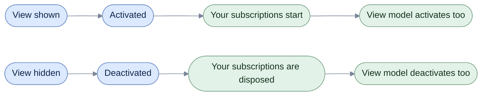

# When Activated

[Run the complete page example](https://github.com/reactiveui/ReactiveUI/blob/main/src/examples/Documentation/Pages/when-activated/when-activated.csproj).

A screen only needs its subscriptions while it is on the user's device. A live score feed, a search box, a timer: start them when the screen appears, and stop them when it goes away. Leave one running and it keeps polling, keeps holding a reference, keeps a background task alive for a screen nobody can see.

Activation is the library's name for that lifetime. A view model or a view is active while its screen is shown, and inactive once it is hidden. `WhenActivated` runs a block of your code each time activation starts, and disposes what that block created each time activation ends.

A view model activates through `IActivatableViewModel` and its `ViewModelActivator`. A view activates through `IActivatableView`, and the way the library finds out when a view is shown or hidden is `ICanActivate` or a custom `IActivationForViewFetcher`. The two sides work the same way and usually work together: a view activates its own resources and, at the same time, activates the view model it is showing.

This page uses the overloads that take an `IObservable<object?>` telling `WhenActivated` when the view's view model changes. They need no reflection, so they work under trimming and Native AOT. A handful of older overloads discover the view model by reflection instead; [Reflection-based WhenActivated](reflection.md) covers those. Prefer the overloads on this page unless you are on a platform package that still wires up the reflected ones for you.

## Give a view model an activation block

**1. Implement `IActivatableViewModel`.** The interface has one member, `Activator`, of type `ViewModelActivator`. Create the activator once, typically as a property initializer.

**2. Call `WhenActivated` in the constructor.** `ScoreBoardViewModel` uses the disposables-container style: the block receives a container and adds each disposable to it. Here it starts a live score feed and subscribes to its scores.

```csharp
public ScoreBoardViewModel(LiveScoreFeed feed)
{
    _feed = feed;

    // The disposables container style: add each disposable to the container the activator hands the block.
    this.WhenActivated(disposables =>
    {
        _feed.Start();
        disposables.Add(new ActionDisposable(_feed.Stop));
        disposables.Add(_feed.Scores.Subscribe(score => CurrentScore = score));
    });
}

/// <inheritdoc/>
public ViewModelActivator Activator { get; } = new();
```

**3. Activate it.** A view normally does this for you, but a unit test — or the example below — can call `Activate` directly. It returns an `IDisposable` that deactivates the view model when disposed.

```csharp
using TodoListViewModel viewModel = new(InMemoryTodoStore.CreateSeeded());
Console.WriteLine(viewModel.Items.Count);

using (viewModel.Activator.Activate())
{
    Console.WriteLine(viewModel.Items.Count);
}

// Output:
// 0
// 4
```

The list is empty before activation and loaded once `Activate` runs the constructor's `WhenActivated` block. Leaving the `using` block disposes the `IDisposable` that `Activate` returned, which deactivates the view model and disposes everything the block created.

## Give a view an activation block

A view calls the same method, `WhenActivated`, but passes it a stream of its own view model instead of relying on reflection to find one. `TodoListView` implements `IViewFor<TodoListViewModel>` and passes `this.WhenAnyValue(x => x.ViewModel)` as that stream. Each disposable the block creates goes through the `disposables` callback.

```csharp
public TodoListView() =>
    this.WhenActivated(
        disposables =>
        {
            disposables(this.Bind(ViewModel, x => x.NewTitle, v => v.NewTitleBox.Text));
            disposables(this.Bind(ViewModel, x => x.FilterText, v => v.FilterBox.Text));
            disposables(this.OneWayBind(ViewModel, x => x.Items, v => v.ItemList.Items));
            disposables(this.OneWayBind(ViewModel, x => x.RemainingCount, v => v.RemainingLabel.Text, static count => $"{count} left"));
            disposables(this.OneWayBind(ViewModel, x => x.ErrorMessage, v => v.ErrorLabel.Text));
            disposables(this.BindCommand(ViewModel, x => x.Add, v => v.AddButton));
        },
        this.WhenAnyValue(x => x.ViewModel));
```

Showing the view runs that block and, because the stream just emitted the current view model, activates it too. Hiding the view disposes the bindings and deactivates the view model, so a keystroke into a hidden screen no longer reaches it.

```csharp
using TodoListViewModel viewModel = new(InMemoryTodoStore.CreateSeeded());
using TodoListView view = new() { ViewModel = viewModel };

view.Show();
Console.WriteLine(view.RemainingLabel.Text);

view.NewTitleBox.Text = ElectricianTitle;
Console.WriteLine(viewModel.NewTitle);

view.Hide();
view.NewTitleBox.Text = "Book plumber";
Console.WriteLine(viewModel.NewTitle);

// Output:
// 3 left
// Book electrician
// Book electrician
```

Showing the view again activates the view model again, so it reloads whatever changed while the screen was away.

```csharp
InMemoryTodoStore store = InMemoryTodoStore.CreateSeeded();
using TodoListViewModel viewModel = new(store);
using TodoListView view = new() { ViewModel = viewModel };

view.Show();
Console.WriteLine(view.RemainingLabel.Text);
view.Hide();

_ = await store.AddAsync("Call the plumber", CancellationToken.None);

view.Show();
Console.WriteLine(view.RemainingLabel.Text);
view.Hide();

// Output:
// 3 left
// 4 left
```

The diagram below is the whole cycle: the view's activation starts the view's own block and, through the view model stream, the view model's blocks; the view's deactivation ends both.



The view model never has to know it is being shown by a particular view. It only reacts to `Activator.Activate` and `Activator.Deactivate`, however they are called.

Dispose every subscription an activation block creates, the way both examples above do, so a screen shown and hidden many times never leaks. See [Dispose your subscriptions](../guidelines/framework/dispose-your-subscriptions.md) for the reasoning.

## Choose a block style

Both sides offer the same three ways to write a block, plus a no-block overload on the view side for a screen with nothing of its own to manage. `ActivationDisposables` is `ReactiveUI.Primitives.Disposables.MultipleDisposable` under another name; it has an `Add` method and, because it implements `ICollection<IDisposable>`, a collection initializer works too.

| Style | View model (`IActivatableViewModel`) | View (`IActivatableView`) |
| --- | --- | --- |
| Callback | `WhenActivated(Action<Action<IDisposable>> block)` | `WhenActivated(Action<Action<IDisposable>> block, IObservable<object?> viewModelChanged)` |
| Container | `WhenActivated(Action<ActivationDisposables> block)` | `WhenActivated(Action<ActivationDisposables> block, IObservable<object?> viewModelChanged)` |
| Return a list | `WhenActivated(Func<IEnumerable<IDisposable>> block)` | `WhenActivated(Func<IEnumerable<IDisposable>> block, IObservable<object?> viewModelChanged)` |
| No block | — | `WhenActivated(IObservable<object?> viewModelChanged)` |

The return-a-list style suits a block with nothing to subscribe to, such as one that only reads a value once. `ScoreBoardHistoryViewModel` loads its past scores this way.

```csharp
public ScoreBoardHistoryViewModel(Func<IReadOnlyList<int>> loadPastScores)
{
    _loadPastScores = loadPastScores;

    // The function-block style: the block returns the disposables to keep; a load with nothing to
    // subscribe to has none.
    this.WhenActivated(() =>
    {
        PastScores = _loadPastScores();
        return [];
    });
}
```

```csharp
int[] pastScores = [21, 33, 55];
using ScoreBoardHistoryViewModel viewModel = new(() => pastScores);

using IDisposable activation = viewModel.Activator.Activate();
Console.WriteLine(string.Join(", ", viewModel.PastScores));

// Output:
// 21, 33, 55
```

`ScoreBoardScreen` is a view that raises its own `ICanActivate` events and shows every view-side style against a `ContentChanged` stream instead of `WhenAnyValue`. The container style updates a title from whatever the screen is showing:

```csharp
using IDisposable subscription = screen.WhenActivated(
    disposables => disposables.Add(screen.ContentChanged.Subscribe(content => screen.Title = content is ScoreBoardHistoryViewModel ? "History" : "Unknown")),
    screen.ContentChanged);

screen.Show();
Console.WriteLine(screen.Title);
Console.WriteLine(string.Join(", ", viewModel.PastScores));
screen.Hide();

// Output:
// History
// 10, 42, 87
```

The return-a-list style does the same job:

```csharp
using IDisposable subscription = screen.WhenActivated(
    () => [screen.ContentChanged.Subscribe(content => screen.Title = content is ScoreBoardViewModel ? "Score Board" : "Unknown")],
    screen.ContentChanged);

screen.Show();
Console.WriteLine(screen.Title);
feed.Report(15);
Console.WriteLine(viewModel.CurrentScore);
screen.Hide();

// Output:
// False
// Score Board
// 15
```

The line before `Show` prints `screen.GetIsDesignMode()`, covered under [Design mode](#design-mode) below.

When the screen has no resources of its own and only needs to activate its content view model, the no-block overload does that alone:

```csharp
using IDisposable subscription = screen.WhenActivated(screen.ContentChanged);

screen.Show();
feed.Report(64);
Console.WriteLine(viewModel.CurrentScore);
screen.Hide();
Console.WriteLine(feed.IsRunning);

// Output:
// 64
// False
```

## Activate more than once

`ViewModelActivator.Activate` counts how many times it has been called without a matching `Deactivate`. The view model stays active until every caller has let go, and `Activated` and `Deactivated` tick only on the first activation and the last deactivation. This matters when more than one view shares a view model, such as a master and a detail pane both showing the same record.

```csharp
List<string> log = [];
using IDisposable activatedSubscription = viewModel.Activator.Activated.Subscribe(_ => log.Add("Activated"));
using IDisposable deactivatedSubscription = viewModel.Activator.Deactivated.Subscribe(_ => log.Add("Deactivated"));

_ = viewModel.Activator.Activate();
_ = viewModel.Activator.Activate();
feed.Report(87);
Console.WriteLine(viewModel.CurrentScore);

viewModel.Activator.Deactivate();
Console.WriteLine(feed.IsRunning);

viewModel.Activator.Deactivate();
Console.WriteLine(feed.IsRunning);
Console.WriteLine(string.Join(", ", log));

// Output:
// 87
// True
// False
// Activated, Deactivated
```

The feed keeps running after the first `Deactivate`, because one activation is still outstanding. `Deactivate(true)` skips the ref count and deactivates at once — use it when a screen is torn down and cannot wait for every outstanding activation to release in turn.

```csharp
IDisposable firstActivation = viewModel.Activator.Activate();
IDisposable secondActivation = viewModel.Activator.Activate();
Console.WriteLine(feed.IsRunning);

viewModel.Activator.Deactivate(ignoreRefCount: true);
Console.WriteLine(feed.IsRunning);

firstActivation.Dispose();
secondActivation.Dispose();
viewModel.Dispose();

// Output:
// True
// False
```

Disposing the `IDisposable` that a released `Activate()` call already accounted for is safe: `Deactivate` never lets the ref count go below zero.

## Force activation with no native event

`ICanForceManualActivation` activates and deactivates a view directly, for a control that has no show/hide event of its own to plug into. A dashboard with one show/hide event for the whole grid, rather than one per tile, forces each tile's state this way. The tile still raises `ICanActivate` ticks for anything watching it.

```csharp
using ScoreBoardTile tile = new();
List<string> log = [];
using IDisposable activatedSubscription = tile.Activated.Subscribe(_ => log.Add("Activated"));
using IDisposable deactivatedSubscription = tile.Deactivated.Subscribe(_ => log.Add("Deactivated"));

ICanForceManualActivation manualActivation = tile;
manualActivation.Activate(isActivating: true);
manualActivation.Activate(isActivating: false);

Console.WriteLine(string.Join(", ", log));

// Output:
// Activated, Deactivated
```

## Plug a control into activation

`ICanActivate` is the interface the library uses to ask a view directly when it is activated and deactivated: two `IObservable<RxVoid>` properties, `Activated` and `Deactivated`. `CanActivateViewFetcher` is the fetcher every app registers by default. It gives an affinity of 10 to any view that implements `ICanActivate`. It translates that view's two streams into the single `bool` stream the activation pipeline runs on.

```csharp
CanActivateViewFetcher fetcher = new();
using ScoreBoardScreen screen = new(content: null);

Console.WriteLine(fetcher.GetAffinityForView(typeof(ScoreBoardScreen)));
Console.WriteLine(fetcher.GetAffinityForView(typeof(object)));

List<bool> activationStates = [];
using IDisposable subscription = fetcher.GetActivationForView(screen).Subscribe(activationStates.Add);

screen.Show();
screen.Hide();

Console.WriteLine(string.Join(", ", activationStates));

// Output:
// 10
// 0
// True, False
```

A control that predates `ICanActivate` — one that only raises plain events such as `Shown` and `Hidden` — needs its own `IActivationForViewFetcher`. Implement `GetAffinityForView` to claim the control's type, and `GetActivationForView` to turn its events into a `bool` stream.

```csharp
public sealed class LegacyPanelActivationFetcher : IActivationForViewFetcher
{
    /// <inheritdoc/>
    public int GetAffinityForView(Type view) => view == typeof(LegacyScorePanel) ? BindingAffinity.ExactType : 0;

    /// <inheritdoc/>
    public IObservable<bool> GetActivationForView(IActivatableView view)
    {
        LegacyScorePanel panel = (LegacyScorePanel)view;
        return Signal.Create<bool>(witness =>
        {
            EventHandler onShown = (_, _) => witness.OnNext(true);
            EventHandler onHidden = (_, _) => witness.OnNext(false);

            panel.Shown += onShown;
            panel.Hidden += onHidden;

            return new ActionDisposable(() =>
            {
                panel.Shown -= onShown;
                panel.Hidden -= onHidden;
            });
        });
    }
}
```

Register it once, with the highest-affinity fetcher for a view type winning when more than one is registered. After that, `WhenActivated` on the control resolves to it automatically, and activates the content view model in step with the panel's plain events.

```csharp
using IDisposable subscription = panel.WhenActivated(Signal.Emit<object?>(viewModel));

panel.Show();
feed.Report(30);
Console.WriteLine(viewModel.CurrentScore);

panel.Hide();
Console.WriteLine(feed.IsRunning);

// Output:
// 30
// False
```

A platform package supplies its own `IActivationForViewFetcher` for the controls it targets, so you rarely need to write one outside a legacy control like this. [Platforms](platforms/index.md) describes what each platform package registers.

## Design mode

`GetIsDesignMode` reports whether a view is being loaded by a designer surface, and returns `false` unless a platform package overrides it for its own view types. `WhenActivated` checks it internally: with no activation fetcher registered and the view in design mode, it does nothing rather than throwing, so a designer preview does not need every service the running app has.

```csharp
Console.WriteLine(screen.GetIsDesignMode());
```

```text
False
```

## Second names

`ReactiveUI` also ships as `ReactiveUI.Reactive`, built from the same source for apps that use System.Reactive instead of the streams in [ReactiveUI.Primitives](../../primitives/index.md).

## Reflection-based overloads

The overloads below discover a view's view model by reflection instead of taking an `IObservable<object?>` signal, so they carry `[RequiresUnreferencedCode]` and are unsuitable for a trimmed or Native AOT app. [Reflection-based WhenActivated](reflection.md) covers them.

| Member | Block style |
| --- | --- |
| `WhenActivated()` | No block; discovers the view model by reflection. |
| `WhenActivated(Func<IEnumerable<IDisposable>> block)` | Return a list. |
| `WhenActivated(Func<IEnumerable<IDisposable>> block, IViewFor? view)` | Return a list, for an explicit view. |
| `WhenActivated(Action<Action<IDisposable>> block)` | Callback. |
| `WhenActivated(Action<Action<IDisposable>> block, IViewFor view)` | Callback, for an explicit view. |
| `WhenActivated(Action<ActivationDisposables> block)` | Container. |
| `WhenActivated(Action<ActivationDisposables> block, IViewFor? view)` | Container, for an explicit view. |

## At a glance

| Member | What it does |
| --- | --- |
| `IActivatableViewModel.Activator` | The `ViewModelActivator` a view uses to activate and deactivate the view model. |
| `IActivatableViewModel.WhenActivated(Func<IEnumerable<IDisposable>>)` | Registers a block that returns the disposables to keep for one activation cycle. |
| `IActivatableViewModel.WhenActivated(Action<Action<IDisposable>>)` | Registers a block that reports each disposable to a callback. |
| `IActivatableViewModel.WhenActivated(Action<ActivationDisposables>)` | Registers a block that adds each disposable to a container. |
| `ViewModelActivator.Activate()` | Increments the ref count; activates and runs every registered block on the first call. Returns an `IDisposable` that calls `Deactivate`. |
| `ViewModelActivator.Deactivate()` | Decrements the ref count; deactivates and disposes on the call that brings it to zero. |
| `ViewModelActivator.Deactivate(bool)` | With `true`, deactivates at once regardless of the ref count. |
| `ViewModelActivator.Activated` / `Deactivated` | Tick on the first activation and the last deactivation. |
| `IActivatableView.WhenActivated(IObservable<object?>)` | Activates the view with no block of its own; activates the view model the signal emits. |
| `IActivatableView.WhenActivated(Func<IEnumerable<IDisposable>>, IObservable<object?>)` | Return-a-list style, plus the view model signal. |
| `IActivatableView.WhenActivated(Action<Action<IDisposable>>, IObservable<object?>)` | Callback style, plus the view model signal. |
| `IActivatableView.WhenActivated(Action<ActivationDisposables>, IObservable<object?>)` | Container style, plus the view model signal. |
| `IActivatableView.GetIsDesignMode()` | Reports whether a designer surface is loading the view; `false` unless a platform package overrides it. |
| `ICanActivate.Activated` / `Deactivated` | The streams a view raises itself to report its own activation state. |
| `ICanForceManualActivation.Activate(bool)` | Forces a view's activation state directly, for a control with no native show/hide event. |
| `IActivationForViewFetcher.GetAffinityForView(Type)` | Reports how strongly a fetcher can activate a view type; the library uses the highest-scoring fetcher. |
| `IActivationForViewFetcher.GetActivationForView(IActivatableView)` | Returns the `bool` stream that drives a view's activation. |
| `CanActivateViewFetcher` | The default fetcher; watches an `ICanActivate` view's own `Activated`/`Deactivated` streams. |
