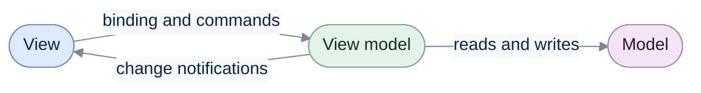
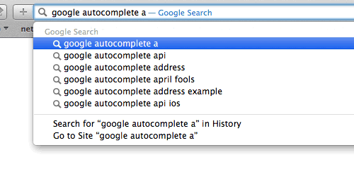
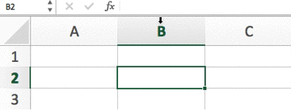

# ReactiveUI

Source and issues: [reactiveui/ReactiveUI](https://github.com/reactiveui/ReactiveUI). This section covers
[getting started](getting-started/index.md), the [handbook](handbook/index.md), [guidelines](guidelines/index.md) and
[upgrading](upgrading/index.md). ReactiveUI runs its bindings on [ReactiveUI.Binding](../binding/index.md).

ReactiveUI is a composable, cross-platform model-view-viewmodel (MVVM) framework. It works on every .NET platform. Functional reactive programming inspired it. That style of programming models values as streams that change over time. A stream fires an event each time its value changes. You subscribe to a stream to react to those changes.

Reactive programming lets you keep the logic for one feature in one place. It keeps mutable state out of your views. It makes your application easier to test. At its core, the project is a set of extension methods for reactive streams. Those extension methods are built on [ReactiveUI.Primitives](../primitives/why-primitives.md). [Slack, GitHub, Amazon, Elastic and Microsoft all use it](https://github.com/reactiveui/ReactiveUI/issues/979#issuecomment-196735701).

ReactiveUI connects three layers of your application. Those layers are the view, the view model and the model. A binding keeps a view control and a view model property in sync. A command runs a view model method when the user acts on the view. A change notification tells subscribers when a property's value changes. The diagram below shows how these pieces fit together.

Notice that the view model never touches the view directly. It only exposes properties and commands, and ReactiveUI wires them up for you.

### An example: search as you type

Say you have a text field. You want to search a service each time the user types. Your designer wants the search to fire automatically as the user types. Your operations team wants only one search request in flight at a time. They also want no more than one request roughly every second.

Most code today is imperative. An imperative program runs one instruction, then the next, then the next. This is much like how a CPU works through its fetch-execute cycle. This style has shaped how programmers write code since the early 1980s.

An imperative solution to the search box above needs a timer. It also needs a flag for whether a request is in flight. It needs code to cancel a stale request too. You can test that code. The tests only catch the bugs you thought to write tests for.

Code is communication between people. It also happens to run on a computer. When you write code for the next person to read, your project stays healthier over time. [Reactive streams let you express a feature's idea in one readable place](https://www.youtube.com/watch?v=5DZ8nC0ENdg). That is what makes them worth learning.

### A better way: reactive streams

ReactiveUI models the text field's input as a stream. A stream is a sequence of values that arrive over time. You can filter, delay and combine a stream with operators. This works the same way you filter and combine a collection with LINQ. It keeps the feature's logic in one readable place, including the delay and the one-request-at-a-time rule.

Reactive programming can look strange at first. The easiest way to picture it is a spreadsheet:

- Three cells, A, B, and C.
- C is defined as the sum of A and B.
- Whenever A or B changes, C reacts to update itself.

That is reactive programming. A change in one place propagates automatically to everywhere that depends on it.

[Watch "Functional Reactive Programming" on YouTube](https://www.youtube.com/watch?v=DYEbUF4xs1Q)

### History

Anaïs Betts started ReactiveUI in 2009. The project is the father of the popular [ReactiveCocoa](https://github.com/ReactiveCocoa/) framework. It has matured over the years. Today it is a stable, solid choice for your next application.

### Get started

Sounds interesting? [Get started!](getting-started/index.md)
