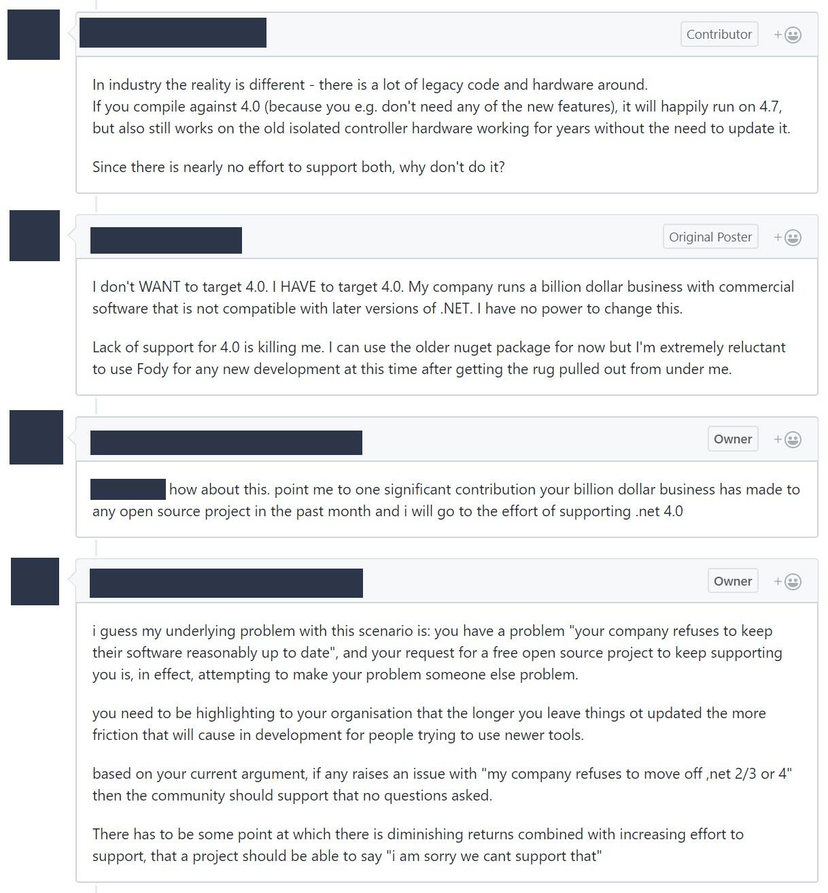
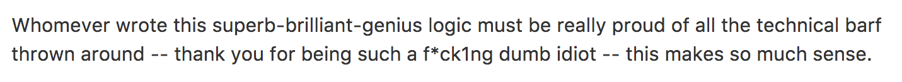
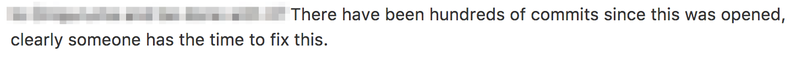

Title: Dealing with Angry, Negative, Problematic or Disruptive community members
---

GitHub's [recent research](http://opensourcesurvey.org/2017/) has shown that even witnessing these negative interactions can be costing our project of consumers stepping up to become contributors:

> 18% of respondents have personally experienced a negative interaction with another user in open source, but 50% have witnessed one between other people.
> 21% of people who experienced or witnessed a negative behavior said they stopped contributing to a project because of it

_It is important to note that "stopped contributing" was the most common response to experiencing or witnessing a negative behavior._

People don't just wake up overnight and decide to become maintainers of a project of this scale. They first start out as users, over time if they may become active and engaged contributors. Without a healthy community and people stepping up to help out the project maintainers will [burn out](../avoiding-burnout).

If ReactiveUI has no maintainers it will quickly become useless to all users and the project will die. As a result, no user complaint, behaviour or need takes priority (except in the case of [Code of Conduct](https://reactiveui.net/code-of-conduct) violations) over the burnout of maintainers. If users do not like the direction of the project, the easiest way to influence it is to make significant, high-quality contributions and become a maintainer.

If you’re being harassed, noticed someone else being harassed, or have any other concerns, please [contact us immediately](mailto:hello@reactiveui.net). Your reports will be taken seriously and will not be dismissed or argued with. All members, committers and volunteers in this community are required to act according to the [Code of Conduct](https://reactiveui.net/code-of-conduct). These guidelines help steer our interactions and strive to keep ReactiveUI a positive, growing project, community and help us provide and ensure a safe environment for everyone. When referring to a group of people, we aim to use gender-neutral terms like "team", "folks", "everyone". (For details, we recommend [this post](https://modelviewculture.com/pieces/gendered-language-feature-or-bug-in-software-documentation)).

# Commerical abuse

Open-source is a huge generational gift, and people should now be concerned about how to sustain the free software movement. Companies can contribute by open source by supporting developers and projects without seeking influence by hiring or acquiring them. But then many don't even bother doing that.

> All problems in community generated software that threaten the sustainability of the project are due to an imbalance between those consuming the software and those participating in building the software. - [Community Imbalnce Theory](https://medium.com/@mikeal/community-imbalance-theory-c5f8688ae352
)

A billion dollar company not upgrading software and expecting an unpaid open-source community to support it unreasonable. The developers at such company need to be highlighting to their organisation that the longer you leave things not updated the more friction that will cause in development for people trying to use newer tools.

# Handling abuse

In the case of commerical abuse, steer the conversation towards the encouraging the company [to financially support open-source and the the project](https://reactiveui.net/donate) if the request is not unreasonable. We need to tactful in these situations as in most cases companies do not know that they were abusive. In these situations, we need to be the educators. Take the discussion off-line from GitHub ASAP and speak with the other maintainers to progress.

Otherwise:

1. Take a screenshot of the offending comment and store it in the `private` repository for future reference to track repeat offenders.
2. Delete the entire comment, even if the comment contains non-problematic content.
3. Post a response of the format:

> {{at-mention}} your comment was deleted as a violation of the [Code of Conduct](https://reactiveui.net/code-of-conduct) as it was {{clause in the CoC that was violated}}. You may consider this an official warning.

In the case of serious code-of-conduct violations, please start a thread in the `private` repository.

# What is abusive?

Now, with all of the above said, how do you determine what crosses the line? Well, there's the obvious ones like:

But there are also the more subtle ones:

# The the rule of thumb

> Are they talking about people? Or ideas?

The top example is an insult directed toward "Whoever wrote this", obviously. But the bottom is also intended as an insult, calling the maintainers incompetent or uncaring. It's just a lot more thickly veiled than the first one. So basically, any comment that is directed at people whether individuals, groups or classes of people, is off-limits.
