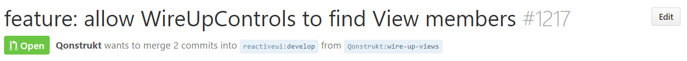
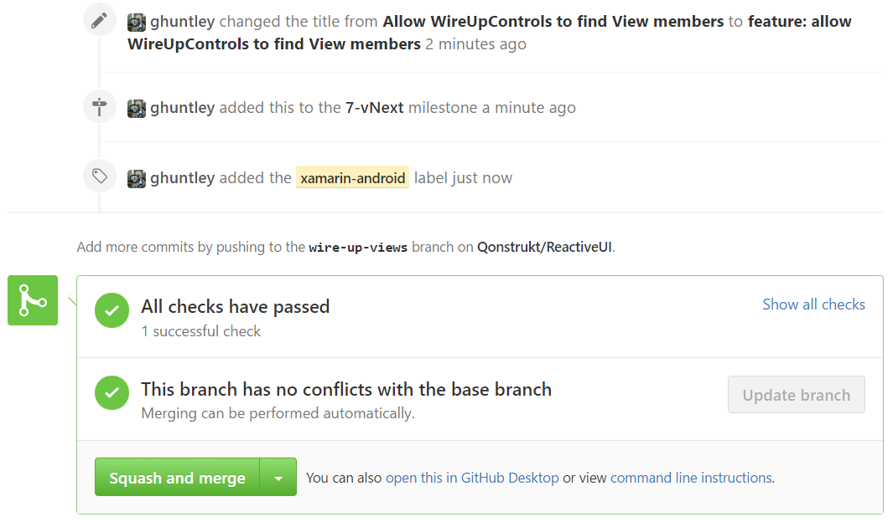
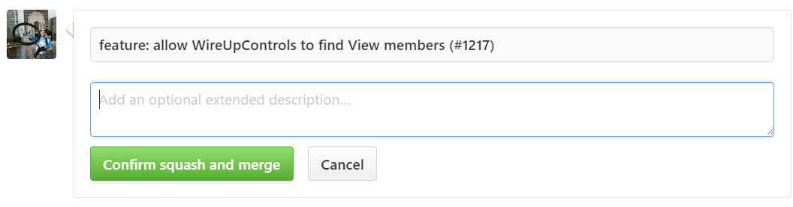

Assign the GitHub issue to the `vNext` milestone.

We use [GitReleaseManager](https://gitreleasemanager.readthedocs.io/develop/) to automatically generate our release notes as per [configured in this file](https://github.com/reactiveui/ReactiveUI/blob/develop/GitReleaseManager.yaml). By doing a little bit of leg work here, right in this moment it makes releasing software so much easier.

1. Assign one or more labels to categorize what component of ReactiveUI was changed by this unit of work. 

2. Rename the title of the GitHub issue to match [our convention](/contribute/software-style-guide/commit-message-convention). 

Ensure that the merge button is set to `Squash and Merge`, use the little arrow on the right hand side to switch to this mode.

Mash the `Squash and Merge` button which will squash/rebasing all commits in the pull-request into one, this is your last chance to make sure the commit message follows [our established convention](/contribute/software-style-guide/commit-message-convention) with the existing suffix i.e. `(#$pullRequestNumber)`

Verify that the pull-request identifier is a suffix on the commit message and then merge the contribution

Shower the contributor in flowers and encourage them to come join us in Slack.

