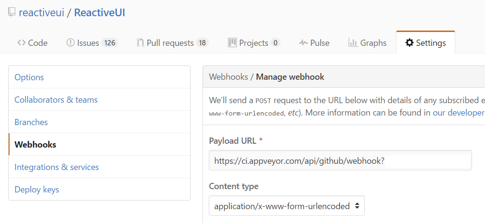

Title: Troubleshooting AppVeyor
---

> **Warning** Do not adjust the project settings via the GUI interface. All configuration changes must be done via modifying the `AppVeyor.yml` which ensures that there is no configuration drift and all changes go through the project approval process. 

## Enabling Remote Desktop

Create a branch off the branch you wish to troubleshoot. In that branch adjust the `AppVeyor.yml` [as per the instructions on this page](https://www.appveyor.com/docs/how-to/rdp-to-build-worker/).


Push the troubleshooting branch which will trigger a new build. When that build completes (either success or failure) at the bottom of the log you will find credentials which you can use to RDP onto AppVeyor. 


Your RDP session is limited by overall build time (60 min). All work will be destroyed when the limit is reached so keep working notes on your local computer. If you need more time then locate your branch in the AppVeyor build history and rebuild the commit which will provision a new instance with different RDP credentials and a fresh session limit.

> **Warning** Please don't litter in our repository; delete your temporary branch when you have finished troubleshooting.


## Retrying a failed build
At a terminal:
```
> git commit --amend -C HEAD
> git push -f origin $NAME_OF_BRANCH
```
This will update the timestamp on the last commit and force push it, thereby triggering another build. Of course, like any forced push, this is only safe if no one is depending on said branch.

## Waiting for status to be reported
Ugh, isn't this annoying? Luckily it doesn't happen often. It happens when the Webhook payload from GitHub to AppVeyor failures for whatever reason. Luckily it's easy to fix.


Navigate to Settings -> Webhooks and then click on the manage AppVeyor webhook button which will reveal this screen.



Scroll down and identify the failed payload and mash the "Redeliver" button exactly once.


Visit AppVeyor to verify that the build has kicked off.
