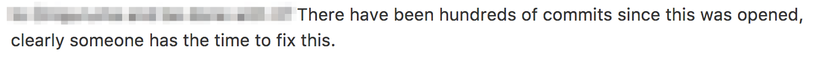

https://medium.com/@eranhammer/so-you-decided-to-contribute-to-open-source-93b640cf2ae2

http://opensourcesurvey.org/2017/

GitHub's recent research has shown that even witnessing these negative interactions can be costing our project of consumers stepping up to become contributors:

> 18% of respondents have personally experienced a negative interaction with another user in open source, but 50% have witnessed one between other people.
> 21% of people who experienced or witnessed a negative behavior said they stopped contributing to a project because of it

_It is important to note that "stopped contributing" was the most common response to experiencing or witnessing a negative behavior._

1. Take a screenshot of the offending comment and store it in the `private` repository for future reference to track repeat offenders
2. Delete the entire comment, even if the comment contains non-problematic content
3. Post a response of the format:

> {{at-mention}} your comment was deleted as a violation of the {{Code of Conduct link}} as it was {{clause in the CoC that was violated}}. You may consider this an official warning.

----

Now, with all of the above said, how do you determine what crosses the line? Well, there's the obvious ones like:

But there are also the more subtle ones:

Here's the rule of thumb:

> Are they talking about people? Or ideas?

The top example is an insult directed toward "Whoever wrote this", obviously. But the bottom is also intended as an insult, calling the maintainers incompetent or uncaring. It's just a lot more thickly veiled than the first one. So basically, any comment that is directed at people whether individuals, groups or classes of people, is off-limits.

----

https://medium.com/@eranhammer/so-you-decided-to-contribute-to-open-source-93b640cf2ae2

> ... But it will also test your resolve and ability to take a sustained attack on your technical and personal skills. Be prepared.
I am not suggesting you stay away from open source. Just the opposite. Be prepared, build a support system of friends. Find a mentor.
I cannot stress enough how much of a difference an experienced and supportive mentor can make to your technical and mental wellbeing.
Find someone who can jump in and defend your work, who can hit back, who will provide you with a safe backchannel. It’s not hard. Most people have a hard time defending themselves when they are attacked. It’s hard. But defending others is a worthwhile cause. People like going to battle for those they feel have been mistreated. Find yourself a mentor who can provide that early. (And if you are in a position to be such a mentor, reach out, offer help, make yourself available, broadcast it)

