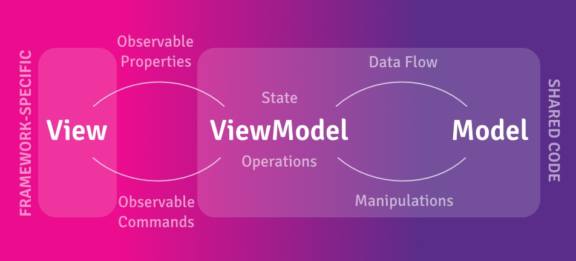
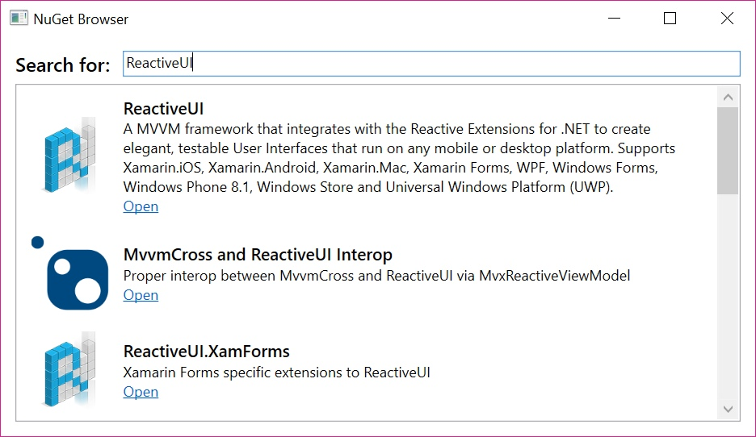

Order: 10
---
A big part of understanding ReactiveUI is understanding Reactive Programming, as ReactiveUI is a library built on <a href="https://github.com/dotnet/reactive">Reactive Extensions</a>. Reactive Extensions is a bunch of extension methods for programming in a reactive manner. Reactive programming is programming with asynchronous data streams, called <a href="http://reactivex.io/documentation/observable.html">observables</a>. Unlike tasks, <a href="http://reactivex.io/documentation/observable.html">observables</a> represent one or more values over time. It allows for Linq like operations to mutate the observable event stream and allows for flexible marshalling onto desired threads.

When you develop .NET applications, especially large-scale and cross-platform ones, you need to write portable and maintainable code. In XAML-powered platforms, such as Windows Presentation Foundation, Universal Windows Platform, Xamarin Forms and Avalonia UI you can achieve this by implementing the MVVM pattern. MVVM stands for Model-View-ViewModel, where Model represents services, data transfer objects and database entities related to the application domain, View is the UI and ViewModel’s responsibility is to tie these two layers together. ViewModel encapsulates interaction with Model, exposing properties and commands for XAML UI to bind to. 

ReactiveUI allows you to combine the MVVM pattern with Reactive Programming using such features, as [WhenAnyValue](https://reactiveui.net/docs/handbook/when-any/), [ReactiveCommand](https://reactiveui.net/docs/handbook/commands/), [ObservableAsPropertyHelper](https://reactiveui.net/docs/handbook/oaph/) and [WhenActivated](https://reactiveui.net/docs/handbook/when-activated/).



# A Compelling Example

Let's create a simple application demonstrating a number of ReactiveUI functionalities, without getting into too many under-the-hood details. We will create a WPF application, which will allow us to search through Github public repositories. The full code of the application is shown at the end of this chapter, and we will show relevant snippets as we go. 

### 1. Create the project
In <a href="https://visualstudio.microsoft.com/">Visual Studio</a>, create a new WPF application (.NET 4.6.1 or above), use `ReactiveDemo` app name. Our view has been already created for us, the `MainWindow`, so we will proceed with creating our ViewModel.

### 2. Add NuGet packages
```
Install-Package ReactiveUI.WPF
```
The complete list containing NuGet packages for all supported platforms <a href="https://reactiveui.net/docs/getting-started/installation/nuget-packages/">can be found here</a>. <a href="https://www.nuget.org/packages/reactiveui/">ReactiveUI</a> main package should normally be installed into you .NET Standard class libraries containing platform-agnostic code (repositories, services, DTOs, view-models), and ReactiveUI.XXX packages are platform-specific, so we use <a href="https://www.nuget.org/packages/ReactiveUI.WPF/">ReactiveUI.WPF</a> in this tutorial as we are developing a tiny WPF application that doesn't need code sharing.
```
Install-Package Octokit
```
We also need a Github client library in this tutorial, and we are going to install and use <a href="https://github.com/octokit/octokit.net">Octokit.NET</a>.

### 3. Create a new AppViewModel class
```csharp
// AppViewModel is where we will describe the interaction of our application.
// We can describe the entire application in one class since it's very small now. 
public class AppViewModel : ReactiveObject
{
    // In ReactiveUI, this is the syntax to declare a read-write property
    // that will notify Observers, as well as WPF, that a property has 
    // changed. If we declared this as a normal property, we couldn't tell 
    // when it has changed!
    private string _searchTerm;
    public string SearchTerm
    {
        get => _searchTerm;
        set => this.RaiseAndSetIfChanged(ref _searchTerm, value);
    }

    // We will describe this later, but ReactiveCommand is a Command,
    // like "Open", "Copy", "Delete", that manages a task running
    // in the background.
    public ReactiveCommand<string, List<Repository>> ExecuteSearch { get; }

    /* ObservableAsPropertyHelper
     * 
     * Here's the interesting part: In ReactiveUI, we can take IObservables
     * and "pipe" them to a Property - whenever the Observable yields a new
     * value, we will notify ReactiveObject that the property has changed.
     * 
     * To do this, we have a class called ObservableAsPropertyHelper - this
     * class subscribes to an Observable and stores a copy of the latest value.
     * It also runs an action whenever the property changes, usually calling
     * ReactiveObject's RaisePropertyChanged.
     */
    private readonly ObservableAsPropertyHelper<List<Repository>> _searchResults;
    public List<Repository> SearchResults => _searchResults.Value;

    // Here, we want to create a property to represent when the application 
    // is performing a search (i.e. when to show the "spinner" control that 
    // lets the user know that the app is busy). We also declare this property
    // to be the result of an Observable (i.e. its value is derived from 
    // some other property)
    private readonly ObservableAsPropertyHelper<bool> _isAvailable;
    public bool IsAvailable => _isAvailable.Value;

    public AppViewModel()
    {
        // Here we create a new Octokit Github client and describe what the 
        // ExecuteSearch command will do. We send a request to Github API
        // and get all repositories satisfying the term we provide.
        var client = new GitHubClient(new ProductHeaderValue("octokit"));
        ExecuteSearch = ReactiveCommand.CreateFromTask(async (string term) =>
        {
            var request = new SearchRepositoriesRequest(term);
            var response = await client.Search.SearchRepo(request);
            return response.Items.ToList();
        });

        /* Creating our UI declaratively
         * 
         * The Properties in this ViewModel are related to each other in different 
         * ways - with other frameworks, it is difficult to describe each relation
         * succinctly; the code to implement "The UI spinner spins while the search 
         * is live" usually ends up spread out over several event handlers.
         *
         * However, with ReactiveUI, we can describe how properties are related in a 
         * very organized clear way. Let's describe the workflow of what the user does 
         * in this application, in the order they do it.
         */

        // We're going to take a Property and turn it into an Observable here - this
        // Observable will yield a value every time the Search term changes, which in
        // the XAML, is connected to the TextBox. 
        //
        // We're going to use the Throttle operator to ignore changes that 
        // happen too quickly, since we don't want to issue a search for each 
        // key pressed! We then pull the Value of the change, then filter 
        // out changes that are identical, as well as strings that are empty.
        //
        // Finally, we use ReactiveUI's InvokeCommand operator, which takes the String 
        // and calls the Execute method on the ExecuteSearch Command, after 
        // making sure the Command can be executed via calling CanExecute.
        this.WhenAnyValue(x => x.SearchTerm)
            .Throttle(TimeSpan.FromMilliseconds(800))
            .ObserveOn(RxApp.MainThreadScheduler)
            .Select(term => term?.Trim())
            .DistinctUntilChanged()
            .Where(term => !string.IsNullOrWhiteSpace(term))
            .InvokeCommand(ExecuteSearch);

        // ExecuteSearch has an IObservable<bool> called IsExecuting that fires 
        // every time the command changes execution state. We use ReactiveUI's
        // ToProperty operator, which is a helper to create an 
        // ObservableAsPropertyHelper object.
        _isAvailable = ExecuteSearch.IsExecuting
            .Select(isExecuting => !isExecuting)
            .ToProperty(this, x => x.IsAvailable, false);

        // We subscribe to the "ThrownExceptions" property of our ReactiveCommand,
        // where ReactiveUI marshals exceptions that are thrown in command implementation. 
        // See the "Error Handling" section for more information about this.
        ExecuteSearch.ThrownExceptions.Subscribe(error => { /* Handle errors here */ });

        // Here, we're going to describe what happens when the ExecuteSearch command
        // gets invoked. The important bit here is the return value - an Observable. 
        // We're going to end up here with a Stream of Users Lists: every time someone 
        // calls Execute, we eventually end up with a new list which we then 
        // immediately put into the SearchResults property, that will then 
        // automatically fire INotifyPropertyChanged.
        _searchResults = ExecuteSearch.ToProperty(this, x => x.SearchResults, new List<Repository>());
    }
}
```

The goal of the ReactiveUI syntax for read-write properties is to notify Observers that a property has changed. Otherwise we would not be able to know when it was changed. 
  
In cases when we don't need to provide for two-way binding between the View and the ViewModel, we can use one of many ReactiveUI Helpers, to notify Observers of a changing read-only value in the ViewModel. We use the <a href="https://reactiveui.net/docs/handbook/oaph/">ObservableAsPropertyHelper</a> twice, once to turn a generic List<T> into an observable read-only collection, and then to change the visibility of an indicator to show that a request is currently executing.

This also works in the opposite direction, when we take the `SearchTerm` property and <a href="https://reactiveui.net/docs/handbook/when-any/">turn it into an observable</a>. This means that we are notified every time a change occurs in the UI. Using Reactive Extensions, we then <a href="http://reactivex.io/documentation/operators/debounce.html">throttle</a> those events, and ensure that the search occurs no sooner than 800ms after the last keystroke. And if at that point the user did not change the last value, or if the search term is blank, we ignore the event completely.

Using the `IsExecuting` observable of <a href="https://reactiveui.net/docs/handbook/commands/">ReactiveCommand</a>, we derive another 
observable to change the visibility of the "processing indicator". The `ExecuteSearch` command gets invoked every time there is a throttled change in the UI.

### 4. Create a View

Assign a new instance of a ViewModel to MainWindow DataContext:

```csharp
public MainWindow()
{
    InitializeComponent();
    DataContext = new AppViewModel();
}  
```

Now we need to create a View for our ViewModel, the following is an example:

```xml
<Window x:Class="ReactiveDemo.MainWindow"
        xmlns="http://schemas.microsoft.com/winfx/2006/xaml/presentation"
        xmlns:x="http://schemas.microsoft.com/winfx/2006/xaml"
        xmlns:d="http://schemas.microsoft.com/expression/blend/2008"
        xmlns:mc="http://schemas.openxmlformats.org/markup-compatibility/2006"
        mc:Ignorable="d" Title="MainWindow" Height="450" Width="800">
    <Window.Resources>
        <DataTemplate x:Key="PhotoDataTemplate">
            <Grid MaxHeight="100">
                <Grid.ColumnDefinitions>
                    <ColumnDefinition Width="Auto" />
                    <ColumnDefinition Width="*" />
                </Grid.ColumnDefinitions>
                <Image Source="{Binding Owner.AvatarUrl, IsAsync=True}" Margin="6" MaxWidth="128"
                       HorizontalAlignment="Center" VerticalAlignment="Center" />
                <TextBlock Grid.Column="1" Margin="6" TextWrapping="WrapWithOverflow">
                    <Run FontSize="14" FontWeight="SemiBold" Text="{Binding FullName, Mode=OneTime}"/>
                    <Run FontSize="12" Text="{Binding StargazersCount, Mode=OneTime}"/>
                    <Run FontSize="12" Text="stars"/>
                    <LineBreak />
                    <Run FontSize="12" Text="{Binding Description, Mode=OneTime}"/>
                </TextBlock>
            </Grid>
        </DataTemplate>
    </Window.Resources>

    <Grid Margin="12">
        <Grid.ColumnDefinitions>
            <ColumnDefinition Width="Auto" />
            <ColumnDefinition Width="*" />
        </Grid.ColumnDefinitions>
        <Grid.RowDefinitions>
            <RowDefinition Height="Auto" />
            <RowDefinition Height="*" />
        </Grid.RowDefinitions>
        <TextBlock FontSize="16" FontWeight="SemiBold" VerticalAlignment="Center" Text="Search for:"/>
        <TextBox Grid.Column="1" Margin="6 0 0 0" 
                 Text="{Binding SearchTerm, Mode=TwoWay, UpdateSourceTrigger=PropertyChanged}"/>
        <ListBox Grid.ColumnSpan="3" Grid.Row="1" Margin="0,6,0,0" 
                 ScrollViewer.HorizontalScrollBarVisibility="Disabled"
                 ItemsSource="{Binding SearchResults, Mode=OneWay}"
                 ItemTemplate="{DynamicResource PhotoDataTemplate}"
                 IsEnabled="{Binding IsAvailable, Mode=OneWay}"/>
    </Grid>
</Window>
```   

Now you can search repositories on Github using your own app!


<br />

# Discover ReactiveUI

Now you know ReactiveUI, but we have more to offer. If you'd like to discover all features ReactiveUI has, visit our <a href="https://reactiveui.net/docs/handbook/">Handbook</a>! If you come from `Xamarin.Android`, `Xamarin.iOS` or `Windows Forms`, take a look at <a href="https://reactiveui.net/docs/handbook/data-binding/">ReactiveUI bindings</a> - they don't require XAML, work across all platforms, support value converters and much more! You'll definitely like this feature. Moreover, we recommend using <a href="https://reactiveui.net/docs/handbook/data-binding/">ReactiveUI bindings</a> over XAML bindings due to the type safety and better value converter mechanisms. Additionally, take a look at a <a href="https://github.com/reactiveui/ReactiveUI/tree/master/integrationtests">truly cross-platform demo app</a> that works on each platform ReactiveUI supports.

Also give a try to <a href="https://github.com/RolandPheasant/DynamicData">DynamicData</a> - reactive collections based on reactive extensions. Use <a href="https://github.com/RolandPheasant/DynamicData">DynamicData</a> for transforming and observing dynamically changing data sets in your ReactiveUI applications. You can also watch <a href="https://reactiveui.net/docs/resources/videos">videos about Reactive Extensions and ReactiveUI</a>, or view sources of <a href="https://reactiveui.net/docs/samples/">open-source applications built with ReactiveUI</a>. We have a <a href="https://reactiveui.net/blog/">blog</a> and a <a href="https://twitter.com/reactivexui">twitter account</a> for you to stay tuned. <a href="https://github.com/reactiveui/ReactiveUI">Star ReactiveUI on Github</a>!


