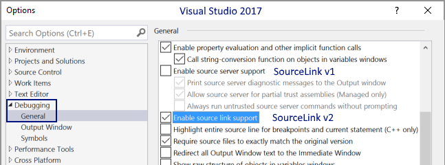

We use [SourceLink](https://docs.microsoft.com/en-us/dotnet/standard/library-guidance/sourcelink) which allows you to break and get live debugging into our code base.

The only requirement is to ensure the check the `Enable source link support` under `Debugging`  in Visual Studio preferences as shown below:

<iframe width="100%" height="315" src="https://www.youtube.com/embed/gyRGhCQPkB4" frameborder="0" allow="accelerometer; autoplay; clipboard-write; encrypted-media; gyroscope; picture-in-picture" allowfullscreen></iframe>

## Troubleshooting
It is worth noting that at the moment SourceLink support is not active in the Xamarin debugger (platforms such as iOS, Android are not supported).
