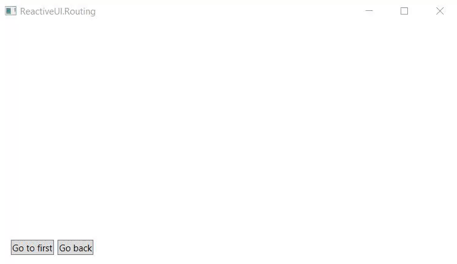

Routing enables an application to coordinate navigation through multiple views and their corresponding view models, and to keep track of the user's navigation state.

ReactiveUI supports routing for the following platforms:

- Avalonia
- Universal Windows Platform (UWP)
- Windows Forms
- Windows Presentation Foundation (WPF)
- WinRT
- WP8
- Xamarin Forms

Routing also works on iOS and Android without Xamarin.Forms, but it isn't always easy to use. If view model routing turns out hard to implement on those platforms, you can use view-first routing and customize most aspects of it.

# About ReactiveUI Routing

The following elements participate in routing:

- One `IScreen`,
- one `RoutingState` (contained in the `ISCreen` instance),
- two or more  `IRoutableViewModel`s, and
- a platform-specific `RoutedViewHost` XAML control.

`IScreen` is the root of the navigation stack. Despite the name, views associated with an `IScreen` do not need to extend to the full screen. `RoutingState` manages the view model's navigation stack and allows view models to navigate to other view models. `RoutedViewHost` monitors an instance of `RoutingState` and responds to changes in the navigation stack by creating and embedding the required view.

# A Compelling Example

> **Note:** The example below is adapted for WPF, but RactiveUI's routing supports more platforms.
>
> Samples:
> - [Xamarin Forms](https://github.com/reactiveui/ReactiveUI.Samples/tree/master/xamarin-forms/MasterDetail) 
> - [Windows Forms](https://github.com/Asesjix/ReactiveUI.Winforms.Samples).
>
> Other resources: 
> - [ViewModel Routing with ReactiveUI and Xamarin.Forms](https://jamilgeor.com/viewmodel-routing-with-reactiveui-and-xamarin-forms/), by Jamil Geor
> - [Sextant](https://github.com/reactiveui/sextant) library for advanced XF routing
> - [AvaloniaUI routing guide](http://avaloniaui.net/docs/reactiveui/routing)
> - [Universal Windows Platform routing samples](https://github.com/reactiveui/ReactiveUI.Samples/tree/master/uwp).

Using Visual Studio, create a new WPF project and name it 'ReactiveRouting'. Install the `ReactiveUI.WPF` NuGet package into the project. Now create a view model named `FirstViewModel` that implements the `IRoutableViewModel` interface. The `IRoutableViewModel.UrlPathSegment` property is a string token representing the current view model, such as 'login' or 'user'. You are free to choose any string. In this example, we use 'first'. The `HostScreen` property typically contains the instance of the host screen used by an application.

**FirstViewModel.cs**

```cs
public class FirstViewModel : ReactiveObject, IRoutableViewModel
{
    public string UrlPathSegment => "first";
    
    public IScreen HostScreen { get; }

    public FirstViewModel(IScreen screen = null)
    {
        HostScreen = screen ?? Locator.Current.GetService<IScreen>();
    }
}
```

Now create a new `UserControl` that will act as the view for the `FirstViewModel` declared above. Derive it from the `ReactiveUserControl<TViewModel>` class.

**FirstView.xaml**

```xml
<rxui:ReactiveUserControl
    x:Class="ReactiveRouting.FirstView"
    x:TypeArguments="vm:FirstViewModel"
    xmlns:rxui="http://reactiveui.net"
    xmlns:vm="clr-namespace:ReactiveRouting"
    xmlns="http://schemas.microsoft.com/winfx/2006/xaml/presentation"
    xmlns:x="http://schemas.microsoft.com/winfx/2006/xaml"
    xmlns:mc="http://schemas.openxmlformats.org/markup-compatibility/2006"
    xmlns:d="http://schemas.microsoft.com/expression/blend/2008"
    Background="LightSeaGreen"
    mc:Ignorable="d">
    <TextBlock x:Name="PathTextBlock" Foreground="White" Margin="10" />
</rxui:ReactiveUserControl>
```

In this example, we set up the bindings in the code-behind file for the view.

**FirstView.xaml.cs**

```cs
public partial class FirstView : ReactiveUserControl<FirstViewModel>
{
    public FirstView()
    {
        InitializeComponent();
        this.WhenActivated(disposables =>
        {
            this.OneWayBind(ViewModel, x => x.UrlPathSegment, x => x.PathTextBlock.Text)
                .DisposeWith(disposables);
        });
    }
}
```

Now create an `IScreen` implementation containing the `RoutingState` that manages the navigation stack.

**MainViewModel.cs**

```cs
public class MainViewModel : ReactiveObject, IScreen
{
    // The Router associated with this Screen.
    // Required by the IScreen interface.
    public RoutingState Router { get; }
        
    // The command that navigates a user to first view model.
    public ReactiveCommand<Unit, IRoutableViewModel> GoNext { get; }

    // The command that navigates a user back.
    public ReactiveCommand<Unit, Unit> GoBack { get; }

    public MainViewModel()
    {
        // Initialize the Router.
        Router = new RoutingState();

        // Router uses Splat.Locator to resolve views for
        // view models, so we need to register our views
        // using Locator.CurrentMutable.Register* methods.
        //
        // Instead of registering views manually, you 
        // can use custom IViewLocator implementation,
        // see "View Location" section for details.
        //
        Locator.CurrentMutable.Register(() => new FirstView(), typeof(IViewFor<FirstViewModel>));

        // Manage the routing state. Use the Router.Navigate.Execute
        // command to navigate to different view models. 
        //
        // Note, that the Navigate.Execute method accepts an instance 
        // of a view model, this allows you to pass parameters to 
        // your view models, or to reuse existing view models.
        //
        GoNext = ReactiveCommand.CreateFromObservable(() => Router.Navigate.Execute(new FirstViewModel()));

        // You can also ask the router to go back.
        GoBack = Router.NavigateBack;
    }
}
```

Now we need to place the `RoutedViewHost` XAML control to our view that will contain our routable views and view models. We bind the view model `MainViewModel.Router` property to `RoutedViewHost.Router` property. The `RoutedViewHost` control is platform-specific, contained in such packages, as `ReactiveUI.WPF`, `ReactiveUI.XamForms`, `ReactiveUI.WinForms`.

**MainWindow.xaml**

```xml
<rxui:ReactiveWindow
    xmlns:rxui="http://reactiveui.net" 
    x:Class="ReactiveRouting.MainWindow"
    x:TypeArguments="vm:MainViewModel"
    xmlns:vm="clr-namespace:ReactiveRouting"
    xmlns="http://schemas.microsoft.com/winfx/2006/xaml/presentation"
    xmlns:x="http://schemas.microsoft.com/winfx/2006/xaml"
    Title="ReactiveUI.Routing" Height="360" Width="620">
    <Grid>
        <Grid.RowDefinitions>
            <RowDefinition Height="*" />
            <RowDefinition Height="Auto" />
        </Grid.RowDefinitions>
        <rxui:RoutedViewHost 
            Grid.Row="0" 
            x:Name="RoutedViewHost"
            HorizontalContentAlignment="Stretch"
            VerticalContentAlignment="Stretch" />
        <StackPanel Grid.Row="1" Orientation="Horizontal" Margin="15">
            <Button x:Name="GoNextButton" Content="Go to first" />
            <Button x:Name="GoBackButton" Content="Go back" Margin="5 0 0 0" />
        </StackPanel>
    </Grid>
</rxui:ReactiveWindow>
```

**MainWindow.xaml.cs**

Here is the code-behind for the `MainWindow` declared above. Here we use `ReactiveWindow<TViewModel>` for WPF. For Xamarin.Forms it should typically be `ReactiveMasterDetailPage<TViewModel>`. The main goal on this step is to bind the `MainViewModel.Router` property to the `RoutedViewHost.Router` property, so the `RoutedViewHost` control will display the appropriate view.

```cs
// We use ReactiveWindow here for WPF, but could actually use
// ReactiveUserControl or a custom IViewFor implementation. For
// Xamarin.Forms, use ReactiveMasterDetailPage.
public partial class MainWindow : ReactiveWindow<MainViewModel>
{
    public MainWindow()
    {
        InitializeComponent();
        ViewModel = new MainViewModel();
        this.WhenActivated(disposables =>
        {
            // Bind the view model router to RoutedViewHost.Router property.
            this.OneWayBind(ViewModel, x => x.Router, x => x.RoutedViewHost.Router)
                .DisposeWith(disposables);
            this.BindCommand(ViewModel, x => x.GoNext, x => x.GoNextButton)
                .DisposeWith(disposables);
            this.BindCommand(ViewModel, x => x.GoBack, x => x.GoBackButton)
                .DisposeWith(disposables);
        });
    }
}
```



Now ReactiveUI's view model-first routing should work as expected. `IScreen`s and `RoutedViewHost`s can be nested any number of levels without impacting routing. However, this only works for XAML pages; for modal and pop-up dialogs [Interactions](../interactions) are a better choice. 

> **Note:** If you experience any difficulties with this tutorial, you can join the [ReactiveUI Slack](https://reactiveui.net/slack) channel and ask for help. We are always ready to give a hand.

# View Location

Override the default `IViewLocator` implementation to avoid having to manually register views. In the bootstrapping stage of your routing, register your view locator using `Locator.CurrentMutable.RegisterLazySingleton`. See [View Location](../view-location) for details.

```cs
public class SimpleViewLocator : IViewLocator
{
    public IViewFor ResolveView<T>(T viewModel, string contract = null) where T : class
    {
        if (viewModel is FirstViewModel)
            return new FirstView { ViewModel = viewModel };
        throw new Exception($"Could not find the view for view model {typeof(T).Name}.")
    }
}

// Register the SimpleViewLocator.
Locator.CurrentMutable.RegisterLazySingleton(() => new SimpleViewLocator(), typeof(IViewLocator));
```

# Assembly Scanning

To register all view models in your application and their associated views, use the following code:

```cs
// Splat uses assembly scanning here to register all views and view models.
Locator.CurrentMutable.RegisterViewsForViewModels(Assembly.GetCallingAssembly());
```
