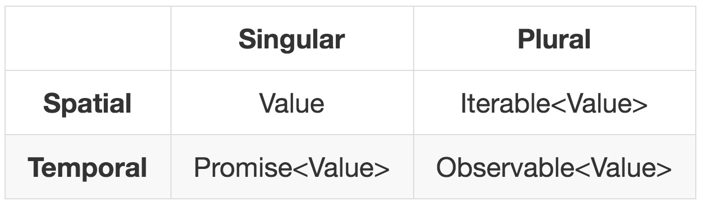

# Reactive Programming: changing the world at Netflix, Microsoft, Slack and beyond!

Matthew Podwysocki at AngularConf

    

        <?# YouTube yEeDbHvg1vQ /?>
    

# Duality

[Meijer.duality.pdf](https://csl.stanford.edu/~christos/pldi2010.fit/meijer.duality.pdf)

    

        <?# YouTube looJcaeboBY /?>
    

