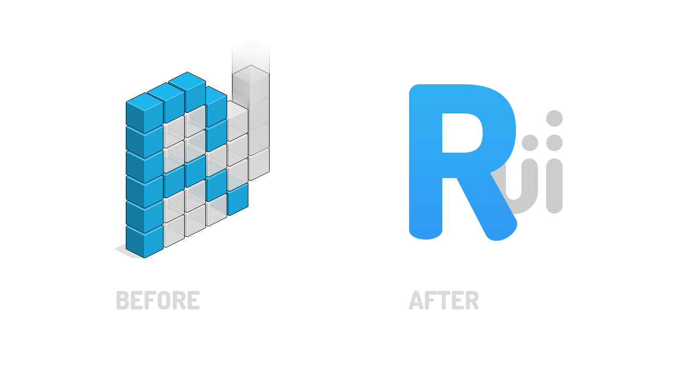

NoTitle: true
IsBlog: true
Title: ReactiveUI Rebranding
Tags: Announcement
Author: Artyom Gorchakov
Published: 2019-01-20
---

ReactiveUI was created by Anaïs Betts whilst working in Office Labs at Microsoft, and released in early 2011. Since that time, ReactiveUI has become a mature framework [trusted by Slack, GitHub, Amazon, Elastic and Microsoft](https://github.com/reactiveui/ReactiveUI/issues/979#issuecomment-196735701), has become a member of the [Dot Net Foundation](https://www.dotnetfoundation.org/), and actively maintained by the open-source community on GitHub. The work we do is sponsored by [our wonderful Backers on OpenCollective](https://opencollective.com/reactiveui).

Now, the Team focuses on improving developer accessibility of ReactiveUI. Numerous issues were fixed during the past year, missing xml documentation was added, exception messages were clarified. We are now at a level of maturity where chatlogs in the documentation pages aren't needed anymore. Most features of the framework are well-documented now, including [testing](https://reactiveui.net/docs/handbook/testing/), [routing](https://reactiveui.net/docs/handbook/routing/) and [activation](https://reactiveui.net/docs/handbook/when-activated/). If you would like to learn ReactiveUI in-depth, step by step, consider purchasing the book ["You, I and ReactiveUI"](https://kent-boogaart.com/you-i-and-reactiveui/) written by Kent Boogaart.

Another way of improving ReactiveUI is making the framework more attractive and recognizable. We are working now on updating the image of ReactiveUI documentation website, to follow modern design trends and to improve the user experience. We are pleased to show you the new ReactiveUI logo!

When developing it, we tried to make things as simple as possible, but still recognizable by developers who use ReactiveUI. The new logo is easier for printing, SVG and PSD files are available in our [styleguide repository](https://github.com/reactiveui/styleguide/). Hope you love it, and more updates are yet to come, including design improvements of our website. Join our [Slack workspace](https://reactiveui.net/slack), if not already.
