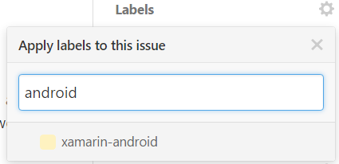

1. Assign one or more labels to categorize what component of ReactiveUI was changed by this unit of work. 

2. Rename the title of the GitHub issue to match [our convention](./contribute/software-style-guide/commit-message-convention). 

Ensure that the merge button is set to `Squash and Merge`, use the little arrow on the right hand side to switch to this mode.

Mash the `Squash and Merge` button which will squash/rebasing all commits in the pull-request into one, this is your last chance to make sure the commit message follows [our established convention](./contribute/software-style-guide/commit-message-convention) with the existing suffix i.e. `(#$pullRequestNumber)`

Verify that the pull-request identifier is a suffix on the commit message and then merge the contribution

Shower the contributor in flowers and encourage them to come join us in Slack.

3. Our robot (https://probot.github.io/apps/delete-merged-branch/) will automatically delete merged branches so you don't have to.
