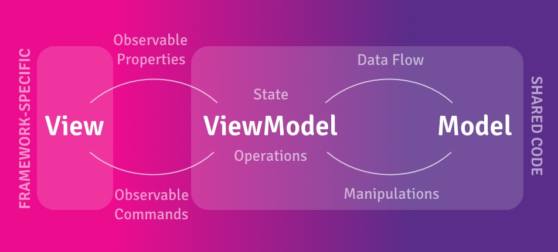

ReactiveUI gives you the power to build reactive, testable, and composable UI code using the MVVM pattern.

See our <a href="../../docs/handbook/">Handbook</a> for the ReactiveUI documentation. We also have a complete <a href="https://github.com/reactiveui/ReactiveUI/tree/main/integrationtests">cross-platform demo app</a>.

## Getting Started

To get started visit our <a href="../../docs/getting-started/installation/">Installation</a> page.

The [Compelling Example](../../docs/getting-started/compelling-example) walks through creating a more complete application, demonstrating the power of ReactiveUI and Reactive Extensions.

## Why MVVM?

The Model-View-ViewModel (MVVM) pattern helps create more portable and maintainable codebases for cross-platform .Net applications. It increases the amount of code that can be shared between different platforms (iOS, Android, etc.) and makes testing easier.

ReactiveUI makes it easy to combine the MVVM pattern with Reactive Programming by providing features such as:

- [WhenAnyValue](../../docs/handbook/when-any/)
- [ReactiveCommand](../../docs/handbook/commands/)
- [ObservableAsPropertyHelper](../../docs/handbook/observable-as-property-helper/)
- [WhenActivated](../../docs/handbook/when-activated/)
- [Data Binding](../../docs/handbook/data-binding/)

## Explore ReactiveUI

ReactiveUI is much more than just a MVVM helper. Take a look at the following projects to get started exploring what is available

- [DynamicData](https://github.com/reactivemarbles/DynamicData) - Reactive collections based on reactive extensions
- [ObservableEvents](https://github.com/reactivemarbles/ObservableEvents) - Build Observables from Events
- [Sextant](https://github.com/reactiveui/Sextant)- Navigation library for Xamarin.Forms using ReactiveUI
- [Samples](../../docs/resources/samples/) - Open Source applications built with ReactiveUI
- [Blog](../../posts/) - Release Notes and Announcements
- [Videos and Presentations](../../docs/resources/videos) - Videos and Presentations
